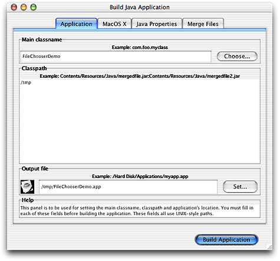
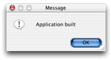
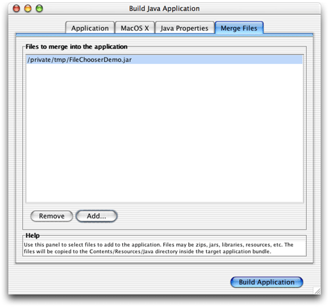
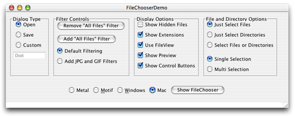
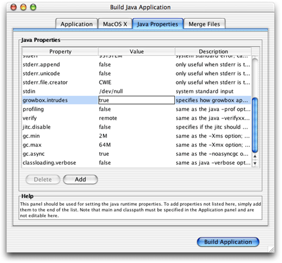
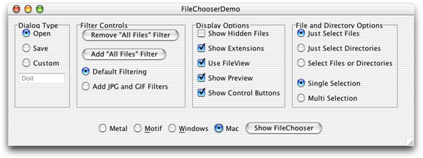
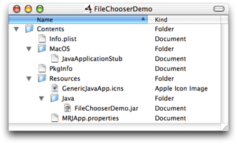

> 导航：[总目录](../../../README.md) · [documentation](../../../_indexes/documentation.md) · [Java 1.3.1 Development for Mac OS X](About%20This%20Book.md)


[Next](Mac%20OS%20X%20Java%20System%20Properties.md)[Previous](Project%20Builder%20Tutorial.md)

# MRJAppBuilder Tutorial

Although command-line Java applications are great for development, when you want to distribute your application, you want the user to be able to launch it just like any other Mac OS X application—without a trip to the command line. MRJAppBuilder allows you to take your existing Java `.class` or `.jar` files and wrap them into a Mac OS X application bundle. This chapter provides a simple tutorial that you can work through to help you understand this process.

To follow this example, you need to have the Mac OS X Developer Tools installed. MRJAppBuilder is installed in `/Developer/Applications`. The sourcecode files you need are `ExampleFileFilter.java`, `ExampleFileView.java`, and `FileChooserDemo.java`; they are installed in `/Developer/Examples/Java/JFC`/FileChooserDemo/src. If you do not see these files, install the Mac OS X Developer Tools. If you do a custom install, make sure that the Developer Example and Developer Tools Software packages are installed. This example will take a JAR file and show you how to bundle it as a Mac OS X application.

MRJAppBuilder works with either stand-alone class files or class files in a JAR file. Since most of the source code in `/Developer/Examples/Java` is not compiled, the first step is to compile a selection to obtain the class files.

In this example, you will use the FileChooserDemo application. From Terminal, compile the three Java files in `/Developer/Examples/Java/JFC/FileChooserDemo/src` with `javac -d /tmp /Developer/Examples/Java/JFC/FileChooserDemo/src/*.java`. This gives you the required class files.

Once you have the class files, open the MRJAppBuilder application in `/Developer/Applications`. When the application opens, you are presented with the Application pane. The required fields for building a valid application are all present in this pane.

In this example set the main classname to FileChooserDemo. This is the class that contains the `main` method. Set the classpath to `/tmp`. In this example, there are only class files in the classpath. It might be appropriate in a more complicated application for the classpath to include image, font, or sound files as well. Set the output file to whatever location is convenient to use for testing your application. This field should include the fully qualified intended location and name of the resultant application, for example `/tmp/FileChooserDemo.app`. Be sure to append the `.app` suffix to the name you choose for this application. The result should be similar to [Figure B-1](#apple-f4xwc4dqnrsv64tfmyxwi33df52wszbpkridgmbqgaydomjrfvbecssdivbusri).

__Figure B-1__  MRJAppBuilder Application pane



With these three fields filled in, you are ready to build the application. Click the Build Application button. You are informed that your build was successful.

__Figure B-2__   A successful build



Navigating in the Finder to the directory you specified in the “Output file” field reveals a double-clickable application. (Hint: In Finder, choose Go to Folder from the Go menu.)

The example in [Building a Basic Application](#apple-f4xwc4dqnrsv64tfmyxwi33df52wszbpkridgmbqgaydomjrfvkfawcsivddcmbw) worked fine, but notice that you set the path to a specific directory, `/tmp`. Unless your users happen to have the appropriate class files installed in `/tmp`, this application won’t work on their computers. How do you get around this? That leads to another pane in MRJAppBuilder. Before using it though you need to prepare the appropriate files. In this example, navigate to your `/tmp` directory and make a JAR file from the class files you put there as follows:

```
jar cf FileChooserDemo.jar *.class
```

You should still have MRJAppBuilder open. If not go ahead and open it and set it up the way it was before. Click the tab labeled Merge Files. It gives you the option to add files. Click the Add button and choose the JAR file you just made. The result should look like [Figure B-3](#apple-f4xwc4dqnrsv64tfmyxwi33df52wszbpkridgmbqgaydomjrfvkfawcsivddcmjx).

__Figure B-3__  Merge Files pane



The JAR file is copied into the `/Contents/Resources/Java` directory of the resulting application bundle. Now go back to the Application pane. Notice that the path to this JAR file was automatically added to the `/tmp` path you had there before. (You can get rid of that reference to `/tmp` now if you haven’t already.) You now have a Mac OS X application that a user can install by simply dropping in the Finder without having to deal with installing anything else or being concerned with where the application is installed.

So far you have built a basic application that has some features that Mac users expect. For example they can install it with a simple drag and drop. If you launch that application, you will notice something missing. The icon in the Dock is a generic Java icon. You can fix that easily enough in MRJAppBuilder. For the sake of this example, just copy an icon from another application, in this case the icon from the prebuilt version of the FileChooserDemo application. To do this, select the generic icon in the Application pane. It is near the bottom of the pane, in the “Output file” section. If you click it, it opens a file chooser. Navigate to the file named `JavaApp.icns` in `/Developer/Examples/Java/JFC/FileChooserDemo/FileChooserDemo.app/Contents/Resources` and click Select. (You will probably need to change the Format pop-up menu to All Files from the default Icon Files to navigate there.) Now if you build the application, you should see that it displays the new icon in the Dock.

An icon is only the first step. There are a few other things you can do to make a well-written Java application hard to distinguish from a native Mac OS X application. MRJAppBuilder provides an interface for making a lot of these changes in the Java Properties pane. Before going there, launch the FileChooserDemo application that you just built. Notice that the window has a white bar at the bottom of the window as shown in [Figure B-4](#apple-f4xwc4dqnrsv64tfmyxwi33df52wszbpkridgmbqgaydomjrfvbecsskjfbeisi).

__Figure B-4__  FileChooserDemo application with relics



This is because by default, MRJAppBuilder sets certain system properties. In this case, `com.apple.mrj.application.growbox.intrudes` is set to `false`. The result is that an extra 15 pixels are added to the window. You can correct this in the Java Properties pane.

Click the Java Properties tab. This pane contains properties that are passed to the application when it is run. Of special note here is the Parameters property. This is where you can specify any command-line parameters that need to be passed to your application when it is run. To see the effect of modifying the Java properties, change the value of the `growbox.intrudes` property from `false` to `true` as in [Figure B-5](#apple-f4xwc4dqnrsv64tfmyxwi33df52wszbpkridgmbqgaydomjrfvbecssii5duirq).

__Figure B-5__  Modifying the `growbox.intrudes` property



Quit the previously built FileChooserDemo if it is still running, and build and run the new version. Notice that the relics no longer surround the window when you switch between the different interface styles.

__Figure B-6__  `com.apple.mrj.application.growbox.intrudes=true`



You can change the value of the other properties by clicking the appropriate value field and making the desired change. See [Appendix C, Mac OS X Java System Properties,](Mac%20OS%20X%20Java%20System%20Properties.md#apple-f4xwc4dqnrsv64tfmyxwi33df52wszbpkridgmbqgaydomjsfvkfami) for a listing and description of some Mac OS X system properties.

The Mac OS X pane allows you to set attributes of the Mac OS X application bundle. Features like the application icon and name can be set here. For information on these keys and how to use them, see _[Mac Technology Overview](../../Mac%20OSX/Mac%20Technology%20Overview/About%20Developing%20for%20Mac.md#apple-f4xwc4dqnrsv64tfmyxwi33df52wszbpkridimbqgaytanrx)_ . These are not explored in this tutorial.

In this tutorial, you have seen how to wrap your JAR files into a native Mac OS X application, and you have seen how to modify the parameters of that application to build an application that fits in with the native applications in Mac OS X. There was no magic going on behind the scenes. MRJAppBuilder is a very simple application that builds an application bundle directory structure, determines runtime options to be passed to the Java virtual machine when the application is invoked, and sets some Mac OS X application properties. To get a glimpse inside an application in Mac OS X, you can either explore the directory of the `.app` from the Terminal or from the Finder. To see what is contained inside an application bundle generated by MRJAppBuilder, Control-click an MRJAppBuilder-generated application. You could use the FileChooserDemo application or even MRJAppBuilder itself. Inside is a structure similar to [Figure B-7](#apple-f4xwc4dqnrsv64tfmyxwi33df52wszbpkridgmbqgaydomjrfvbecssfivcegra)

__Figure B-7__  Application bundle contents



Once you have built an application bundle with MRJAppBuilder, you might want to fine tune the settings in the `Info.plist` or the `MRJApp.properties` files by hand. Any text editor will do and you won’t need to set up all of the fields in MRJAppBuilder each time you want to make changes.

[Next](Mac%20OS%20X%20Java%20System%20Properties.md)[Previous](Project%20Builder%20Tutorial.md)

