> 导航：[总目录](../../../README.md) · [documentation](../../../_indexes/documentation.md) · [Java 1.3.1 Development for Mac OS X](About%20This%20Book.md)

[Next](MRJAppBuilder%20Tutorial.md)[Previous](Using%20Native%20Features%20of%20Mac%20OS%20X%20in%20Java%20Applications.md)

# Project Builder Tutorial

Apple provides a complete set of development tools free with Mac OS X. This set includes compilers, a debugger, a complete integrated development environment (IDE), as well as many other tools and resources. Apple’s IDE, Project Builder, allows you to edit, compile, debug, and package your Java applications. This chapter provides a simple tutorial on using Project Builder to build a Swing-based Java application and an applet.

To follow this example, you need to have the Mac OS X Developer Tools installed. Project Builder is installed in `/Developer/Applications`. The sourcecode files you need are `ExampleFileFilter.java`, `ExampleFileView.java`, and `FileChooserDemo.java`; they are installed in `/Developer/Examples/Java/JFC/FileChooserDemo`. If you do not see these files you need, install the Mac OS X Developer Tools. If you do a custom install, make sure that the Developer Example and Developer Tools Software packages are installed. For this example you will build Sun’s FileChooserDemo that lets you see how different Java look and feel designs display file browsers.

Open Project Builder. From the Project Builder File menu choose New Project.

You see that you can use Project Builder to create AppleScript, Carbon, Cocoa, and Java applications as well as bundles, tools, frameworks, kernel extensions, and plug-ins. In the Java section, there is support for creating several types of Java projects including tools, applets, and applications. Select Java Swing Application by double-clicking it.

Enter `FileChooserDemo` in the Project Name field and place the project in a location that is convenient for you by either entering a pathname or by clicking the Choose button and navigating using the browser. In either case, the Location field displays the location of your project.

Click Finish. Project Builder generates the appropriate files and places them inside the directory that you specified.

A look at this project’s directory in the Finder reveals the files that Project Builder creates when you make a new project as shown in [Figure A-1](#apple-f4xwc4dqnrsv64tfmyxwi33df52wszbpkridgmbqgaydomjqfvkfawcsivddcmjr).

__Figure A-1__  Project folder contents

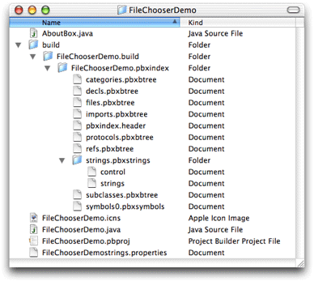

The build directory contains the results of building your project. The file `FileChoserDemo.icns` contains the icons for your application. This file is the icon set that Project Builder assigns by default to Java applications if you do not specify another `.icns` file to use. `FileChooserDemo.pbproj` is the Project Builder project file. It contains generated meta data about your project, and Project Builder maintains this file. `FileChooserDemostring.properties` maintains a list of localizable strings. There are also two Java source files.

To further explore the interactions of these parts of the FileChooserDemo project, make Project Builder active again.

In the Files list you see the same basic layout as in the Finder. With such a simple project, it might appear that the Files list is just a mirror of the file-system layout. It is important to note that this is not the case. Project Builder keeps track of the files in your project by means of references. It does not have to actually copy the file to the project folder. This allows you to set up your project in the Files list in a manner that streamlines development without having to be concerned with how the files are structured on disk. You could, for example, have source code in a directory different from that of your Project Builder project.

Before making any changes to your new project, verify that it builds a valid Java application. Choose Build and Run from the Build menu. You can also click the Build and Run button (the one with the hammer and computer monitor) in the toolbar or simply press Command-R. Your application should build and then launch a simple Hello World application. It’s window should look like the one shown in [Figure A-2](#apple-f4xwc4dqnrsv64tfmyxwi33df52wszbpkridgmbqgaydomjqfvbuuqscijeugsa).

__Figure A-2__  Result of building a default project

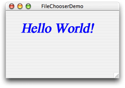

Notice the generic Java icon in the Dock for this application.

__Figure A-3__  Generic Java icon

Also notice that the application, though a pure Java application, takes on the Aqua look and feel of a Mac OS X application, right down to the genie effect when you minimize the window.

Project Builder has not only compiled the `.java` source files, but also wrapped the resulting Java application as a Mac OS X application. In the Finder you can see the double-clickable Mac OS X application inside your project folder in the `Build` directory. In building the Mac OS X application, Project Builder has set certain system properties. For example, by default Project Builder passes the flag `-Dcom.apple.macosx.useScreenMenuBar=true` to your application when it runs. This puts the menu bar at the top of the screen where it is in native Macintosh applications. 

Building a default application is nice, but how do you get your code to build in Project Builder? So far you have only built and run the default files provided in the Java Swing application template. Now you are going to add modify the template to get a feel for how you can modify the default Project Builder templates with your own Java source code.

If the FileChooserDemo application is still running, quit it. You can do this either by clicking the Stop button in the Project Builder toolbar or by pressing Command-Q in the application itself. Before adding the correct source files, you need to remove the two source files that Project Builder gave you by default. In the Files list, you see `FileChooserDemo.java` and `AboutBox.java` as indicated in [Figure A-4](#apple-f4xwc4dqnrsv64tfmyxwi33df52wszbpkridgmbqgaydomjqfvbegskdifcessi).

__Figure A-4__  Default files in a new Java Swing application

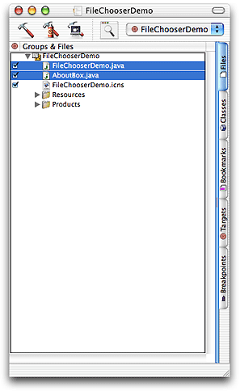

`FileChooserDemo.java` contains the `main` method invoked when the application runs. You will replace this file with the `FileChooserDemo.java` source file in `/Developer/Examples/Java`. The use of MRJAboutBox and MRJQuitHandler in `FileChooserDemo.java` allows your Java application to more closely resemble a native Mac OS X application. Their use, however, is beyond the scope of this example. There is another file, `AboutBox.java`, which contains the AboutBox class that is used in conjunction with the MRJAboutHandler.

To get rid of the old `FileChooserDemo.java` file, select it in the Files list and choose Delete from Project Builder’s Edit menu. In the alert that appears, click Delete References & Files. This removes the reference to the file in Project Builder and deletes the file from your project directory. Delete `AboutBox.java` in the same manner.

__Figure A-5__  Delete References alert

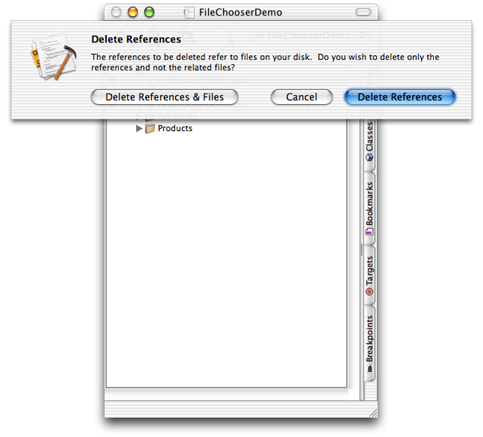

You now have a Java project with no source files. From the Project menu, choose Add Files. Navigate to `/Developer/Examples/Java/JFC/FileChooserDemo/src` either in the browser or by typing the path in the "Go to” field. Select `ExampleFileFilter.java`, `ExampleFileView.java`, and `FileChooserDemo.java`. Click Add.

__Figure A-6__  Selecting files to add to a Java project

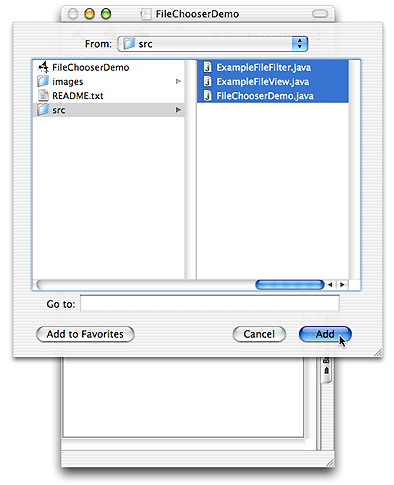

In the next dialog, you need to decide whether to copy the files themselves into the project folder or just make references to them. Do you want a local version that you can alter without affecting other projects or do you want to maintain a single copy of that source file? In this case the former is appropriate so select the option “Copy items into destination group’s folder.” Leave the Reference Style pup-up menu set to Default. Since you are not adding any folders, your choice for the folder reference radio buttons does not matter. Click Add.

__Figure A-7__  Copy items into project folder option

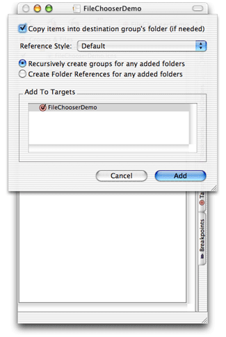

Once you have the appropriate files in your project, you can compile the Java code and build the Mac OS X application. Since you removed some files and added others since your last build, it is a good idea to clean the active target before building. If you don’t clean the active target, you might get build errors. From the Build menu select Clean. Dismiss the resulting warning by clicking Clean Active Target. Now you are ready to build. Click the Build button (with the hammer icon) in the Project Builder toolbar or choose Build from the Build menu. Look at the results of this process by opening your project folder in the Finder.

__Figure A-8__  Contents of a built application

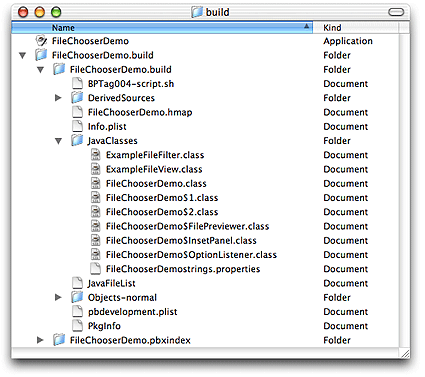

At the top level of the project directory are the source files and the `FileChooserDemo.icns` file that were there before. The `build` directory now contains the class files and the Mac OS X double-clickable application, FileChooserDemo. You can see how everything was built by looking at the messages in Project Builder’s Build pane. When Project Builder builds a Java application, the source code is compiled, archived as a JAR file, and then converted to a Mac OS X application.

Although Project Builder did compile the Java source files and used `jar` to archive them together, it also put together the Mac OS X application bundle. In doing this it evaluates certain settings in Project Builder to construct the property lists that Java on Mac OS X uses at runtime. (see [Property List Attributes for Java Applications](Deployment%20Options.md#apple-f4xwc4dqnrsv64tfmyxwi33df52wszbpkridgmbqgaydombwfvbegskjjjcegsi)). For example, Project Builder determined the name FileChooserDemo to display in the title bar and determined the main class to run when your application is double-clicked in the Finder. Some properties don’t get set automatically though and some retain default values unless you specify otherwise. For example if you launch the FileChooserDemo application, you can see that the default Java icon is still in the Dock. This icon is added to your application bundle if you don’t add your own icon.

It is simple to modify the generic Java runtime properties of your application or to add specific Mac OS X properties from Project Builder. In your FileChooserDemo Project window, click the Targets tab. Select the FileChooserDemo target in the top left window. It should be the only target there. (If you are using Project Builder’s multi window user interface, double click the target.) In the resulting window or pane you can modify many different aspects of that target as [Figure A-9](#apple-f4xwc4dqnrsv64tfmyxwi33df52wszbpkridgmbqgaydomjqfvbeeq2ei5fessq) shows.

__Figure A-9__  Target settings

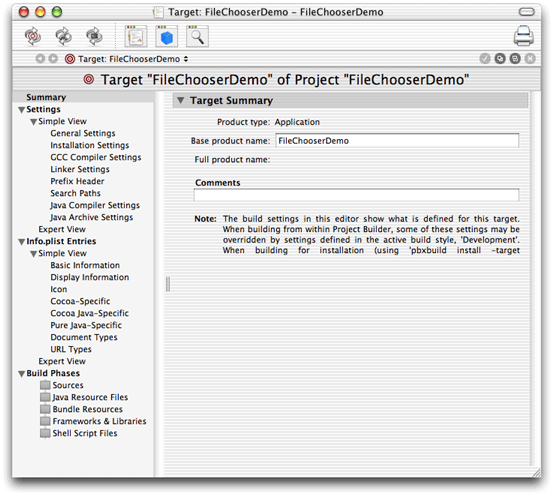

There are many settings here that you can modify, but the ones you will probably modify the most include those in Pure Java-Specific. To see how you can modify these, select the Pure Java-Specific section. Project Builder should display a window that looks like the one in [Figure A-10](#apple-f4xwc4dqnrsv64tfmyxwi33df52wszbpkridgmbqgaydomjqfvbeeq2hiraucsi).

__Figure A-10__  Pure Java-Specific settings

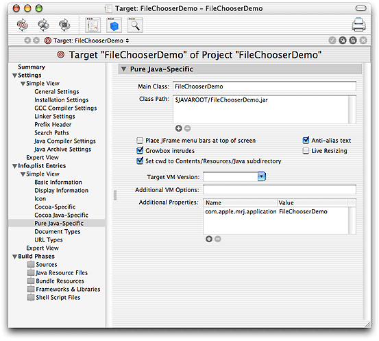

This pane shows the default settings. To see the effect of changing settings here, add a command-line setting to the Additional Properties list, then clean and rebuild the application. For example:

1. Click the plus (+) button under Additional Properties.
2. Replace the highlighted `new`.property with `com.apple.mrj.application.live-resize`.
3. Replace `value` with `true`.
4. Choose Clean from the Build menu. In the sheet select Clean Active Target.
5. From the Build menu, select Build and Run.

You can see in the resulting application that if you resize the window it now attempts to fill in the contents as the window is resizing, instead of just resizing an outline of the window. You can also see why this system property is off by default! (For an application with a simpler window, turning on this system property might be beneficial.)

You can add any properties in the Pure Java Specific section that you might pass in at the command line. Those that you pass in with the `-D` flag should go in the Additional Properties section. Those that you pass in with `-X` should go into the Additional VM Options section.

Having tried an option that didn’t make your application better, you should remove it. In removing it though, try using the Expert View indicated in [Figure A-11](#apple-f4xwc4dqnrsv64tfmyxwi33df52wszbpkridgmbqgaydomjqfvkfawcsivddcmjz). Just select the offending property, and delete it.

__Figure A-11__  Expert View

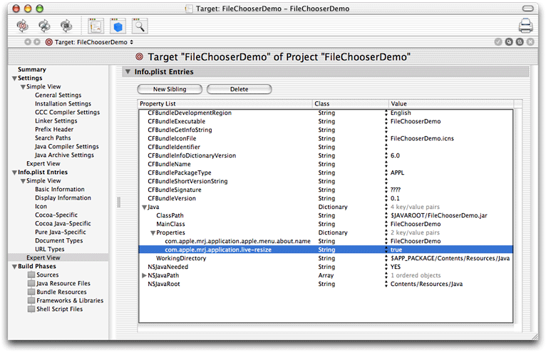

Now if you clean, build, and run the application, you should see that the original behavior has returned. This is seen in Figure A-12. Whether modifying the settings in the Expert View or Simple View, you are really just modifying the property list entries as discussed in [Property List Attributes for Java Applications](Deployment%20Options.md#apple-f4xwc4dqnrsv64tfmyxwi33df52wszbpkridgmbqgaydombwfvbegskjjjcegsi).

__Figure A-12__  Default setting for live resizing

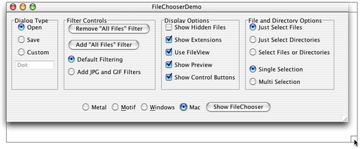

With the basic steps presented here, you have the foundation to build your own Java applications in Project Builder and take advantage of the value it adds by allowing users to run your pure Java application just like they would any other Mac OS X application.

Building applets with Project Builder is very similar to building applications. Since applets are hosted within another application, there is no need to convert them to Mac OS X applications like you did with the Pure Java application. Having built an application in Project Builder, building your applet should be very straightforward. As with the application, the simplest way to start is with one of Project Builder’s templates. By adding your own files and removing the default files, you can quickly get your own applets built in Project Builder.

Build one of the applets in `/Developer/Examples/Java/Applets`. For example:

1. Open a new Project Builder project. Use the Java AWT Applet template. Name it `ArcTest`.
2. Delete the `ArcTest.java` and `example1.html` files.
3. Add in `ArcTest.java` and `example1.html` from `/Developer/Examples/Java/Applets/ArcTest` like you did in [Adding Your Source Files](#apple-f4xwc4dqnrsv64tfmyxwi33df52wszbpkridgmbqgaydomjqfvbeeq2hifeeusq).
4. Clean and Build the applet.

Once you have built your applet, you can test it by loading the HTML file into a browser or into the Applet Launcher application found in `/Applications/Utilities/Java`. As illustrated in [Figure A-13](#apple-f4xwc4dqnrsv64tfmyxwi33df52wszbpkridgmbqgaydomjqfvkfawcsivddcmjx), just put in the path to the HTML file that Project Builder generated. This file is in your project folder in `build/ArdTest.build/ArcTest.build/JavaClasses`.

__Figure A-13__  Applet Launcher

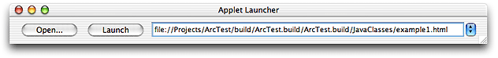

By following this short tutorial, you should now see that Project Builder gives you a simple-to-use development environment for pure Java development, while also helping you to make your Java applications fit seamlessly into Mac OS X.

[Next](MRJAppBuilder%20Tutorial.md)[Previous](Using%20Native%20Features%20of%20Mac%20OS%20X%20in%20Java%20Applications.md)

