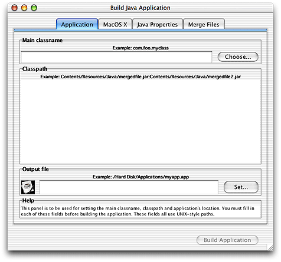
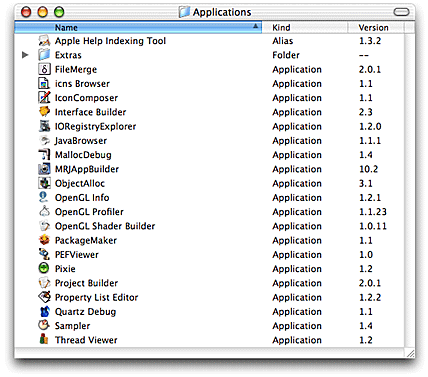

> 导航：[总目录](../../../README.md) · [documentation](../../../_indexes/documentation.md) · [Java 1.3.1 Development for Mac OS X](About%20This%20Book.md)


[Next](Cross-Platform%20Practices%20for%20Great%20Native%20Behavior.md)[Previous](Deployment%20Options.md)

# The Development Environment

Mac OS X provides a very robust environment for Java development. This chapter outlines some of the tools available to you in Mac OS X. It also discusses some things that may be different in the development environment from other platforms that you may have used for Java development.

There are three basic types of Java development tools available to you in Mac OS X:

- There are the standard command-line Java tools that you normally associate with the Java Development Kit (JDK).
- Apple provides additional command-line and GUI-based tools free with the Mac OS X Developer Tools.
- There are many third-party tools, both open source and commercial, that you can use for Java development on Mac OS X.

Most of the same tools that you would expect to find on Linux, Solaris, or Windows with the Java Development Kit (JDK) installed are included with Mac OS X by default. There are no extra installation steps required. Most of the standard JDK tools are command-line tools. The Java command-line tools are accessible from `/usr/bin` and `/Library/Java/Home/bin`. These tools are included with the default installation of Mac OS X:

- basic Java tools
- - `java`— runtime and virtual machine
  - `javac`—compiler
  - `javah`—C header and stub file generator
  - `javap`—class file disassembler
  - `jdb`—debugger
  - `jar`—archive tool
  - `javadoc`—API documentation generator
  - `appletviewer`—applet viewer
  - `extcheck`—JAR conflict detection utility
- Remote Method Invocation (RMI) tools
- - `rmic`—RMI stub compiler
  - `rmid`—RMI activation system daemon
  - `rmiregistry`—remote object registry
  - `serialver`—tool to obtain class serial version
- internationalization tool
- - `native2acsii`—text converter to Unicode
- security tools
- - `jarsigner`—JAR signing and verification tool
  - `keytool`—key and certificate management tool
  - `policytool`—tool to manage Java policy files
- Java Interface Definition Language (IDL) and RMI over Internet Inter-ORB Protocol (IIOP) tools
- - `idlj`—IDL-to-Java compiler
  - `tnameserv`—Java IDL name server starter script

Documentation on using these tools is available in the online manual (`man`) pages. These are available in Project Builder under the Help menu as well as in the shell itself.

When debugging your Java applications, you may want to display a stack trace. If you launched your application from the command line, CTRL-\ generates a `SIGQUIT` signal and prints the current stack trace in your Terminal window. If you launch your Java application from the Finder, you just need to find its process ID (PID) and deliver a `SIGQUIT` signal to that process. You see the stack trace in the Console application. For example, first launch Applet Launcher, Terminal, and Console (all are in `Applications/Utilities`). If you want to generate a stack trace for Applet Launcher, in Terminal type:

```
ps -auxwww | grep "Applet Launcher"
```

You would see the results as something like:

```
bgerfen 1490   0.0  2.3   255700  17912  ??  S     2:39PM   0:05.76 /Applications/Utilities/Java/Applet Launcher.app/Contents/MacOS/Applet Launcher -psn_0_5898241
bgerfen 1507   0.0  0.0     1116      4 std  R+    2:41PM   0:00.00 grep -i Applet Launcher
```

Once you have the appropriate PID, kill it. For this example this looks like:

```
kill -QUIT 1490
```

Console displays the stack trace.

You may also want to include monitor status information in the stack trace. If you are running your application from the command line, just run your program with the `-XX:+JavaMonitorsInStackTrace` flag. You can also make a `.hotspotrc` file in your home directory with this line in it:

```
+JavaMonitorsInStackTrace
```

Since this file is parsed every time a Java VM starts up, it is in effect for applications run from the command line, double-clickable applications run from the Finder, and even Java applications embedded within other applications.

If you have a reproducible crash, you might also want to find the stack trace for the native code by running your application in `gdb`. After a crash use this command:

```
thread apply all bt
```


Having a UNIX-based core at the heart of the operating system provides you, as a Java developer, access not only to Java tools, but also a host of general UNIX-based development tools.

A look in `/usr/bin` shows many tools that make Java development on Mac OS X very comfortable if you are already accustomed to a UNIX-based operating system. (In the Finder, choose “Go to Folder” from the Go menu.) You will find `emacs`, `gdb`, `make`, `pico`, `vi`, and `perl` among others. If you do not see all of these, you may need to install the Mac OS X Developer Tools. See [Where to Get the Tools](#apple-f4xwc4dqnrsv64tfmyxwi33df52wszbpkridgmbqgaydombxfvbegskeijeeusq) for more information.

If you are looking for Mac OS X ports of other command-line tools, look first in the Darwin CVS repository available at [http://developer.apple.com/darwin](https://developer.apple.com/darwin) or [http://www.opendarwin.org](http://www.opendarwin.org/). You can also look at the main repository of the tool you are trying to obtain. For basic information on porting your favorite non-Java tools to Mac OS X, see _Inside Mac OS X: UNIX Porting Guide_.

Among the GUI-based tools are three that are especially important for Java development: Project Builder, MRJAppBuilder, and Applet Launcher.

Project Builder is a complete integrated developmente environment (IDE) that allows you to edit, compile, debug, and package your Java applications. A tutorial of how to build a simple Java application is included in [Project Builder Tutorial](Project%20Builder%20Tutorial.md#apple-f4xwc4dqnrsv64tfmyxwi33df52wszbpkridgmbqgaydomjqfvkfawcsivddcmbr). Additional details of using Project Builder to build Java applications are included in the section on compiling Java files in Project Builder Help.

MRJAppBuilder is a utility for packaging already-compiled Java applications to run as Mac OS X applications. MRJAppBuilder constructs applications in the same application bundle format as other Mac OS X applications. It is very simple to use and allows you, with minimal work, to make your Java application launch like native Mac OS X applications. You can even easily set options like the Dock icon and the application name that appears in the menu bar without modifying your Java source code. Additionally you can use MRJAppBuilder to set runtime flags that you might want to use only in Mac OS X. In order to use MRJAppBuilder, you need only know the main class name of your application and have access to the `.class` files.

The interface to MRJAppBuilder is simple and readily apparent when you open the application. As illustrated in [Figure 4-1](#apple-f4xwc4dqnrsv64tfmyxwi33df52wszbpkridgmbqgaydombxfvbuuqsei5cesry), there are four tabbed panes in the MRJAppBuilder window.

__Figure 4-1__  MRJAppBuilder



The information in the Application pane is all that you need to make a Mac OS X application. All three fields are required. The “Main classname” field is where you enter the name of the class that contains `main`. This field represents the value of the property `com.apple.mrj.application.main`. Remember to include a full package name. For example, `com.myCompany.myMainClass`.

The Classpath field allows you to modify the classpath. This is automatically set to point to the JAR file that you’re bundling into your application. If you want to use JAR or `.class` files that will not be included in the resulting application bundle, add a classpath entry of this form:

```
$APP_PACKAGE/../MyJARFile.jar
```

`$APP_PACKAGE` is a special path string that represents the application bundle directory. The last required field is the “Output file” field. This is where the resulting application bundle will be built. An optional setting in this pane is the application icon. Click the icon in the “Output file” section to bring up a file chooser dialog for selecting an `.icns` file.

Settings in Mac OS X, Java Properties, and Merge Files panes are optional. The Mac OS X pane allows you to set values specific to the Mac OS X application bundle format. If you do not specify `CFBundleExecutable` or `CFBundleName`, they are set based on the name of the output file you choose.

The Java Properties pane lets you set specific runtime properties, which can include standard Java properties as well as the specific Mac OS X system properties discussed in [Mac OS X Application Properties](Mac%20OS%20X%20Java%20System%20Properties.md#apple-f4xwc4dqnrsv64tfmyxwi33df52wszbpkridgmbqgaydomjsfvkfawcsivddcmbr). See [Setting Runtime Properties in MRJAppBuilder](Deployment%20Options.md#apple-f4xwc4dqnrsv64tfmyxwi33df52wszbpkridgmbqgaydombwfvkfawcsivddcmbx) for more information on the Java Properties pane.

The Merge Files pane provides a means for adding files to the application bundle, such as `.zip` or JAR files. Each item added to the merge list is copied into the application’s `Contents/Resources/Java` directory. Each item you add to the merge list gets automatically added to the classpath.

When you have finished making settings, click Build Application. MRJAppBuilder does not provide an import mechanism. If you build an application and want to change certain settings, you need to make a new application with MRJAppBuilder or modify the `Info.plist` and `MRJApp.properties` files by hand. Information on these files can be found in [Application Bundles](Deployment%20Options.md#apple-f4xwc4dqnrsv64tfmyxwi33df52wszbpkridgmbqgaydombwfvbegskkijceuqq).

Applet Launcher (in `/Applications/Utilities/Java`) allows you to run applets without the overhead of launching a Web browser. It provides a graphical interface to Sun’s Java Plug-in. If you want to test the performance of your applet with the `sun.applet.AppletViewer` class, you should use the `appletviewer` command-line tool (`/usr/bin/`). You can enter the path to an applet using its fully-qualified URL, and then press the Launch button. For example, entering the following URL launches the ArcTest applet:

file:///Developer/Examples/Java/Applets/ArcTest/example1.html

Performance and behavior settings for applets may be adjusted in the Java Plugin Settings application installed in `/Applications/Utilities/Java`.

The Mac OS X Developer Tools also provide many tools useful for any kind of development, not just Java. For example Package Maker, File Merge, and Icon Composer are just a few examples. [Figure 4-2](#apple-f4xwc4dqnrsv64tfmyxwi33df52wszbpkridgmbqgaydombxfvbuuqscizfekri) shows all of the tools that get installed into `/Developer/Applications`.

__Figure 4-2__  Tools in `/Developer/Applications`



In addition to the Apple-supplied tools, since you have both a UNIX foundation and a full implementation of Java 2 Standard Edition, you may use many third party tools in Mac OS X. IDEs like Borland’s JBuilder, Sun’s ONE Studio, and Metrowerks’ CodeWarrior are all available. There are many text editors, as well as other tools for specific functionality like `ant`, JUnit, and OptimizeIt. If you are interested in Java 2 Platform, Enterprise Edition (J2EE) development, Pramati and Jboss both offer J2EE development environments for Mac OS X. Some of the most important pieces of J2EE, like Enterprise Java Beans and Java Server Pages (JSP), are supported in Apple’s WebObjects product ([http://www.apple.com/webobjects](http://www.apple.com/webobjects)). Zentek’s iJADE product line is one solution for Java 2 Platform, Micro Edition (J2ME) development in Mac OS X.

The standard JDK tools are installed with a default user installation of Mac OS X. If your computer has Mac OS X installed but does not appear to have tools like `javac`, you can remedy this by making sure that the BSD packages are installed:

1. In the Welcome to Mac OS X folder of the Mac OS X Install Disk 1, double-click the Install Mac OS X icon.
2. In the window that opens, click the Restart button.
3. When your computer has restarted, follow the onscreen prompts until you get to the Installation Type phase. (This is indicated on the left side of the Install Mac OS X window.)
4. Select the Customize button.
5. Select BSD Subsytem.Though you may select other packages to add to your computer, for basic command-line Java development, you do not need any other packages. (The Base System and Essential System Software packages are always included.)
6. Proceed with the installation by following the onscreen prompts. Once you have restarted your computer, you should find the command-line Java tools installed in `/usr/bin`.

The Mac OS X Developer Tools CD comes with Mac OS X and is provided with new Macintosh computers. If you do not have a current copy of the Mac OS X Developer Tools, you may download them from the Apple Developer Connection Web site at [http://connect.apple.com](http://connect.apple.com/). Even if you do not want to use the Apple provided GUI-based tools, you should install the Mac OS X Developer Tools since they contains some important tools not installed by default.

[Next](Cross-Platform%20Practices%20for%20Great%20Native%20Behavior.md)[Previous](Deployment%20Options.md)

