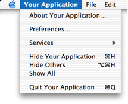
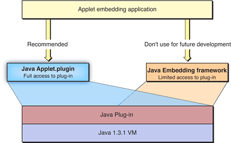

> 导航：[总目录](../../../README.md) · [documentation](../../../_indexes/documentation.md) · [Java 1.3.1 Development for Mac OS X](About%20This%20Book.md)


[Next](Project%20Builder%20Tutorial.md)[Previous](Cross-Platform%20Practices%20for%20Great%20Native%20Behavior.md)

# Using Native Features of Mac OS X in Java Applications

If you are targeting a Java application for Mac OS X deployment, this chapter offers a collection of things you might need to know to help your application perform the best it can in Mac OS X.

When your Swing applications start up, the Java implementation in Mac OS X determines which video card is installed in your system and compares this against a list of known unsupported video cards. If your card does not appear in, or is commented out of this list, then hardware graphics acceleration is invoked. If you do nothing at all, your Java applications take advantage of hardware acceleration if that computer has a compatible video card. You may find in testing your application in Mac OS X that you do not want hardware acceleration on or you might find certain video cards that you wish to turn off hardware acceleration for. If these cards are not ones that Apple automatically turns off hardware acceleration for, you need to explicitly turn them off with the `com.apple.hwaccelexclude` property using the naming conventions described in [Video Cards Designation Strings](#apple-f4xwc4dqnrsv64tfmyxwi33df52wszbpkridgmbqgaydombzfvkfawcsivddcmrs). For example, to turn off hardware acceleration on just the ATI Radeon 8500 but leave it on for all other cards, you could use the following command in Terminal:

```
java -Dcom.apple.hwaccel=true -Dcom.apple.hwaccelexclude=ATIRadeon8500_67108864 -jar App.jar
```

By using the `com.apple.hwaccelexclude` property, you have complete control of which cards are ignored. If you choose to turn off hardware acceleration for any specific cards, make sure that you also turn it off for those that are uncommented by default in the `hwexcludelist.properties` file as well. Otherwise you will turn it off for the video card you are concerned with, but it will be on with cards that Apple initially had it turned off for.

Taking this into account, a better example of turning off hardware acceleration for the ATI Radeon 8500 would also turn it off for the 8 MB ATI Rage 128 card in the first generation iBooks and Titanium PowerBooks:

```
java -Dcom.apple.hwaccel=true -Dcom.apple.hwaccelexclude=ATIRadeon8500_67108864,ATIRage128_8388608 -jar App.jar
```

The `com.apple.hwaccel=true` is not necessary in Mac OS X version 10.2, but it is suggested that you use it along with the -Dcom.apple.hwaccelexclude flag.

To turn off hardware acceleration completely, pass in the command-line flag `com.apple.hwaccel=false`. For example:

```
java -Dcom.apple.hwaccel=false -jar App.jar
```

To turn on hardware acceleration for all video cards, pass in the command-line flag `com.apple.hwaccelexclude` with no arguments as follows:

```
java -Dcom.apple.hwaccel=true -Dcom.apple.hwaccelexclude= -jar App.jar
```

You may incorporate any of these command-line options into your Mac OS X applications bundles using MRJAppBuilder or Project Builder.

While testing your Java applications, you may want to see what effect Mac OS X’s Java hardware graphics acceleration has on your code without having to restart your application each time you make a change. By passing in the system property `com.apple.usedebugkeys=true` and you can use function keys combinations to turn hardware acceleration on and off. There are two sets of key combinations you can use:

- Command-F7 to turn on hardware acceleration gracefully. This is equivalent to the default behavior except that you may toggle it on and off while the application is running. Option-F7 turns it off.
- Command-F8 forces hardware acceleration on. This differs from Command-F7 in that it forces everything to be hardware acceleration without applying any of the logic that Command-F7 would use. This is for testing only, and you may see unpredictable results. Option-F8 turns it off.

The `com.apple.forcehwaccel` runtime property allows you to force hardware acceleration on or off without looking at the list of suggested video cards. This is similar to using Command-F8 with `com.apple.usedebugkeys` as noted above except that with `com.apple.forcehwaccel`, the state is explicitly determined at runtime. Available values are `true` and `false`.

Another runtime property, `com.apple.hwaccelnogrowbox`, is provided so that you can determine if hardware acceleration is on or off just by looking at a window. By setting this to `true`, the grow box (called a resize control in Aqua) normally found in the bottom right corner is not displayed if hardware acceleration is on. It will be visible if hardware acceleration is not on. Setting this to `false`, gives you the default behavior that shows the grow box regardless of whether hardware acceleration is on or off.

Java hardware graphics acceleration is supported on most of the default video cards in Apple computers, provided they have 16 MB or more of on-card video memory. For the purpose of Java graphics hardware acceleration, each of these cards has been assigned a distinct identifying string. There are a few ways of determining these strings:

- If you are unsure of the type of video card in a computer, use the `hwaccel_info_tool` available online at [http://connect.apple.com](http://connect.apple.com/). Instructions on using this command-line tool are provided in a man page installed with the tool.
- If you know what type of video card is in your computer, you can determine the appropriate string by looking in the `hwaccelexclude.properties` file in `/System/Library/Frameworks/JavaVM.framework/Versions/1.3.1/Home/lib` or by using[Table 6-1](#apple-f4xwc4dqnrsv64tfmyxwi33df52wszbpkridgmbqgaydombzfvkfawcsivddcmru).

__Table 6-1__  Video-card designation strings

| Video card model | Memory | String |
| ATI Rage Mobility 128 | 8 MB | `ATIRage128_8388608` |
| ATI Rage 128 | 16 MB | `ATIRage128_16777216` |
| ATI Radeon | 16 MB | `ATIRadeon_16777216` |
| ATI Rage 128 | 32 MB | `ATIRage128_33554432` |
| ATI Radeon 7500 | 32 MB | `ATIRadeon_33554432` |
| ATI Radeon 8500 | 32 MB | `ATIRadeon8500_67108864` |
| NVidia GeForce2 | 32 MB | `NVidia11_33554432` |
| NVidia GeForce3 | 64 MB | `NVidia20_67108864` |
| NVidia GeForce4MX | 64 MB | `NVidia11_67108864` |
| NVidia GeForce4TNT | 64 MB | `NVidia20_134217728` |

By default, Java processes that are launched from a shell do not show up in the Dock or the menu bar until they show a window. If they never show a window, they never appear in the Dock. This allows server-type processes to run behind the scenes with no user-visible manifestation.

If you are running an application from the command line that opens a window, the class name of the application’s main class appears as the application name in the Dock and application menu. You may specify a more appropriate name to display by using this command-line option:

`-Xdock:name=`_applicationName_

You can also specify an icon to replace the generic Java icon with this option:

`-Xdock:icon=`_pathToIconFile_

The icon file must be a Mac OS X icon file—the same type you would use for any other Mac OS X application. If either the application name or path to the icon file has spaces in it, wrap it in double quotes.

In Swing, an application’s menu bar is applied on a per-frame (window) basis. Similar to the Windows model, the menu bar appears directly under the frame’s title bar. This is different from the Macintosh model, where the application has a single menu bar that controls all of the application's windows. To solve the basic problem, a runtime property is provided:

```
com.apple.macos.useScreenMenuBar
```

This property can have a value of `true` or `false`. If undefined, the standard Java behavior equivalent to a value of `false` is used. When read by the Java runtime at application startup, a given JFrame’s JMenuBar is placed at the top of the screen, where a Macintosh user would expect it to be. Since this is a simple runtime property that must be used by the host VM, setting it in your application has no effect on other platforms since they do not even check for it.

Note that a JMenuBar attached to a JDialog does not appear at the top of the screen as expected when setting this property, but rather inside the dialog as if the property were not set. If your JDialog does not have a menu bar, the default parent JFrame’s menu bar is displayed when the JDialog is brought into focus.

If you find the need to attach menus to a dialog window, you may want to consider making the window a JFrame instead of a JDialog. A dialog should be informational or present the user with a simple decision, not provide complex choices. A window with enough functionality to necessitate a menu bar may be better as a JFrame.

Unfortunately, this solves only part of the problem—the placement of the menu bar. The fundamental discrepancy between the idea of a single menu bar per application of the Macintosh and a menu bar per window of Java, still exists. In other words, setting this property causes the menu to appear at the top of the screen, but only when the specific window it was assigned to is in focus. If your application has multiple windows, and a window other than the one holding the menu bar is focused, the menu bar vanishes. The Aqua guidelines state that the menu bar should always be visible in an application; even an insignificant window such as an alert dialog should still show the menu bar (though you may want to disable the menus).

One of the suggestions in _Inside Mac OS X: Aqua Human Interface Guidelines_ is that all Mac OS X applications should provide a Window menu to keep track of all currently open windows. A Window menu should contain a list of currently active (visible) windows, with the corresponding menu item checked if a given window is currently in the foreground. Likewise, selection of a given Window menu item should result in the corresponding window being brought to the front. New windows should be added to the menu, and closed windows should be removed. The ordering of the menu items is typically the order in which the windows appeared. _Inside Mac OS X: Aqua Human Interface Guidelines_ has more specific guidance on the Window menu.

Any Java application that uses AWT/Swing, or is packaged in a double-clickable application bundle, is automatically launched with an application menu similar to native applications on Mac OS X. This application menu, by default, contains the full name of the main class as the title. This name can be changed using the `com.apple.mrj.application.apple.menu.about.name` application property or the `-Xdock:name` command-line property. According to the Aqua guidelines, the name you specify for the application menu should be no longer than 16 characters. [Figure 6-1](#apple-f4xwc4dqnrsv64tfmyxwi33df52wszbpkridgmbqgaydombzfvkfawcsivddcmjv) shows an application menu.

__Figure 6-1__  Application menu for a Java application in Mac OS X



The next step to customizing your application menu is to have your own handling code called when an item in the application menu is chosen. Apple has provided a means for this through interfaces in the `com.apple.mrj` package. Each interface has a special callback method that is called when the appropriate application menu item is chosen. The following callback interfaces for the application menu are available:

- com.apple.MRJAboutHandler, to handle the About menu item.
- com.apple.MRJPrefsHandler, to handle the Preferences menu item.
- com.apple.MRJQuitHandler, to trigger final clean-up logic when the Quit menu item is chosen. By default, that Quit menu item just calls `System.exit`. You might actually want to do more than just exit.

To handle a given application menu item:

1. Implement the appropriate handler interface.
2. Define the appropriate `handler` method in your implementation: `handleAbout`, `handlePrefs`, or `handleQuit`.
3. Register your handler using the appropriate static methods in the `com.apple.mrj.MRJApplicationUtils` class: either `registerAboutHandler`, `registerPrefsHandler`, or `registerQuitHandler`.

You can see examples of these implementations in a default Swing application project in Project Builder.

If your application is to be deployed on other platforms, where Preferences, Quit, and About are accessed elsewhere on the menu bar (in a File or Edit menu, for example), you may want to make this placement conditional based on the operating system of the host platform. This is preferable to just adding a second instance of each of these menu items for Mac OS X. This minor modification can go a long way to making your Java application feel more like a native application on Mac OS X.

In addition to the interfaces provided for handling application menu items, Java on Mac OS X provides two other handlers:

- com.apple.MRJOpenApplicationHandler, which lets you respond to an Open Application Apple event.
- com.apple.MRJOpenDocumentHandler, that responds to double-clicking a supported document or the dragging of a document onto your application’s icon.

These handler interfaces are intended to enhance a Java application’s behavior in the Mac OS X Finder and are used in the same manner as the application menu interfaces described above.

To run correctly in non-English locales, Java applications bundles need to have the appropriate localized folders inside the application package. This is true even if the Java application handles its localization through Java `ResourceBundles`. Specifically, you need to have a folder named with the locale name and the `.lproj` suffix present in the application’s `Resources` folder for any locale that you wish to use. For example, you need a `Japanese.lproj` folder inside `YourApplication.pkg/Contents/Resources/` in order for Japanese localization to work correctly. The folder itself can be empty, but it must be present for Mac OS X to set the locale correctly when the application launches. Otherwise Mac OS X launches your application with the English US locale.

The Bundle Services documentation and _Inside Mac OS X: System Overview_, both available from [http://developer.apple.com/documentation](https://developer.apple.com/documentation), provide more details about the application bundle format.

QuickTime for Java provides a cross-platform API that allows Java developers to build multimedia components, including streaming audio and video, into applications and applets for both Macintosh and Windows. More information on QuickTime for Java is available online at [http://developer.apple.com/quicktime/qtjava/](https://developer.apple.com/quicktime/qtjava/).

Mac OS X includes a very robust sound subsystem. Hooks for using this system directly from Java are provided in the Java Core Audio packages. More information on the Mac OS X Core Audio framework can be found online at [http://developer.apple.com/audio](https://developer.apple.com/audio).

Two very useful frameworks, Spelling and Speech, are also available for you to use in Mac OS X. These are implemented as Java Beans. The source code, examples, and documentation are available at [http://developer.apple.com/java](https://developer.apple.com/java).

In addition to the standard Java Native Interface, Mac OS X also includes JDirect3. JDirect3 allows access to preexisting native code libraries from Java without you needing to explicitly use JNI. It builds JNI stubs for you on the fly.

JDirect3 is not a standard part of J2SE, and it is important to keep in mind that it ties your code to Mac OS X. JDirect3 is not recommended for future new development since changes in future releases of Mac OS X will yield your code unusable.

JDirect1, which has been deprecated since 1997, is not supported in Mac OS X. If you have JDirect2 code, it requires minor modifications to run under JDirect3. If you are porting old JDirect2 code to JDirect3, there are a few important details to keep in mind as the following sections discuss.

You must synchronize all Human Interface Toolbox calls. Since Java threads are native Mach threads and can preempt Toolbox calls made by the host application or by other Java threads otherwise. The Java implementation itself is based on the Carbon threading model in Mac OS X. This threading model is neither reentrant or thread-safe. Since reentrant calls can corrupt memory or crash your application, it is important that only one thread be inside Carbon at any time.

This is the correct way to call the Toolbox from Java on Mac OS X:

```
import com.apple.mrj.macos.carbon.CarbonLock;
try {
    CarbonLock.acquire();

//Carbon call here

} finally {
    CarbonLock.release();
}
```

This way the Carbon lock handling can easily be reversed for JDirect callbacks.

Be sure to use `CarbonLock` around all Carbon calls. Since threads are preemptive on Mac OS X, you should hold the Carbon lock for the shortest amount of time possible.

Make sure not to do anything that might throw an exception in the `finally` block that calls `CarbonLock.release`. Structure your code so that the Carbon locking is separate from other finally blocks.

To help debug JDirect on Mac OS X, you can define a shell variable, `JDIRECT_VERBOSE` to write verbose JDirect loading info to `stderr`. This works only when launching Java code from the command line, not when double-clicking a bundled application in the Finder. You can launch any double-clickable application from the command line by specifying the path to the application’s executable.

For example, to set the shell variable, and then launch an application called Foo.app, you would do the following in `csh`:

`setenv JDIRECT_VERBOSE`

`/path/Foo.app/Contents/MacOS/Foo`

The class `MethodClosureUPP` was created for use in Mac OS 9 and is not supported in Mac OS X. If you are using Carbon callbacks and want code that can run in Mac OS 9 and Mac OS X, you need to have a helper class that creates a new `MethodClosureUPP` when in Mac OS 9 or a new `MethodClosure` when in Mac OS X.

Normally, your `JDirect_MacOSX` string is a full path to a dylib, which is the standard packaging for shared Mach-O binaries in Mac OS X. You can also specify a full path to a bundle. The bundle path name must end in `.bundle` and be a properly constructed directory. A bundle can use both Mach-O binaries and CFM binaries. The Bundle Services documentation in _Inside Mac OS X: System Overview_ has more details.

If you are a Mac OS X developer that needs to embed Java applets inside of your native application, use the Java Applet Plug-in (`Java Applet.plugin`) architecture of Mac OS X. In previous versions of Mac OS X, you might have used Java Embedding framework. Though this framework still works, it is not recommended for future development. It may change significantly in future versions of Java on Mac OS X.

As illustrated in [Figure 6-2](#apple-f4xwc4dqnrsv64tfmyxwi33df52wszbpkridgmbqgaydombzfvbecssfifduury), using the Java Applet Plug-in architecture will allow applets displayed in you application to take full advantage of Sun’s Java Plug-in; the Java Embedding framework provides only a subset of that functionality. The Java Applet Plug-in therefore provides both developmental benefits for developers as well as an enhanced user experience for applets displayed in your application.

__Figure 6-2__  Java Applet Plug-in versus Java Embedding Framework



The Java Applet Plug-in architecture allows your native code access to Sun’s Java Plug-in which in turn lets you access a virtual machine. Since it is a standard Netscape 4.0 style plug-in, you may also use it to provide Java support inside native applications. `Java Applet.plugin` is a native Mach-O library. It is a standard Mac OS X bundle. It exports the same symbols that the UNIX Netscape plug-in exports. Complete details on integrating a Netscape-style plug-in is beyond the scope of this document. .

In Mac OS X, Cocoa applications can be written in Java as well as their native Objective-C. Cocoa Java applications will behave just like a native applications but will not be portable to other platforms.

If you are using Cocoa Java for your user interface, it is important that you do not try to mix Cocoa Java with standard Java components. Since many of these components are Carbon-based, you will run into many problems. In particular, you should avoid trying to mix the following with Cocoa Java:

- Swing/AWT components, including Java events
- QuickTime for Java components
- JDirect calls

The main reason for this is that Carbon and Cocoa use different run loops, which conflict with one another if mixed in the same application.

More information on Cocoa Java is available at [http://developer.apple.com/documentation/cocoa](https://developer.apple.com/documentation/cocoa).

[Next](Project%20Builder%20Tutorial.md)[Previous](Cross-Platform%20Practices%20for%20Great%20Native%20Behavior.md)

