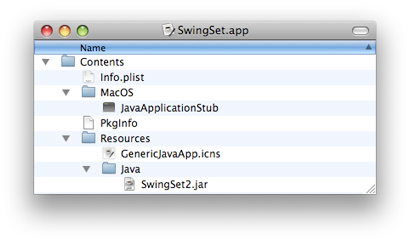
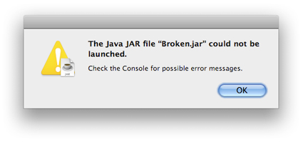

> 导航：[总目录](../../../README.md) · [documentation](../../../_indexes/documentation.md) · [Java Development Guide for Mac](Introduction.md)


[Next](OS%20X%20Integration%20for%20Java.md)[Previous](Apple%20Developer%20Tools%20for%20Java.md)

# Java Deployment Options for OS X

When deploying Java applications in OS X, you can use Java Web Start and web browser applets as you can on other platforms. You may also deploy Java applications as native Mac app bundles. This article discusses these deployment technologies. Make sure you know whether you are using a 32-bit or a 64-bit version of Java to ensure that your application is compatible with the architectures you are writing for.

OS X supports deploying your application as a Java Web Start application. Java Web Start is an implementation of the Java Network Launching Protocol (JNLP) specification, which means that OS X users can run your application in their web browser with a single click. Java Web Start automatically updates your application by checking your website for a new version before launch. Listing 1 provides a sample JNLP file that you can modify to accommodate your application.

__Listing 1__  A Sample JNLP file

```xml
<?xml version="1.0" encoding="UTF-8"?> <jnlp spec="1.0+" codebase="http://developer.apple.com/java/javawebstart/apps/welcome" href="JWS_Demo.jnlp">   <information>     <title>Welcome to Web Start!</title>     <vendor>Apple Computer, Inc.</vendor>     <homepage href="http://developer.apple.com/java/javawebstart" />     <offline-allowed />   </information>   <resources>     <j2se version="1.5+" />     <jar href="WebStartDemo.jar" />   </resources>   <application-desc main-class="apple.dts.javawebstart.DemoMain" /> </jnlp>
```

OS X desktop integration with Java Web Start lets users create a local application bundle from any Java Web Start application. The Shortcut Creation setting in Java Preferences controls whether the user is prompted to create an application bundle when opening a Java Web Start application. Bundled Java Web Start applications have all of the benefits of native application bundles, which are described in OS X Application Bundles.

You need to be aware of only a few details about how the OS X implementation of Java Web Start differs from the Windows and Solaris versions:

- Java Web Start on the Mac does not support downloading of additional Java Runtime Environments (JREs). New Java versions are provided by Apple via Software Update to all current OS X customers.
  Valid version keys for Mac app bundles are the same as those of Java Web Start. A list of these keys can be found in Java Dictionary Info.plist Keys.
- It is not necessary to set up proxy information explicitly in the Web Start application. Java Web Start in OS X automatically picks up the proxy settings from the Network pane in System Preferences.
- Java Web Start caches its data in the user’s `~/Library/Caches/Java/` directory.

Native Mac apps are more than just executable files. Although a user sees a single icon in the Finder, an application is actually an entire directory that can include images, sounds, icons, documentation, localizable strings, and other resources that the application may use in addition to the executable file itself. The application bundle simplifies application deployment in many ways for developers. The Finder, which displays an application bundle as a single item, retains simplicity for users, including the ability to just drag and drop one item to install an application.

This section discusses Mac app bundles as they relate to deploying Java applications. More general information on Mac app bundles is available in _[Bundle Programming Guide](../../Core%20Foundation/Bundle%20Programming%20Guide/Introduction.md#apple-f4xwc4dqnrsv64tfmyxwi33df52wszbpgeydambqgezdg2i)_.

When deploying Java applications in OS X, consider making your Java application into an OS X application bundle. It is easy to do and offers many benefits:

- Users can simply double-click the application to launch it. They can also drag it to the Trash to delete it.
- Users can add your application to their Dock. This is not possible without a complete Mac app bundle.
- If you add an appropriate icon, it shows the application icon in the Dock, clearly identifying your application. (Otherwise, a default Java coffee cup icon appears in the Dock.)
- You can easily set OS X–specific system properties that can make your Java application look more like a native application.
- You can associate specific document types with your application. This lets users launch your application by double-clicking a document created by your application.

The application bundle directory structure is hidden from view in the Finder by the `.app` suffix and a specific attribute, the bundle bit, that is set for that directory. (See _[Runtime Configuration Guidelines](../../Mac%20OSX/Runtime%20Configuration%20Guidelines/Introduction.md#apple-f4xwc4dqnrsv64tfmyxwi33df52wszbpgeydambqge3ta2i)_ for more information on Finder attributes.) The combination of these two things makes the directory a bundle. To get a glimpse inside an application bundle, you can explore the directory of resources from Terminal or from the Finder. Although by default the Finder displays applications as a single object, you can see inside by Control-clicking (or right-clicking if you have a multi-button mouse) an application icon and selecting Show Package Contents. You should see something similar to the directory structure shown in Figure 1.

__Figure 1__  Contents of a Java application bundle



Applications bundles for Java applications should have the following components:

- An `Info.plist` file in the Contents folder. This contains important information that OS X uses to set up the Java runtime environment for your application. More information about these property lists is in Java Dictionary Info.plist Keys.
- A file named `PkgInfo` should also be in the Contents folder. This is a simple text file that contains the string `APPL` optionally concatenated with a four letter creator code. If an application does not have a registered creator code, the string `APPL????` should be used. You may register your application with Apple’s creator code database on the ADC Creator Code Registration site at [http://developer.apple.com/datatype/](https://developer.apple.com/datatype/).
- The application’s icon that is displayed in the Dock and the Finder should be in the Resources folder. There is an OS X–specific file type designated by the `.icns` suffix, but most common image types work. To make an icon (`.icns`) file from your images, use the Icon Composer application installed in `/Developer/Applications/Utilities/`.
- The Java code itself, in either `.jar` or `.class` files, in the Resources folder.
- A native executable stub in the MacOS folder that launches the Java VM. This stub should only contain the architectures your application supports. Typically, pure Java applications should use the default ppc, i386, and x86_64 Universal stub in order to launch in as many Java VMs and as many versions of OS X as possible.
- Images (PNG, ICNS, PDF, and so on) used in your application should be in the Resources folder. These images can be accessed in you application with the AWT Toolkit by calling `java.awt.Toolkit.getDefaultToolkit().getImage("NSImage://your-image-name")`.
- Optional localized versions of strings may be included in folders designated by the `.lproj` suffix. If your application contains localized strings, you must include corresponding `.lproj` folders in your bundle, even if the strings are in `.properties` files in a Jar. See [Localizing Java Applications](#apple-f4xwc4dqnrsv64tfmyxwi33df52wszbpkridimbqgaytqobvfuzdaojshe2a) for more information on localized application bundles.

There are other files in the application bundle, but these are the ones that you should have in a Java application bundle. You can learn more about the other files in an application bundle, as well as more information about some of these items, in _[Framework Programming Guide](../../Mac%20OSX/Framework%20Programming%20Guide/Introduction%20to%20Framework%20Programming%20Guide.md#apple-f4xwc4dqnrsv64tfmyxwi33df52wszbpgeydambqge4dg2i)_.

OS X makes use of XML files for various system settings. The most common type of XML document used is the property list. Property lists have a `.plist` extension. The `Info.plist` file in the `Contents` folder of an OS X application is a property list.

The `Info.plist` file lets you fine-tune how your application is presented in OS X. With slight tweaking of some of the information in this file, you can make your application virtually indistinguishable from a native application in OS X, which is important for making an application that users appreciate and demand.

If you build your Java application in Xcode or Jar Bundler, the `Info.plist` file is automatically generated for you. If you are building application bundles through a shell or Ant script, you need to generate this file yourself. Even if it is built for you, you may want to modify it. This is most easily done with the Property List Editor application in `/Developer/Applications/Utilities`. Since property lists are simple XML files, you can also modify them with any text editor.

A property list file is divided into hierarchical sections called dictionaries. These are designated with the `dict` key. The top-level dictionary contains the information that the operating system needs to properly launch the application. The keys in this section are prefixed by `CFBundle` and are usually self explanatory. Where they are not, see the documentation in _[Runtime Configuration Guidelines](../../Mac%20OSX/Runtime%20Configuration%20Guidelines/Introduction.md#apple-f4xwc4dqnrsv64tfmyxwi33df52wszbpgeydambqge3ta2i)_.

At the end of the `CFBundle` keys, a `Java` key designates the beginning of a Java dictionary. This dictionary requires a `MainClass` key and should also include a `JVMVersion` key if your application requires a particular minimum version of Java. A listing of all the available keys and Java version values for the Java dictionary is provided in Java Dictionary Info.plist Keys.

There are three ways to make a Java application bundle:

- With Xcode
- With Jar Bundler
- From the command line

If you build a new Java Swing application using one of the Xcode Organizer’s templates, Xcode automatically generates an application bundle complete with a default `Info.plist` file. You can fine-tune the `Info.plist` file directly in Xcode or with Property List Editor. For more information on using Xcode for Java development, see Xcode Help (available from the Help menu in Xcode).

If you want to turn your existing Java application into an OS X Java application, use the Jar Bundler application available in `/Developer/Applications/Utilities`. It allows you to take existing `.class` or `.jar` files and wrap them as application bundles. Information about Jar Bundler, including a tutorial, is provided in _[Jar Bundler User Guide](../Jar%20Bundler%20User%20Guide/Introduction%20to%20Jar%20Bundler%20User%20Guide.md#apple-f4xwc4dqnrsv64tfmyxwi33df52wszbpkridimbqgaydqobu)_.

To build a valid application bundle from the command-line, for example, in a shell script or an Ant file, you need to follow these steps:

1. Set up the correct directory hierarchy. The top level directory should be named with the name of your application with the suffix `.app`.

   There should be a Contents directory at the root of the application bundle. It should contain a MacOS directory and a Resources directory. A Java directory should be inside of the Resources directory.

   The directory layout should look like this:

```
YourApplicationName.app/
    Contents/
        MacOS/
        Resources/
            Java/
```
2. Copy the `JavaApplicationStub` file from `/System/Library/Frameworks/JavaVM.framework/Versions/Current/Resources/MacOS/` into the `MacOS` directory of your application bundle.
3. Make an `Info.plist` file in the `Contents` directory of your application bundle. You can start with an example from an existing Java application (such as Jar Bundler) and modify it or generate a completely new one from scratch. Note that the application bundle does not launch unless you have set the correct attributes in this property list, especially the `MainClass` key.
4. Make a `PkgInfo` file in the `Contents` directory. It should be a plain text file. If you have not registered a creator code with ADC, the contents should be `APPL????`. If you have registered a creator code replace the `????` with your creator code.
5. Put your application’s icon file into the `Contents/Resources/` directory. Use Icon Composer in `Developer/Applications/Utilities` for help creating your icon file.
6. Copy your Java `.jar` or `.class` files into `Contents/Resources/Java/`.
7. Set the bundle bit Finder attribute with `SetFile`, found in `/Developer/Tools/`. For example, `/Developer/Tools/SetFile -a B YourApplicationName.app`. For more information on `SetFile`, see the man page.

After these steps, you should have a double-clickable application bundle that contains your Java application.

To run correctly in locales other than US English, Java application bundles must have a localized folder for each appropriate language inside the application bundle. Even if the Java application handles its localization through Java `ResourceBundle`s, the folder itself must be there for the operating system to set the locale correctly when the application launches. Otherwise OS X launches your application with the US English locale.

Put a folder named with the locale name and the `.lproj` suffix in the application’s Resources folder for any locale that you wish to use. For example if you include a Japanese and French version of your application, include a `jp.lproj` folder and a `fr.lproj` folder in `YourApplicationName.app/Contents/Resources/`. The folder itself can be empty, but it must be present.

_[Bundle Programming Guide](../../Core%20Foundation/Bundle%20Programming%20Guide/Introduction.md#apple-f4xwc4dqnrsv64tfmyxwi33df52wszbpgeydambqgezdg2i)_ provides more detail about the application bundle format.

The recommended way to distribute application bundles is as a compressed disk image. This gives users the ease of a drag-and-drop installation. Put your application bundle, along with any relevant documentation, on a disk image with Disk Utility, and then compress and distribute it. Disk Utility is available in `/Applications/Utilities/`. You can further simplify the installation process for your application by making the disk image Internet enabled. For information on how to do this see Distributing Software With Internet-Enabled Disk Images.

You can deploy an application as a JAR file, but this method should be used for testing purposes only. This technique requires very few, if any, changes from the JAR files you distribute on other platforms. However, it also has significant drawbacks for your users. Applications distributed as JAR files are given a default Java application icon instead of one specific to the application, and JAR files do not allow you to easily specify runtime options without doing so either programmatically or from a shell script. If your application has a graphical interface and will be run by general users, this deployment method is not recommended.

Double-clickable JAR files launch with the default version of Java. If a JAR file needs to be launched in another version of Java, wrap the JAR file as an OS X application bundle using Jar Bundler and specify the minimum version required in the application bundle's `Info.plist` file.

If you choose to deploy your application from a JAR file in OS X, the manifest file must specify which class contains the `main` method. Without this information, the JAR file is not double-clickable and users see an error message like the one shown in Figure 2.

__Figure 2__  Jar Launcher error



Java SE 6 for OS X includes the Java Plug-in for you to deploy applets in web browsers.

The Applet Launcher application in `/Applications/Utilities/Java/` also launches applets for testing purposes, without using a browser or the applet plug-in. For more information on Applet Launcher see [Applet Launcher](Apple%20Developer%20Tools%20for%20Java.md#apple-f4xwc4dqnrsv64tfmyxwi33df52wszbpkridimbqgaytqobufuzdanzzhezq).

For use in Safari, the `<APPLET>` tag is preferred over the `<OBJECT>` and `<EMBED>` tags. To ensure that your applet launches correctly in all browsers, see [Sun’s Java Web App Deployment Advice](http://java.sun.com/javase/6/docs/technotes/guides/jweb/deployment_advice.html).

[Next](OS%20X%20Integration%20for%20Java.md)[Previous](Apple%20Developer%20Tools%20for%20Java.md)

