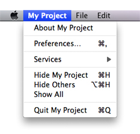
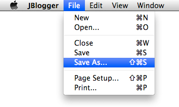
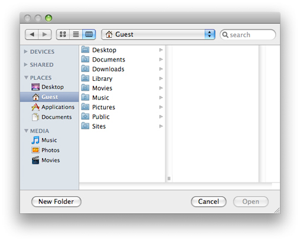
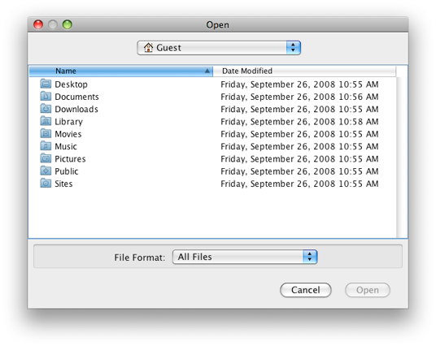

> 导航：[总目录](../../../README.md) · [documentation](../../../_indexes/documentation.md) · [Java Development Guide for Mac](Introduction.md)


[Next](User%20Interface%20Toolkits%20for%20Java.md)[Previous](Java%20Deployment%20Options%20for%20OS%20X.md)

# OS X Integration for Java

The more your application fits in with the native environment, the less users have to learn unique behaviors to use your application. A great application looks and feels like an extension of the platform it runs on. This article discusses a few details that can help you make your application look and feel like it is an integral part of OS X.

Java SE cross-platform design demands a lot of flexibility from the user interface to accommodate multiple operating systems. The Aqua user interface, on the other hand, imposes unique constraints to provide the absolute best user experience in OS X.

This section aims to help you make consistent user interface decisions, so that your Java application will look like an OS X native application, and will perform as well as one, too. The topics covered here represent just a small subset of design decision topics, but they are high-visibility issues that are often encountered by Java developers. The complete guidelines for the Aqua user interface can be found in _OS X Human Interface Guidelines_. For information on customization options for Swing components in the Aqua Look and Feel, see “_[New Control Styles available within J2SE 5.0 on Mac OS X 10.5](https://developer.apple.com/library/archive/technotes/tn2007/tn2196.html#//apple_ref/doc/uid/DTS10004439)_”.

The appearance and behavior of menu items varies across platforms. This section offers some techniques for improving how your Java menus are presented, and how they perform, specifically in OS X.

Removing menus from your windows and putting them in the menu bar is highly encouraged, but that approach does not perfectly emulate the native experience of OS X menus. In OS X, a native application’s menu bar is always visible when an application is the active application, whether or not any windows are currently open. In Java for OS X, the menus in the menu bar are associated with a top-level frame, and the menus will disappear if the frame closes.

Any Java application that uses AWT/Swing or is packaged in a double-clickable application bundle is automatically launched with an application menu similar to native applications in OS X. This application menu, by default, contains the full name of the main class as the title. This name can be changed using the `-Xdock:name` command-line property, or it can be set in the information property list file for your application as the `CFBundleName` value. For more on `Info.plist` files, see [A Java Application’s Information Property List File](Java%20Deployment%20Options%20for%20OS%20X.md#apple-f4xwc4dqnrsv64tfmyxwi33df52wszbpkridimbqgaytqobvfuzdaobwg43q). According to the Aqua guidelines, the name you specify for the application menu should be the simplest name of the application (generally no more than 16 characters) and should not include extraneous information like a company name. Figure 1 shows an application menu.

__Figure 1__  Application menu for a Java application in OS X



The next step to customizing your application menu is to have your own handling code called when certain items in the application menu are chosen. Apple provides functionality for this in the `com.apple.eawt.*` Java classes. The Application and ApplicationAdaptor classes provide a way to handle the Preferences, About, and Quit items.

For more information see [J2SE 5.0 Apple Extensions Reference](https://developer.apple.com/documentation/Java/Reference/1.5.0/appledoc/api/index.html). Examples of how to use these can also be found in a default Java application project in Xcode. Just open a new project in Xcode by selecting Java Application from the Organizer window. The resulting project uses all of these handlers. For more on the Xcode Organizer, see [The Xcode Organizer](Apple%20Developer%20Tools%20for%20Java.md#apple-f4xwc4dqnrsv64tfmyxwi33df52wszbpkridimbqgaytqobufvjvomy).

If your application is to be deployed on other platforms, where Preferences, Quit, and About are elsewhere on the menu bar (in a File or Edit menu, for example), you should make this placement conditional based on the host platform’s operating system. Conditional placement is preferable to just adding a second instance of each of these menu items for OS X. This minor modification can go a long way to making your Java application feel more like a native application in OS X. An in-depth example of conditional menu and UI handling is provided in the Xcode JNI Library project template.

_OS X Human Interface Guidelines_ suggests that all Mac apps should provide a Window menu to keep track of all currently open windows. A Window menu should contain a list of windows, with a checkmark next to the active window. Selection of a given Window menu item should result in the corresponding window being brought to the front. New windows should be added to the menu, and closed windows should be removed. The ordering of the menu items is typically the order in which the windows are opened. _OS X Human Interface Guidelines_ has more specific guidance on the Window menu.

Do not set menu item accelerators with an explicit `javax.swing.KeyStroke` specification. Modifier keys vary from platform to platform. Instead, use the `java.awt.Tookit.getMenuShortcutKeyMask()` method to ask the system for the appropriate key rather than defining it manually.

When calling this method, the current platform’s Toolkit implementation returns the proper mask. For example, in the case of adding a Copy item to a menu, using `getMenuShortcutKeyMask` means that you can replace the complexity of Listing 1 with the simplicity of Listing 2.

__Listing 1__  Explicitly setting accelerators based on the host platform

```
JMenuItem jmi = new JMenuItem("Copy");
    String vers = System.getProperty("os.name").toLowerCase();
    if (s.indexOf("windows") != -1) {
       jmi.setAccelerator(KeyStroke.getKeyStroke(KeyEvent.VK_C, Event.CTRL_MASK));
    } else if (s.indexOf("mac") != -1) {
       jmi.setAccelerator(KeyStroke.getKeyStroke(KeyEvent.VK_C, Event.META_MASK));
    }
```


__Listing 2__  Using `getMenuShortcutKeyMask()` to set modifier keys

```
JMenuItem jmi = new JMenuItem("Copy");
jmi.setAccelerator(KeyStroke.getKeyStroke(KeyEvent.VK_C,
    Toolkit.getDefaultToolkit().getMenuShortcutKeyMask()));
```

The default modifier key in OS X is the Command key. There may be additional modifier keys like Shift, Option, or Control, but the Command key is the primary key that alerts an application that a command, not regular input follows. When assigning keyboard shortcuts to items for menu items, make sure that you are not overriding any of the keyboard commands that Mac users are accustomed to. See _OS X Human Interface Guidelines_ for the definitive list of the most common and reserved keyboard shortcuts (keyboard equivalents).

You should make your keyboard shortcuts conditional based on the current platform, because standard shortcuts vary across platforms.

The `JMenuItem` class inherits the concept of mnemonics from the `JAbstractButton` class. In the context of menus, mnemonics are shortcuts to menus and their contents, which are executed by using a modifier key in conjunction with a single letter. When you set a mnemonic in a menu item, Java underscores the mnemonic letter in the title of the `JMenuItem` or `JMenu` component when the Option key is held down. Using mnemonics is discouraged in OS X, because mnemonics violate the principles of _OS X Human Interface Guidelines_. If you are developing a Java application for multiple platforms and some of those platforms recommend the use of mnemonics, just include a single `setMnemonics()` method that is conditionally called (based on the platform) when constructing your interface.

How then do you get the functionality of mnemonics without using Java’s mnemonics? If you have defined a keystroke sequence in the `setAccelerator()` method for a menu item, that key sequence is automatically entered into your menus. For example, Listing 3 sets an accelerator of Command-Shift-S for a Save As menu.

__Listing 3__  Setting an accelerator

```
JMenuItem saveAsItem = new JMenuItem("Save As...");
    saveAsItem.setAccelerator(
        KeyStroke.getKeyStroke(KeyEvent.VK_S, (java.awt.event.InputEvent.SHIFT_MASK | (Toolkit.getDefaultToolkit().getMenuShortcutKeyMask()))));
    saveAsItem.addActionListener(new ActionListener(  ) {
      public void actionPerformed(ActionEvent e) { System.out.println("Save As...") ; }
    });
    fileMenu.add(saveAsItem);
```

Figure 2 shows the result of this code, along with similar settings for the other items. Note that the symbols representing the Command and Shift keys are automatically included.

__Figure 2__  A File menu



In addition to accelerators, OS X provides keyboard and assistive-device navigation to the menus. Preferences for these features are set in the Keyboard and Universal Access panes of System Preferences.

Menu item icons are available and functional in OS X, via Swing. They are not a standard part of the Aqua interface, although some applications do display them—most notably the Finder in the Go menu. You may want to consider applying these icons conditionally based on platform.

Aqua specifies a specific set of special characters to be used in menus. See the information on using special characters in menus in _OS X Human Interface Guidelines_.

Contextual menus, which are called pop-up menus in Java, are fully supported. In OS X, they are triggered by a Control-click or a right-click on mouse down. Even though both clicks trigger a contextual menu, they are not the same mouse event. In Windows, the right mouse button-up is the standard trigger for contextual menus.

The different triggers present in OS X could result in fragmented and conditional code. One important aspect of both triggers is shared—the mouse click. To ensure that your program is interpreting the proper contextual–menu trigger, it is again a good idea to ask the AWT to do the interpreting for you, with `java.awt.event.MouseEvent.isPopupTrigger()`.

The method is defined in `java.awt.event.MouseEvent` because you need to activate the contextual menu through a `java.awt.event.MouseListener` on a given component when a mouse event on that component is detected. The important thing to determine is how and when to detect the proper event. In OS X, the pop-up trigger is set on `MOUSE_PRESSED`. In Windows it is set on `MOUSE_RELEASED`. For portability, both cases should be considered.

__Listing 4__  Detecting contextual-menu activation

```
JLabel label = new JLabel("I have a pop-up menu!");

label.addMouseListener(new MouseAdapter(){
    public void mousePressed(MouseEvent e) {
       evaluatePopup(e);
    }

    public void mouseReleased(MouseEvent e) {
       evaluatePopup(e);
    }

    private void evaluatePopup(MouseEvent e) {
       if (e.isPopupTrigger()) {
          // show the pop-up menu...
       }
    }
});
```

Like the application menu, contextual menus can differ between platforms. You should make the layout of your contextual menus conditional based on the platform.

When designing contextual menus, keep in mind that a contextual menu should never be the only way a user can access something. Contextual menus provide convenient access to often-used commands associated with an item, not the primary or sole access.

The `com.apple.eawt.Application` class includes the following methods for managing your Java application’s Dock icon:

- `public java.awt.Image getDockIconImage()`
- `public void setDockIconImage(java.awt.Image)`
- `public java.awt.PopupMenu getDockMenu()`
- `public void setDockMenu(java.awt.PopupMenu)`
- `public void setDockIconBadge(String)`

There are several key concepts to keep mind when designing the components in your user interface.

Do not explicitly set the x and y coordinates of components when placing them; instead make use of layout managers. The layout managers use abstracted location constants and determine the exact placement of these controls for a specific environment. Layout managers take into account the preferred sizes of each individual component while maintaining their placement relative to one another within the container.

In general, do not set component sizes explicitly. Each look and feel has its own font styles and sizes. These font sizes affect the required size of components containing text. Moving explicitly sized components to a different look and feel with a larger font size can cause problems. The safest way to make your components a proper size in a portable manner is to change to or add another layout manager, or to set the component’s minimum and maximum size to its preferred size. The `setSize()` and `getPreferredSize()` methods are useful when following the latter approach.

Nesting many JPanels with BorderLayouts is often the most successful approach to creating a portable layout that is both understandable and efficient. Opaque JPanels can be heavily nested with negligible performance implications, because component repaints usually only request the immediate parent to repaint the bounds of a child.

You can create both small and miniature versions of Swing controls in OS X by setting the `sizeVariant` client property. See _[New Control Styles available within J2SE 5.0 on Mac OS X 10.5](https://developer.apple.com/library/archive/technotes/tn2007/tn2196.html#//apple_ref/doc/uid/DTS10004439)_ for more information.

Because a given look and feel tends to have universal coloring and styling for most, if not all of its controls, you may be tempted to create custom components that match the look and feel of standard user interface classes. This approach adds maintenance and portability costs that may not be apparent until Apple or the Java platform changes the default appearance. It is easy to set an explicit color that you think works well with the current look and feel. Changing to a different look and feel, though, may surprise you with an occasional nonstandard component. To ensure that your custom control matches standard components, query the `UIManager` class for the desired colors. One example is a custom window object that contains some standard lightweight components but wants to paint its uncovered background to match that of the rest of the application’s containers and windows. To do this, you can call

```
myPanel.setBackground(UIManager.getColor("window"))
```

This call returns the color appropriate for the current look and feel. There are also a number of OS X-specific colors installed in the UIManager that are used in different contexts. The following colors stay in sync with the user's color selections in the Appearance system preference pane:

- `UIManager.getColor("Focus.color")`
- `UIManager.getColor("List.selectionBackground")`
- `UIManager.getColor("TextField.selectionBackground")`

There are also a number of borders installed in the UIManager that can be used to draw alternative backgrounds for certain kinds of lists. The following borders dynamically adjust to the active state of the parent window of the component they are painting:

- `UIManager.getBorder("List.sourceListBackgroundPainter")`
- `UIManager.getBorder("List.sourceListSelectionBackgroundPainter")`
- `UIManager.getBorder("List.sourceListFocusedSelectionBackgroundPainter")`
- `UIManager.getBorder("List.evenRowBackgroundPainter")`
- `UIManager.getBorder("List.oddRowBackgroundPainter")`

OS X window coordinates and insets are compatible with the JDK. Window bounds refer to the outside of the window’s frame. The coordinates of the window put (0,0) at the top left of the title bar. The `getInsets` method returns the amount by which content needs to be inset in the window to avoid the window border. This should affect only applications that are performing precision positioning of windows, especially full-screen windows.

Windows behave differently in OS X than they do on other platforms. For example, an application can be open without having any windows. Windows minimize to the Dock, and windows with variable content always have scroll bars. This section highlights the windows details you should be aware of and discusses how to deal with window behavior in OS X.

The multiple document interface (MDI) model of the `javax.swing.JDesktopPane` object can provide a confusing user experience in OS X. Therefore when building applications for OS X, try to avoid using internal frames. Windows minimized in a `JDesktopPane` object move around as the pane changes size. In `JDesktopPane`, windows minimize to the bottom of the pane while independent windows minimize to the Dock. Furthermore, the pane restricts users from moving windows where they want. They are forced to deal with two different scopes of windows, those within the pane and the pane itself. Normally, OS X users interact with applications through numerous free-floating, independent windows and a single menu bar at the top of the screen. Users can intersperse these windows with other application windows (from the same application or other applications) anywhere they want in their view, which includes the entire desktop. Users should not be constrained to one area of the screen when using a Java application.

In OS X, scrollable document windows display a scrollbar whether or not there is enough content in the window to require scrolling (the scroller itself appears only when the content exceeds a window’s viewable area). To mimic this behavior in Java applications, place your content inside a scroll pane (`JScrollPane`). You do this because a Swing `JFrame` object by default has no scroll bars, no matter how it is resized. When you use `JScrollPane`, make sure you set the scrollbar policy to always display scrollbars (to mimic OS X), as shown in Listing 5.

__Listing 5__  Setting `JScrollBar` policies to be more like those of Aqua

```
JScrollPane jsp = new JScrollPane();
jsp.setVerticalScrollBarPolicy(JScrollPane.VERTICAL_SCROLLBAR_ALWAYS);
jsp.setHorizontalScrollBarPolicy(JScrollPane.HORIZONTAL_SCROLLBAR_ALWAYS);
```

When you are using a host platform other than OS X, you may find that the `JScrollBar` default policy, `AS_NEEDED`, more closely resembles its native behavior.

File-choosing dialogs in Java applications are of two main types: dialogs created with `java.awt.FileDialog` and those created with `javax.swing.JFileChooser`. Although each has its advantages, `java.awt.FileDialog` makes your applications behave more like a native Mac app. This dialog, shown in Figure 3, looks much like a Finder window in OS X.

__Figure 3__  Dialog created with `java.awt.FileDialog`



The Swing dialog, shown in Figure 4, looks much less like an OS X dialog.

__Figure 4__  Dialog created with `javax.swing.JFileChooser`



Unless you need a functional advantage of `JFileChooser`, use `FileDialog` instead.

When using `FileDialog`, you may want a user to select a directory instead of a file. In this case, use the `apple.awt.fileDialogForDirectories` property with the `setProperty.invoke()` method on your `FileDialog` instance.

In OS X, when a document has unsaved changes, the window’s close button displays a dot. Adopting this same approach, that is, using a window-modified indicator, in your application makes it look more like an OS X native application and so conform to user expectations.

To display an indicator that a window was modified, you need to use the Swing property `Window.documentModified`. It can be set on any subclass of `JComponent` that implements a top-level window using the `putClientProperty()` method. The value of the property is either `Boolean.TRUE` or `Boolean.FALSE`.

For more on using the window-modified indicator in your application, review _[New Control Styles available within J2SE 5.0 on Mac OS X 10.5](https://developer.apple.com/library/archive/technotes/tn2007/tn2196.html#//apple_ref/doc/uid/DTS10004439)_.

OS X uses Apple events for interprocess communication. Apple events are high-level semantic events that an application can send to itself or other applications. AppleScript allows you to script actions based on these events. Without including native code in your Java application you can nevertheless let users take some level of control of your application through AppleScript. To do so, implement the `Application` and `ApplicationAdaptor` classes available in the `com.apple.eawt` package. By implementing the event handlers in the ApplicationAdaptor class, your application can generate and handle basic events such as Print and Open. Information on these two classes is available in [J2SE 5.0 Apple Extensions Reference](https://developer.apple.com/documentation/Java/Reference/1.5.0/appledoc/api/index.html).

Java SE 6 also enables you to invoke AppleScript with the `javax.script` API. [Listing 6](#apple-f4xwc4dqnrsv64tfmyxwi33df52wszbpkridimbqgaytsmbzfvjvomq) provides a sample implementation of this functionality. Full documentation for the API can be found at [http://java.sun.com/javase/6/docs/api/javax/script/package-summary.html](http://java.sun.com/javase/6/docs/api/javax/script/package-summary.html).

__Listing 6__  Invoking AppleScript with the `javax.script` API

```
public static void main(String[] args) throws Throwable {     String script = "say \"Hello from Java\"";          ScriptEngineManager mgr = new ScriptEngineManager();     ScriptEngine engine = mgr.getEngineByName("AppleScript");     engine.eval(script); }
```

For more on AppleScript, see _Getting Started with AppleScript_.

There are many OS X–specific system properties you can set to modify the behavior of your Java application. A complete list of supported OS X system properties, including how to use them, is available in _Java System Property Reference for Mac_.

[Next](User%20Interface%20Toolkits%20for%20Java.md)[Previous](Java%20Deployment%20Options%20for%20OS%20X.md)

