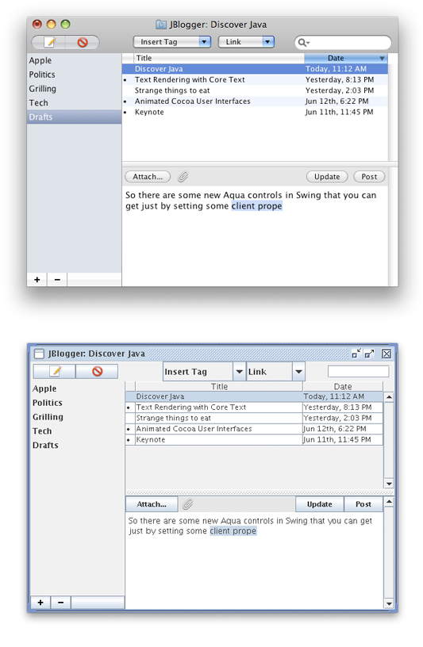

> 导航：[总目录](../../../README.md) · [documentation](../../../_indexes/documentation.md) · [Java Development Guide for Mac](Introduction.md)

[Next](Apple%20Developer%20Tools%20for%20Java.md)[Previous](Introduction.md)

# Overview of Java for OS X

This article provides a broad overview of how Java fits into OS X. It is suggested background information for anyone new to Java development for OS X.

The complete Java implementation in OS X includes the components you would normally associate with the Java SE Runtime Environment (JRE) as well as the Java SE Development Kit (JDK). More details about JDK in OS X are provided in [Java Deployment Options for OS X](Java%20Deployment%20Options%20for%20OS%20X.md#apple-f4xwc4dqnrsv64tfmyxwi33df52wszbpkridimbqgaytqobvfvjvomi).

The following sections give a high-level overview of how Java for OS X is different from Java for other platforms.

“Write once, run anywhere” is true only if Java is everywhere. With OS X, you know the Java Runtime is there for your applications, because it is built into the operating system. This means that when developing Java applications for deployment on OS X, you know that Java is already installed and configured to work with your customer’s Mac.

Java is the only high-level framework on OS X besides Cocoa that provides a graphical toolkit for building applications. With just a little work on your part, Java applications can be nearly indistinguishable from native applications. Information on how to achieve this is provided in [OS X Integration for Java](OS%20X%20Integration%20for%20Java.md#apple-f4xwc4dqnrsv64tfmyxwi33df52wszbpkridimbqgaytsmbzfvjvomi). Users don’t need to learn different behaviors for Java applications—in fact, they shouldn’t even know that applications are Java applications.

When developing with Java in OS X, you are encouraged to create applications that target the oldest possible Java version but launch with the newest available version. In this way, you accommodate the largest possible audience, and at the same time take advantage of the speedups and operating system integration that later versions afford.

OS X v10.6 includes both a 32-bit and a 64-bit version of Java SE 6. It is important to note that certain Apple APIs, such as QuickTime for Java (QTJ), are compatible only with 32-bit versions of Java. Similarly, considerations should be made when writing Java Native Interface (JNI) libraries, because the architecture of the library must correspond to the version of the code you are interfacing with.

Anyone who has run a GUI-based Java application in OS X is bound to notice one of the most striking differences between Java on OS X and Java elsewhere. Figure 1 shows this distinction by showing the cross-platform look and feel in OS X, which is essentially the way the user interface looks on other platforms, and the Aqua look and feel.

__Figure 1__  Apple’s Aqua look and feel and the standard Java cross-platform look and feel in OS X

By default, Swing applications in OS X use the Aqua look and feel (LAF). Although this is the default LAF, it is not required; the standard Java cross-platform LAF is also available. While the use of the Aqua LAF is encouraged for Swing applications, different design philosophies inherent in an application might make the Aqua LAF inappropriate. To use the cross-platform LAF, modify your code to include `UIManager.setLookAndFeel(UIManager.getCrossPlatformLookAndFeelClassname())`. Further details on the Aqua LAF are provided in [User Interface Toolkits for Java](User%20Interface%20Toolkits%20for%20Java.md#apple-f4xwc4dqnrsv64tfmyxwi33df52wszbpkridimbqgaytsmbrfvjvomi).

One of the first hurdles newcomers to Java development on OS X face is figuring out where everything is on the platform. This section outlines some basic things to remember and offers some guidelines to follow when navigating the OS X filesystem.

Since the Java implementation provided by Apple resides with the rest of the system components in `/System`, it is not user modifiable. The OS X command line provides several tools that make it easy to use multiple versions of Java with multiple supported architectures.

The Java command line tools in `/usr/bin` run in the version of Java at the top of the Java Applications list in `/Applications/Utilities/Java Preferences.app`. The currently selected version can be determined with the `/usr/libexec/java_home` tool, which prints out the full path currently assigned to the `$JAVA_HOME` environment variable.

Since Java is built into the operating system, it is implemented as an OS X framework. For more information on frameworks, see _[Framework Programming Guide](../../Mac%20OSX/Framework%20Programming%20Guide/Introduction%20to%20Framework%20Programming%20Guide.md#apple-f4xwc4dqnrsv64tfmyxwi33df52wszbpgeydambqge4dg2i)_. The code that makes the Java implementations in OS X work can be found in `/System/Library/Frameworks/JavaVM.framework/`. That directory contains a `Versions/` directory and some symbolic links to directories inside it. The layout of the `JavaVM.framework` directory is designed to accommodate design decisions from previous versions of Java and should not be used directly.

Do not rely on a particular path within the `JavaVM.framework` directory in any code that you ship to customers, because the directory’s contents will change with updates to Java and the operating system. Only native applications that instantiate a Java VM with JNI should link against the JavaVM framework.

Some applications look for a Java home directory (`$JAVA_HOME`) on the user’s system, especially during installation. If you need to set this explicitly in a shell script or an installer, use `/usr/libexec/java_home` or call `System.getProperty("java.home")` if you already have an active JVM. Using a hardcoded path can result in a broken application for your customers down the road, when Apple ships a software update that changes the default version of Java, or when the user moves the application to another version of OS X which has a different default version of Java.

Java can be extended by adding custom`.jar`, `.zip`, and `.class` files, as well as native JNI libraries, into an extensions directory. On some platforms this is designated by the `java.ext.dir` system property. In OS X, put your extensions in `/Library/Java/Extensions/`. Java automatically looks in this directory as it is starting up the Java Virtual Machine.

Putting extensions in `/Library/Java/Extensions/` loads those extensions for every user on that particular computer. It is preferable to limit which users can use certain extensions by putting them in the `~/Library/Java/Extensions/` directory inside the appropriate users’ home directories. By default, that folder does not exist, so you may need to make it. Try to include all of your dependent libraries in your application rather than relying on the Java Extensions directory, because its contents are unversioned and cannot accommodate for multiple versions of the same library.

When you launch a Java application from the command line, standard output goes to the Terminal window. When you launch a Java application by double-clicking it, your Java output is displayed in the Console application in `/Applications/Utilities/`. Applets that use the Java Plug-in display output in the Java Console if the console has been turned on in the Java Preferences application (see [Other Tools](Apple%20Developer%20Tools%20for%20Java.md#apple-f4xwc4dqnrsv64tfmyxwi33df52wszbpkridimbqgaytqobufuzdaobqgmyq) for information on Java Preferences.).

The default file system of OS X, HFS+ (Mac OS Extended format), is case-insensitive but case preserving. Although it preserves the case of files written to it, it does not recognize the difference between uppercase and lowercase. You should make sure that no files in the same directory have names that differ only by case. For example, having a file named `mybigimage.png` and `MyBigImage.png` in the same directory can create unpredictable results. Note that while most UNIX-based operating systems are case-sensitive, Windows is case-insensitive so this is a general guideline for any cross-platform Java development.

Details about how HFS+ relates to character encoding can be found in [Character Encoding](User%20Interface%20Toolkits%20for%20Java.md#apple-f4xwc4dqnrsv64tfmyxwi33df52wszbpkridimbqgaytsmbrfvjvomq).

[Next](Apple%20Developer%20Tools%20for%20Java.md)[Previous](Introduction.md)

