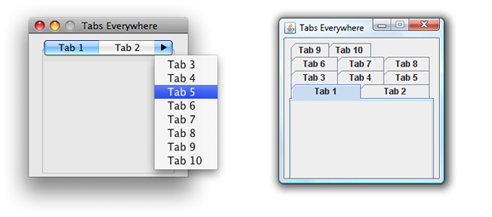
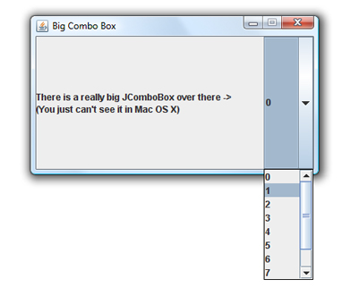
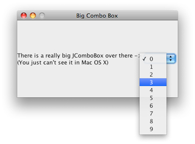

> 导航：[总目录](../../../README.md) · [documentation](../../../_indexes/documentation.md) · [Java Development Guide for Mac](Introduction.md)


[Next](Core%20Java%20APIs%20and%20the%20Java%20Runtime%20on%20OS%20X.md)[Previous](OS%20X%20Integration%20for%20Java.md)

# User Interface Toolkits for Java

This article discusses how the OS X implementation of the user interface toolkits Swing, AWT, accessibility, and sound differ from the toolkits on other platforms. Although there is some additional functionality in OS X, for the most part these toolkits work as you would expect them to on other platforms. This article does not discuss user interface design issues that you should consider in OS X. For that information, see [Making User Interface Decisions](OS%20X%20Integration%20for%20Java.md#apple-f4xwc4dqnrsv64tfmyxwi33df52wszbpkridimbqgaytsmbzfuzdcmjygy3q).

In OS X, Swing uses the Aqua Look and Feel as the default look and feel (LAF). Swing attempts to be platform neutral, but some aspects of it are an impedance mismatch with the Aqua user interface. Apple attempts to bridge the gap with a common ground that provides both developers and users an experience that is not foreign. This section discusses where the Aqua LAF differs from the default implementation on other platforms.

In Java’s default cross-platform LAF, as well as the Windows LAF, menus are applied on a per-frame basis inside the window under the title bar. On a Mac, in contrast, menus appear in one spot no matter what windows users have open—at the top of the screen, in the menu bar.

To get menus out of the window and into the menu bar, you need only to set a single system property:

```
apple.laf.useScreenMenuBar
```

This property can have a value of `true` or `false`. By default, it is `false`, which means menus are in the window instead of the menu bar. When this property is set to `true`, the Java runtime moves the menu bar of any Java frame to the top of the screen, where Macintosh users expect it. Since this is just a simple runtime property that only the OS X Java VM looks for, there is no harm in putting it into your cross-platform code base.

Note that this setting does not work for Java dialogs having menus. A dialog should be informational or present the user with a simple decision, not provide complex choices. If users are performing actions in a dialog, it is not really a dialog and you should consider using a `JFrame` object instead of a `JDialog` object.

On other platforms, if you have a tabbed pane (`JTabbedPane`) with too many tabs to fit in the parent window, the tabs are simply stacked on top of each other. In the Aqua user interface of OS X, tab controls are never stacked. The Aqua LAF implementation of multiple tabs includes a special tab on the right that exposes a pull-down menu to navigate to the tabbed panes not visible. This behavior, allows you to program your application just as you would on any other platform while providing users an experience that is more consistent with OS X guidelines. The difference between a tabbed pane in OS X and a tabbed pane in Windows is shown in Figure 1.

__Figure 1__  Tabbed panes with multiple tabs in OS X and Windows



One other thing to keep in mind about `JTabbedPane` objects in OS X is that they have a standard size. If you put an image in a tab, the image is scaled to fit the tab instead of the tab to the image. This standard size applies to several other Swing components as well.

Aqua has very well-defined guidelines for the size of its controls. Swing, on the other hand, does not. The Aqua LAF tries to find a common ground. For example, since any combo box larger than twenty pixels would look out of place in OS X, that is all that is displayed, even if the actual size of the combo box is bigger. Figure 2 shows a very large `JComboBox` component in Windows XP. Note that the drop-down scrolling list appears at the bottom of the button.

__Figure 2__  An oversize `JComboBox` component in Windows



The same code yields quite a different look in OS X, as can be seen in Figure 3. The visible button is sized to that of a standard Aqua combo box. The drop-down list appears at the bottom of the visible button. The entire area that is active on other platforms is still active, but the button itself doesn’t appear as large.

__Figure 3__  An oversize `JComboBox` component in the Aqua LAF



Note that some other components have similar sizing adjustments to align with the standards set in _OS X Human Interface Guidelines_ for example, scroller and sliders. The JComboBox example is an extreme example. Most are not as large, but this gives you an idea of how the Aqua LAF handles this type of situation.

There are basically three button types in OS X:

- Push buttons, which are rounded rectangles with text labels on them.
- Radio buttons, which are in sets of two to seven circular buttons. They are for making mutually exclusive, but related choices.
- Bevel buttons, which can display text, an icon, or a picture that can be either a standard push button or have a menu attached.

  Bevel buttons normally have rounded corners. When displayed in a toolbar or when sizing constraints are tight, the corners are squared off.

To be consistent with these button types and their defined use in OS X, there are some nuances of Swing buttons that you should be aware of:

- `JButton` components with images in them are rendered as bevel buttons by default.
- A default `JButton` component that contains only text is usually rendered as a push button. (Over a certain height, it is rendered as a bevel button, since Aqua push buttons are limited in their height.)

In addition to these default characteristics which are dependent on height and the contents of the button, you can also explicitly set the type of button with `JButton.buttontype`, which accepts the following values:

- `square` gives you square bevel button.
- `bevel` gives you a rounded bevel button.
- `texturedRound` gives you a metal button.

Keep Apple’s human interface guidelines in mind if you explicitly set a button type.

For many more button styles available in the Aqua LAF in Swing, see _[New Control Styles available within J2SE 5.0 on Mac OS X 10.5](https://developer.apple.com/library/archive/technotes/tn2007/tn2196.html#//apple_ref/doc/uid/DTS10004439)_.

By its nature, AWT is very different on every platform. When developing Java applications in OS X, follow these tips for best results:

- The value of the accelerator key can be determined by calling `Toolkit.getDefaultToolkit().getMenuShortcutKeyMask()`. This is further discussed in [Accelerators (Keyboard Shortcuts)](OS%20X%20Integration%20for%20Java.md#apple-f4xwc4dqnrsv64tfmyxwi33df52wszbpkridimbqgaytsmbzfuzdcmrqgmza).
- OS X does not specify a default minimum size for windows. To avoid a 0 by 0 (0x0) pixel window being opened, top-level frames have a minimum size of 128 points wide by 37 points high.
- OS X does not allow visible windows to have a location that is completely off-screen. In order to set the location of a window to a value that is off-screen, make the window invisible with the `setVisible()` method and make it undecorated with the `setUndecorated()` method.
- Dragging the mouse following a control-click or a right click in a window produces a `MOUSE_MOVED` event instead of a `MOUSE_DRAGGED` event. This is because control-clicks and right clicks trigger a contextual menu on mouse down, which does not initiate a drag.
- `java.awt.GraphicsDevice` includes methods for controlling the full screen of a client computer through Java. In addition to these standard tools, OS X provides a few system properties that may be useful for development of full-screen Java applications. These are discussed in _Java System Property Reference for Mac_.

The default character encoding in Java for OS X is MacRoman. The default font encoding on some other platforms is ISO-Latin-1 or WinLatin-1; unlike MacRoman, these encodings are subsets of UTF-8. Programs that assume that filenames can be turned into UTF-8 by just turning a byte into a char will cause problems in OS X.

The simplest way to work around this problem is to specify a font encoding explicitly rather than assuming one. Specifying a font encoding besides UTF-8 and UTF-16 is not recommended.

If you do not specify a font encoding explicitly, recognize that:

- In the conversion from a Unicode subset to MacRoman you may lose information.
- Filenames are not stored on disk in the default font encoding, but in UTF-8. Usually this isn’t a problem, because most files are handled in Java as `java.io.File`s, though it is good to be aware of.
- Although filenames are stored on disk as UTF-8, they are stored decomposed. This means that certain characters—for example, e-acute (é)—are stored as two characters, “e”, followed by “´” (acute accent). The default HFS+ filesystem of OS X enforces this behavior. SMB enforces composed Unicode characters. UFS and NFS do not specify whether filenames are stored composed or decomposed, so they can do either.

With some platforms, to use the Java Accessibility API, you must use a native bridge. This is not necessary in OS X because the bridging code is built in. Users can configure the accessibility features of OS X through the Universal Access pane of System Preferences. As a result, if you are using the Accessibility API, your application can use devices that the user has configured there.

Beginning with OS X v10.4, a screen reader called VoiceOver is included with the operating system. Your Java application automatically uses this technology.

In OS X v10.5 and later, Java applications that use the Kerberos computer network authentication protocol automatically access the system credentials cache and tickets.

Apple also includes a cryptographic service provider based on the Java Cryptography Architecture. Currently, the following algorithms are supported:

- Mac: MD5, SHA1
- Message Digest: MD5, SHA1
- Secure Random: YarrowPRNG

Java on OS X v10.5 features an implementation of KeyStore that uses the OS X Keychain as its permanent store. You can get an instance of this implementation by using code like this:

```
keyStore = KeyStore.getInstance("KeychainStore", "Apple");
```

For more usage information, see the reference documentation on `java.security.KeyStore` at [http://java.sun.com/j2se/1.5.0/docs/api/java/security/KeyStore.html](http://java.sun.com/j2se/1.5.0/docs/api/java/security/KeyStore.html).

Java on OS X allows you to sample sound with Apple’s Core Audio framework at any frame rate supported by your input device. Input can be signed or unsigned PCM encoding, mono or stereo, 8 or 16 bits per sample.

By default, the Java Sound engine in OS X uses the `midsize` sound bank from [http://java.sun.com/products/java-media/sound/soundbanks.html](http://java.sun.com/products/java-media/sound/soundbanks.html).

OS X supports Java input methods. The utility application Java Preferences allows you to configure a trigger for input methods. You can download sample Java-specific input methods from [http://java.sun.com/products/jfc/tsc/articles/InputMethod/inputmethod.html](http://java.sun.com/products/jfc/tsc/articles/InputMethod/inputmethod.html).

In OS X, Java windows are double buffered. The Java implementation itself attempts to flush the buffer to the screen often enough to have good drawing behavior without compromising performance. If, for some reason, you need to force window buffers to be flushed immediately, use `Toolkit.sync()`.

By default, Java on OS X uses the Sun2D renderer, which exactly mimics the behavior of Java 2D on other platforms. If you are developing a graphically intensive application specifically for the Mac and the Sun2D renderer’s performance is inadequate, you may find better success using Apple’s Quartz graphics engine for your Java rendering instead (see _[Quartz 2D Programming Guide](../../Graphics%20Imaging/Quartz%202D%20Programming%20Guide/Introduction.md#apple-f4xwc4dqnrsv64tfmyxwi33df52wszbpkridgmbqgaytanrw)_ for more information). Quartz is optimized for a different set of operations from the Sun2D renderer, and its behavior is sometimes different from that of Java on other platforms.

By default, Quartz displays text anti-aliased. Therefore, if you use Quartz as your renderer, Java2D turns anti-aliasing on in order to render text in the Aqua look and feel for Swing (it does this by setting `KEY_ANTIALIASING` to `VALUE_ANTIALIAS_ON`). If you want the pixels of your images and text to more closely approximate that same content on other platforms, turn off anti-aliasing. You can do so by using the properties described in Java System Properties or by calling `java.awt.Graphics.setRenderingHint()` from within your Java application. In applets, anti-aliasing is turned off by default.

Java is not explicitly designed for resolution independence (also known as HiDPI); therefore, Java for OS X borrows some functionality from the Cocoa framework. To load a resolution-independent `tiff`, `icns`, or `pdf` file from the Resources folder of your application bundle into your Java application, use the `getImage()` method of `java.awt.Toolkit`. The string you pass into `getImage()` is of the form `"NSImage://MyImage"`. Do not include the file extension of the image. Also be aware that the Sun 2D renderer is disabled when the user interface scale factor does not have a value of `1.0`. Use the Quartz renderer so that your images scale smoothly.

You can test resolution independence in your application with the Quartz Debug tool, located in `/Developer/Applications/Performance Tools`. Quartz Debug allows you to launch your application at up to three times the default screen resolution. For a full list of features included in Quartz Debug, consult the Quartz Debug Help.

OS X includes resolution-independent standard images for user interfaces that you can also access with the `getImage` method of `java.awt.Toolkit`. For instance, `Toolkit.getDefaultToolkit().getImage("NSImage://NSColorPanel")` will return an Image reference representing the color wheel icon seen on the Colors button in applications such as Mail. For a comprehensive list of the standard images available, see Constants.

[Next](Core%20Java%20APIs%20and%20the%20Java%20Runtime%20on%20OS%20X.md)[Previous](OS%20X%20Integration%20for%20Java.md)

