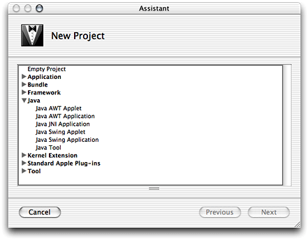
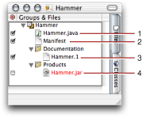
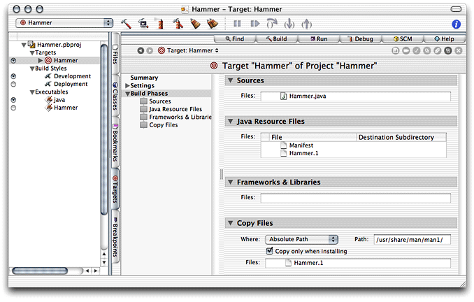
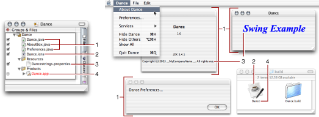
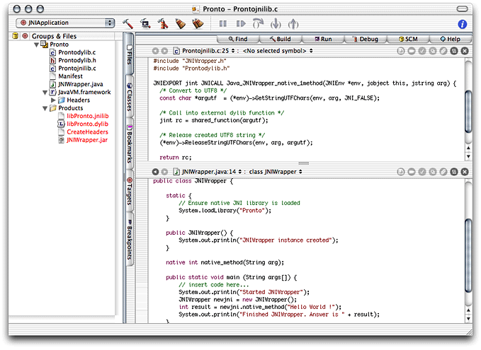
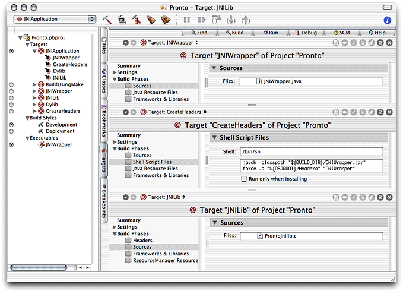

> 导航：[总目录](../../../README.md) · [documentation](../../../_indexes/documentation.md) · [Project Builder for Java](Introduction%20to%20Project%20Builder%20for%20Java.md)

[Next](Build%20System.md)[Previous](Introduction%20to%20Project%20Builder%20for%20Java.md)

# Application Development

This chapter introduces the development of Java applications using Project Builder. Project Builder provides a development environment in which you can develop, build, and deploy Java applications. In addition, Project Builder has a project template that facilitates the development of applications that use the native Mac OS X environment, that is, applications that have both Java code as well as C or Objective-C code.

Project Builder templates are prebuilt projects that give you a head start in the development of an application. Figure 1-1 shows the New Project pane of the Project Builder Assistant, listing the Java project templates you can use to develop applications. When you want to develop a Swing-based application, for example, you can start with the Swing application template, which provides a fully configured application that follows Apple’s guidelines for GUI (graphical user interface) applications. That template is also useful if you’re new to Java and Swing and want to see the inner workings of a working application.

__Figure 1-1__  Project Builder templates for Java development

Table 1-1 shows the type of Java applications you can develop with Project Builder and their corresponding project templates.

__Table 1-1__  Applications types and their corresponding project templates

| Application type | Template name |
| Text-based application | Java Tool |
| Swing applet | Java Swing Applet |
| Swing application | Java Swing Application |
| JNI (Java Native Interface) application | Java JNI Application |
| AWT (Abstract Window Toolkit) applet | Java AWT Applet |
| AWT application | Java AWT Application |

Project Builder has a powerful and flexible build system that facilitates the potentially complex tasks involved in building and deploying products, which include applications, libraries, frameworks, JAR files, and so on. The main elements involved in building products are targets. A project can contain more than one product, each produced by a target. In the case of text-based application projects, such as Java tool projects, the target is a JAR file created by the project’s only target.

In general, a target encompasses instructions on how to build a product, which can be an application or a component of one. Build settings are properties that tell Project Builder how to build a product. Build phases are concrete steps Project Builder takes to build a target; for example, compiling source files into object files and linking object files to create an executable file. For more information, see [Targets](Build%20System.md#apple-f4xwc4dqnrsv64tfmyxwi33df52wszbpkridimbqgaydsmztfvbuqmrqgywueqkkijbuiq2f), [Build Settings](Build%20System.md#apple-f4xwc4dqnrsv64tfmyxwi33df52wszbpkridimbqgaydsmztfvbuqmrqgywueqkkjjbuer2j), and [Build Phases](Build%20System.md#apple-f4xwc4dqnrsv64tfmyxwi33df52wszbpkridimbqgaydsmztfvbuqmrqgywueq2jjbeeer2i).

The Java Tool template provides the files needed to create a simple, text-based application. It includes source files for the class with the `main` method, the JAR manifest, and the man page. Figure 1-2 shows the files that make up a Java tool project.

__Figure 1-2__  The files of a Java tool project

The following list describes the files of a Java tool project named Hammer:

1. `Hammer.java`: Java source file that contains the `main` method. Project Builder names this file after the project.
2. `Manifest`: File that contains information that Project Builder adds to the `MANIFEST.MF` file of the generated JAR file.
3. `Hammer.1`: Source for the man page that documents the tool.
4. `Hammer.jar`: JAR file in which Java class files, the manifest file, and other resources are stored for distribution. This is the product of the project. It’s red because it hasn’t been produced yet, so the file doesn’t exist in the file system.

Figure 1-3 shows the target editor for the Hammer project.

__Figure 1-3__  Target editor for the Hammer project.

The items under Build Phases in the target editor list the build phases of the Hammer target. The phases are executed from top to bottom when the product is built. That is, the build phases are executed in the following order:

1. __Sources__ Determines which Java source files are to be compiled (run through the `javac` compiler).
2. __Java Resource Files__ Indicates which files to copy to the root level of the product (the top level of the JAR file).
3. __Frameworks & Libraries__ Lists frameworks or libraries to which the Java class files generated in step 1 must link against.
4. __Copy Files__ Copies files to specific parts of a product (for example, its resources directory or its plug-ins directory).

The Java Swing Application template provides the files needed to create a desktop application. It includes source files for a controller class (which includes the `main` method) and two JFrames that the user can make visible through menu commands, an icon file, and a properties file. Figure 1-4 shows the files that make up a Java Swing application project.

Figure 1-4 shows the project’s files in the Project Builder window, the contents of the project’s build folder, and the running application.

__Figure 1-4__  The files of a Java Swing application project

The following list describes the files in a Java Swing application project named Dance and their relationship to the actual application:

1. `Dance.java`, `AboutBox.java` and `Preferences.java`: Java source files that implement an About box and a preferences dialog.
2. `Dance.icns`: Icon file that contains the icon that the Finder displays for the application package.
3. `Dancestrings.properties`: File that contains the names and values of application properties accessible at runtime. Project Builder places this file inside the JAR file for the application.
4. `Dance.app`: Application package that contains Mac OS X–specific information for the application, as well as the application’s JAR file.

The Java Native Interface (JNI) provides a standard interface for communication with native libraries. You may want to use the JNI if you need to interface with native, legacy code from Java applications or when you want to improve the performance of an application by porting certain tasks to native code.

Project Builder provides a template with which you can develop projects that include both native code and Java code. Figure 1-5 shows a project called Pronto created with the JNI Application template.

__Figure 1-5__  A JNI-based application project

The most interesting part of the Pronto project are its targets. While the previous project types, tool and Swing application, required only one target, a JNI project requires several targets. This is because a JNI project contains three products, a JNI library (which contains the compiled C code), a header to the library, and a JAR file for the Java side of the application. See Figure 1-6.

__Figure 1-6__  Targets of JNI-based application project

The project has three main targets:

- __JNIWrapper__ Compiles the Java source files of the application and archives them in a JAR file. This is the Java application.
- __CreateHeaders__ Creates C function prototypes from Java class files in the JAR file generated by the JNIWrapper target.
- __JNILib__ Builds the native library by compiling `Prontojnilib.c` and linking it with the Java VM framework (`/System/Library/Frameworks/JavaVM.framework`).

The Native target is an aggregate target. Its purpose is to enclose the JNIWrapper, CreateHeaders, and JNILib targets into one build unit, so that any action performed on it is performed on all the targets it contains. The BuildUsingMake target bypasses the Project Builder build system. It uses `gnumake` (`/usr/bin/gnumake`) to build the application.

You can find detailed information on the JNI at [http://java.sun.com/j2se/1.4/docs/guide/jni/](http://java.sun.com/j2se/1.4/docs/guide/jni/).

[Next](Build%20System.md)[Previous](Introduction%20to%20Project%20Builder%20for%20Java.md)

