> 导航：[总目录](../../../README.md) · [documentation](../../../_indexes/documentation.md) · [Project Builder for Java](Introduction%20to%20Project%20Builder%20for%20Java.md)

[Next](Developing%20a%20Tool.md)[Previous](Application%20Development.md)

# Build System

This chapter discusses the Project Builder build system, which determines how applications are built. Project Builder uses the Jam software build tool as its build engine. Jam allows Project Builder to easily manage dependencies between a project’s elements. It can also take advantage of computers with two or more central processing units (CPUs).

Build settings are similar to Java properties: They store values that Project Builder uses to build products. Project Builder facilitates configuring some build settings through specialized panes (see [Target Information Panes](#apple-f4xwc4dqnrsv64tfmyxwi33df52wszbpkridimbqgaydsmztfvbuqmrqgywueq2jivdemssb)). However, you can set the value of any build setting directly through expert panes. Expert panes show the configuration build settings as a list of key-value pairs. Through these panes you can set the values of build settings for which the more user-friendly specialized panes do not provide a user interface.

The following tables list some of the build settings you may have to use in your projects. [Build Settings Reference](Build%20Settings%20Reference.md#apple-f4xwc4dqnrsv64tfmyxwi33df52wszbpkridimbqgaydsmztfvbuqmrrgewueqsdivdeuskf) has a complete list of Java-related settings. See the Project Builder release notes for a complete list of all settings.

Table 2-1 lists build settings that identify a project and tell Project Builder where to put temporary files generated during product building.

__Table 2-1__  Project build settings

| Build setting | Description |
| `PROJECT_NAME` | Name of the project. For example, `MyProject`. You should not modify this setting directly. |
| `SYMROOT` | Base location for built products. For example, `MyProject/build`. |
| `BUILD_DIR` | Base location for the temporary files generated by a project’s targets. For example, `MyProject/build`. You should not modify this setting directly. |
| `TARGET_BUILD_DIR` | Base location for built products. It’s set to `$BUILD_DIR` in development builds (for example, `MyProject/build`), `$INSTALL_DIR` (for example, `/tmp/MyProject.dst/usr/bin`) in deployment builds when the product is installed, and `$BUILD_DIR/UninstalledProducts` when the product is not installed. |

Table 2-2 lists build settings that determine where files are placed when you use `pbxbuild` to install a product.

__Table 2-2__  Deployment build settings

| Build setting | Description |
| `DSTROOT` | Base location for the installed product. For example, `/tmp/MyProject.dst/`. |
| `INSTALL_PATH` | Location of the installed product. For example `usr/bin`. |
| `INSTALL_DIR` | Fully qualified path for the installed product. By default, it concatenates `DSTROOT` and `INSTALL_PATH`. So, with the example values, it evaluates to `/tmp/MyProject.dst/usr/bin`. You should not modify this setting directly. |

Table 2-3 lists build settings that identify a target and tell Project Builder where to put the files it generates.

__Table 2-3__  Target build settings

| Build setting | Description |
| `TARGET_NAME` | Name of the target. For example, `MyProject`. You should not modify this setting directly. |
| `ACTION` | The action being performed on a target. Its possible values are `build`, `clean`, or `install` (through `pbxbuild`). You should not modify this setting directly. |
| `TEMP_DIR` | Location for a target’s temporary files. For example, `MyProject/build/MyProject.build/MyTarget.build`. |

Table 2-4 lists build settings used to call `javac` or `jikes` to compile Java source files.

__Table 2-4__  Java compiler build settings

| Build setting | Description |
| `CLASS_FILE_DIR` | Base location for Java class files. For example, `MyProject/build/MyProject.build/MyTarget.build/JavaClasses`. |
| `JAVA_COMPILER_TARGET_VM_VERSION` | Defines the Java virtual machine version that `javac` compiles Java source files to—for example, `1.4`. By default, this setting is undefined. |

Table 2-5 lists the build setting that defines the archive of Java class files and the creation of the application package.

__Table 2-5__  Java application build setting

| Build setting | Description |
| `JAVA_MANIFEST_FILE` | Path (relative to the project’s root directory) to a manifest file to use when archiving Java class files into a JAR file. For example, `Manifest`. |

Project Builder targets represent a product, such as an application or a framework. A project can produce more than one product. For example, a project can contain Java source files, which are compiled into Java class files by `javac`, and Objective-C source files, which are compiled into object files by `gcc`. Such a project must contain at least two targets, one that compiles the Java sources files and another that compiles the Objective-C source files. The build settings introduced in [Build Settings](#apple-f4xwc4dqnrsv64tfmyxwi33df52wszbpkridimbqgaydsmztfvbuqmrqgywueqkkjjbuer2j) are what Project Builder uses to determine how to build a product.

Each target has its own set of build setting values; they are autonomous entities within a project. However, you can tell Project Builder that a target depends on one or more additional targets. That way you can guarantee, for example, that when target A needs files produced by target B, target B is executed before target A. In addition, if there’s a problem with target B, target A doesn’t get executed.

In addition, Project Builder provides the ability to add _aggregate_ targets to a project. An aggregate target contains no product-building instructions; instead, it groups other targets. The operations you perform on aggregate targets are carried out on all the targets they enclose.

Each target can contain some or all of the following types of elements:

- __Build settings__ The group of build settings that control the build system.
- __Information property list entries__ Application package–specific information, such as type, version, icon, and so on.
- __Build phases__ Types of tasks to perform on a set of a project’s files, such as compile, link, archive, copy, and so on. See [Build Phases](#apple-f4xwc4dqnrsv64tfmyxwi33df52wszbpkridimbqgaydsmztfvbuqmrqgywueq2jjbeeer2i) for more information.

For more information on targets, see Project Builder Help.

Target information panes group information about how a product is built. They contain a user-friendly view of the values of certain build settings. These information panes are grouped in three major groups: Summary, Settings and Info.plist Entries.

The Summary pane shows summary information for a project, including its name, type, and developer comments; it’s shown in Figure 2-1.

__Figure 2-1__  Target Summary pane of the target editor in Project Builder

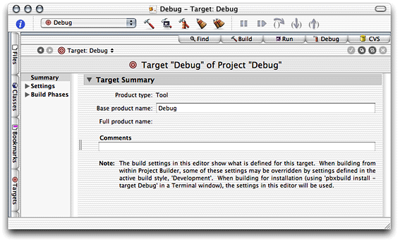

Table 2-6 describes the elements of the Target Summary pane.

__Table 2-6__  Elements of the Target Summary pane

| Element label | Description | Corresponding build setting |
| Product type | Indicates the type of project. Can be Application, Tool, Framework, and so on. | _None_. |
| Base product name | Name of the generated product file without an extension. | `PRODUCT_NAME` |
| Comments | Developer comments about the target. | _None_. |

The Build Settings pane groups views of the build settings of a project. It includes two views: Simple View and Expert View. The Simple View provides a easy-to-use user interface to various build settings. The Expert View lists all the build settings. You can use this view when the other views don’t provide a way of configuring a particular build setting.

The General Settings pane, depicted in Figure 2-2, shows information that pertains to the entire project. Table 2-7 describes its elements.

__Figure 2-2__  General Settings pane of the target editor in Project Builder

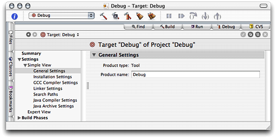

__Table 2-7__  Elements of the General Settings pane

| Element label | Description | Corresponding build setting |
| Product type | Indicates the type of project. Can be Application, Tool, Framework, and so on. | _None_. |
| Product name | Name of the generated product file without an extension. | `PRODUCT_NAME` |

The Installation Settings pane, depicted in Figure 2-3, shows installation information for the selected target. Table 2-8 describes its elements.

__Figure 2-3__  Installation Settings pane of the target editor in Project Builder

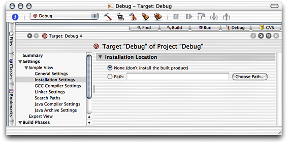

__Table 2-8__  Elements of the Installation Settings pane

| Element label | Description | Corresponding build setting |
| None | When selected, the product doesn’t get installed. | _None_. |
| Path | When selected, the product gets installed in the directory entered in the text input field. | `INSTALL_PATH` |

The Search Paths pane, depicted in Figure 2-4, determines the places Project Builder searches for frameworks, libraries, Java classes, and headers (in the case of a JNI application) to build the selected target. Table 2-9 describes its elements.

__Figure 2-4__  Search Paths pane of the target editor in Project Builder

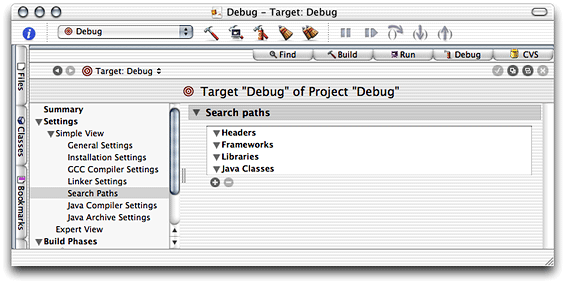

__Table 2-9__  Elements of the Search Paths pane

| Element label | Description | Corresponding build setting |
| Headers | Search paths for Objective-C header files. | `HEADER_SEARCH_PATHS` |
| Frameworks | Search paths for frameworks. | `FRAMEWORK_SEARCH_PATHS` |
| Libraries | Search paths for libraries. | `LIBRARY_SEARCH_PATH` |
| Java Classes | Search paths for Java class files or JAR files. | `JAVA_CLASS_SEARCH_PATHS` |

The Java Compiler Settings pane, depicted in Figure 2-5, determines some compiler settings for the selected target. Table 2-10 describes its elements.

__Figure 2-5__  Java Compiler Settings pane of the target editor in Project Builder

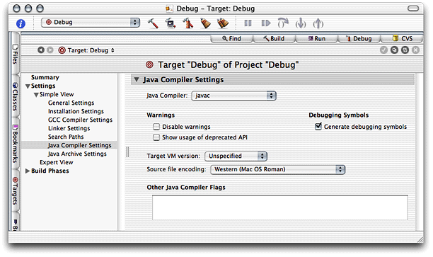

__Table 2-10__  Elements of the Java Compiler Settings pane

| Element label | Description | Corresponding build setting |
| Java Compiler | Determines the compiler to use to compile Java source files. The options are `javac` and `jikes`. | `JAVA_COMPILER` |
| Disable warnings | When selected, the compiler doesn’t produce warnings. | `JAVA_COMPILER_DISABLE_WARNINGS` |
| Show usage of deprecated API | When selected, the compiler warns about deprecated API use. | `JAVA_COMPILER_DEPRECATED_WARNINGS` |
| Generate debugging symbols | When selected, the compiler generates debugging symbols. | `JAVA_COMPILER_DEBUGGING_SYMBOLS` |
| Target VM version | The virtual machine version the compiler is to produce Java class files for. | `JAVA_COMPILER_TARGET_VM_VERSION` |
| Source file encoding | Specifies the character encoding used in all the Java source files that are to be compiled. | `JAVAC_SOURCE_FILE_ENCODING` |
| Other Java Compiler Flags | Additional compiler options. | `JAVA_COMPILER_FLAGS` |

The Java Archive Settings pane, depicted in Figure 2-6, determines how Java class files in the selected target are archived. Table 2-11 describes its elements.

__Figure 2-6__  Java Archive Settings pane of the target editor in Project Builder

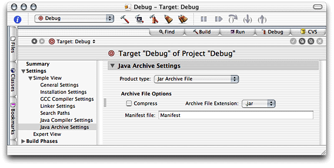

__Table 2-11__  Elements of the Java Archive Settings pane

| Element label | Description | Corresponding build setting |
| Product type | Determines whether Java class files are archived in a JAR file. | `JAVA_ARCHIVE_CLASSES` |
| Compress | When unselected, the Java class files are stored in the JAR file, but are not compressed. | `JAVA_ARCHIVE_COMPRESSION` |
| Archive file extension | The extension to use for the JAR file. The options are `.jar`, `.war`, and `.ear`. | `CLASS_ARCHIVE_SUFFIX` |
| Manifest file | Name of the supplemental manifest file. | `JAVA_MANIFEST_FILE` |

Information property lists (`Info.plist` files) contain information an application can access at runtime. This is similar to Java’s system properties. Information property lists, however, specify Mac OS X–specific application details, such as the application type and its icon. In addition, some Java-specific settings are also stored there; for example, the Java VM version that Mac OS X uses to run the application.

The following sections describe the simple views of information property list entries. See _Mac OS X Developer Release Notes: Information Property List_ at [http://developer.apple.com/releasenotes/index.html](https://developer.apple.com/releasenotes/index.html) for more information about information property lists.

The Basic Information pane, depicted in Figure 2-7, encapsulates identification information about the application package. Table 2-12 describes its elements.

__Figure 2-7__  Basic Information pane of the target editor in Project Builder

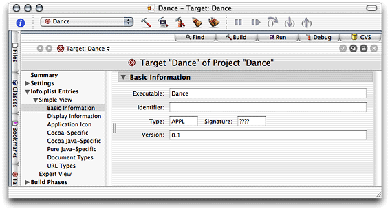

__Table 2-12__  Elements of the Basic Information pane

| Element label | Description | Corresponding Info.plist entry |
| Executable | Name of the file containing the application’s executable code. | `CFBundleExecutable` |
| Identifier | Package-style name (for example, `com.apple.ProjectBuilder`) used to uniquely identify the application or bundle. | `CFBundleIdentifier` |
| Type | Four-letter type indicator for the bundle. For example, `APPL` for applications, `FMWK` for frameworks, and so on. | `CFBundlePackageType` |
| Signature | Four-letter creator code for the bundle. | `CFBundleSignature` |
| Version | Version number for the bundle. For example, `10.2.3`. | `CFBundleVersion` |

The Display Information pane, depicted in Figure 2-8, encapsulates display information about the application package file. Table 2-13 describes its elements.

__Figure 2-8__  Display Information pane of the target editor in Project Builder

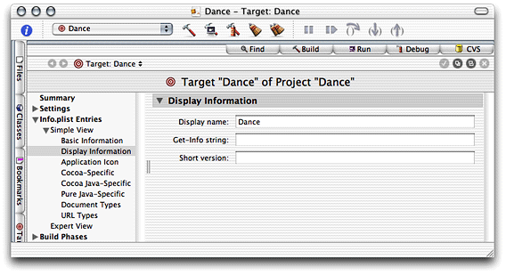

__Table 2-13__  Elements of the Display Information pane

| Element label | Description | Corresponding Info.plist entry |
| Display name | In application packages, localized name that is displayed in the menu bar. | `CFBundleName` |
| Get-Info string | Localized string that appears in Info windows or the Inspector in the Finder. | `CFBundleGetInfoString` |
| Short version | Localized string with bundle-version information. This is the string displayed in Info windows or the Inspector in the Finder when `CFBundleGetInfoString` is undefined. | `CFBundleShortVersionString` |

The Application Icon pane, depicted in Figure 2-9, identifies the icon file to be used for the application package’s icon, which is the icon the Finder displays to the user. Table 2-14 describes its elements.

__Figure 2-9__  Application Icon pane of the target editor in Project Builder

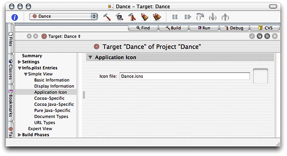

__Table 2-14__  Elements of the Application Icon pane

| Element label | Description | Corresponding Info.plist entry |
| Icon file | Name of the icon file for the bundle. | `CFBundleIconFile` |

The Cocoa Java–Specific pane, depicted in Figure 2-10, contains information specific for Cocoa applications written in Java. Table 2-15 describes its elements.

__Figure 2-10__  Cocoa Java–Specific pane of the target editor in Project Builder

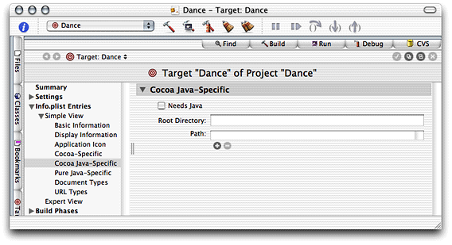

__Table 2-15__  Elements of the Cocoa Java–Specific pane

| Elements label | Description | Corresponding Info.plist entry |
| Needs Java | When selected, indicates that a Cocoa application needs to instantiate a Java virtual machine. | `NSJavaNeeded` |
| Root Directory | The directory where the application’s JAR files are stored in the application bundle. For example, `Contents/Resources/Java`. | `NSJavaRoot` |
| Path | List of JAR files contained in the root directory. | `NSJavaPath` |

The Pure Java Specific pane, depicted in Figure 2-11, contains settings that are specific to Pure Java. Table 2-16 describes its elements.

__Figure 2-11__  Pure Java–Specific pane of the target editor in Project Builder

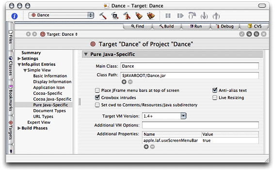

__Table 2-16__  Elements of the Pure Java–Specific pane

| Element label | Description | Corresponding Info.plist entry |
| Main Class | Fully qualified name of an application’s main class. | `Java/MainClass` |
| Class Path | List of paths to Java class files of JAR files the application uses. | `Java/ClassPath/` |
| Place JFrame menu bars at top of screen | When selected, the application’s menu bar follows Mac OS X style: It’s placed at the top of the screen instead of within each application window. | `Java/Properties/com.apple.macos.useScreenMenuBar` |
| Growbox intrudes | When selected, the resize control is part of the window pane. When unselected, a white band is added to the bottom of the window, so that the resize control doesn’t intrude in the windows’ content. | `Java/Properties/com.apple.mrj.application.growbox.intrudes` |
| Set cwd to Contents/Resources/Java subdirectory | When selected, the application’s working directory is set to the bundle’s `Contents/Resources/Java` directory. | `Java/WorkingDirectory` |
| Anti-alias text | Toggles text anti-aliasing. | `Java/Properties/com.apple.macosx.AntiAliasedTextOn` |
| Live resizing | Toggles live resizing of windows. | `Java/Properties/com.apple.mrj.application.live-resize` |
| Target VM Version | Version of the Java runtime the application requires. For example, `1.4+`. | `Java/JVMVersion` |
| Additional VM Options | Command-line options to add to the java invocation. For example, `-Xfuture -Xprof`. | `Java/VMOptions` |
| Additional Properties | Additional Java system properties, which you can access through `System.getProperty`. | `Java/Properties/` |

During development, you may want to include debugging information in Java class files, but would rather not include it in the final version of those files. For example, the `JAVA_COMPILER_DEBUGGING_SYMBOLS` build setting determines whether debugging symbols are added to class files. So, a project could have a target called `MyAppDebug` that sets that build setting to `YES` and a target called `MyApp` that sets it to `NO`. However, when you need to set another build setting that affects the building of the application, you would have to make the change in two targets instead of one. To solve this situation, Project Builder includes _build styles_.

Build styles contain build setting configurations that override target build settings. So, instead of having two targets to produce an application, one for debugging and another for your customers, a project would contain one target that builds both types of products and a couple of build styles, one called Development and another named Deployment. The Development build style would contain the `JAVA_COMPILER_DEBUGGING_SYMBOLS = YES` build configuration, while the Deployment build style would have `JAVA_COMPILER_DEBUGGING_SYMBOLS = NO`.

To add a build style to a project, choose Project > New Build Style and name it. Then add the build settings that the build style is to override. For example, the build style shown in Figure 2-12 tells `javac` to optimize code for execution time.

__Figure 2-12__  Build style definition

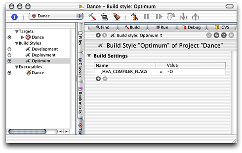

Build phases define concrete tasks that Project Builder performs to build a product. These are the build phases you use in Java application projects:

- __Sources__ Compiles the selected Java source files using `javac` and puts the generated class files in `$TEMP_DIR/JavaClasses`. It uses the `JavaFileList` file in the target’s build directory (the `TEMP_DIR` build setting).
- __Java Resource Files__ Copies the selected Java resource files, the `Dancestrings.string` file for example, to `$TEMP_DIR/JavaClasses`.
- __Bundle Resources__ Copies the selected bundle resource files, such as the icon file, to the resulting bundle’s `Resources` directory.
- __Frameworks & Libraries__ Links the class files generated in the Sources build phase with the selected frameworks and libraries, and archives the result in a JAR file (when the `JAVA_ARCHIVE_CLASSES` build setting is set to `YES`).
- __Shell Script Files__ Executes a custom shell script. The value of every build setting is accessible in the script using the format `$BUILD_SETTING`, `$(BUILD_SETTING)`, or `${BUILD_SETTING}`. Therefore, you can use shell script phases to perform tasks that the other type of build phases do not support. Further, you can insert shell script phases between other build phases to confirm the value of a build setting.
- __Copy Files__ Copies the files indicated in the build phase to a specified location. To select the files to copy, drag them from the Files list into the Files list.

Figure 2-13 is an example of inserting a shell script phase to confirm the value of a build setting. It shows a script that displays the value of the `JAVA_COMPILER_FLAGS` build setting. Figure 2-14 shows the script’s output.

__Figure 2-13__  Build-setting display script

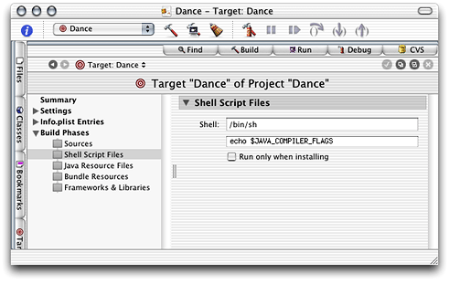

__Figure 2-14__  Output of a build-setting display script

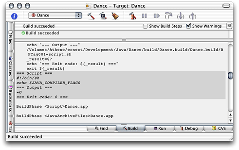

[Next](Developing%20a%20Tool.md)[Previous](Application%20Development.md)

