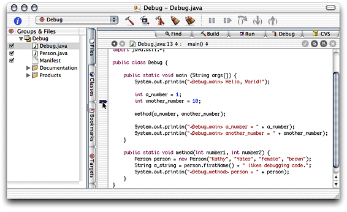
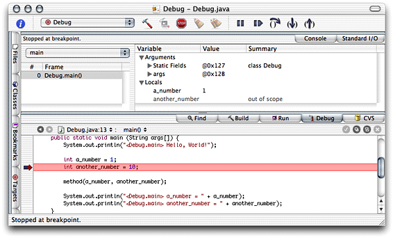
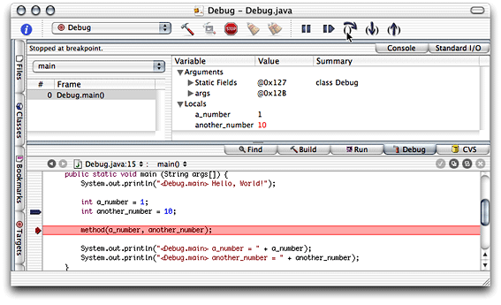
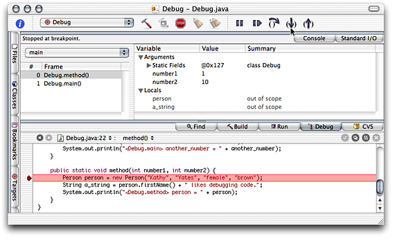
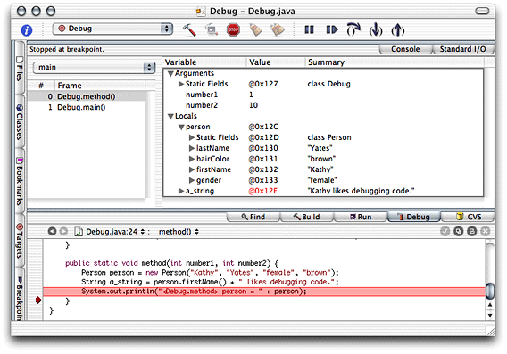
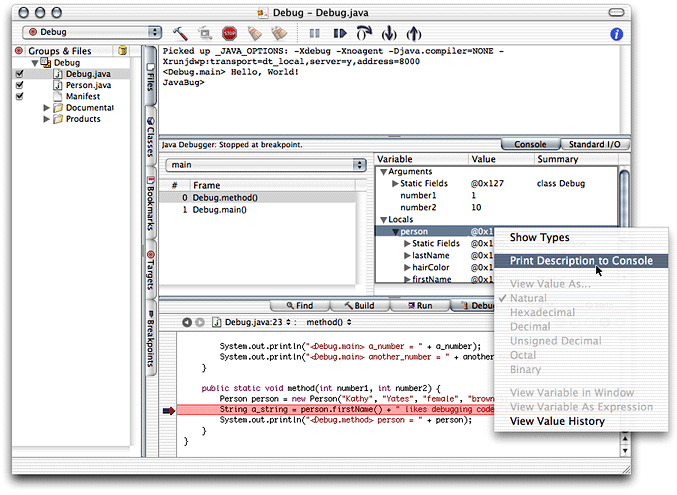

> 导航：[总目录](../../../README.md) · [documentation](../../../_indexes/documentation.md) · [Project Builder for Java](Introduction%20to%20Project%20Builder%20for%20Java.md)


[Next](Build%20Settings%20Reference.md)[Previous](Developing%20a%20JNI%20Application.md)

# Debugging Applications

Project Builder provides facilities for debugging Java applications. They allow you to stop the execution of an application at a specific line of code, execute a line of code within a method, step into a method call, step out of a method, or view the contents of variables in any method in the call stack.

This chapter shows how to use Project Builder’s debugging facilities to analyze the execution of a small application. It’s based on the Debug project included in the companion folder (`companion/projects/Debug`); see [Introduction to Project Builder for Java](Introduction%20to%20Project%20Builder%20for%20Java.md#apple-f4xwc4dqnrsv64tfmyxwi33df52wszbpkridimbqgaydsmztfvbuqmrqgqwviucykjcummjqge) for details on companion files.

To pause the execution of an application, place a breakpoint marker in the line of code you want execution to stop. Listing 6-1 shows the definition of the Debug class in the Debug project.

__Listing 6-1__  `Debug.java` file of Debug project

```
import java.util.*;

public class Debug {

    public static void main (String args[]) {
        System.out.println("<Debug.main> Hello, World!");

        int a_number = 1;
        int another_number = 10;// 1

        method(a_number, another_number);

        System.out.println("<Debug.main> a_number = " + a_number);
        System.out.println("<Debug.main> another_number = " + another_number);
}

    public static void method(int number1, int number2) {
        Person person = new Person("Kathy", "Yates", "female", "brown");
        String a_string = person.firstName() + " likes debugging code.";
        System.out.println("<Debug.method> person = " + person);
    }
}
```

To add a breakpoint to the line numbered 1, click the line’s left margin in the editor. You can also set the insertion point in the line and choose Debug > Add Breakpoint at Current Line. Figure 6-1 shows the result.

__Figure 6-1__  Breakpoint in `Debug.java` file of Debug project



To remove a breakpoint, click the breakpoint marker, drag the marker out of the margin, or choose Debug > Remove Breakpoint at Current Line.

To disable a breakpoint, Command-click the breakpoint marker or choose Debug > Disable Breakpoint at Current Line.

To build and debug the Debug project, choose Build > Build and then choose Debug > Debug Executable, or click the Build and Debug toolbar button. Figure 6-2 shows the result, in which the highlighted line is about to be executed.

__Figure 6-2__  Debugging an application—stopping



To step to the next line of code choose Debug > Step Over or click the Step Over toolbar button, as shown in Figure 6-3. Because the line executed is not a method call, clicking the Step Into toolbar button would give the same result.

__Figure 6-3__  Debugging an application—stepping over



To step into a method choose Debug > Step Into or click the Step Into toolbar button, as shown in Figure 6-4.

__Figure 6-4__  Debugging an application—stepping into a method



To step out of a method, (that is, to execute the rest of the lines in the current method and return to calling method), choose Debug > Step Out or click the Step Out toolbar button.

The pop-up menu to the right of the Files tab (with main chosen) lists threads of execution. The list below it shows the call stack for the chosen thread. The pane to the right of the call stack pane, the variable pane, shows the names of the parameters and variables declared for the currently executing method in the chosen thread. It may also show the arguments used in the method invocation and the values of the local variables. Figure 6-5 shows the call stack of the main thread and parameters and local variables of a method.

__Figure 6-5__  Debugging an application—viewing variable information



While you debug code, you may need to see the values of an object’s instance variables. Most programmers sprinkle `System.out.println` invocations throughout their code to accomplish this essential task. In Project Builder you can execute an object’s `toString` method to get the same effect.

Listing 6-2 shows a partial listing of the Person class. It contains an implementation of the `toString` method.

__Listing 6-2__  `Person.java` file

```
public class Person {
    private String firstName;
    private String lastName;
    private String gender;
    private String hairColor;

    public Person(String firstName, String lastName, String gender, String hairColor) {
        setFirstName(firstName);
        setLastName(lastName);
        setGender(gender);
        setHairColor(hairColor);
    }

    ...

    public String toString() {
        return "{FirstName: " + firstName() + "},{LastName: " + lastName() + "},{Gender: " + gender() + "},{HairColor: " + hairColor() + "}";
    }
}
```

Figure 6-6 depicts a debugging session in which the user chooses the Print Description to Console command through the contextual menu of person in the Variable list of the Debug pane.

__Figure 6-6__  Debugging an application—viewing an object’s contents



Listing 6-3 shows the output generated.

__Listing 6-3__  Console output after executing Print Description to Console command on a Person object

```
Picked up _JAVA_OPTIONS: -Xdebug -Xnoagent -Djava.compiler=NONE -Xrunjdwp:transport=dt_local,server=y,address=8000
<Debug.main> Hello, World!

Printing description of person:
"{FirstName: Kathy},{LastName: Yates},{Gender: female},{HairColor: brown}"
JavaBug>
```

[Next](Build%20Settings%20Reference.md)[Previous](Developing%20a%20JNI%20Application.md)

