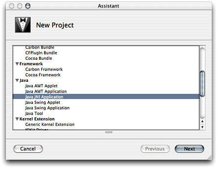
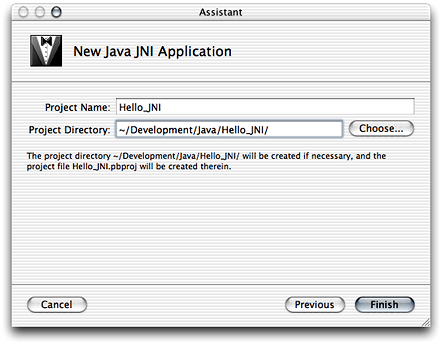
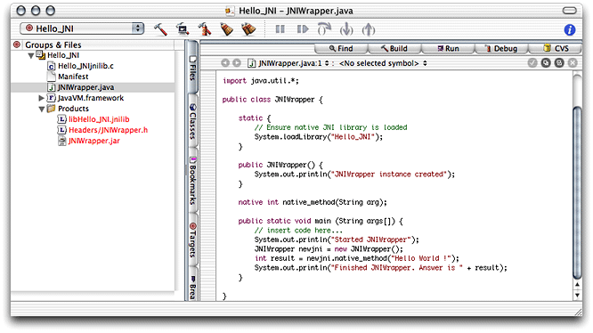
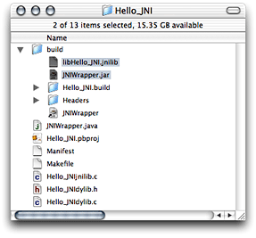

> 导航：[总目录](../../../README.md) · [documentation](../../../_indexes/documentation.md) · [Project Builder for Java](Introduction%20to%20Project%20Builder%20for%20Java.md)


[Next](Debugging%20Applications.md)[Previous](Developing%20a%20Swing%20Application.md)

# Developing a JNI Application

When you need to leverage existing C or Objective-C code in a Java application or need to improve the performance of an application by executing critical parts natively instead of on the Java virtual machine, you use the Java Native Interface (JNI). The JNI provides a way for Java code to communicate with C-based libraries.

Project Builder provides a template that facilitates the development of JNI-based applications. For an explanation of the elements of that template, including its targets, see [The JNI Application Template](Application%20Development.md#apple-f4xwc4dqnrsv64tfmyxwi33df52wszbpkridimbqgaydsmztfvbuqmrqguwueq2jizbeqqkg).

The JNI application template provides yet another version of a “Hello, World” application. This one, however, joins the flexibility of Java with the high performance of C code to print the famous greeting on the console. Follow these steps to create a JNI-based application.

1. Launch Project Builder. It’s located in `/Developer/Applications`.
2. Create a Java JNI application project.

   Choose File > New Project, and select Java JNI Application under Java in the template list.

   
3. Name the project and choose a location for it.

   In the New Java JNI Application pane of the Assistant, enter `Hello_JNI` in the Project Name text input field, click Choose, and choose a location for the project folder.

   

When done, you should see the Project Builder window, shown in Figure 5-1. The files in red are the project’s products, which haven’t been built.

__Figure 5-1__  The Leverage project in the Project Builder window



Project Builder generated the source files for the native side and the Java side of the application. They’re shown in Listing 5-1 and Listing 5-2.

__Listing 5-1__  `Leveragejnilib.c` source file in the Leverage project

```c
#include "JNIWrapper.h"

int shared_function(const char *arg) {
    printf("shared_function called with %s\n", arg);
    return 42;
}

JNIEXPORT jint JNICALL Java_JNIWrapper_native_1method(JNIEnv *env, jobject this, jstring arg) {
    /* Convert to UTF8 */
    const char *argutf  = (*env)->GetStringUTFChars(env, arg, JNI_FALSE);

    /* Call into external dylib function */
    jint rc = shared_function(argutf);

    /* Release created UTF8 string. */
    (*env)->ReleaseStringUTFChars(env, arg, argutf);

    return rc;
}
```


__Listing 5-2__  `JNIWrapper.java` source file in the Leverage project

```
import java.util.*;

public class JNIWrapper {

    static {
        // Ensure native JNI library is loaded.
        System.loadLibrary("Leverage");
    }

    public JNIWrapper() {
        System.out.println("JNIWrapper instance created");
    }

    native int native_method(String arg);

    public static void main (String args[]) {
        System.out.println("Started JNIWrapper");
        JNIWrapper newjni = new JNIWrapper();
        int result = newjni.native_method("Hello World !");
        System.out.println("Finished JNIWrapper. Answer is " + result);
    }

}
```

Now, make sure the Leverage target is selected, and build and run the application. Several files appear in the project’s build folder. Because this is a JNI application, in addition to the JAR file containing the Java application, you see a JNI library file, which contains the object file for the native function specified in `Leveragejnilib.c` (Figure 5-2). The Header folder contains the `JNIWrapper.h` file, which is generated by `javah` from the `JNIWrapper.class` file.

__Figure 5-2__  The build folder of the Leverage project after building the application



The developer tools package includes several examples of JNI-based applications, including a Cocoa/Java application located in `/Developer/Examples/Java/AppleDemos/CocoaComponent`. Open those projects and examine them to get a glimpse of the power and flexibility that Java and JNI provide.

[Next](Debugging%20Applications.md)[Previous](Developing%20a%20Swing%20Application.md)

