> 导航：[总目录](../../../README.md) · [documentation](../../../_indexes/documentation.md) · [Project Builder for Java](Introduction%20to%20Project%20Builder%20for%20Java.md)


[Next](Developing%20a%20JNI%20Application.md)[Previous](Developing%20a%20Tool.md)

# Developing a Swing Application

This chapter covers the steps needed to develop Swing applications. First, this chapter guides you through the creation of a simple application, completely based on Project Builder’s Swing project template. Second, to show how to port an existing Swing application to Mac OS X, it shows how to create a Swing project based on Sun’s File Chooser Demo application and deploy it as a Mac OS X application; the finished project is in `companion/projects/FileChooser`. (See [Introduction to Project Builder for Java](Introduction%20to%20Project%20Builder%20for%20Java.md#apple-f4xwc4dqnrsv64tfmyxwi33df52wszbpkridimbqgaydsmztfvbuqmrqgqwviucykjcummjqge) for details on this document’s companion files.) Finally, this chapter explains how to change the icon the Finder displays for the application from the generic Java application icon. .

The Swing application template provides another version of the “Hello, World” application. Follow these steps to create a project that demonstrates how a Swing application looks in Mac OS X.

1. Launch Project Builder. It’s located in `/Developer/Applications`.
2. Create a Java Swing application project.

   Choose File > New Project, and select Java Swing Application under Java in the project-template list of the New Project pane.

   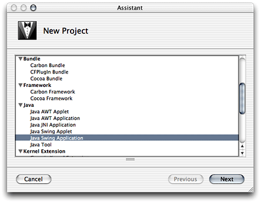
3. Name the project and choose a location for it.

   In the New Java Swing Application pane of the Assistant enter `Hello_Swing` in the Project Name text input field, click Choose, and choose a location for the project folder.

   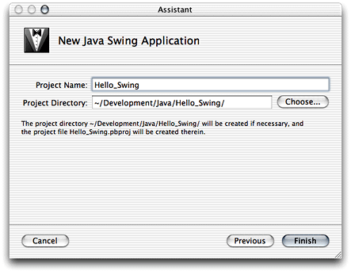

When done, you should see the Project Builder window, shown in Figure 4-1. The product, `Hello_Swing.app`, appears in red because it hasn’t been built.

__Figure 4-1__  The Hello_Swing project in Project Builder’s window

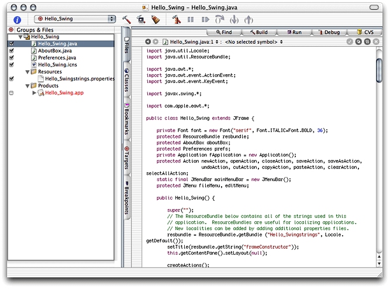

Build and run the application by choosing Build > Build and Run. Figure 4-2 shows the running Hello_Swing application.

__Figure 4-2__  Hello_Swing application in action

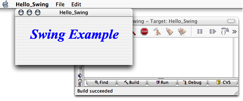

This section explains how to use existing Java source files to create a Swing-based Mac OS X application.

You can download source code that demonstrates the use of the JFileChooser class (`javax.swing`) at [http://java.sun.com/docs/books/tutorial/uiswing/components/filechooser.html](http://java.sun.com/docs/books/tutorial/uiswing/components/filechooser.html). You can also use the files included with this document in `companion/source/FileChooser` (see [Introduction to Project Builder for Java](Introduction%20to%20Project%20Builder%20for%20Java.md#apple-f4xwc4dqnrsv64tfmyxwi33df52wszbpkridimbqgaydsmztfvbuqmrqgqwviucykjcummjqge) for details on companion files).

Perform these steps to create a file-chooser demonstration project.

1. Create a Java Swing application project named `FileChooser`.
2. Remove the standard source files from the project:

   1. Select the `FileChooser.java`, `AboutBox.java`, and `Preferences.java` files in the Files list.
   2. Choose File > Delete or press the Delete key.
   3. Click Delete References & Files in the Delete References dialog, shown in Figure 4-3.

      __Figure 4-3__  Delete References dialog of Project Builder

      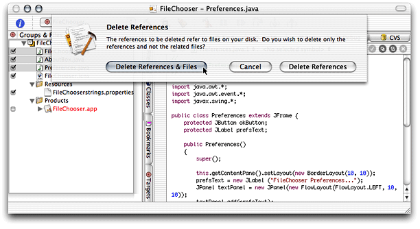
3. Add the source files and image files required for the project:

   1. Choose Project > Add Files.
   2. Navigate to where the source files reside, select them, and click Add. Figure 4-4 exemplifies the addition of the file-chooser demonstration files in `companion/source/FileChooser`.

      __Figure 4-4__  Adding source files to a project in Project Builder

      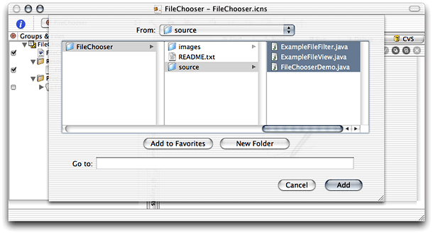
   3. In the dialog that appears, select “Copy items into destination group’s folder” and make sure the FileChooser target is selected in the Add To Targets list.

      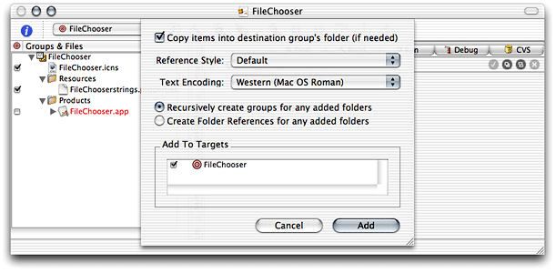
   4. Repeat the previous step for the image files.
4. Examine the FileChooser target to verify that the newly added files are assigned to the correct build phases:

   1. Click the Targets tab and select the FileChooser target in the Targets list.
   2. Select the Sources build phase and the Java Resource Files build phase in the target editor. Make sure the source files and image files you added to the project appear in the Sources pane and the Java Resource Files pane, respectively.

      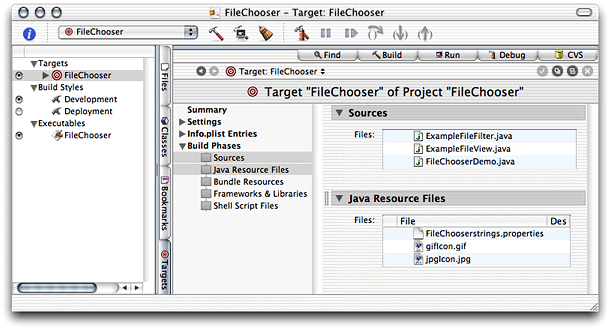
5. Change the name of the main class in the information property list:

   1. Select Pure Java–Specific under Simple view under Info.plist Entries in the target editor.
   2. Enter `FileChooserDemo` in the Main Class text field.
6. Clean the FileChooser target by choosing Build > Clean and click Clean Active Target in the dialog that appears.

   Cleaning the target erases any temporary files stored in the target’s `build` directory, which may have been left there in previous builds. (If you didn’t build the application, you may skip this step.)

   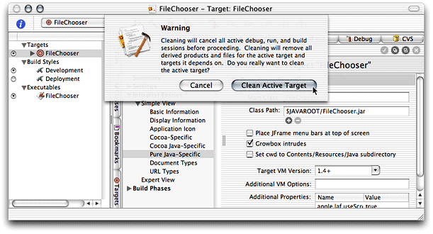

Build and run the application. You should see the window shown in Figure 4-5.

__Figure 4-5__  FileChooser in action

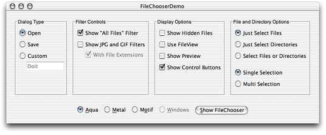

If instead of a running application you get an error message like the following in Project Builder’s Run pane, make sure that the name of the application’s main class matches the contents of the Main Class entry of the Pure Java–Specific pane of the Info.plist Entries pane in the target editor.

```
[LaunchRunner Error] The main class "FileChooser" could not be found.
[JavaAppLauncher Error] CallStaticVoidMethod() threw an exception
java.lang.NullPointerException
    at apple.launcher.LaunchRunner.run(LaunchRunner.java:85)
    at apple.launcher.LaunchRunner.callMain(LaunchRunner.java:50)
    at apple.launcher.JavaApplicationLauncher.launch(JavaApplicationLauncher.java:52)
Exception in thread "main"
FileChooser has exited with status 0.
```

When you click the Show FileChooser button of the FileChooserDemo window, you should see a window like the one in Figure 4-6. Of course, the actual look of the window depends on the selections you make in the FileChooserDemo window.

__Figure 4-6__  Open dialog displayed by FileChooserDemo

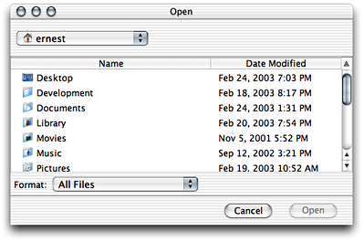

The Resources folder of an application package holds several types of files, including icon files. The Finder consults the `CFBundleIconFile` information property list entry to determine which of these files to use as the application’s icon.

Follow these steps to change the icon of the FileChooser application developed in [Creating the File Chooser Demo](#apple-f4xwc4dqnrsv64tfmyxwi33df52wszbpkridimbqgaydsmztfvbuqmrqhawueq2jjbbeeqsf) from the default icon.

1. Identify the icon file for the new icon.

   You can find an icon file in `/Developer/Applications/Pixie.app/Contents/Resources/Big.icns`.

   In Terminal, execute the following command:

```
cp /Developer/Applications/Pixie.app/Contents/Resources/Big.icns <FileChooser_project_directory>
```
2. Remove the `FileChooser.icns` file from the FileChooser project:

   1. Select `FileChooser.icns` in the Files list in the Project Builder main window.
   2. Choose Edit > Delete or press the Delete key.
   3. Click Delete References & Files.
3. Add the icon file for the desired icon to the project:

   1. Choose Project > Add Files.
   2. Select `Big.icns` in the file list and click Add.

      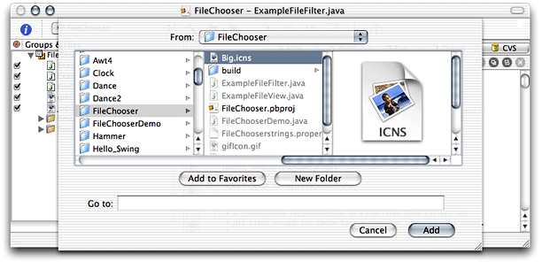
   3. In the dialog that appears, make sure “Copy items into destination group’s folder” is not selected and click Add.

      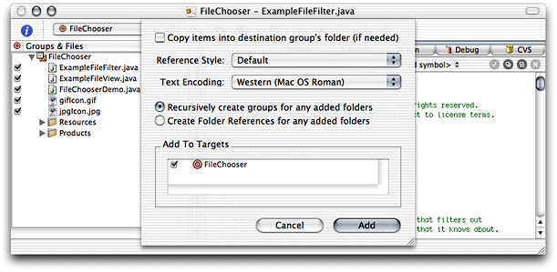
4. Make sure that the new icon file is assigned to the Bundle Resources build phase and not the Java Resource Files build phase.

   1. Select the Java Resource Files build phase and the Bundle Resources build phase in the target editor of the FileChooser target.
   2. Drag `Big.icns` from the Files list of the Java Resource Files pane to the Files list of the Bundle Resources pane.

      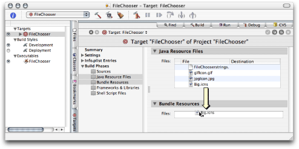
5. Set the name of the icon file of the application.

   1. Select Application Icon under Simple View under Info.plist Entries in the target editor.
   2. Enter `Big.icns` in the “Icon file” text field of the Application Icon pane.

      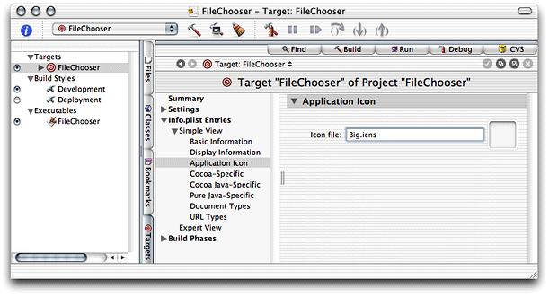

Clean the project, and build and run the application. The icon for `FileChooser.app` in the build folder of the project should have the icon used by Pixie.

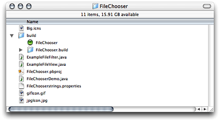

[Next](Developing%20a%20JNI%20Application.md)[Previous](Developing%20a%20Tool.md)

