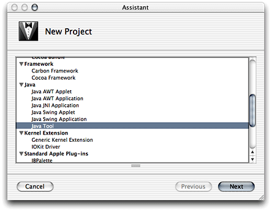
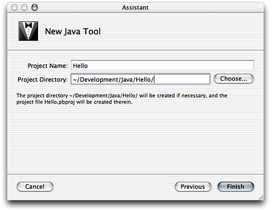
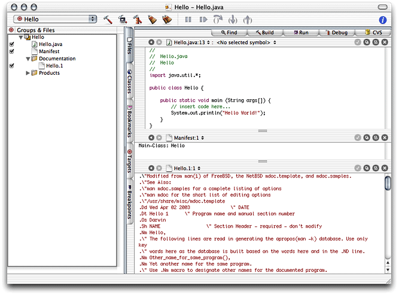
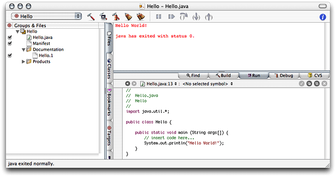
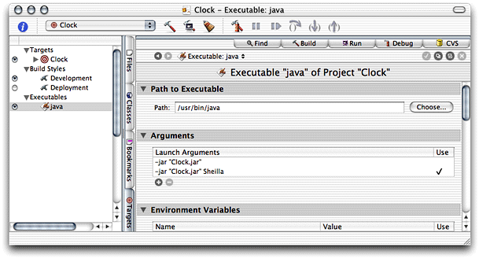
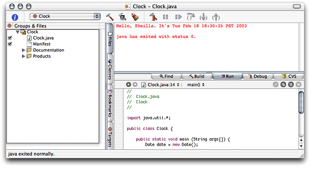
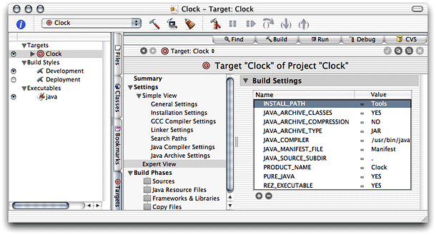
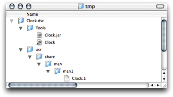
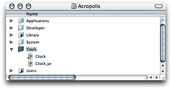
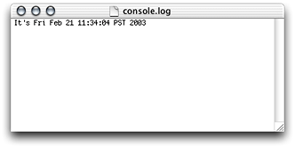

> 导航：[总目录](../../../README.md) · [documentation](../../../_indexes/documentation.md) · [Project Builder for Java](Introduction%20to%20Project%20Builder%20for%20Java.md)


[Next](Developing%20a%20Swing%20Application.md)[Previous](Build%20System.md)

# Developing a Tool

This chapter shows how to develop text-based Java applications or tools in Project Builder using the tool project template. It guides you through the creation of two projects, Hello and Clock. The former one is a “Hello, World” application, while the latter is a simple tool to display the current time, which is included in this document’s companion files. See [Introduction to Project Builder for Java](Introduction%20to%20Project%20Builder%20for%20Java.md#apple-f4xwc4dqnrsv64tfmyxwi33df52wszbpkridimbqgaydsmztfvbuqmrqgqwviucykjcummjqge) for details.

The Java Tool project template provides the prototypical “Hello, World” application. Follow these steps to create your first Java application using Project Builder.

1. Launch Project Builder. It’s located in `/Developer/Applications`.
2. Create a Java tool project.

   Choose File > New Project, and select Java Tool under Java in the project-template list of the New Project pane.

   
3. Name the project and choose a location for it.

   In the New Java Tool pane of the Assistant, enter `Hello` in the Project Name text input field, click Choose, and choose a location for it.

   

When done, you should see the Project Builder window. Figure 3-1 shows the window with three editor panes, one for each file in the project, the Java source file, the manifest file, and the man page documentation file. The product, `Hello.jar`, is shown in red because it hasn’t been built.

__Figure 3-1__  The Hello project in Project Builder



Build and run the application by choosing Build > Build and Run. Figure 3-2 shows the Run pane of the Project Builder window. The Run pane displays the console output of the application.

__Figure 3-2__  Project Builder’s Run pane showing Hello’s console output



This section shows how to create the Clock tool. Clock is a text-based application that tells time. It takes an optional command-line argument, the name of the user. You can find the finished product among this document’s companion files in `companion/projects/Clock` (see [Introduction to Project Builder for Java](Introduction%20to%20Project%20Builder%20for%20Java.md#apple-f4xwc4dqnrsv64tfmyxwi33df52wszbpkridimbqgaydsmztfvbuqmrqgqwviucykjcummjqge) for details on companion files).

Follow these instructions to create the Clock tool.

1. Create a Java tool project and name it `Clock`.
2. Edit the `main` method of the Clock class so that it looks like this:

```
public static void main (String args[]) {
    Date date = new Date();

    if (args.length > 0) {
        String user_name = args[0];
        System.out.println("Hello, " + user_name + ". It's " + date);
    }
    else {
        System.out.println("It's " + date);
    }
}
```
3. Add an argument to the application’s launch arguments to test it within Project Builder.

   1. Click the Targets tab to display the Targets list.
   2. Click java under Executables in the Targets list.
   3. Click the plus sign (+) in the Arguments pane of the target editor.
   4. Enter `-jar "Clock.jar" Sheilla` in the newly added row of the Launch Arguments list.
   5. Deselect the Use option in the first row by clicking the checkmark in the Use column. The Arguments pane should now look like Figure 3-3.

   __Figure 3-3__  Arguments pane of the executable editor in Project Builder

   

Build and run the application. You should see its output in Project Builder’s Run pane, as shown in Figure 3-4.

__Figure 3-4__  Output of Clock tool displayed in Project Builder



This section shows how to install the Clock tool on a computer. Follow these steps to install Clock on your computer:

1. Determine the location of the installed product by adding the `INSTALL_DIR` build setting to the project and configuring the setting appropriately.

   1. Click the Targets tab to display the Targets list.
   2. Click the Clock target.
   3. Click Expert View under Settings in the target editor.
   4. Click the plus sign (+) in the Build Settings pane.
   5. In the newly added row, enter `INSTALL_PATH` in the Name column and `Tools` in the Value column. The Expert View pane should look like Figure 3-5.

      __Figure 3-5__  Expert View pane of the target editor in Project Builder

      
2. Run `pbxbuild` to install the application:

   1. Launch Terminal. It’s located in `/Applications/Utilities`.
   2. Execute the following commands:

```shell
% cd <path_to_Clock_project>
% pbxbuild install -buildstyle Deployment
```

Now, your `/tmp` directory contains the Clock distribution directory (`Clock.dst`), as shown in Figure 3-6.

__Figure 3-6__  Clock distribution directory in `/tmp`



If you want `pbxbuild` to install in the final destination of a product instead of in `/tmp`, use the following commands:

```
sudo pbxbuild clean
sudo pbxbuild install -buildstyle Deployment DSTROOT=/
```

This creates `/Tools` in your root volume if it doesn’t already exist and places the application’s JAR file there, as shown in Figure 3-7.

__Figure 3-7__  Clock target directory



To run the application, double-click the JAR file. To view the application’s output when you launch it from the Finder, launch Console, located in `/Applications/Utilities`. Figure 3-8 shows Console displaying the output of a Clock session.

__Figure 3-8__  Output of Clock viewed through Console



[Next](Developing%20a%20Swing%20Application.md)[Previous](Build%20System.md)

