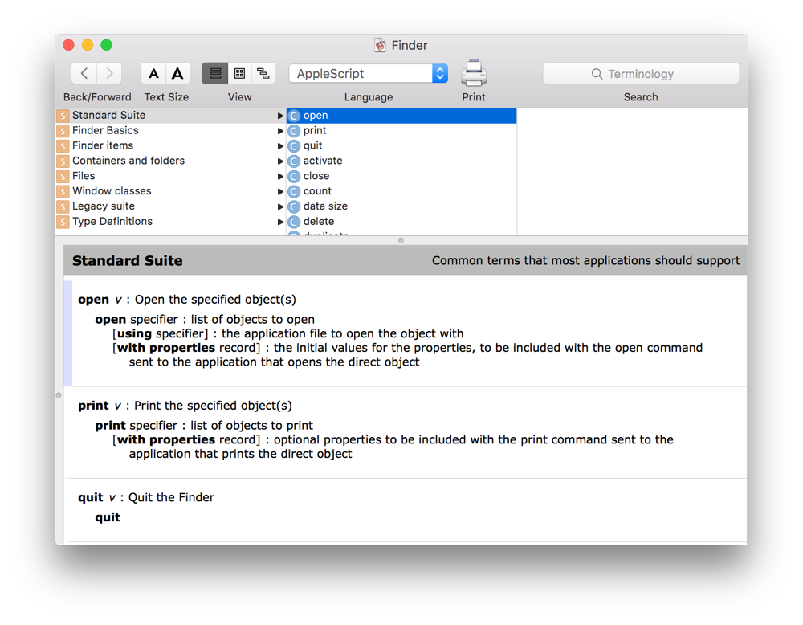

> 导航：[总目录](../../README.md) · [documentation](../../_indexes/documentation.md) · [Mac Automation Scripting Guide](index.md)

## About Scripting Terminology

AppleScript and JavaScript possess core language commands, classes, and properties that make scripting possible. For AppleScript, core terminology is documented in _[AppleScript Language Guide](../Apple%20Script/AppleScript%20Language%20Guide/Introduction%20to%20AppleScript%20Language%20Guide.md#apple-f4xwc4dqnrsv64tfmyxwi33df52wszbpkridimbqgaydsobt)_. For JavaScript, see _[JavaScript for Automation Release Notes](../../releasenotes/JavaScript%20for%20Automation%20Release%20Notes/Introduction%20to%20JavaScript%20for%20Automation%20Release%20Notes.md#apple-f4xwc4dqnrsv64tfmyxwi33df52wszbpkridimbqge2dkmby)_ and [Mozilla’s official JavaScript documentation](https://developer.mozilla.org/en-US/docs/Web/JavaScript).

Each scriptable app introduces additional terminology that extends the core language. For example, Mail introduces terminology for creating and sending email messages. iTunes introduces terminology for working with music and playlists. In order to write a script that controls an app, you need to familiarize yourself with that app’s terminology.

The terminology for an app is found in its _scripting dictionary_, an `.sdef` file stored in the app bundle. The dictionary describes the commands, classes, and properties an app supports. This information is used by the scripting components of the operating system, the app itself, and any other apps or scripts that interact with the app through scripting. It also serves as a reference, which you can consult in Script Editor for guidance as you write a script. See Figure 10-1.

__Figure 10-1__Example of a scripting dictionary in Script Editor

Not every OS X app supports scripting, but many apps do, including Mail, Address Book, Calendar, iTunes, and Messages. To determine if a particular app is scriptable, see if it has a scripting dictionary. See [Opening a Scripting Dictionary](OpenaScriptingDictionary.md#apple-f4xwc4dqnrsv64tfmyxwi33df52wszbpkridimbqge3demzzfvbuqnzwfvjvomi).

Scripting terminology can vary extensively from app to app. While some apps may have extensive scripting support, others may have very limited scripting support. If an app doesn’t meet your scripting needs, reach out to the app developer and request improved support in a future version. To request scripting enhancements for Apple apps, submit a [bug report](http://bugreport.apple.com/) that specifies the app and communicates your specific needs.

Also, keep in mind that scripting terminology can change from one version of an app or OS X to the next. Always test essential scripts when upgrading to a new app or system version.

> [!NOTE]
> 

[Configuring Scripting Preferences](ConfigureScriptingPreferences.md#apple-f4xwc4dqnrsv64tfmyxwi33df52wszbpkridimbqge3demzzfvbuqnzqfvjvomi)

[Opening a Scripting Dictionary](OpenaScriptingDictionary.md#apple-f4xwc4dqnrsv64tfmyxwi33df52wszbpkridimbqge3demzzfvbuqnzwfvjvomi)
