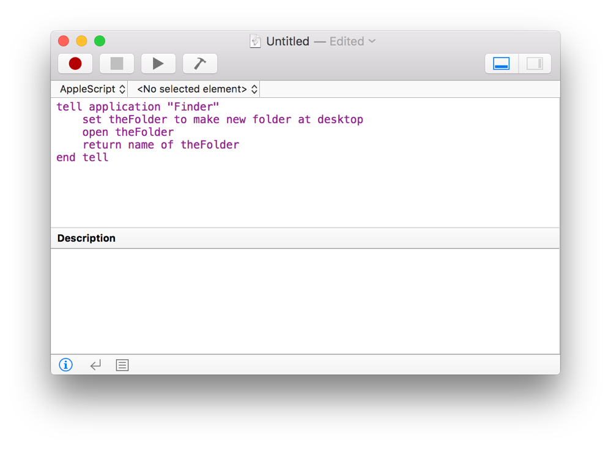
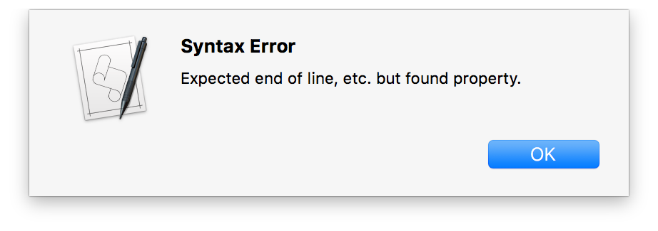
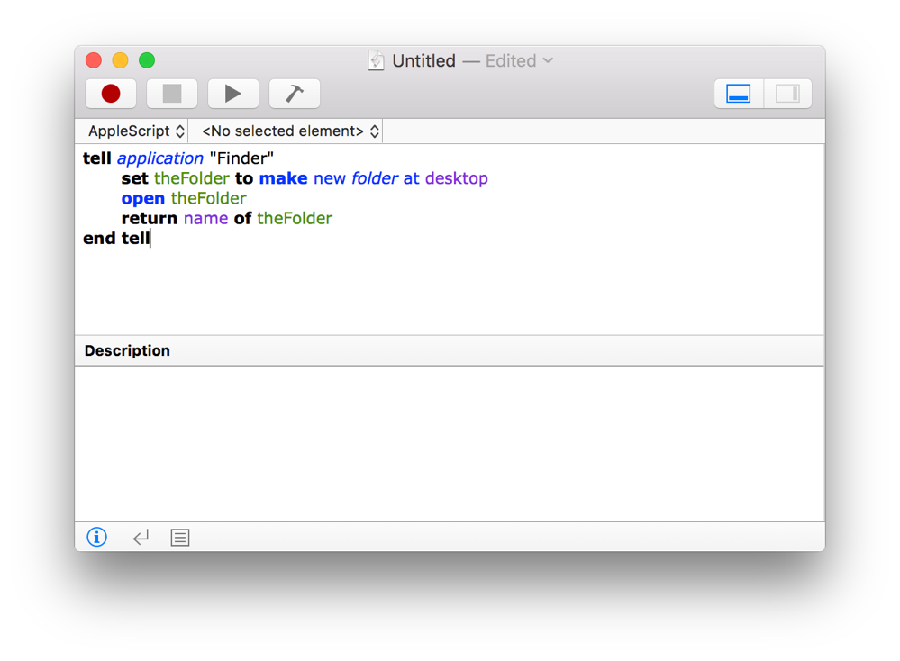
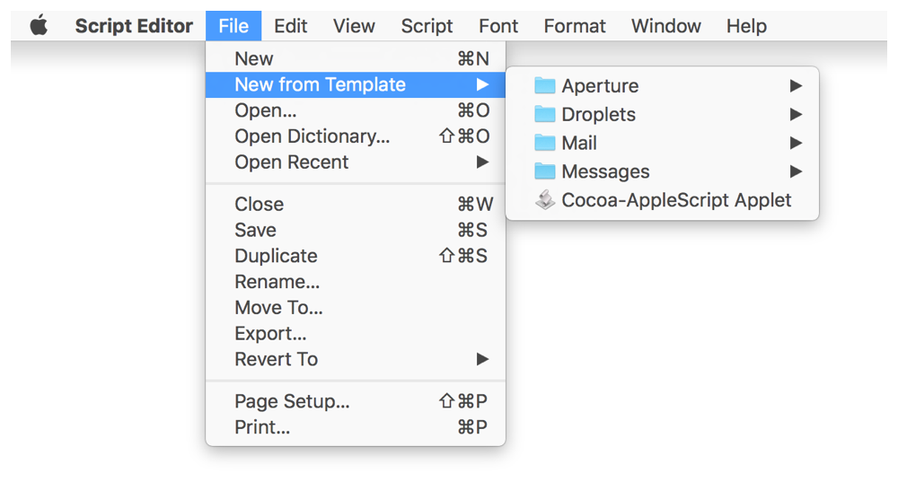
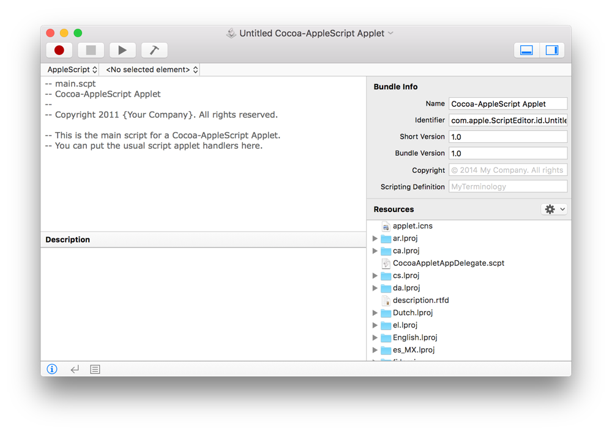

> 导航：[总目录](../../README.md) · [documentation](../../_indexes/documentation.md) · [Mac Automation Scripting Guide](index.md)

## Creating a Script

Generally, most scripts are written in Script Editor documents. Scripts can also be written in Xcode, but this is typically for scripts that require advanced user interfaces.

__To write a script in Script Editor__

1. Launch Script Editor in `/Applications/Utilities/`.
2. Press Command-N or select File > New.
3. If the script isn’t configured for the correct language, choose the language in the navigation bar.

   

   > [!TIP]
   > 
4. Write your script code in the editing area. Newly written code is uncompiled and formatted as new text.

   
5. Click the Compile button () to compile the script and check for syntax errors.

   If a syntax error occurs, an alert is displayed.

   

   If the script compiles, code formatting is applied at this time.

   

> [!TIP]
> 

### Using an AppleScript Template

Script Editor includes a number of built-in templates for creating common types of AppleScripts, including droplets, Mail rule scripts, and Messages handler scripts.

> [!NOTE]
> 

__To create a template-based script__

1. Launch Script Editor in `/Applications/Utilities/`.
2. Choose File > New from Template.

   
3. Select a script template.

   A new Script Editor document window opens containing prewritten code and preconfigured settings. The following screenshot shows an example of a script created using a template.

   
4. Customize the script.

[Getting to Know Script Editor](GettoKnowScriptEditor.md#apple-f4xwc4dqnrsv64tfmyxwi33df52wszbpkridimbqge3demzzfvbuqnjnknltc)

[Saving a Script](SaveaScript.md#apple-f4xwc4dqnrsv64tfmyxwi33df52wszbpkridimbqge3demzzfvbuqmjtfvjvomi)
