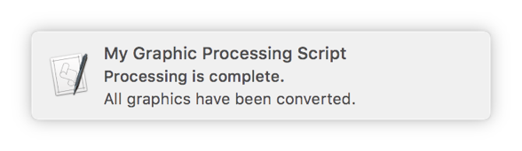
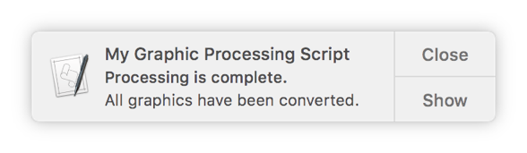

> 导航：[总目录](../../README.md) · [documentation](../../_indexes/documentation.md) · [Mac Automation Scripting Guide](index.md)

## Displaying Notifications

Notification Center offers another opportunity for providing feedback during script execution. Use the Standard Additions scripting addition’s `display notification` command to show notifications, such as status updates as files are processed. Notifications are shown as alerts or banners, depending on the user’s settings in System Preferences > Notifications. See Figure 24-1 and Figure 24-2.

__Figure 24-1__A banner notification

__Figure 24-2__An alert notification

To show a notification, provide the `display notification` command with a string to display. Optionally, provide values for the `with title`, `subtitle`, and `sound name` parameters to provide additional information and an audible alert when the notification appears, as shown in Listing 24-1 and Listing 24-2.

__APPLESCRIPT__

[Open in Script Editor](applescript://com.apple.scripteditor?action=new&script=display%20notification%20%22All%20graphics%20have%20been%20converted.%22%20with%20title%20%22My%20Graphic%20Processing%20Script%22%20subtitle%20%22Processing%20is%20complete.%22%20sound%20name%20%22Frog%22)

__Listing 24-1__AppleScript: Displaying a notification

1. `display notification "All graphics have been converted." with title "My Graphic Processing Script" subtitle "Processing is complete." sound name "Frog"`

__JAVASCRIPT__

[Open in Script Editor](applescript://com.apple.scripteditor?action=new&script=var%20app%20%3D%20Application.currentApplication%28%29%0A%0Aapp.includeStandardAdditions%20%3D%20true%0A%0Aapp.displayNotification%28%22All%20graphics%20have%20been%20converted.%22%2C%20%7B%0A%20%20%20%20withTitle%3A%20%22My%20Graphic%20Processing%20Script%22%2C%0A%20%20%20%20subtitle%3A%20%22Processing%20is%20complete.%22%2C%0A%20%20%20%20soundName%3A%20%22Frog%22%0A%7D%29)

__Listing 24-2__JavaScript: Displaying a notification

1. `var app = Application.currentApplication()`
3. `app.includeStandardAdditions = true`
5. `app.displayNotification("All graphics have been converted.", {`
6. `withTitle: "My Graphic Processing Script",`
7. `subtitle: "Processing is complete.",`
8. `soundName: "Frog"`
9. `})`

> [!NOTE]
> 

[Prompting for Text](PromptforText.md#apple-f4xwc4dqnrsv64tfmyxwi33df52wszbpkridimbqge3demzzfvbuqobqfvjvomi)

[Speaking Text](SpeakText.md#apple-f4xwc4dqnrsv64tfmyxwi33df52wszbpkridimbqge3demzzfvbuqnrsfvjvomi)
