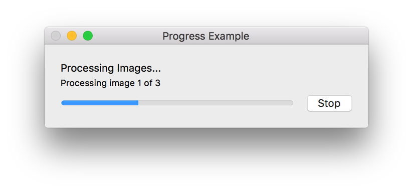
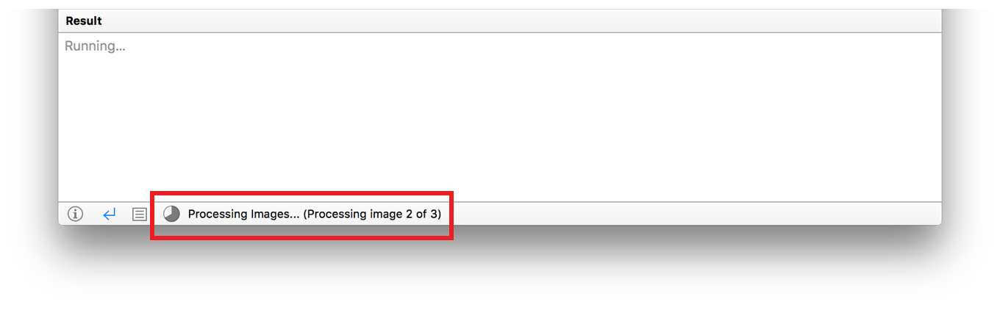
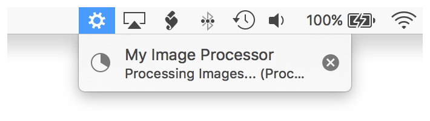

> 导航：[总目录](../../README.md) · [documentation](../../_indexes/documentation.md) · [Mac Automation Scripting Guide](index.md)

## Displaying Progress

Many scripts perform large and time-consuming processing operations. All too often, they do this invisibly; they simply run and the user has no idea how long processing will take. A more user-friendly approach is to provide progress information during script operation. At a basic level, this can be done by displaying periodic dialogs or notifications. See [Displaying Dialogs and Alerts](DisplayDialogsandAlerts.md#apple-f4xwc4dqnrsv64tfmyxwi33df52wszbpkridimbqge3demzzfvbuqmjvfvjvomi) and [Displaying Notifications](DisplayNotifications.md#apple-f4xwc4dqnrsv64tfmyxwi33df52wszbpkridimbqge3demzzfvbuqnrrfvjvomi). At a complex level, this can be done by designing a fully-custom interface that provides processing feedback.

AppleScript and JavaScript can also report progress graphically and textually. For script apps, this progress reporting takes the form of a dialog window containing a progress bar, descriptive text, and a Stop button. See Figure 30-1.

__Figure 30-1__A script progress dialog

For scripts running in Script Editor, this progress reporting appears at the bottom of the script window. See Figure 30-2.

__Figure 30-2__Progress displayed in Script Editor

For scripts running from the systemwide script menu, this progress reporting appears in the menu bar, beneath a temporarily displayed gear icon. See Figure 30-3.

__Figure 30-3__Progress of a script menu script

AppleScript has several language-level properties and JavaScript has a `Progress` object with properties that are used to produce this type of progress reporting. See Table 30-1.

__Table 30-1__Progress properties in AppleScript and JavaScript

| AppleScript Property | JavaScript Property | Value Type | Description |
| --- | --- | --- | --- |
| `progress total steps` | `Progress.totalUnitCount` | Integer | Configures the total number of steps to be reported in the progress. For example, if the script will process 5 images, then the value for `progress total steps` would be `5`. |
| `progress completed steps` | `Progress.completedUnitCount` | Integer | Configures the number of steps completed so far. For example, if the script has processed 3 of 5 images, then the value of `progress completed steps` would be `3`. |
| `progress description` | `Progress.description` | Integer | Text to display when reporting progress. Use this is an opportunity to let the user know what’s happening. For example, it could indicate that images are being processed. |
| `progress additional description` | `Progress.additionalDescription` | Integer | Additional text to display when reporting progress. Use this is an opportunity to provide even more detailed information about what’s happening. For example, it could indicate the specific task being performed, and how much more processing is remaining. |

Listing 30-1 and Listing 30-2 demonstrate how these properties can be used to provide progress information while processing a set of images.

__APPLESCRIPT__

[Open in Script Editor](applescript://com.apple.scripteditor?action=new&script=set%20theImages%20to%20choose%20file%20with%20prompt%20%22Please%20select%20some%20images%20to%20process%3A%22%20of%20type%20%7B%22public.image%22%7D%20with%20multiple%20selections%20allowed%0A%0A--%20Update%20the%20initial%20progress%20information%0Aset%20theImageCount%20to%20length%20of%20theImages%0Aset%20progress%20total%20steps%20to%20theImageCount%0Aset%20progress%20completed%20steps%20to%200%0Aset%20progress%20description%20to%20%22Processing%20Images...%22%0Aset%20progress%20additional%20description%20to%20%22Preparing%20to%20process.%22%0A%0Arepeat%20with%20a%20from%201%20to%20length%20of%20theImages%0A%0A%20%20%20%20--%20Update%20the%20progress%20detail%0A%20%20%20%20set%20progress%20additional%20description%20to%20%22Processing%20image%20%22%20%26%20a%20%26%20%22%20of%20%22%20%26%20theImageCount%0A%0A%20%20%20%20--%20Process%20the%20image%0A%0A%20%20%20%20--%20Increment%20the%20progress%0A%20%20%20%20set%20progress%20completed%20steps%20to%20a%0A%0A%20%20%20%20--%20Pause%20for%20demonstration%20purposes%2C%20so%20progress%20can%20be%20seen%0A%20%20%20%20delay%201%0Aend%20repeat%0A%0A--%20Reset%20the%20progress%20information%0Aset%20progress%20total%20steps%20to%200%0Aset%20progress%20completed%20steps%20to%200%0Aset%20progress%20description%20to%20%22%22%0Aset%20progress%20additional%20description%20to%20%22%22)

__Listing 30-1__AppleScript: Display progress while processing images

1. `set theImages to choose file with prompt "Please select some images to process:" of type {"public.image"} with multiple selections allowed`
3. `-- Update the initial progress information`
4. `set theImageCount to length of theImages`
5. `set progress total steps to theImageCount`
6. `set progress completed steps to 0`
7. `set progress description to "Processing Images..."`
8. `set progress additional description to "Preparing to process."`
10. `repeat with a from 1 to length of theImages`
12. `-- Update the progress detail`
13. `set progress additional description to "Processing image " & a & " of " & theImageCount`
15. `-- Process the image`
17. `-- Increment the progress`
18. `set progress completed steps to a`
20. `-- Pause for demonstration purposes, so progress can be seen`
21. `delay 1`
22. `end repeat`
24. `-- Reset the progress information`
25. `set progress total steps to 0`
26. `set progress completed steps to 0`
27. `set progress description to ""`
28. `set progress additional description to ""`

__JAVASCRIPT__

[Open in Script Editor](applescript://com.apple.scripteditor?action=new&script=var%20app%20%3D%20Application.currentApplication%28%29%0Aapp.includeStandardAdditions%20%3D%20true%0A%0Avar%20images%20%3D%20app.chooseFile%28%7B%0A%20%20%20%20withPrompt%3A%20%22Please%20select%20some%20images%20to%20process%3A%22%2C%0A%20%20%20%20ofType%3A%20%5B%22public.image%22%5D%2C%0A%20%20%20%20multipleSelectionsAllowed%3A%20true%0A%7D%29%0A%0A%2F%2F%20Update%20the%20initial%20progress%20information%0Avar%20imageCount%20%3D%20images.length%0AProgress.totalUnitCount%20%3D%20imageCount%0AProgress.completedUnitCount%20%3D%200%0AProgress.description%20%3D%20%22Processing%20Images...%22%0AProgress.additionalDescription%20%3D%20%22Preparing%20to%20process.%22%0A%0Afor%20%28i%20%3D%200%3B%20i%20%3C%20imageCount%3B%20i%2B%2B%29%20%7B%0A%20%20%20%20%2F%2F%20Update%20the%20progress%20detail%0A%20%20%20%20Progress.additionalDescription%20%3D%20%22Processing%20image%20%22%20%2B%20i%20%2B%20%22%20of%20%22%20%2B%20imageCount%0A%0A%20%20%20%20%2F%2F%20Process%20the%20image%0A%0A%20%20%20%20%2F%2F%20Increment%20the%20progress%0A%20%20%20%20Progress.completedUnitCount%20%3D%20i%0A%0A%20%20%20%20%2F%2F%20Pause%20for%20demonstration%20purposes%2C%20so%20progress%20can%20be%20seen%0A%20%20%20%20delay%281%29%0A%7D)

__Listing 30-2__JavaScript: Display progress while processing images

1. `var app = Application.currentApplication()`
2. `app.includeStandardAdditions = true`
4. `var images = app.chooseFile({`
5. `withPrompt: "Please select some images to process:",`
6. `ofType: ["public.image"],`
7. `multipleSelectionsAllowed: true`
8. `})`
10. `// Update the initial progress information`
11. `var imageCount = images.length`
12. `Progress.totalUnitCount = imageCount`
13. `Progress.completedUnitCount = 0`
14. `Progress.description = "Processing Images..."`
15. `Progress.additionalDescription = "Preparing to process."`
17. `for (i = 0; i < imageCount; i++) {`
18. `// Update the progress detail`
19. `Progress.additionalDescription = "Processing image " + i + " of " + imageCount`
21. `// Process the image`
23. `// Increment the progress`
24. `Progress.completedUnitCount = i`
26. `// Pause for demonstration purposes, so progress can be seen`
27. `delay(1)`
28. `}`

Clicking the Stop button in a progress dialog results in a user cancelled error.

For additional information, see [Progress Reporting](https://developer.apple.com/library/archive/releasenotes/AppleScript/RN-AppleScript/RN-10_10/RN-10_10.html#//apple_ref/doc/uid/TP40000982-CH110-SW8) in _[AppleScript Release Notes](../../releasenotes/Apple%20Script/AppleScript%20Release%20Notes.md#apple-f4xwc4dqnrsv64tfmyxwi33df52wszbpkridimbqgaydsobs)_ and [Progress](../../releasenotes/JavaScript%20for%20Automation%20Release%20Notes/OS%20X%2010.10%20Release%20Notes.md#apple-f4xwc4dqnrsv64tfmyxwi33df52wszbpkridimbqge2dkmbyfvbuqmjqhewvgvztgu) in _[JavaScript for Automation Release Notes](../../releasenotes/JavaScript%20for%20Automation%20Release%20Notes/Introduction%20to%20JavaScript%20for%20Automation%20Release%20Notes.md#apple-f4xwc4dqnrsv64tfmyxwi33df52wszbpkridimbqge2dkmby)_.

> [!NOTE]
> 

[Prompting for a Color](PromptforaColor.md#apple-f4xwc4dqnrsv64tfmyxwi33df52wszbpkridimbqge3demzzfvbuqobwfvjvomi)

[Converting RGB to HTML Color](ConvertRGBtoHTMLColor.md#apple-f4xwc4dqnrsv64tfmyxwi33df52wszbpkridimbqge3demzzfvbuqnbzfvjvomi)
