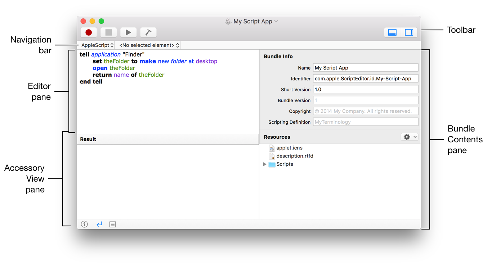
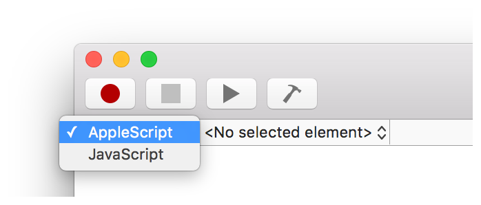
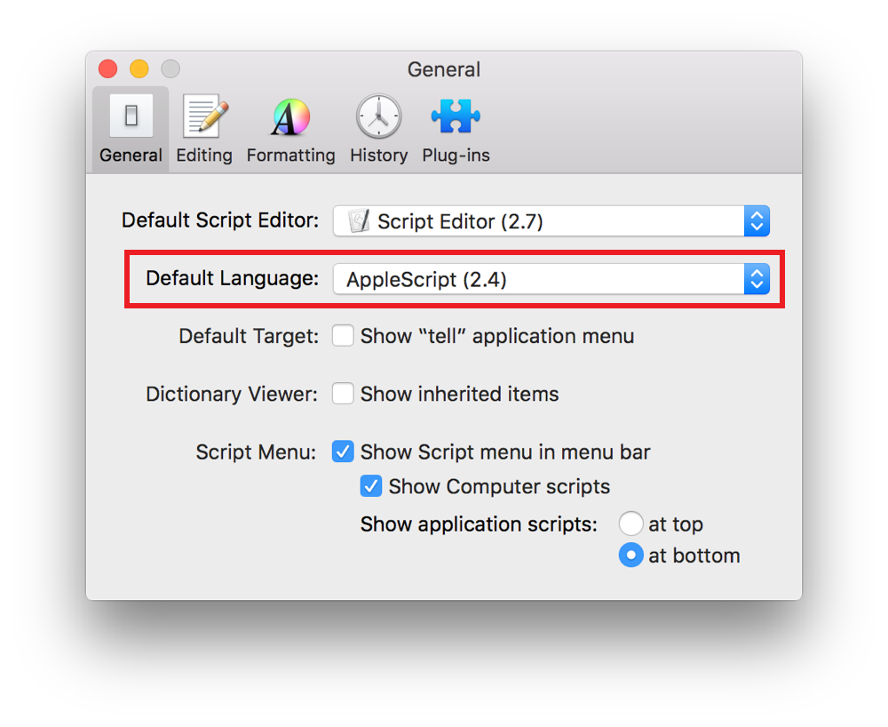
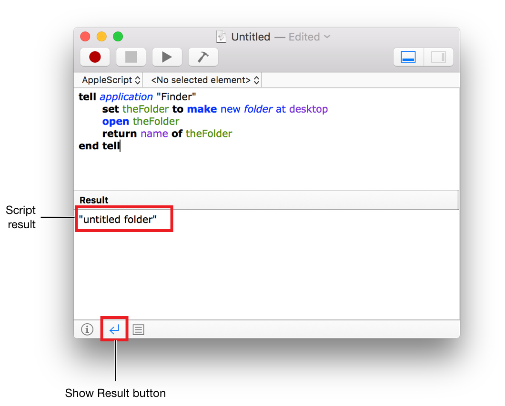
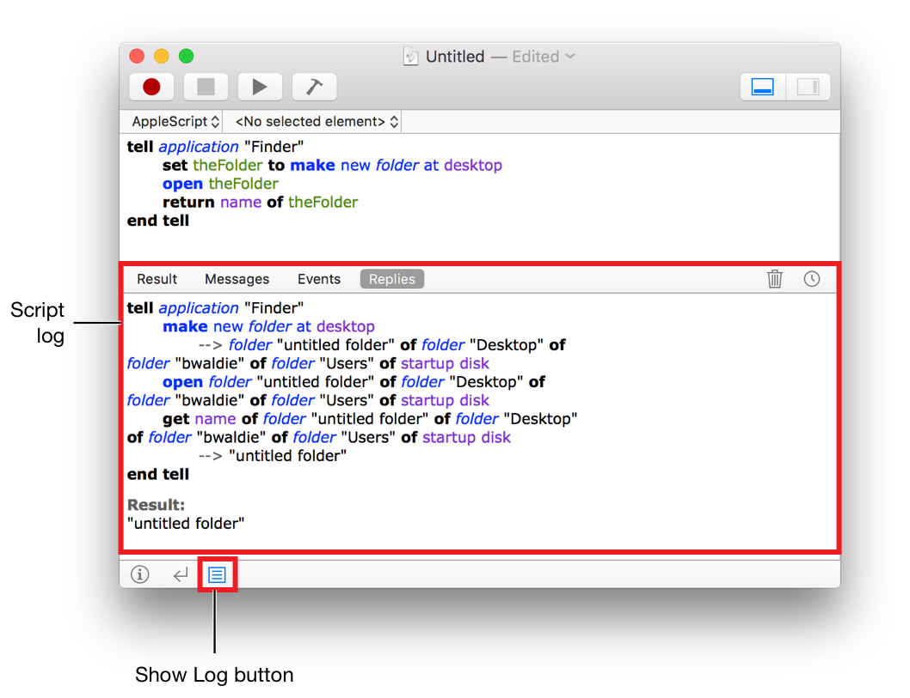
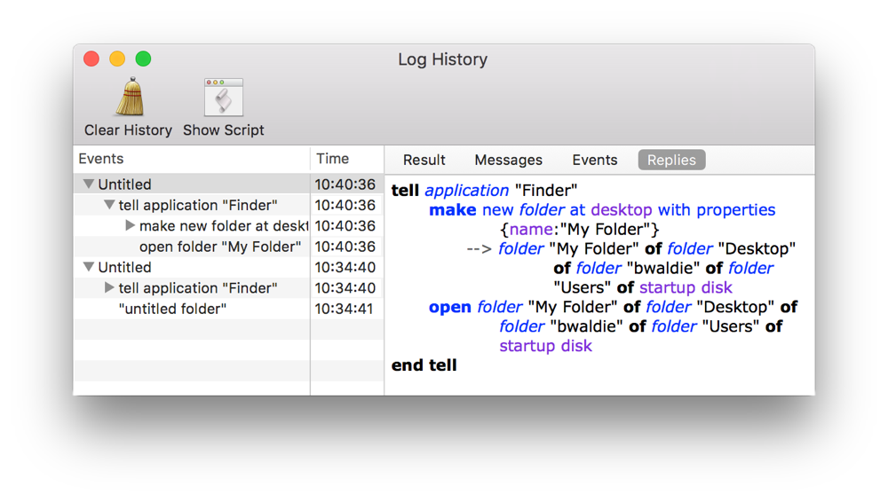

> 导航：[总目录](../../README.md) · [documentation](../../_indexes/documentation.md) · [Mac Automation Scripting Guide](index.md)

## Getting to Know Script Editor

Script Editor, found in `/Applications/Utilities/`, is an app for writing AppleScripts and JavaScripts. It provides the ability to edit, compile, and run scripts, browse scripting terminology, and save scripts in a variety of formats including compiled scripts, apps, and plain text.

> [!NOTE]
> 

### Navigating Script Editor Documents

A Script Editor document window includes the following main areas, as shown in Figure 5-1:

__Figure 5-1__A Script Editor document window

- __Toolbar__—Use this to compile, run, and stop your script. Buttons are also available for showing and hiding the accessory view pane and the bundle contents pane. Select View > Customize Toolbar, or Control-click on the toolbar and choose Customize Toolbar, to choose what buttons displayed in the toolbar.

  The toolbar also includes a Record button, which converts manual mouse clicks and keystrokes into script code. However, recording is not supported in JavaScript and few apps support AppleScript recording.
- __Navigation bar__—Use this bar to select a scripting language, target an app, or navigate through the handlers in your script.

  The navigation bar currently only supports navigation of AppleScript handlers.
- __Editor pane__—Write your script code here.
- __Accessory View pane__—View and edit your script’s description here, or browse the result and events produced when your script runs.
- __Bundle Contents pane__— Edit the identifier, version, and copyright info for your script here. You can also use this pane to add, remove, or manage resources contained within the bundle. This pane is accessible only when your script is saved in script bundle or app format.

### Targeting a Scripting Language

When you create a Script Editor document, select a scripting language in the navigation bar. See Figure 5-2.

__Figure 5-2__Setting the scripting language in a Script Editor document window

If you always use the same language, set it as the default in the General pane of Script Editor preferences. See Figure 5-3.

__Figure 5-3__Setting the default scripting language for Script Editor documents

### Viewing Script Events and Results

Script Editor can display the result of executing a script, as well as a log of events sent and received during execution.

> [!NOTE]
> 

### Viewing the Script Result

The result of executing your script—if a result was produced—is found in the Accessory View pane. See Figure 5-4.

__Figure 5-4__Viewing the result of a script in Script Editor

__To view the result of your script__

Do one of the following:

- Press Command-2.
- Choose View > Show Result.
- Click the Show Result () button at the bottom of the Accessory View pane.

### Viewing the Script Log

The Accessory View pane also contains a script log. See Figure 5-5.

__Figure 5-5__Viewing the script log in Script Editor

The script log displays the following information.

- __Result__—The result of executing your script.
- __Messages__—Includes log messages generated as your script runs, as well as the script’s result.
- __Events__—Includes log messages, the script’s result, and events—commands—sent to applications.
- __Replies__—Includes log messages, the script’s result, events sent to applications, and event replies.

__To view the script log__

Do one of the following:

- Press Command-3.
- Choose View > Show Log.
- Click the Show Log () button at the bottom of the Accessory View pane.

> [!NOTE]
> 

### Viewing the Log History

The result and script log areas in the Accessory View pane reset each time you run your script. However, you can view historical logs for an opened script in the Log History window. See Figure 5-6.

__Figure 5-6__The Log History window in Script Editor

__To view the Log History window__

Do one of the following:

- Press Option-Command-L.
- Choose View > Log History.
- Click the Log History button () in the top right of the Accessory View pane.

[About this Guide](AboutthisGuide.md#apple-f4xwc4dqnrsv64tfmyxwi33df52wszbpkridimbqge3demzzfvbuqnzrfvjvomi)

[Creating a Script](CreateaScript.md#apple-f4xwc4dqnrsv64tfmyxwi33df52wszbpkridimbqge3demzzfvbuqmjsfvjvomi)
