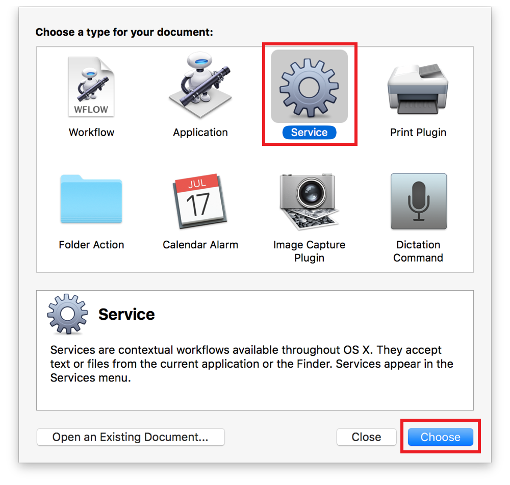
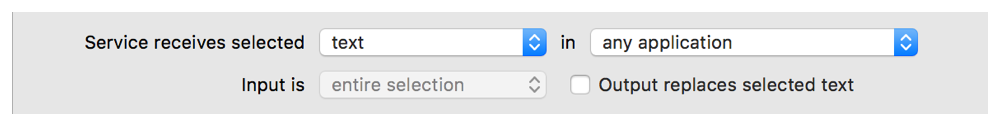
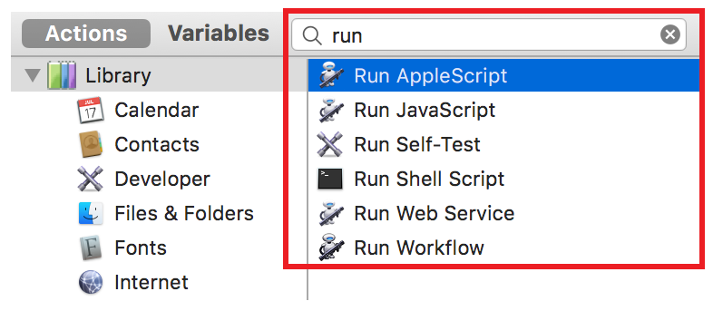
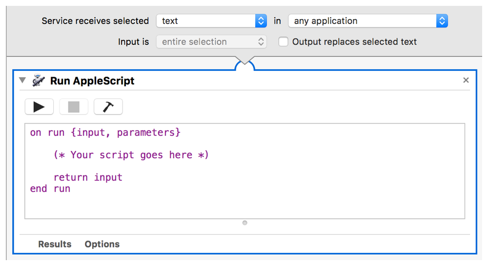
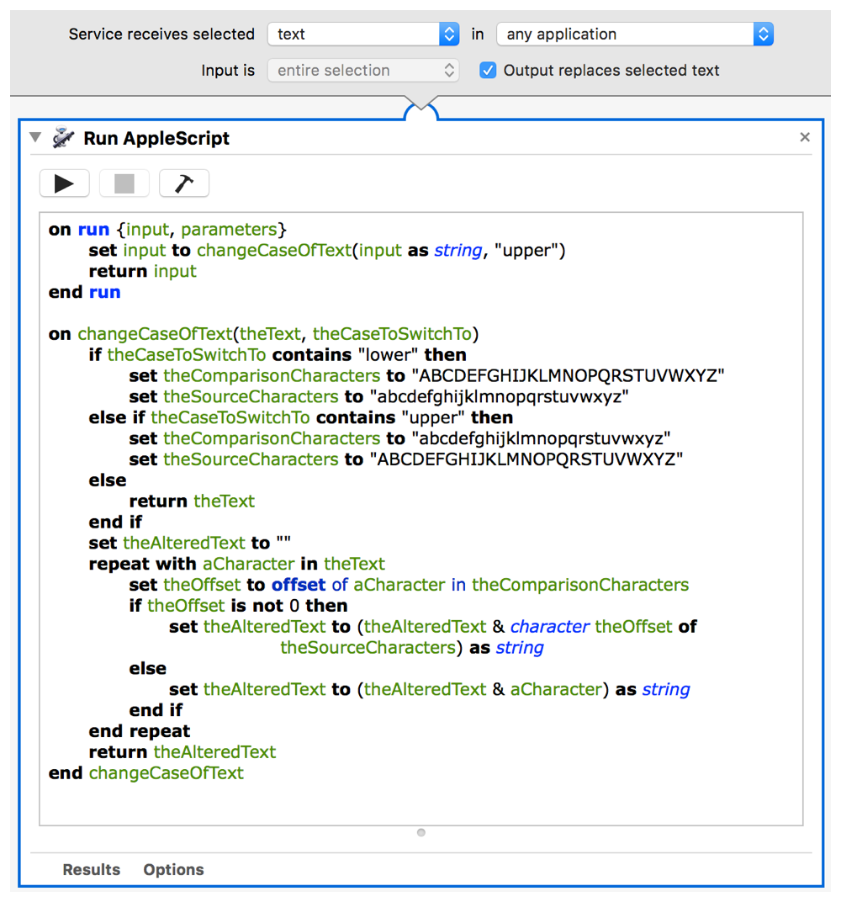
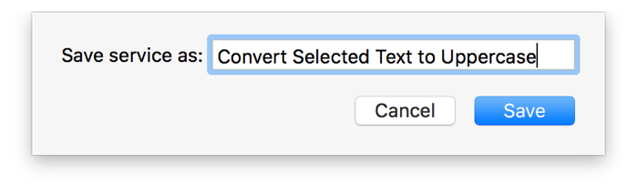

> 导航：[总目录](../../README.md) · [documentation](../../_indexes/documentation.md) · [Mac Automation Scripting Guide](index.md)

## Making a Systemwide Service

In OS X, _services_ let you access functionality in one app from within another app. An app that provides a service advertises the operations it can perform on a particular type of data. Services are triggered from the Application Name > Services menu, or from contextual menus that appear when you Control-click on text, files, and other kinds of data. When you’re manipulating a particular type of data, related services becomes available. For example, Mail provides a service that creates a new email from selected text.

### Making a Script Available as a Service

A script can be made available as a service by embedding it in an Automator service workflow.

__To create a service workflow that runs a script__

1. Launch Automator, found in `/Applications/`.
2. Create a new Automator document.
3. When prompted, choose a document type of Service and click Choose.

   
4. At the top of the Automator document, configure the service.

   

   If the service will process a specific type of data, such as text, files, or images, select the appropriate type. Otherwise, select “no input.”

   If the service will be available within the context of a specific app only, select the appropriate app. Otherwise, select “any application.”

   If the service will replace selected text with processed text, select the “Output replaces selected text” checkbox.
5. Type `run` in the search field above the action library pane to filter the action library.

   A list of actions for running AppleScripts, JavaScripts, UNIX shell scripts, and more are displayed.

   
6. Drag an action, such as Run AppleScript or Run JavaScript, to the workflow area.

   An interface for the action appears.

   
7. Write the script code and add it to the action. If the action contains additional configuration options, adjust them as needed.

   For AppleScripts and JavaScripts, use the action’s run handler template to process input data when the service runs, such as text or files. For workflows that replace selected text with processed text, be sure your workflow results in a text value. See [Example Service Workflow Scripts](#apple-f4xwc4dqnrsv64tfmyxwi33df52wszbpkridimbqge3demzzfvbuqnbwfvjvomjs).

   
8. Save the Automator document.

   When prompted, enter a name for the service.

   

### Example Service Workflow Scripts

Listing 40-1 and Listing 40-2 provide example code that can be pasted into the Run AppleScript and Run JavaScript Automator actions to convert selected text to uppercase.

__APPLESCRIPT__

[Open in Script Editor](applescript://com.apple.scripteditor?action=new&name=Convert%20Text%20to%20Uppercase&script=on%20run%20%7Binput%2C%20parameters%7D%0D%20%20%20%20set%20input%20to%20changeCaseOfText%28input%20as%20string%2C%20%22upper%22%29%0D%20%20%20%20return%20input%0Dend%20run%0D%0Don%20changeCaseOfText%28theText%2C%20theCaseToSwitchTo%29%0D%20%20%20%20if%20theCaseToSwitchTo%20contains%20%22lower%22%20then%0D%20%20%20%20%20%20%20%20set%20theComparisonCharacters%20to%20%22ABCDEFGHIJKLMNOPQRSTUVWXYZ%22%0D%20%20%20%20%20%20%20%20set%20theSourceCharacters%20to%20%22abcdefghijklmnopqrstuvwxyz%22%0D%20%20%20%20else%20if%20theCaseToSwitchTo%20contains%20%22upper%22%20then%0D%20%20%20%20%20%20%20%20set%20theComparisonCharacters%20to%20%22abcdefghijklmnopqrstuvwxyz%22%0D%20%20%20%20%20%20%20%20set%20theSourceCharacters%20to%20%22ABCDEFGHIJKLMNOPQRSTUVWXYZ%22%0D%20%20%20%20else%0D%20%20%20%20%20%20%20%20return%20theText%0D%20%20%20%20end%20if%0D%20%20%20%20set%20theAlteredText%20to%20%22%22%0D%20%20%20%20repeat%20with%20aCharacter%20in%20theText%0D%20%20%20%20%20%20%20%20set%20theOffset%20to%20offset%20of%20aCharacter%20in%20theComparisonCharacters%0D%20%20%20%20%20%20%20%20if%20theOffset%20is%20not%200%20then%0D%20%20%20%20%20%20%20%20%20%20%20%20set%20theAlteredText%20to%20%28theAlteredText%20%26%20character%20theOffset%20of%20theSourceCharacters%29%20as%20string%0D%20%20%20%20%20%20%20%20else%0D%20%20%20%20%20%20%20%20%20%20%20%20set%20theAlteredText%20to%20%28theAlteredText%20%26%20aCharacter%29%20as%20string%0D%20%20%20%20%20%20%20%20end%20if%0D%20%20%20%20end%20repeat%0D%20%20%20%20return%20theAlteredText%0Dend%20changeCaseOfText%0D)

__Listing 40-1__AppleScript: Example of an Automator service script that converts selected text to uppercase

1. `on run {input, parameters}`
2. `set input to changeCaseOfText(input as string, "upper")`
3. `return input`
4. `end run`
6. `on changeCaseOfText(theText, theCaseToSwitchTo)`
7. `if theCaseToSwitchTo contains "lower" then`
8. `set theComparisonCharacters to "ABCDEFGHIJKLMNOPQRSTUVWXYZ"`
9. `set theSourceCharacters to "abcdefghijklmnopqrstuvwxyz"`
10. `else if theCaseToSwitchTo contains "upper" then`
11. `set theComparisonCharacters to "abcdefghijklmnopqrstuvwxyz"`
12. `set theSourceCharacters to "ABCDEFGHIJKLMNOPQRSTUVWXYZ"`
13. `else`
14. `return theText`
15. `end if`
16. `set theAlteredText to ""`
17. `repeat with aCharacter in theText`
18. `set theOffset to offset of aCharacter in theComparisonCharacters`
19. `if theOffset is not 0 then`
20. `set theAlteredText to (theAlteredText & character theOffset of theSourceCharacters) as string`
21. `else`
22. `set theAlteredText to (theAlteredText & aCharacter) as string`
23. `end if`
24. `end repeat`
25. `return theAlteredText`
26. `end changeCaseOfText`

__JAVASCRIPT__

[Open in Script Editor](applescript://com.apple.scripteditor?action=new&name=Convert%20Text%20to%20Uppercase&script=function%20run%28input%2C%20parameters%29%20%7B%0A%20%20%20%20var%20selectedText%20%3D%20input%5B0%5D%0A%20%20%20%20return%20selectedText.toUpperCase%28%29%0A%7D)

__Listing 40-2__JavaScript: Example of an Automator service script that converts selected text to uppercase

1. `function run(input, parameters) {`
2. `var selectedText = input[0]`
3. `return selectedText.toUpperCase()`
4. `}`

### Triggering Service Workflows

Saved Automator service workflows automatically appear in services menus throughout the system at the appropriate time. For example, text processing workflows become available when you select text in an app. To run a service, select Application Name > Services > Service Workflow Name from the menu bar, or select Services > Service Workflow Name from a contextual menu.

[Calling Command-Line Tools](CallCommandLineUtilities.md#apple-f4xwc4dqnrsv64tfmyxwi33df52wszbpkridimbqge3demzzfvbuqnbtfvjvomi)

[Using the Systemwide Script Menu](UsetheSystem-WideScriptMenu.md#apple-f4xwc4dqnrsv64tfmyxwi33df52wszbpkridimbqge3demzzfvbuqnznknltc)
