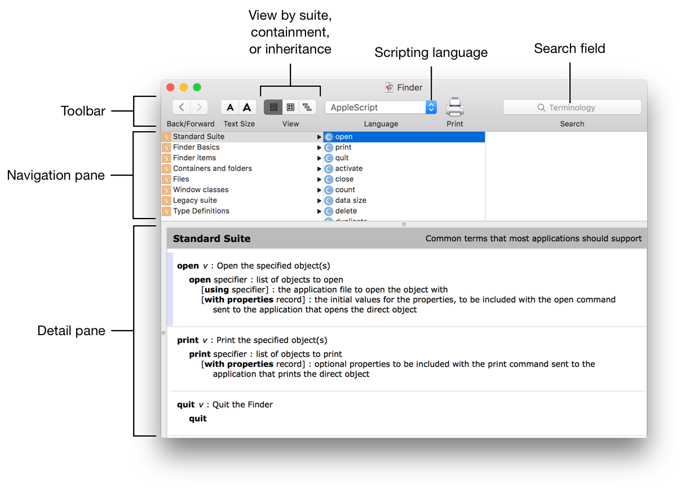
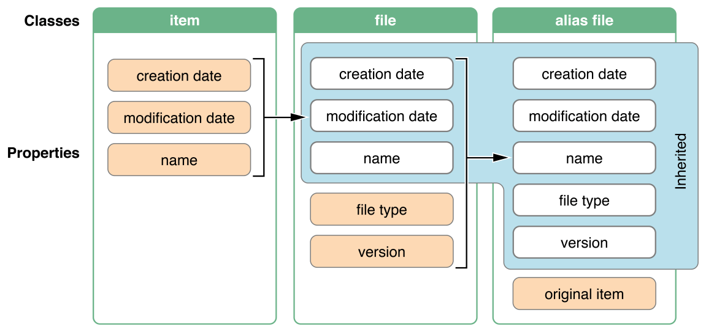
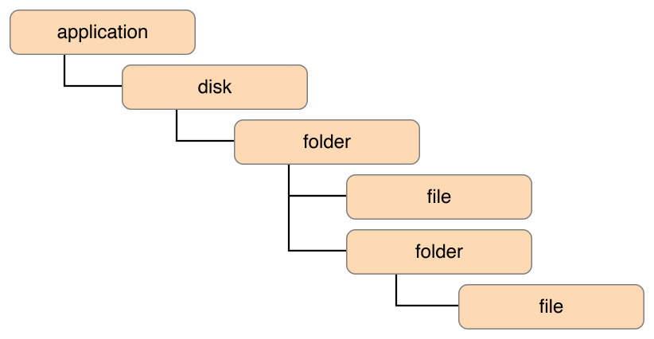
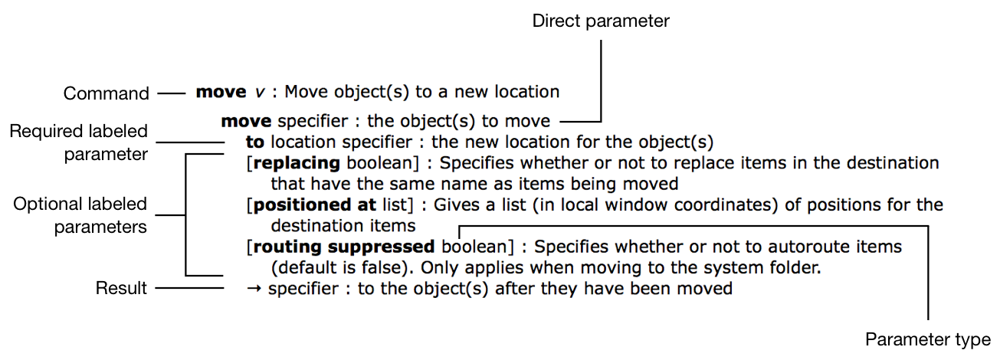
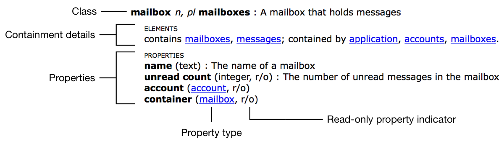
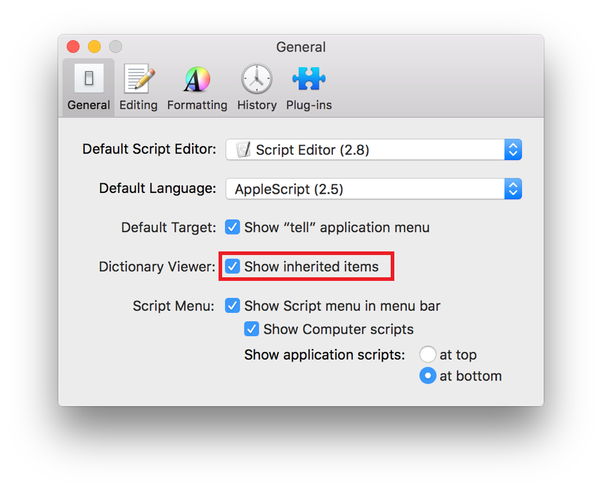

> 导航：[总目录](../../README.md) · [documentation](../../_indexes/documentation.md) · [Mac Automation Scripting Guide](index.md)

## Navigating a Scripting Dictionary

A scripting dictionary window in Script Editor contains three primary areas. See Figure 12-1.

__Figure 12-1__Primary elements of a scripting dictionary window in Script Editor

- __Toolbar.__ Options for toggling between terminology views, setting the scripting language, entering search terms, and more.
- __Navigation pane.__ Columns of scripting terminology.
- __Detail pane.__ Definitions for any terminology selected in the navigation pane.

### Types of Terminology

The navigation pane of a dictionary includes the types of terms described in Table 12-1.

__Table 12-1__Types of scripting terminology

| Type | Icon | Description |
| --- | --- | --- |
| Suite | image: ../Art/osa_suite_2x.png | A _suite_ is a grouping of related commands and classes. Apps often have a Standard Suite, which includes terminology supported by most scriptable apps, such as an `open` command, a `quit` command, and an `application` class. |
| Command | image: ../Art/osa_command_2x.png | A _command_ is an instruction that can be sent to an app or object in order to initiate some action. For example, `delete`, `make`, `print` are commands that are found in many scriptable apps. Many commands have _parameters_ that specify the target object and control the behavior of the command. |
| Class | image: ../Art/osa_class_2x.png    image: ../Art/osa_element_2x.png | A _class_ is an object within an app, or an app itself. Mail, for example, has an `application` class, a `message` class, and a `signature` class, among others. Objects within an app sometimes contain other objects as _elements_. For example, in Mail, a `mailbox` objects can contain `message` objects as elements. |
| Property | image: ../Art/osa_property_2x.png | A _property_ is an attribute of a class. For example, the `message` class in Mail has many properties, including `date received`, `read status`, and `subject`. Some properties are read-only, while others are readable and writable. |

### Key Concepts

It’s important to understand the concepts of _inheritance_ and _containment_ when navigating a scripting dictionary.

### Inheritance

In a scriptable app, different classes often implement the same properties. For example, in Finder, the `file` and `folder` classes both have `creation date`, `modification date`, and `name` properties. Rather than defining these same properties multiple times throughout the scripting dictionary, Finder implements a generic `item` class. Since files and folders are considered types of Finder items, these classes inherit the properties of the `item` class. In other words, any properties of the `item` class also apply to the `file` and `folder` classes. There are many other items in Finder that also inherit these same properties, including the `disk`, `package`, and `alias file` classes.

A class that inherits the properties of other classes can also implement its own properties. In Finder, the `file` class implements a number of file-specific properties, including `file type` and `version`. The `alias file` class implements an `original item` property.

In some cases, a class inherits properties from multiple classes. In Finder, an alias is a type of file, which is a type of item. Therefore, the `alias file` class inherits the properties of both the `file` and `item` classes, as shown in Figure 12-2.

__Figure 12-2__In scripting, classes can inherit the properties of other classes

### Containment

Classes of a scriptable app reside within a certain containment hierarchy. The application is at the top level, with other classes nested beneath. Finder, for example, contains disks, folders, files, and other objects. While files don’t contain elements, folders and disks can contain other folders and files. See Figure 12-3. Mail is another example—the application contains accounts, which can contain mailboxes, which can contain other mailboxes and messages.

__Figure 12-3__In scripting, classes can contain other classes as elements

When referencing a class, you must do so very specifically according to its containment hierarchy in order to provide the scripting system with context. To reference a file in Finder, you would specify where the file resides in the folder hierarchy. See Listing 12-1 and Listing 12-2. To reference a message in Mail, you would specify where the message resides in the mailbox and account hierarchy.

__APPLESCRIPT__

[Open in Script Editor](applescript://com.apple.scripteditor?action=new&name=Reference%20a%20File%20by%20Containment%20Hierarchy%20in%20Finder&script=tell%20application%20%22Finder%22%0D%20%20%20%20modification%20date%20of%20file%20%22My%20File.txt%22%20of%20folder%20%22Documents%22%20of%20folder%20%22YourUserName%22%20of%20folder%20%22Users%22%20of%20startup%20disk%0Dend%20tell%0D--%3E%20Result%3A%20date%20%22Monday%2C%20September%2028%2C%202015%20at%2010%3A10%3A17%20AM%22%0D)

__Listing 12-1__AppleScript: Referencing a file by containment hierarchy in Finder

1. `tell application "Finder"`
2. `modification date of file "My File.txt" of folder "Documents" of folder "YourUserName" of folder "Users" of startup disk`
3. `end tell`
4. `--> Result: date "Monday, September 28, 2015 at 10:10:17 AM"`

__JAVASCRIPT__

[Open in Script Editor](applescript://com.apple.scripteditor?action=new&name=Reference%20a%20File%20by%20Containment%20Hierarchy%20in%20Finder&script=var%20Finder%20%3D%20Application%28%22Finder%22%29%0DFinder.startupDisk.folders%5B%22Users%22%5D.folders%5B%22YourUserName%22%5D.folders%5B%22Documents%22%5D.files%5B%22My%20File.txt%22%5D.modificationDate%28%29%0D%2F%2F%20Result%3A%20Mon%20Sep%2028%202015%2017%3A10%3A17%20GMT-0700%20%28PDT%29%0D)

__Listing 12-2__JavaScript: Referencing a file by containment hierarchy in Finder

1. `var Finder = Application("Finder")`
2. `Finder.startupDisk.folders["Users"].folders["YourUserName"].folders["Documents"].files["My File.txt"].modificationDate()`
3. `// Result: Mon Sep 28 2015 17:10:17 GMT-0700 (PDT)`

### Anatomy of a Command Definition

The definition of a command in a scripting dictionary is a recipe for using the command, as shown in Figure 12-4, Listing 12-3, and Listing 12-4.

__Figure 12-4__Definition for the move command in the Finder scripting dictionary

A command definition includes the following elements:

- __Command name.__ The name of the command.
- __Direct parameter.__ An object to be targeted by the command. For the `move` command in Finder, this is the object to be moved. If a command definition doesn’t specify a direct parameter, then the target object is the application. A direct parameter immediately follows the command.
- __Labeled parameters.__ Control some aspect of the command’s behavior and are required or optional. Optional parameters are surrounded by brackets. Since these parameters are identified by label, they can be placed in any order when you write your script. The command definition denotes the value type for each labeled parameter. For example, the optional `replacing` parameter for the `move` command in Finder takes a boolean value.
- __Result.__ The result of the command, if any. Often, this is a reference to a newly created or modified object. For the `move` command in Finder, it’s a reference to the moved object.

__APPLESCRIPT__

[Open in Script Editor](applescript://com.apple.scripteditor?action=new&name=Example%20Usage%20of%20the%20Move%20Command%20in%20Finder&script=tell%20application%20%22Finder%22%0D%20%20%20%20move%20folder%20someFolder%20to%20someOtherFolder%20replacing%20true%0Dend%20tell%0D)

__Listing 12-3__AppleScript: Example usage of the move command in Finder

1. `tell application "Finder"`
2. `move folder someFolder to someOtherFolder replacing true`
3. `end tell`

__JAVASCRIPT__

[Open in Script Editor](applescript://com.apple.scripteditor?action=new&name=Example%20Usage%20of%20the%20Move%20Command%20in%20Finder&script=var%20Finder%20%3D%20Application%28%22Finder%22%29%0DFinder.move%28someFolder%2C%20%7B%0D%20%20to%3A%20someOtherFolder%2C%0D%20%20replacing%3A%20true%0D%7D%29%0D)

__Listing 12-4__JavaScript: Example usage of the move command in Finder

1. `var Finder = Application("Finder")`
2. `Finder.move(someFolder, {`
3. `to: someOtherFolder,`
4. `replacing: true`
5. `})`

### Anatomy of a Class Definition

A class definition describes a class, as shown in Figure 12-5.

__Figure 12-5__Definition for the mailbox class in the Mail scripting dictionary

A class definition includes the following elements:

- __Class name.__ The name of the class.
- __Inheritance details.__ A list of other classes from which properties are inherited, if any. Each class is a hyperlink—clicking it takes you to the definition for the corresponding class.
- __Containment details.__ A list of contained classes, if any. May also list other classes containing the class, if any.
- __Properties.__ Any properties for the class, along with their data types. Read-only properties include an `r/o` indicator.

To view inherited properties, as well as containing classes in the Script Editor dictionary viewer, select Show inherited items in Preferences > General. See Figure 12-6.

__Figure 12-6__Enabling inherited item dictionary details in Script Editor

[Opening a Scripting Dictionary](OpenaScriptingDictionary.md#apple-f4xwc4dqnrsv64tfmyxwi33df52wszbpkridimbqge3demzzfvbuqnzwfvjvomi)

[Using Handlers/Functions](UseHandlersFunctions.md#apple-f4xwc4dqnrsv64tfmyxwi33df52wszbpkridimbqge3demzzfvbuqnjsfvjvomi)
