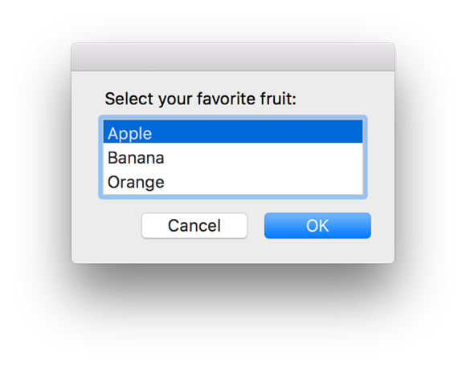

> 导航：[总目录](../../README.md) · [documentation](../../_indexes/documentation.md) · [Mac Automation Scripting Guide](index.md)

## Prompting for a Choice from a List

Use the Standard Additions scripting addition’s `choose from list` command to prompt the user to select from a list of strings. Listing 28-1 and Listing 28-2 ask the user to select a favorite fruit, as seen in Figure 28-1.

__Figure 28-1__Prompting the user to choose from a list of items

__APPLESCRIPT__

[Open in Script Editor](applescript://com.apple.scripteditor?action=new&script=set%20theFruitChoices%20to%20%7B%22Apple%22%2C%20%22Banana%22%2C%20%22Orange%22%7D%0Aset%20theFavoriteFruit%20to%20choose%20from%20list%20theFruitChoices%20with%20prompt%20%22Select%20your%20favorite%20fruit%3A%22%20default%20items%20%7B%22Apple%22%7D%0AtheFavoriteFruit)

__Listing 28-1__AppleScript: Prompting the user to choose from a list of items

1. `set theFruitChoices to {"Apple", "Banana", "Orange"}`
2. `set theFavoriteFruit to choose from list theFruitChoices with prompt "Select your favorite fruit:" default items {"Apple"}`
3. `theFavoriteFruit`
4. `--> Result: {"Apple"}`

__JAVASCRIPT__

[Open in Script Editor](applescript://com.apple.scripteditor?action=new&script=var%20app%20%3D%20Application.currentApplication%28%29%0Aapp.includeStandardAdditions%20%3D%20true%0A%0Avar%20fruitChoices%20%3D%20%5B%22Apple%22%2C%20%22Banana%22%2C%20%22Orange%22%5D%0Avar%20favoriteFruit%20%3D%20app.chooseFromList%28fruitChoices%2C%20%7B%0A%20%20%20%20withPrompt%3A%20%22Select%20your%20favorite%20fruit%3A%22%2C%0A%20%20%20%20defaultItems%3A%20%5B%22Apple%22%5D%0A%7D%29%0AfavoriteFruit)

__Listing 28-2__JavaScript: Prompting the user to choose from a list of items

1. `var app = Application.currentApplication()`
2. `app.includeStandardAdditions = true`
4. `var fruitChoices = ["Apple", "Banana", "Orange"]`
5. `var favoriteFruit = app.chooseFromList(fruitChoices, {`
6. `withPrompt: "Select your favorite fruit:",`
7. `defaultItems: ["Apple"]`
8. `})`
9. `favoriteFruit`
10. `// Result: ["Apple"]`

The `choose from list` command can optionally let the user choose multiple items by setting the `multiple selections allowed` parameter to `true`. For this reason, the result of the command is always a list of selected strings. This list may be empty if the `empty selection allowed` parameter has been specified and the user dismissed the dialog without making a selection.

[Prompting for a File Name](PromptforaFileName.md#apple-f4xwc4dqnrsv64tfmyxwi33df52wszbpkridimbqge3demzzfvbuqobsfvjvomi)

[Prompting for a Color](PromptforaColor.md#apple-f4xwc4dqnrsv64tfmyxwi33df52wszbpkridimbqge3demzzfvbuqobwfvjvomi)
