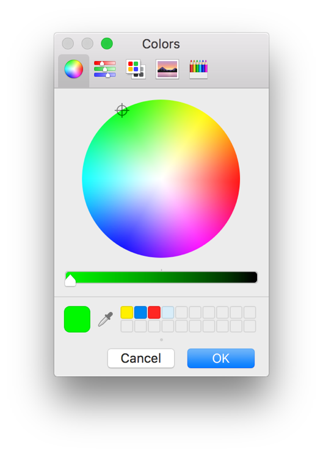

> 导航：[总目录](../../README.md) · [documentation](../../_indexes/documentation.md) · [Mac Automation Scripting Guide](index.md)

## Prompting for a Color

Use the Standard Additions scripting addition’s `choose color` command to ask the user to select a color from a color picker dialog like the one shown in Figure 29-1. The command accepts an optional `default color` parameter, and produces an RGB color value as its result. Listing 29-1 and Listing 29-2 display a color picker, create a TextEdit document containing some text, and apply the chosen color to the text.

__Figure 29-1__A color picker dialog

__APPLESCRIPT__

[Open in Script Editor](applescript://com.apple.scripteditor?action=new&script=set%20theColor%20to%20choose%20color%20default%20color%20%7B0%2C%2065535%2C%200%7D%0A--%3E%20Result%3A%20%7B256%2C%2040421%2C%20398%7D%0A%0Atell%20application%20%22TextEdit%22%0A%20%20%20%20set%20theDocument%20to%20make%20new%20document%0A%20%20%20%20set%20text%20of%20document%201%20to%20%22Colored%20Text%22%0A%20%20%20%20set%20color%20of%20text%20of%20document%201%20to%20theColor%0Aend%20tell)

__Listing 29-1__AppleScript: Adding colored text to a new TextEdit document

1. `set theColor to choose color default color {0, 65535, 0}`
2. `--> Result: {256, 40421, 398}`
4. `tell application "TextEdit"`
5. `set theDocument to make new document`
6. `set text of document 1 to "Colored Text"`
7. `set color of text of document 1 to theColor`
8. `end tell`

__JAVASCRIPT__

[Open in Script Editor](applescript://com.apple.scripteditor?action=new&script=var%20app%20%3D%20Application.currentApplication%28%29%0Aapp.includeStandardAdditions%20%3D%20true%0A%0Avar%20color%20%3D%20app.chooseColor%28%7BdefaultColor%3A%20%5B0%2C%201%2C%200%5D%7D%29%0A%2F%2F%20Result%3A%20%5B0.003753719385713339%2C%200.7206835746765137%2C%200.005828946363180876%5D%0A%0Acolor%20%3D%20%5BMath.trunc%28color%5B0%5D%20*%2065535%29%2C%20Math.trunc%28color%5B1%5D%20*%2065535%29%2C%20Math.trunc%28color%5B2%5D%20*%2065535%29%5D%0A%0Avar%20textedit%20%3D%20Application%28%22TextEdit%22%29%0Avar%20document%20%3D%20textedit.make%28%7Bnew%3A%20%22document%22%7D%29%0Adocument.text%20%3D%20%22Colored%20Text%22%0Adocument.text.color%20%3D%20%5B256%2C%2040421%2C%20398%5D)

__Listing 29-2__JavaScript: Adding colored text to a new TextEdit document

1. `var app = Application.currentApplication()`
2. `app.includeStandardAdditions = true`
4. `var color = app.chooseColor({defaultColor: [0, 1, 0]})`
5. `// Result: [0.003753719385713339, 0.7206835746765137, 0.005828946363180876]`
7. `color = [Math.trunc(color[0] * 65535), Math.trunc(color[1] * 65535), Math.trunc(color[2] * 65535)]`
9. `var textedit = Application("TextEdit")`
10. `var document = textedit.make({new: "document"})`
11. `document.text = "Colored Text"`
12. `document.text.color = [256, 40421, 398]`

> [!NOTE]
> 

[Prompting for a Choice from a List](PromptforaChoicefromaList.md#apple-f4xwc4dqnrsv64tfmyxwi33df52wszbpkridimbqge3demzzfvbuqobtfvjvomi)

[Displaying Progress](DisplayProgress.md#apple-f4xwc4dqnrsv64tfmyxwi33df52wszbpkridimbqge3demzzfvbuqmzxfvjvomi)
