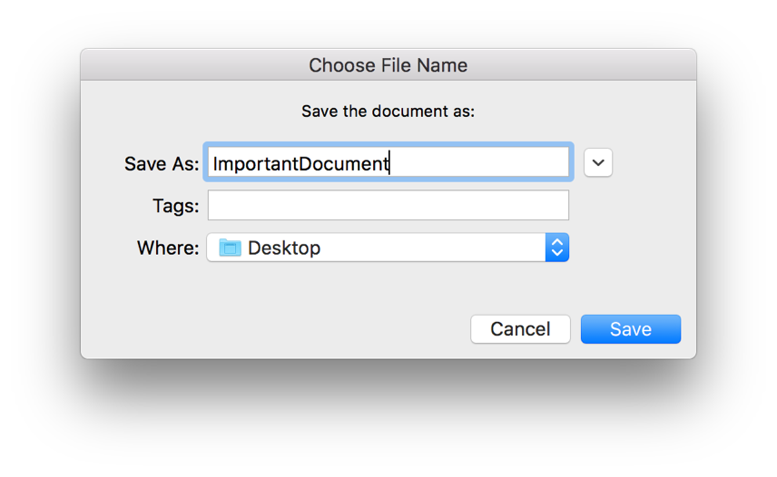
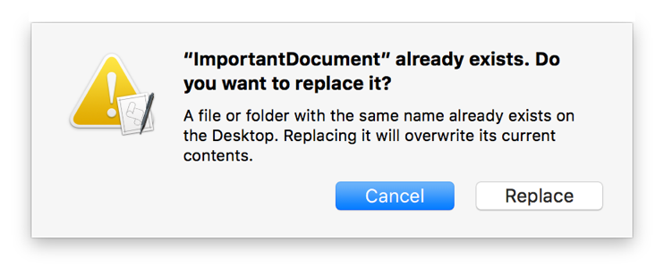

> 导航：[总目录](../../README.md) · [documentation](../../_indexes/documentation.md) · [Mac Automation Scripting Guide](index.md)

## Prompting for a File Name

Use the Standard Additions scripting addition’s `choose file name` command to display a save dialog that lets the user enter a file name and choose an output folder, such as the one produced by Listing 27-1 and Listing 27-2, shown in Figure 27-1.

__Figure 27-1__Prompting for a file name

__APPLESCRIPT__

[Open in Script Editor](applescript://com.apple.scripteditor?action=new&script=set%20theNewFilePath%20to%20choose%20file%20name%20with%20prompt%20%22Save%20the%20document%20as%3A%22)

__Listing 27-1__AppleScript: Prompting for a file name

1. `set theNewFilePath to choose file name with prompt "Save the document as:"`
2. `--> Result: file "Macintosh HD:Users:yourUserName:Desktop:ImportantDocument"`

__JAVASCRIPT__

[Open in Script Editor](applescript://com.apple.scripteditor?action=new&script=var%20app%20%3D%20Application.currentApplication%28%29%0Aapp.includeStandardAdditions%20%3D%20true%0A%0Avar%20newFilePath%20%3D%20app.chooseFileName%28%7B%0A%20%20%20%20withPrompt%3A%20%22Save%20the%20document%20as%3A%22%0A%7D%29%0AnewFilePath)

__Listing 27-2__JavaScript: Prompting for a file name

1. `var app = Application.currentApplication()`
2. `app.includeStandardAdditions = true`
4. `var newFilePath = app.chooseFileName({`
5. `withPrompt: "Save the document as:"`
6. `})`
7. `newFilePath`
8. `// Result: Path("/Users/yourUserName/Desktop/ImportantDocument")`

If the specified file name already exists in the output folder when the user clicks the Save button, the user is prompted to replace it, as shown in Figure 27-2.

__Figure 27-2__Prompting to replace an existing file

The result of the `choose file name` command is a path to a potential file. This file may or may not already exist. However, if it does exist, you can assume the user wants to replace it. Your script can now safely write or save a file to the path.

Listing 27-3 and Listing 27-4 ask the user to type some text as a note and choose an file name and output folder, and then save the note in the specified file.

__APPLESCRIPT__

[Open in Script Editor](applescript://com.apple.scripteditor?action=new&script=set%20theResponse%20to%20display%20dialog%20%22Enter%20a%20note%3A%22%20default%20answer%20%22%22%0Aset%20theNote%20to%20text%20returned%20of%20theResponse%0A%0Aset%20theNewFilePath%20to%20choose%20file%20name%20with%20prompt%20%22Save%20the%20document%20as%3A%22%0A%0AwriteTextToFile%28theNote%2C%20theNewFilePath%2C%20true%29%0A%0Aon%20writeTextToFile%28theText%2C%20theFile%2C%20overwriteExistingContent%29%0A%20%20%20%20try%0A%0A%20%20%20%20%20%20%20%20--%20Convert%20file%20to%20a%20string%0A%20%20%20%20%20%20%20%20set%20theFile%20to%20theFile%20as%20string%0A%0A%20%20%20%20%20%20%20%20--%20Open%20file%20for%20writing%0A%20%20%20%20%20%20%20%20set%20theOpenedFile%20to%20open%20for%20access%20file%20theFile%20with%20write%20permission%0A%0A%20%20%20%20%20%20%20%20--%20Clear%20file%20if%20content%20should%20be%20overwritten%0A%20%20%20%20%20%20%20%20if%20overwriteExistingContent%20is%20true%20then%20set%20eof%20of%20theOpenedFile%20to%200%0A%0A%20%20%20%20%20%20%20%20--%20Write%20new%20content%20to%20file%0A%20%20%20%20%20%20%20%20write%20theText%20to%20theOpenedFile%20starting%20at%20eof%0A%0A%20%20%20%20%20%20%20%20--%20Close%20file%0A%20%20%20%20%20%20%20%20close%20access%20theOpenedFile%0A%0A%20%20%20%20%20%20%20%20--%20Return%20a%20boolean%20indicating%20that%20writing%20was%20successful%0A%20%20%20%20%20%20%20%20return%20true%0A%0A%20%20%20%20%20%20%20%20--%20Handle%20a%20write%20error%0A%20%20%20%20on%20error%0A%0A%20%20%20%20%20%20%20%20--%20Close%20file%0A%20%20%20%20%20%20%20%20try%0A%20%20%20%20%20%20%20%20%20%20%20%20close%20access%20file%20theFile%0A%20%20%20%20%20%20%20%20end%20try%0A%0A%20%20%20%20%20%20%20%20--%20Return%20a%20boolean%20indicating%20that%20writing%20failed%0A%20%20%20%20%20%20%20%20return%20false%0A%20%20%20%20end%20try%0Aend%20writeTextToFile%0A)

__Listing 27-3__AppleScript: Saving content in a specified file

1. `set theResponse to display dialog "Enter a note:" default answer ""`
2. `set theNote to text returned of theResponse`
4. `set theNewFilePath to choose file name with prompt "Save the document as:"`
6. `writeTextToFile(theNote, theNewFilePath, true)`
8. `on writeTextToFile(theText, theFile, overwriteExistingContent)`
9. `try`
11. `-- Convert file to a string`
12. `set theFile to theFile as string`
14. `-- Open file for writing`
15. `set theOpenedFile to open for access file theFile with write permission`
17. `-- Clear file if content should be overwritten`
18. `if overwriteExistingContent is true then set eof of theOpenedFile to 0`
20. `-- Write new content to file`
21. `write theText to theOpenedFile starting at eof`
23. `-- Close file`
24. `close access theOpenedFile`
26. `-- Return a boolean indicating that writing was successful`
27. `return true`
29. `-- Handle a write error`
30. `on error`
32. `-- Close file`
33. `try`
34. `close access file theFile`
35. `end try`
37. `-- Return a boolean indicating that writing failed`
38. `return false`
39. `end try`
40. `end writeTextToFile`

__JAVASCRIPT__

[Open in Script Editor](applescript://com.apple.scripteditor?action=new&script=var%20app%20%3D%20Application.currentApplication%28%29%0Aapp.includeStandardAdditions%20%3D%20true%0A%0Avar%20response%20%3D%20app.displayDialog%28%22Enter%20a%20note%3A%22%2C%20%7B%0A%20%20%20%20defaultAnswer%3A%20%22%22%0A%7D%29%0Avar%20note%20%3D%20response.textReturned%0A%0Avar%20newFilePath%20%3D%20app.chooseFileName%28%7B%0A%20%20%20%20withPrompt%3A%20%22Save%20document%20as%3A%22%0A%7D%29%0AwriteTextToFile%28note%2C%20newFilePath%2C%20true%29%0A%0Afunction%20writeTextToFile%28text%2C%20file%2C%20overwriteExistingContent%29%20%7B%0A%20%20%20%20try%20%7B%0A%0A%20%20%20%20%20%20%20%20%2F%2F%20Convert%20file%20to%20a%20string%0A%20%20%20%20%20%20%20%20var%20fileString%20%3D%20file.toString%28%29%0A%0A%20%20%20%20%20%20%20%20%2F%2F%20Open%20file%20for%20writing%0A%20%20%20%20%20%20%20%20var%20openedFile%20%3D%20app.openForAccess%28Path%28fileString%29%2C%20%7B%20writePermission%3A%20true%20%7D%29%0A%0A%20%20%20%20%20%20%20%20%2F%2F%20Clear%20file%20if%20content%20should%20be%20overwritten%0A%20%20%20%20%20%20%20%20if%20%28overwriteExistingContent%29%20%7B%0A%20%20%20%20%20%20%20%20%20%20%20%20app.setEof%28openedFile%2C%20%7B%20to%3A%200%20%7D%29%0A%20%20%20%20%20%20%20%20%7D%0A%0A%20%20%20%20%20%20%20%20%2F%2F%20Write%20new%20content%20to%20file%0A%20%20%20%20%20%20%20%20app.write%28text%2C%20%7B%20to%3A%20openedFile%2C%20startingAt%3A%20app.getEof%28openedFile%29%20%7D%29%0A%0A%20%20%20%20%20%20%20%20%2F%2F%20Close%20file%0A%20%20%20%20%20%20%20%20app.closeAccess%28openedFile%29%0A%0A%20%20%20%20%20%20%20%20%2F%2F%20Return%20a%20boolean%20indicating%20that%20writing%20was%20successful%0A%20%20%20%20%20%20%20%20return%20true%0A%20%20%20%20%7D%0A%20%20%20%20catch%20%28error%29%20%7B%0A%0A%20%20%20%20%20%20%20%20try%20%7B%0A%20%20%20%20%20%20%20%20%20%20%20%20%2F%2F%20Close%20file%0A%20%20%20%20%20%20%20%20%20%20%20%20app.closeAccess%28file%29%0A%20%20%20%20%20%20%20%20%7D%0A%20%20%20%20%20%20%20%20catch%28error%29%20%7B%0A%20%20%20%20%20%20%20%20%20%20%20%20%2F%2F%20Report%20error%20is%20closing%20failed%0A%20%20%20%20%20%20%20%20%20%20%20%20console.log%28%60Couldn%27t%20close%20file%3A%20%24%7Berror%7D%60%29%0A%20%20%20%20%20%20%20%20%7D%0A%0A%20%20%20%20%20%20%20%20%2F%2F%20Return%20a%20boolean%20indicating%20that%20writing%20was%20successful%0A%20%20%20%20%20%20%20%20return%20false%0A%20%20%20%20%7D%0A%7D)

__Listing 27-4__JavaScript: Saving content in a specified file

1. `var app = Application.currentApplication()`
2. `app.includeStandardAdditions = true`
4. `var response = app.displayDialog("Enter a note:", {`
5. `defaultAnswer: ""`
6. `})`
7. `var note = response.textReturned`
9. `var newFilePath = app.chooseFileName({`
10. `withPrompt: "Save document as:"`
11. `})`
12. `writeTextToFile(note, newFilePath, true)`
14. `function writeTextToFile(text, file, overwriteExistingContent) {`
15. `try {`
17. `// Convert file to a string`
18. `var fileString = file.toString()`
20. `// Open file for writing`
21. `var openedFile = app.openForAccess(Path(fileString), { writePermission: true })`
23. `// Clear file if content should be overwritten`
24. `if (overwriteExistingContent) {`
25. `app.setEof(openedFile, { to: 0 })`
26. `}`
28. `// Write new content to file`
29. `app.write(text, { to: openedFile, startingAt: app.getEof(openedFile) })`
31. `// Close file`
32. `app.closeAccess(openedFile)`
34. `// Return a boolean indicating that writing was successful`
35. `return true`
36. `}`
37. `catch (error) {`
39. `try {`
40. `// Close file`
41. `app.closeAccess(file)`
42. `}`
43. `catch(error) {`
44. `// Report error is closing failed`
45. `` console.log(`Couldn't close file: ${error}`) ``
46. `}`
48. `// Return a boolean indicating that writing was successful`
49. `return false`
50. `}`
51. `}`

[Prompting for Files or Folders](PromptforaFileorFolder.md#apple-f4xwc4dqnrsv64tfmyxwi33df52wszbpkridimbqge3demzzfvbuqobrfvjvomi)

[Prompting for a Choice from a List](PromptforaChoicefromaList.md#apple-f4xwc4dqnrsv64tfmyxwi33df52wszbpkridimbqge3demzzfvbuqobtfvjvomi)
