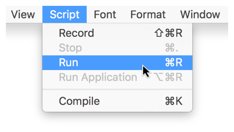

> 导航：[总目录](../../README.md) · [documentation](../../_indexes/documentation.md) · [Mac Automation Scripting Guide](index.md)

## Running a Script

Scripts can be opened and run in Script Editor and script applications can be run outside of Script Editor like any other OS X application. Some apps and tools, such as Automator and the systemwide script menu, can also run scripts.

### Running a Script in Script Editor

To run a script in Script Editor, click the Run button () in the toolbar, press Command-R, or choose Script > Run, as shown in Figure 8-1.

__Figure 8-1__Running a script in Script Editor

As the script runs, the Accessory View pane shows events and results of the script. This information can be useful for troubleshooting. See [Viewing Script Events and Results](GettoKnowScriptEditor.md#apple-f4xwc4dqnrsv64tfmyxwi33df52wszbpkridimbqge3demzzfvbuqnjnknltm).

### Running a Script Application

To run a script application, double-click the script in the Finder, just like you would do to launch any other application. The script opens and begins running.

> [!NOTE]
> 

[Saving a Script](SaveaScript.md#apple-f4xwc4dqnrsv64tfmyxwi33df52wszbpkridimbqge3demzzfvbuqmjtfvjvomi)

[Configuring Scripting Preferences](ConfigureScriptingPreferences.md#apple-f4xwc4dqnrsv64tfmyxwi33df52wszbpkridimbqge3demzzfvbuqnzqfvjvomi)
