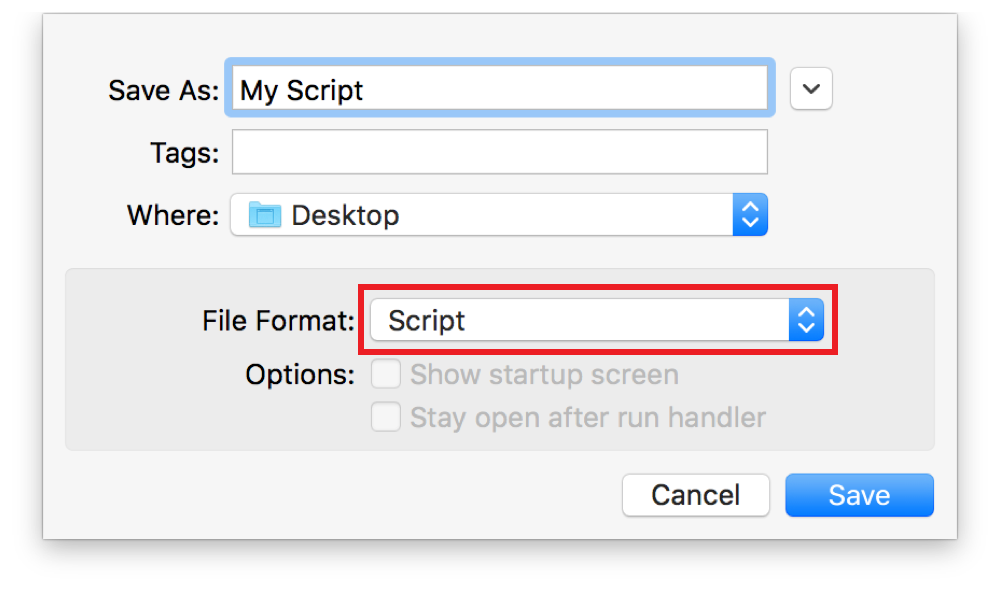
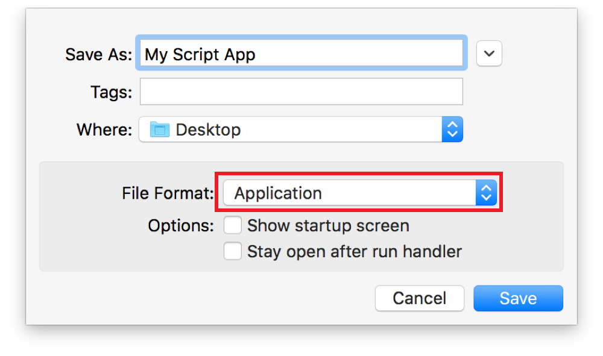
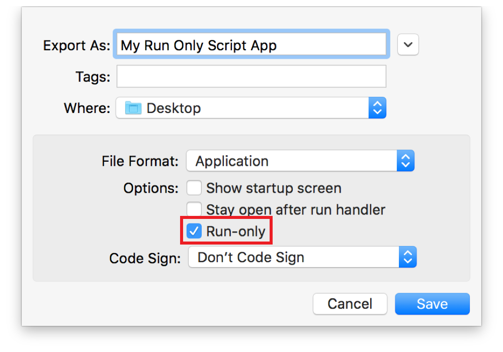
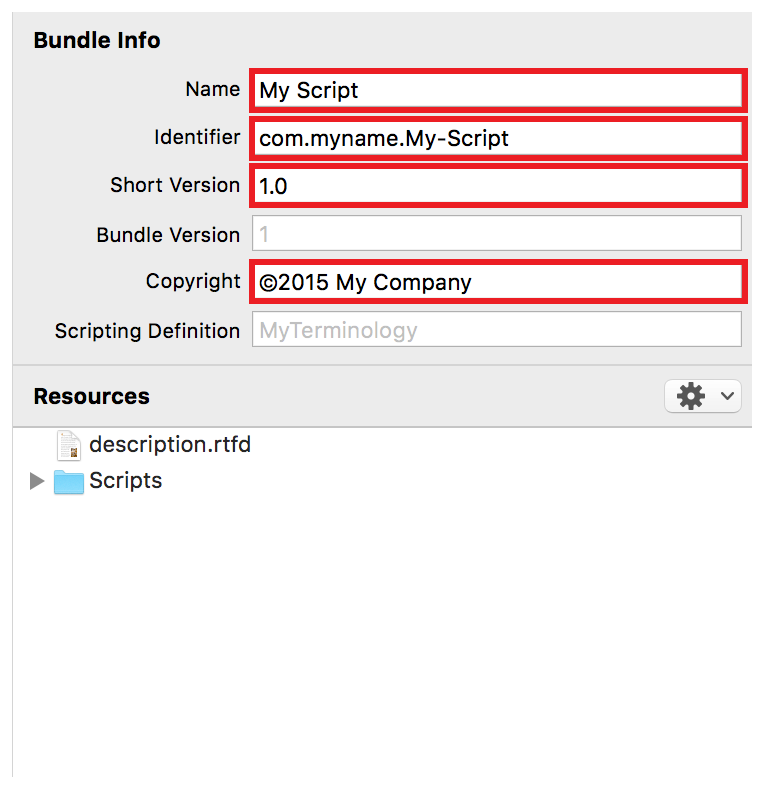
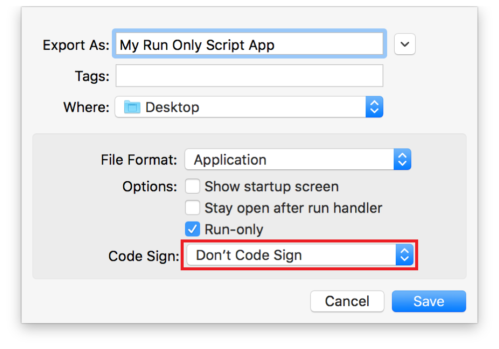

> 导航：[总目录](../../README.md) · [documentation](../../_indexes/documentation.md) · [Mac Automation Scripting Guide](index.md)

## Saving a Script

After you write a script, you can save it for future reference or to be run outside of Script Editor.

### Saving a Script or Script Bundle

Scripts and script bundles open in Script Editor when double-clicked in the Finder.

__To save a script or script bundle__

1. Choose File > Save (or press Command-S) to display the save dialog.
2. Type a name for the script and choose an output folder.
3. Choose Script or Script Bundle from the File Format popup menu.

   
4. Click Save.

### Saving a Script Application

Script applications, known as applets, work like other apps on your Mac. Double-click an applet to run it.

__To save an applet__

1. Choose File > Save (or press Command-S) to display the save dialog.
2. Type a name for the applet and choose an output folder.
3. Choose Application from the File Format popup menu.

   
4. If you want the script’s description—defined in the Accessory View pane—to display when the applet launches, select the “Show startup screen” checkbox.
5. If you want to create a stay-open applet, select the “Stay open after run handler” checkbox.
6. Click Save.

> [!NOTE]
> 

### Protecting a Script’s Source Code

If you plan to distribute your script, you may wish to protect is source code. This is done by exporting the script in run-only format.

__To save a script in run-only format__

1. Choose File > Export to display the export dialog.
2. Type a name for the applet and choose an output folder.
3. Choose a format from the File Format popup menu.
4. If you’re saving in application format, choose whether you want a startup screen or a stay-open script.
5. Select the Run-only checkbox.

   
6. Click Save.

> [!IMPORTANT]
> 

### Code Signing a Script

By default, the security settings in OS X only allow the launching of apps (including applets and droplets) that have been created by you, downloaded from the Mac App Store, or created by developers identified by Apple. If you plan to distribute your scripts to others, you should consider code signing your scripts with an Apple developer ID.

You obtain a Developer ID certificate from [Certificates, Identifiers & Profiles](https://developer.apple.com/account/mac/certificate/) in your developer account and import it on your Mac. For detailed information about obtaining and importing a certificate, see Maintaining Your Signing Identities and Certificates in _App Distribution Guide_.

__To prepare a script application or bundle code signing__

1. If the Bundle Contents pane isn’t visible, choose View > Show Bundle, press Command-0, or click the bundle contents button () in the toolbar.
2. Make sure the following highlighted fields are populated in the Bundle Contents pane.

   
   - Name—The name of your script.
   - Identifier—A uniform type identifier for your script. For information, see _[Uniform Type Identifiers Overview](../File%20Management/Uniform%20Type%20Identifiers%20Overview/Introduction%20to%20Uniform%20Type%20Identifiers%20Overview.md#apple-f4xwc4dqnrsv64tfmyxwi33df52wszbpkridimbqgaytgmjz)_.
   - Short Version—The version number for your script.
   - Copyright—The copyright string for your script.

__To code sign a script__

1. Choose File > Export to display the export dialog.
2. Type a name for the applet and choose an output folder.
3. Choose a format from the File Format popup menu.
4. If you’re saving in application format, choose whether you want a startup screen or a stay-open script.
5. Choose whether you want to save the script as run-only.
6. Choose your developer identity from the Code Sign popup menu.

   
7. Click Save.

[Creating a Script](CreateaScript.md#apple-f4xwc4dqnrsv64tfmyxwi33df52wszbpkridimbqge3demzzfvbuqmjsfvjvomi)

[Running a Script](RunaScript.md#apple-f4xwc4dqnrsv64tfmyxwi33df52wszbpkridimbqge3demzzfvbuqmjufvjvomi)
