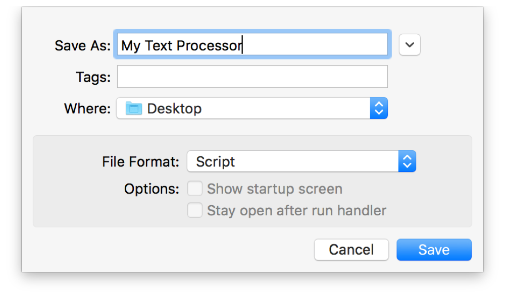

> 导航：[总目录](../../README.md) · [documentation](../../_indexes/documentation.md) · [Mac Automation Scripting Guide](index.md)

## Using Script Libraries

A script library is a collection of handlers, which can be loaded and used by other scripts. For example, a scripter might compile a set of commonly-used text-processing handlers into a text library. This library could then be shared by multiple scripts that need to perform text processing operations.

### Writing Script Libraries

To write a script library, create a Script Editor document that contains one or more handlers, such as the one shown in Listing 14-1 and Listing 14-2, and save it in _script_ format, as shown in Figure 14-1.

__Figure 14-1__Saving a script library

__APPLESCRIPT__

[Open in Script Editor](applescript://com.apple.scripteditor?action=new&script=on%20changeCaseOfText%28theText%2C%20theCaseToSwitchTo%29%0A%20%20%20%20if%20theCaseToSwitchTo%20contains%20%22lower%22%20then%0A%20%20%20%20%20%20%20%20set%20theComparisonCharacters%20to%20%22ABCDEFGHIJKLMNOPQRSTUVWXYZ%22%0A%20%20%20%20%20%20%20%20set%20theSourceCharacters%20to%20%22abcdefghijklmnopqrstuvwxyz%22%0A%20%20%20%20else%20if%20theCaseToSwitchTo%20contains%20%22upper%22%20then%0A%20%20%20%20%20%20%20%20set%20theComparisonCharacters%20to%20%22abcdefghijklmnopqrstuvwxyz%22%0A%20%20%20%20%20%20%20%20set%20theSourceCharacters%20to%20%22ABCDEFGHIJKLMNOPQRSTUVWXYZ%22%0A%20%20%20%20else%0A%20%20%20%20%20%20%20%20return%20theText%0A%20%20%20%20end%20if%0A%20%20%20%20set%20theAlteredText%20to%20%22%22%0A%20%20%20%20repeat%20with%20aCharacter%20in%20theText%0A%20%20%20%20%20%20%20%20set%20theOffset%20to%20offset%20of%20aCharacter%20in%20theComparisonCharacters%0A%20%20%20%20%20%20%20%20if%20theOffset%20is%20not%200%20then%0A%20%20%20%20%20%20%20%20%20%20%20%20set%20theAlteredText%20to%20%28theAlteredText%20%26%20character%20theOffset%20of%20theSourceCharacters%29%20as%20string%0A%20%20%20%20%20%20%20%20else%0A%20%20%20%20%20%20%20%20%20%20%20%20set%20theAlteredText%20to%20%28theAlteredText%20%26%20aCharacter%29%20as%20string%0A%20%20%20%20%20%20%20%20end%20if%0A%20%20%20%20end%20repeat%0A%20%20%20%20return%20theAlteredText%0Aend%20changeCaseOfText)

__Listing 14-1__AppleScript: Handler that converts text to uppercase or lowercase

1. `on changeCaseOfText(theText, theCaseToSwitchTo)`
2. `if theCaseToSwitchTo contains "lower" then`
3. `set theComparisonCharacters to "ABCDEFGHIJKLMNOPQRSTUVWXYZ"`
4. `set theSourceCharacters to "abcdefghijklmnopqrstuvwxyz"`
5. `else if theCaseToSwitchTo contains "upper" then`
6. `set theComparisonCharacters to "abcdefghijklmnopqrstuvwxyz"`
7. `set theSourceCharacters to "ABCDEFGHIJKLMNOPQRSTUVWXYZ"`
8. `else`
9. `return theText`
10. `end if`
11. `set theAlteredText to ""`
12. `repeat with aCharacter in theText`
13. `set theOffset to offset of aCharacter in theComparisonCharacters`
14. `if theOffset is not 0 then`
15. `set theAlteredText to (theAlteredText & character theOffset of theSourceCharacters) as string`
16. `else`
17. `set theAlteredText to (theAlteredText & aCharacter) as string`
18. `end if`
19. `end repeat`
20. `return theAlteredText`
21. `end changeCaseOfText`

__JAVASCRIPT__

[Open in Script Editor](applescript://com.apple.scripteditor?action=new&script=function%20changeCaseOfText%28text%2C%20caseToSwitchTo%29%20%7B%0A%20%20%20%20var%20alteredText%20%3D%20text%0A%20%20%20%20if%20%28caseToSwitchTo%20%3D%3D%3D%20%22lower%22%29%20%7B%0A%20%20%20%20%20%20%20%20alteredText%20%3D%20alteredText.toLowerCase%28%29%0A%20%20%20%20%7D%0A%20%20%20%20else%20if%20%28caseToSwitchTo%20%3D%3D%3D%20%22upper%22%29%20%7B%0A%20%20%20%20%20%20%20%20alteredText%20%3D%20alteredText.toUpperCase%28%29%0A%20%20%20%20%7D%0A%20%20%20%20return%20alteredText%0A%7D)

__Listing 14-2__JavaScript: Function that converts text to uppercase or lowercase

1. `function changeCaseOfText(text, caseToSwitchTo) {`
2. `var alteredText = text`
3. `if (caseToSwitchTo === "lower") {`
4. `alteredText = alteredText.toLowerCase()`
5. `}`
6. `else if (caseToSwitchTo === "upper") {`
7. `alteredText = alteredText.toUpperCase()`
8. `}`
9. `return alteredText`
10. `}`

Move the saved script to one of the following folders on your Mac, creating the folder if it doesn’t already exist:

- `~/Library/Script Libraries/`
- `/Library/Script Libraries/`
- `/Resources/` folder inside a script or app bundle.

For additional information about writing script libraries, see [Creating a Library](../Apple%20Script/AppleScript%20Language%20Guide/Script%20Objects.md#apple-f4xwc4dqnrsv64tfmyxwi33df52wszbpkridimbqgaydsobtfvbuqmrqg4wvgvzrgm) in _[AppleScript Language Guide](../Apple%20Script/AppleScript%20Language%20Guide/Introduction%20to%20AppleScript%20Language%20Guide.md#apple-f4xwc4dqnrsv64tfmyxwi33df52wszbpkridimbqgaydsobt)_ and [Libraries](../../releasenotes/JavaScript%20for%20Automation%20Release%20Notes/OS%20X%2010.10%20Release%20Notes.md#apple-f4xwc4dqnrsv64tfmyxwi33df52wszbpkridimbqge2dkmbyfvbuqmjqhewvgvzrgq) in _[JavaScript for Automation Release Notes](../../releasenotes/JavaScript%20for%20Automation%20Release%20Notes/Introduction%20to%20JavaScript%20for%20Automation%20Release%20Notes.md#apple-f4xwc4dqnrsv64tfmyxwi33df52wszbpkridimbqge2dkmby)_.

### Using Script Libraries

Once a script library is installed, your other scripts can target its handlers at any time.

To target a script library in AppleScript, use a `tell` statement, as shown in Listing 14-3.

__APPLESCRIPT__

[Open in Script Editor](applescript://com.apple.scripteditor?action=new&script=tell%20script%20%22My%20Text%20Processor%22%0A%20%20%20%20changeCaseOfText%28%22scripting%20is%20awesome!%22%2C%20%22upper%22%29%0Aend%20tell)

__Listing 14-3__AppleScript: Targeting a handler in a script library

1. `tell script "My Text Processor"`
2. `changeCaseOfText("scripting is awesome!", "upper")`
3. `end tell`
4. `--> Result: "SCRIPTING IS AWESOME!"`

To target a script library in JavaScript, use the `Library` command to reference the library. Then, you can target handlers in the referenced library, as shown in Listing 14-4.

__JAVASCRIPT__

[Open in Script Editor](applescript://com.apple.scripteditor?action=new&script=textProcessor%20%3D%20Library%28%22My%20Text%20Processor%22%29%0AtextProcessor.changeCaseOfText%28%22scripting%20is%20awesome!%22%2C%20%22upper%22%29)

__Listing 14-4__JavaScript: Targeting a function in a script library

1. `textProcessor = Library("My Text Processor")`
2. `textProcessor.changeCaseOfText("scripting is awesome!", "upper")`
3. `// Result: "SCRIPTING IS AWESOME!"`

[Using Handlers/Functions](UseHandlersFunctions.md#apple-f4xwc4dqnrsv64tfmyxwi33df52wszbpkridimbqge3demzzfvbuqnjsfvjvomi)

[Referencing Files and Folders](ReferenceFilesandFolders.md#apple-f4xwc4dqnrsv64tfmyxwi33df52wszbpkridimbqge3demzzfvbuqmzufvjvomi)
