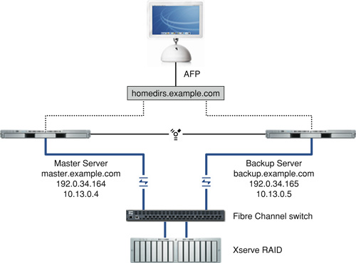
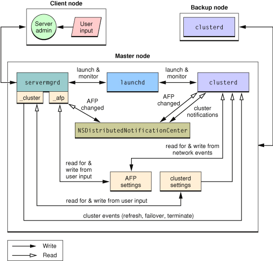

> 导航：[总目录](../../../README.md) · [documentation](../../../_indexes/documentation.md) · [OS X Server Failover Messaging Architecture Guide](About%20This%20Manual.md)


[Next](Document%20Revision%20History.md)[Previous](About%20This%20Manual.md)

# Concepts

OS X v10.4 provides a new failover mechanism composed of two nodes – a master node and a backup node – forming a failover pair.

The following rules govern whether a node can be configured as a master or as a backup:

- The master and backup nodes must reside on the same private FireWire network.
- The master and backup nodes cannot run a conflicting service, such as being an Open Directory master or replica.
- Both the master and the backup node must be listed in an accessible DNS server.

Intra-host communication between processes running on the master and backup nodes is accomplished through the NSDistributedNotificationCenter. Third-party software can use the NSDistributedNotificationCenter to receive notification of changes such as a configuration change or a failover event. Inter-host communication is accomplished through a custom, proprietary protocol managed by the cluster daemon (`clusterd`).

[Figure 1-1](#apple-f4xwc4dqnrsv64tfmyxwi33df52wszbpkridimbqgaytqmbufvbuqmrqguwtcmrwg43ds) shows the typical hardware scenario in which the new failover mechanism is used.

__Figure 1-1__  Failover hardware scenario



In Figure 1-1, FireWire connects two Xserve G5 cluster nodes and forms a private, FireWire network. Both Xserve G5 cluster nodes are connected to an Xserve RAID device through a Fibre Channel switch. Each node has a public name and IP address defined in DNS. In Figure 1-1, the public address 192.0.34.164 is assigned in DNS to master.example.com, and the public address 192.0.34.165 is assigned to backup.example.com. In addition to public addresses, private addresses (10.13.0.4 and 10.13.0.5, respectively), are also assigned to each node. The public address 192.0.34.166 is also assigned in DNS to homedirs.example.com but is not permanently assigned to a particular computer. This type of assignment is sometimes called a _virtual IP address_.

[Figure 1-2](#apple-f4xwc4dqnrsv64tfmyxwi33df52wszbpkridimbqgaytqmbufvbuqmrqguwtcmrwgu3de) shows the interaction of the failover components installed on the master and the backup node.

__Figure 1-2__  Interaction of failover components



On the master node, the `launchd` daemon starts and monitors the server manager daemon (`servermgrd`) and the cluster daemon (`clusterd`). Administrators provide configuration input to `servermgrd` through the Server Admin application.

The `servermgr_clusterd` module of `servermgrd` reads and writes the `clusterd` settings and also sends cluster events, such as refresh, failover, and terminate, to the `clusterd` daemon.

The `servermgr_afp` module of `servermgrd` reads and writes the AFP settings. A change to the AFP settings causes a notification to be sent to the NSDistributedNotificationCenter. The `clusterd` daemon has registered with NSDistributedNotificationCenter to receive notification of AFP settings changes, so it gets the notification when an AFP setting changes.

The `clusterd` daemon on the master node communicates with the `clusterd` daemon on the backup node using IP over the dedicated, secure FireWire link.

For this release, the `servermgrd` daemon also has a `servermgr_nfs` module and a `servermgr_smb` module that perform the same functions as the `servermgr_afp` module.

The backup node’s interactions are similar to the master node’s. However, certain server administration operations, such as modifying file service settings, are not allowed.

The master and backup nodes exchange messages that are actually plists. The messages involve the use of two node record types:

- Public node record— A public node record represents publicly accessible IPv4 or IPv6 address information obtained from a DNS server. A public node’s IPv4 or IPv6 address is assigned to the master and assumed by the backup when the master fails. This node record or its IP addresses are virtual IP addresses.
- Cluster node record —A cluster node record represents one of the computers in the failover pair. One or more public node records are associated with the cluster node currently hosting it.

For this release, a single peer can be identified by querying the public node.

__Table 1-1__  Message commands

| Message | Function |
| `configuration` | This message requests the list of public nodes the target is monitoring, as well as the target’s list of private addresses. A response is expected. For more information on this command, see [Configuration Command](#apple-f4xwc4dqnrsv64tfmyxwi33df52wszbpkridimbqgaytqmbufvbuqmrqguwtcmjxgq2dc). |
| `failover` | This message is sent by a node that is giving up a public node to a backup node. In the case of a manual failover on the network shown in [Figure 1-1](#apple-f4xwc4dqnrsv64tfmyxwi33df52wszbpkridimbqgaytqmbufvbuqmrqguwtcmrwg43ds), the master (master.example.com) releases the monitored public node homedirs.example.com to the backup (backup.example.com). When the transition is complete, the master still has its own public node (master.example.com), but the other public node (homedirs.example.com) is hosted on the backup (backup.example.com). |
| `notification` | This message notifies the `clusterd` daemon of a significant event. No response is expected but this message may trigger other messages. The `clusterd` daemon processes but does not forward certain internal notifications, such as `heartbeat` notifications, which provide status and performance data to nodes that are listening. |

Any of the commands listed in Table 1-1 can be accompanied by any of the standard attributes listed in Table 1-2.

__Table 1-2__  Message attributes

| Message | Function |
| `data` (data or dictionary) | Packet content describing notification or requested data. This attribute appears in notifications and may appear in replies. |
| `errorCodes` (array of integer) | List of errors generated as a result of a corresponding request. This attribute only appears in replies. |
| `version` (integer) | Cluster plist format version number. This may appear in any message. |

The `configuration` command is the first command sent by the backup node. It queries the public nodes of interest to determine the current owner. Here is an example of the request backup.example.com would send to homedirs.example.com:

```xml
<?xml version-”1.0” encoding=”UTF-8”?>
<!DOCTYPE plist PUBLIC “-//Apple Computer//DTD PLIST 1.0//EN”  “http://www.applecom/ DTDs/PropertyList-1.0.dtd”>
<plist version=”1.0”>
<dict>
    <key>command</key>
    <string>configuration</string>
    <key>version</key>
    <integer>1</integer>
</dict>
</plist>
```


The reply to a `configuration` command is a dictionary containing identifying information, including a UUID (valid for the life of the process), a list of private names and addresses, and the list of hosted public nodes. Here is an example of the response from homedirs.example.com (currently hosted on master.example.com) to the request from backup.example.com:

```xml
<?xml version-”1.0” encoding=”UTF-8”?>
<!DOCTYPE plist PUBLIC “-//Apple Computer//DTD PLIST 1.0//EN”  “http://www.applecom/ DTDs/PropertyList-1.0.dtd”>
<plist version=”1.0”>
<dict>
    <key>command</key>
    <string>configuration</string>
    <key>data</key>
    <dict>
        <key>_id_</key>
        <string>E773FBDD-5CFE-4CF0-9F4C-10B6604064D7</string>
        <key>addresses</key>
        <array>
            <string>10.13.0.5</string>
        </array>
        <key>names</key>
        <array>
            <string>master</string>
        <key>publicNodes</key>
        <dict>
            <key>homedirs</key>
            <array>
                <string>192.0.34.166</string>
            </array>
            <key>master.example.com</key>
            <array>
                <string>192.0.34.164</string>
            </array>
        </dict>
    </dict>
    <key>errorCodes</key>
    </array>
    <key>version</key>
    <integer>1</integer>
</dict>
</plist>
```

In the example above,

- `E773FBDD-5CFE-4CF0-9F4C-10B6604064D7` is a UUID valid for the life of the `clusterd` process. It is used to quickly identify a node.
- The `addresses` key always specifies at least one valid address, which is the private IP address of the target that is being monitored, which, in this case is `10.13.0.5`.
- The `names` key is guaranteed to contain a least one value, the node’s Bonjour name. In this example, `master.local` is the Bonjour name that corresponds to 10.13.0.5.
- The `publicNodes` key is a dictionary instead of an array because each node can have just one DNS name and multiple IP addresses. In this example, homedirs.example.com is the DNS name of a node the target is monitoring.
- `192.0.34.166` is the IP address for homedirs.example.com.

The server manager daemon (`servermgrd`) posts messages using the NSDistributedNotificationCenter mechanism. The cluster daemon (`clusterd`) registers for notifications posted by `servermgrd` and uses them to trigger synchronization actions. Third-party software can register to receive notification of messages. For additional information, see [NSDistributedNotificationCenter](https://developer.apple.com/documentation/foundation/nsdistributednotificationcenter).

Failover messaging uses two notification types:

- `com.apple.ServiceConfigurationChangedNotification`
- `com.apple.ServiceStatusChangedNotification`

This notification is posted when a service’s configuration changes. The related dictionary indicates the name of the service. For example, here is a configuration changed notification for AFP:

```
<dict>
    <key>ServiceName</key>
    <string>afp</string>
</dict>
```

For this release, the possible values for `ServiceName` are:

- `afp`
- `nfs`
- `smb`
- `sharepoints`

The `sharepoints` value is not actually a service but is used to notify interested parties of a change in the set of sharepoints.

This notification is posted when a service is stopped or started. The related dictionary indicates the name of the service and its new state. For example, here is a service status changed notification for AFP:

```
<dict>
    <key>ServiceName</key>
    <string>afp</string>
    <key>State</key>
    <string>RUNNING</string
</dict>
```

For this release, the possible values for `ServiceName` are:

- `afp`
- `nfs`
- `smb`

The possible values for `state` are:

- `RUNNING`
- `STOPPED`
- `STARTED`
- `STOPPING`
- `UNKNOWN`

The header file `/usr/include/NSFailoverEvents.h` contains the following failover messaging definitions for use by third-party applications that want to receive notifications. It contains definitions for symbolic names for the notifications and keys and values for the dictionaries included in the notifications.

```
#define NSFailoverServiceStatusChanged  @"com.apple.ServiceStatusChangedNotification"
#define NSFailoverServiceConfigurationChanged  @"com.apple.ServiceConfigurationChangedNotification"
#define NSFailoverServiceNameKey        @"ServiceName"
#define NSFailoverServiceStateKey       @"State"

#define NSFailoverServiceStateRunning   @"RUNNING"
// Any value other than NSFailoverServiceStateRunning means "not  running".
#define NSFailoverServiceStateStopped   @"STOPPED"
#define NSFailoverServiceStateStarting  @"STARTING"
#define NSFailoverServiceStateStopping  @"STOPPING"
#define NSFailoverServiceStateUnkonwn   @"UNKNOWN"

#define NSFailoverServiceNameAFP        @"afp"
#define NSFailoverServiceNameSMB        @"smb"
#define NSFailoverServiceNameNFS        @"nfs"
#define NSFailoverServiceNameWeb        @"web"
#define NSFailoverServiceNameMail       @"mail"

// NSFailoverServiceNameSharepoints is a virtual service that reflects  the
// set of file service sharepoints
#define NSFailoverServiceNameSharepoints@"sharepoints"

#define NSFailoverPathToScriptsDir      @"/Library/Failover"
#define NSFailoverPathToDefaultScriptsDir@"/Library/Failover/Default  Scripts"
```

[Next](Document%20Revision%20History.md)[Previous](About%20This%20Manual.md)

