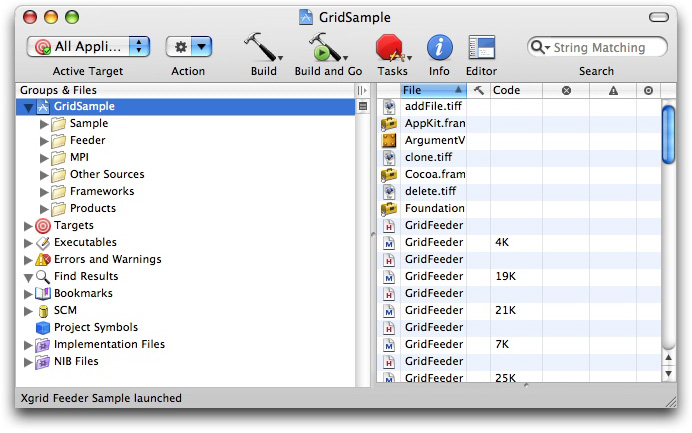
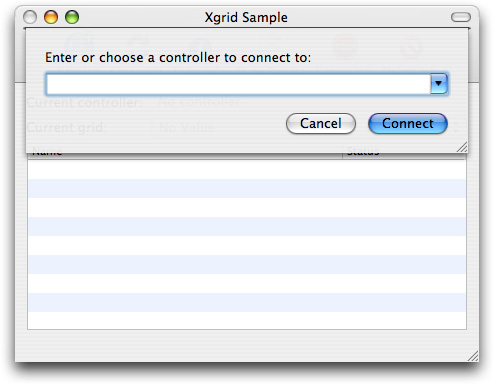
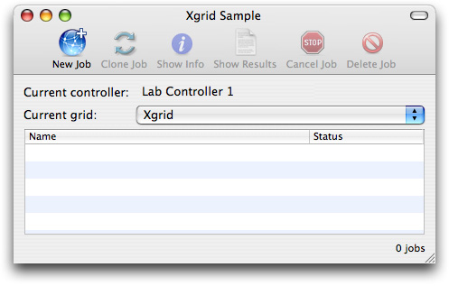
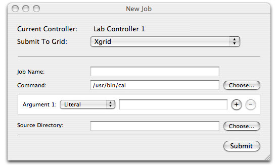

> 导航：[总目录](../../../README.md) · [documentation](../../../_indexes/documentation.md) · [Xgrid Programming Guide](Introduction.md)


[Next](Overriding%20the%20Job%20Specification%20Function.md)[Previous](Using%20the%20Xgrid%20Command-Line%20Client.md)

# Building and Running GridSample

GridSample is not just a sample application. It is a library-quality set of code intended to handle a wide variety of job submission tasks in a robust fashion, with all the authentication, submission, notification, error handling, and housekeeping tasks handled correctly.

Consequently, it is not so much a simple teaching tool as an application framework. You can create your own application just by overwriting the job submission function and providing a nib file to customize the user interface.

The best way to learn from GridSample is not to study all of the code—there is a lot of it, and much of it is complex housekeeping—but rather to build and run it, then modify it as needed, studying the parts you need to modify.

This chapter covers the basics of building and using GridSample. Modifying the job specification function is discussed separately in [Overriding the Job Specification Function](Overriding%20the%20Job%20Specification%20Function.md#apple-f4xwc4dqnrsv64tfmyxwi33df52wszbpkridimbqga3denbwfvbuqnrnknltc).

When you install the Mac OS X Developer Tools or Xcode Tools, a `Developer/Examples/Xgrid` directory is created. This directory contains the GridSample project. To get the current version, install the Developer Tools from the installation disc for Mac OS X 10.4 (Tiger) or the Xcode Tools for Mac OS X 10.5 (Leopard).

`GridSample.xcodeproj` is an Xcode project. Double-clicking it opens the project in Xcode.

You should see the GridSample project, show in Figure 4-1.

__Figure 4-1__  GridSample project



If you click the disclosure triangle next to the Targets icon, you will see that the project has three targets, Sample, Feeder, and MPI, which compile three complete applications: Xgrid Sample, Xgrid Feeder Sample, and Xgrid MPI Sample.

Xgrid Sample is the simplest application, and the easiest to use and understand. Xgrid Feeder Sample contains more sophisticated code for handling various types of job submission. Xgrid MPI Sample is intended to feed Xgrid jobs using MPI, a multiprocessing language which falls outside the scope of this document.

To build and run the Xgrid Sample application, select Xgrid Sample from the target list, then click the Build and Go icon in the toolbar at the top of the window. The code will compile, link, and run. You should see Figure 4-2, with a dialog prompting you to choose a controller.

__Figure 4-2__  The Xgrid Sample controller selection window



You must select a valid Xgrid controller in order to proceed.

Choose a controller from the pop-up list and enter the password. GridSample connects to the controller and brings up the user interface.

__Figure 4-3__  Xgrid Sample main window



Click the New Job icon to submit a job to Xgrid. You are then prompted for a job name and a command. The job name can be any descriptive string to help you identify the job. The syntax for the command is similar to a job submission for the `xgrid` command-line tool (for details, see [Using the Xgrid Command-Line Client](Using%20the%20Xgrid%20Command-Line%20Client.md#apple-f4xwc4dqnrsv64tfmyxwi33df52wszbpinedanjnknlte)).

XgridSample submits the command to Xgrid as a single task, in the following format:

```
/bin/sh -c "COMMAND"
```


To build and run the Xgrid Feeder application, select Xgrid Feeder from the target list, then click the Build and Go icon in the toolbar at the top of the window. The code compiles, links, and runs. Again, you should see a window with a dialog prompting you to choose a controller.

Connect to a controller and the user interface screen appears. It is identical to the Grid Sample screen shown earlier. When you click the New Job icon, however, a far more sophisticated interface appears, allowing you to browse for executable tasks, construct a table of arguments, and choose a source directory for your job.

__Figure 4-4__  Gridfeeder Sample New Job window



You can enter or choose a command, add arguments, browse for a source directory, and otherwise interactively construct a job entry for Xgrid.

Use the Xgrid Admin tool to debug your setup and monitor the job progress as Grid Sample or Grid Feeder executes your tasks.

You can download the Admin tools from [http://www.apple.com/support/downloads/serveradmintools1047.html](http://www.apple.com/support/downloads/serveradmintools1047.html). Once you have downloaded and installed the Admin tools, Xgrid Admin is located in the Server subdirectory of your Applications directory.

Use Xgrid Admin to verify that you have a controller and agents available, and to monitor the status of the jobs you submit to Grid Sample or Grid Feeder.

[Next](Overriding%20the%20Job%20Specification%20Function.md)[Previous](Using%20the%20Xgrid%20Command-Line%20Client.md)

