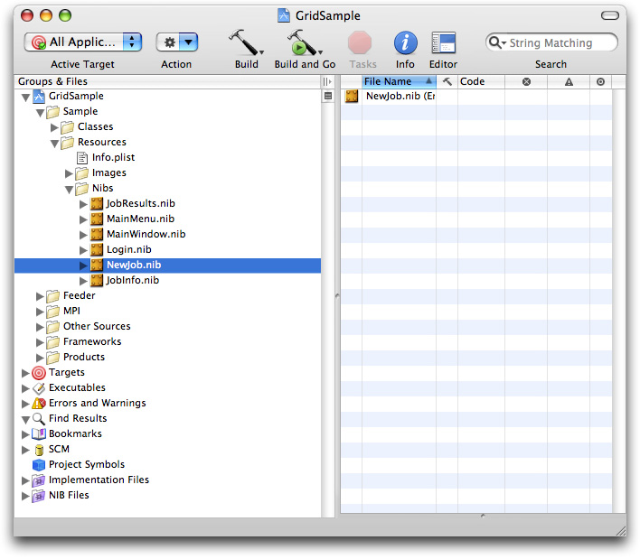
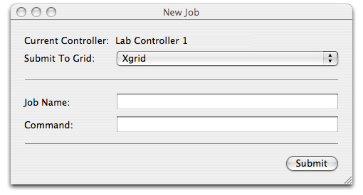
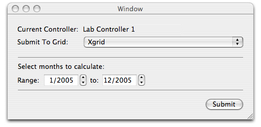
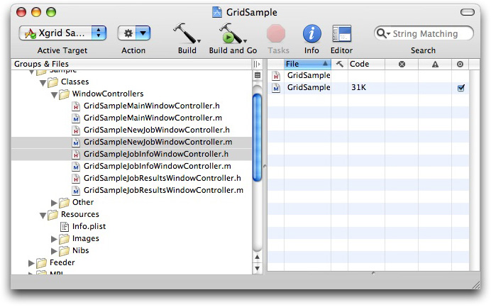
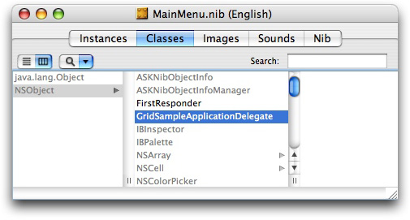
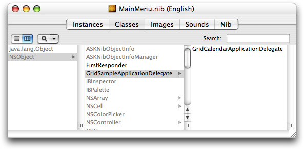

> 导航：[总目录](../../../README.md) · [documentation](../../../_indexes/documentation.md) · [Xgrid Programming Guide](Introduction.md)


[Next](Writing%20a%20Cocoa%20Xgrid%20Client.md)[Previous](Building%20and%20Running%20GridSample.md)

# Overriding the Job Specification Function

The easiest way to create an Xgrid client application is to override the job specification function in the GridSample sample code. This chapter shows you how to accomplish this.

The GridSample application is organized into several modules. All the modules are part of the GridSample project, found in your `Developer/Examples/Xgrid/GridSample/` directory.

Some modules consist entirely of `.nib` files that open in Interface Builder. Most of the modules are paired `.h` and `.m` files that open in the code editor—`GridSampleApplicationDelegate.h` and `GridSampleApplicationDelegat.m`, for example.

The GridSample modules form an outline of the main tasks any Xgrid client must perform:

- Identify a controller—You need to locate a controller, typically by opening a service browser window.

  See the `GridSampleConnectionController` and `GridSampleServiceBrowser` modules.
- Authenticate and connect—You need to connect to the controller, which is typically password protected.

  See the `GridSampleLoginController` module.
- Submit the job—You need to assemble the tasks into a job and submit the job to the controller, specifying a grid.

  See the `GridSampleNewJobWindowController` and `NewJob.nib` modules.
- Monitor status and retrieve job ID—When you submit a job, an action monitor object is returned. You need to check the status of the action monitor to see if your job was submitted successfully. If it was, you can obtain a job ID.

  See the `GridSampleNewJobWindowController` module.
- Set callback for notifications—Using the job ID, you can register to be notified when the job completes or when errors occur.

  See the `GridSampleNewJobWindowController` module.
- Collect data—When the job completes, you need to collect the returned data and deal with it appropriately.

  See the `GridSampleResultsWindowController` module.
- Housekeeping—As always, there are error handling routines and basic housekeeping tasks, such as deleting the job.

  See the `dealloc` function in the `GridSampleResultsWindowController` module.

The GridSample application is general purpose. In addition to modifying the job submission module, you may want to streamline other behaviors. For example:

- You may want to connect to a specific controller every time. To modify this behavior, refer to the GridSampleConnectionController and GridSampleServiceBrowser modules.
- You may want to use only your chosen method of authentication. To modify this behavior, refer to the GridSampleLoginController module.
- You may want to direct the collected data to another application for postprocessing. To modify this behavior, refer to the GridSampleJobResultsWindowController module.

Most of these modifications are fairly straightforward. Examining the source code of the appropriate module should provide you with much of the information you need, and referring the [XgridFoundation Reference](https://developer.apple.com/documentation/Performance/Conceptual/XgridDeveloper/index.html#//apple_ref/doc/framework/XgridFoundation_reference) should answer remaining questions. The job submission module deserves special attention, however.

To override the job specification function in Grid Sample, you need to make modifications in four places:

- `NewJob.nib`
- `NewJobWindowController` (`.m` and `.h`)
- `ApplicationDelegate` (`.m` and `.h`)
- `MainMenu.nib`

For example, if you examine the GridCalendar sample code, found at [http://developer.apple.com/samplecode/GridCalendar/](https://developer.apple.com/samplecode/GridCalendar/), you will see that it is a copy of the GridSample application, with the following modifications:

- A new `NewJob.nib` file has been created, with a new UI for job specification.
- The `jobSpecification` function has been subclassed to create a window controller that builds a job specification based on the new UI.
- A new application delegate has been created, subclassing `classForNewJobWindowController` to point to the new window controller.
- The application delegate has been subclassed in `MainMenu.nib` to specify the new application delegate.

Here are the steps in more detail:

- `NewJob.nib` has been changed to provide a new job submission user interface. (The `.nib` file is created using Interface Builder without actually writing any code.)
- _GridSample_`NewJobWindowController` has been supplemented with _GridCalendar_`NewJobWindowController`, which contains the support code to process the UI state returned from `NewJob.nib` into a properly formatted job submission. The new support code is encapsulated as a subclass of `jobSpecification`, overriding the job specification code in `GridSampleNewJobWindowController`.
- _GridSample_`ApplicationDelegate` has been supplemented with _GridCalendar_`ApplicationDelegate`, which overrides `-classForNewJobWindowController` to point to `GridCalendarNewJobWindowController`.
- In `Mainmenu.nib`, the application delegate object’s class has been subclassed to `GridCalendarApplicationDelegate`.

You should proceed in a similar manner, using the code in GridCalendar as a guide. The process is broken down into four steps:

Create a new job submission UI by modifying and saving `NewJob.nib`.

Note that the GridSample project contains three `NewJob.nib` files, one for each target: GridSample, GridFeeder, and GridMPI. Open the .nib file GridSample > Sample > Resources > Nibs, as shown in Figure 5-1.

__Figure 5-1__  Locating the right `NewJob.nib` file



Figure 5-2 and [Figure 5-3](#apple-f4xwc4dqnrsv64tfmyxwi33df52wszbpkridimbqga3denbwfvbuqnrnknlto)show the NewJob.nib file from GridSample and the modified NewJob.nib file for GridCalendar. Since GridCalendar always uses the same command, the command field and job name field have been removed, and a date selector field has been added for the `cal` command.

__Figure 5-2__  GridSample job submission `.nib` file



__Figure 5-3__  GridCalendar job submission `.nib` file



Assuming your application always submits the same type of job to Xgrid, you should make similar changes to the user interface: keep the pop-up window to select the grid, but replace the job name and command fields with input fields that allow the user to set the parameters for each instance of your particular job.

Create a new file that contains the support logic to create a job specification based on the returned state from your UI. Override `jobSpecification`, as defined in `GridSampleNewJobWindowController.m`, by creating a new class of the same name, encapsulating your code. This file supplements `GridSampleNewJobWindowController`, so name it appropriately (in GridCalendar, it’s named `GridCalendarNewJobWindowController`).

__Figure 5-4__  GridSampleNewJobWindowContoller files



To see how this is done, compare `GridSampleNewJobWindowController.m` and with `GridCalendarNewJobWindowController.m`. Notice that `GridCalendarNewJobWindowController.m` contains only the modified job specification code, and that the main function is named `jobSpecification`, overriding the `jobSpecification` defined in `GridSampleNewJobWindowController.m`. This way, the new window controller inherits all the functionality of the old window controller, such as selecting a grid, submitting the job, retrieving the action monitor, and setting up callbacks for status. Only the job specification function is overridden.

Supplement `GridSampleApplicationDelegate.m` with your own application delegate that sublasses `classForNewJobWindowController` to point to your new window controller, thereby overriding `GridSampleNewJobWindowController` with your own window controller.

Listing 5-1 shows the contents of the `GridCalendarApplicationDelegate.m` file in its entirety.

__Listing 5-1__  GridCalendarApplicationDelegate

```objc
#import "GridCalendarApplicationDelegate.h"
#import "GridCalendarNewJobWindowController.h"
@implementation GridCalendarApplicationDelegate
#pragma mark *** Accessor methods ***
- (Class)classForNewJobWindowController;
{
    return [GridCalendarNewJobWindowController self];

}
@end
```

As you can see, the code is quite simple. As the implementation of your application delegate, define `classForNewJobWindowController` to return an instance of the window controller you added in step 2.

Finally, change the application delegate’s class in `MainMenu.nib` to point to the new application delegate you added in step 3.

1. Open `MainMenu.nib` (There are three `.nib` files by this name in GridSample—one for each target. Open the `MainMenu.nib` file for GridSample.)
2. Select the Classes tab and highlight `GridSampleApplicationDelegate`, as shown in Figure 5-5.

   __Figure 5-5__  Classes tab in `MainMenu.nib`

   
3. Press the Return key. This creates a new subclass, `MyGridSampleApplicationDelegate`. Double-click the new entry to select it, then type the name of your application delegate from step 3. You will see your new application delegate subclass, similar to Figure 5-6.

   __Figure 5-6__  `GridCalendarApplicationDelegate` subclass

   
4. Save your changes, then click the Build and Go icon to compile and run your application. You should have a customized Xgrid client application that submits your job to Xgrid.

To summarize: you have created a `.nib` file with a new UI for job specification; you have subclassed `jobSpecification` to create a window controller that builds a job specification based on your UI; you have created an application delegate and subclassed `classForNewJobWindowController` to point to your window controller; and you have subclassed the application delegate in the `MainMenu.nib` file to use your new application delegate.

Congratulations. Unless you need to further customize the look and feel of your application, you’re done. If you do need to go further, see [Writing a Cocoa Xgrid Client](Writing%20a%20Cocoa%20Xgrid%20Client.md#apple-f4xwc4dqnrsv64tfmyxwi33df52wszbpkridimbqga3denbwfvbuqnznknltc).

[Next](Writing%20a%20Cocoa%20Xgrid%20Client.md)[Previous](Building%20and%20Running%20GridSample.md)

