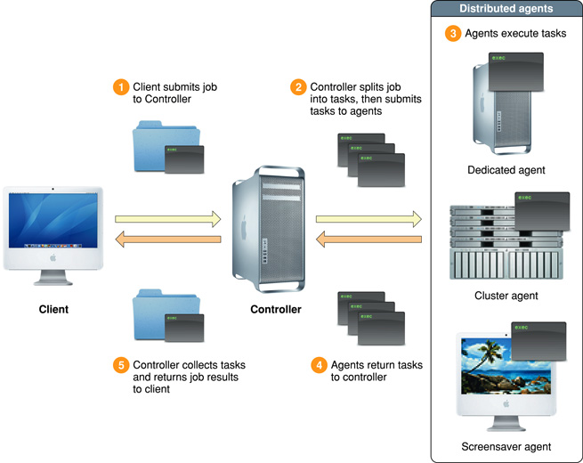
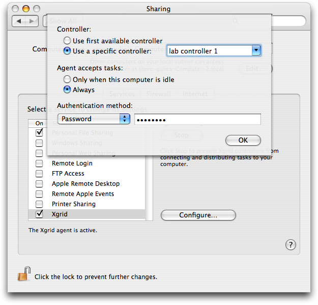

> 导航：[总目录](../../../README.md) · [documentation](../../../_indexes/documentation.md) · [Xgrid Programming Guide](Introduction.md)

[Next](Getting%20Started%20with%20Xgrid.md)[Previous](Introduction.md)

# Xgrid Overview

Xgrid allows you to execute programs using multiple computers—and multiple processors on a single computer—to perform multiple calculations in parallel.

Xgrid is a generalized system, capable of assembling clusters of processors on demand, detecting and correcting failures, and parceling out parallel tasks as needed for general-purpose parallel computing on multiple systems.

The Xgrid controller is a feature of Mac OS X Server, but any computer with Mac OS X (version 10.4 and later) can submit jobs to Xgrid or act as an agent to carry out Xgrid computations.

The main components of Xgrid are the _client_, the _controller_, and one or more _agents_. As illustrated in Figure 1-1, the client submits _jobs_ to the controller, which assigns _tasks_ to the agents. The agents carry out the tasks and return data to the controller. The controller supervises the agents, collects the data, and notifies the client when the job terminates.

__Figure 1-1__  Xgrid architecture

A _job_, as defined for Xgrid, is a collection of one or more executable _tasks_ that can be run in parallel. Each individual task consists of an executable file and any necessary input parameters, data files, and directories.

If enough agents are available, each task is assigned to an agent for simultaneous execution. If necessary, agents with multiple CPUs or multiple cores will have a separate task assigned to each CPU or core.

If there are not enough agents, CPUs, or cores to execute all the tasks simultaneously, the controller assigns tasks to each agent, then waits and assigns the remaining tasks to agents as they finish their current task or otherwise become available.

The controller passes or copies the executable files to the agents, along with any necessary working directories for input and output. The controller supervises and coordinates the agents, detects individual failures, and reassigns tasks as necessary. The agents complete the tasks and return any data, and the controller notifies the client when the job is done or aborts due to an error.

Since jobs typically take a long time to execute, the process is asynchronous. The client submits the job and is notified when it completes.

The client can register to be notified by the controller when the job completes or when events such as errors occur. Notifications by email are also supported.

The client may also monitor the job state at any time by querying the controller. The client may disconnect from the network and return to check the status of the job later.

Xgrid provides notification of errors, task completion, and job completion. Ongoing progress of individual tasks is not reported, even for very long tasks.

Mac OS X includes a command-line client, `xgrid`, and a sample client application, GridSample.

The `xgrid` command-line client is installed on all computers with Mac OS X, versions 10.4 and later.

When you install the Developer Tools for Mac OS X version 10.4, or the Xcode Tools for Mac OS X version 10.5, a directory named `Developer/Examples/Xgrid` is created. Inside this directory is an Xcode project named GridSample. This project contains a complete client application. You can build and run this application as a graphical alternative to the `xgrid` command-line tool. You can also modify the GridSample code to create your own client applications with minimal programming. To an extent, you can treat the GridSample project as an application framework.

You can also write your own Xgrid client software from scratch, using the Xgrid Foundation framework—a collection of Objective-C classes.

Client software that you write, either from scratch or by modifying the GridSample code, can be run on any computer with Mac OS X version 10.4 or later.

The controller software is included on Mac OS X Server version 10.4 or later.

You do not normally need to interact with the controller software directly. After a controller is configured, it waits for job submissions from clients and performs its work without human intervention. On Mac OS X Server, the Xgrid controller can be configured using the Server Admin tool (found in the `Applications/Server/` directory). From within Server Admin, choose Computers and Services, then select Xgrid. Tabs are available for configuring controller software and agent software.

Mac OS X Server also includes the XgridAdmin application (also found in the `Applications/Server` directory), which can be used to monitor and administer Xgrid, to cancel or delete jobs, for example.

Any computer with Mac OS X version 10.3 or later can act as an agent. The agent software is included in version 10.4 and later, and can be downloaded for version 10.3.

The agent software can be controlled from the System Preferences window, as shown in Figure 1-2.

__Figure 1-2__  Agent configuration

By default, agent software is off. When turned on, by default it accepts tasks only when the host computer is idle (has had no activity for 15 minutes or is running the screen saver). The agent software can be set to accept jobs at any time, however, making the host computer a _dedicated_ agent (the host computer can still run other software, but is available for parallel computing tasks at all times).

On Mac OS X Server, the agent softwarer can be configured using the Server Admin tool (found in the `Applications/Server/` directory). From within Server Admin, choose Computers and Services, then select Xgrid. Tabs are available for configuring controller software and agent software.

Setting up Xgrid is fairly simple.

- Choose a Mac OS X Server computer to act as a controller. Enable the controller and set the password using the Server Admin application (choose Xgrid from the list of Computers and Services; there are tabs for configuring the Agent and Controller services).
- Choose the computers you will use as agents and enable the Xgrid function (in the Sharing pane of the System Preferences window) for each agent computer.
- Make sure that all of the agents can be accessed over the network by the controller.
- If your agents are sharing access to a common pool of data, rather than receiving copies of all necessary data from the controller, make sure that all the agents have network access to the data and verify that they have the necessary permissions to read and write.

While simple in concept, ensuring network access to all agents in a large organization can be tricky to implement. Similarly, setting permissions correctly so that a data set can be shared by multiple agents can involve a great deal of housekeeping. Where doing so is practical, you can eliminate most of the complexity by taking two simplifying steps: put the controller and all the agents on the same IP subnet; and have the controller copy all necessary data to the agents.

Setting up the controller and agents is described in more detail in [[Xgrid Administration Guide]](http://images.apple.com/server/docs/Xgrid_Admin_v10.4.pdf). The administrator’s guide also provides a more detailed overview of the Xgrid architecture and setup considerations.

Mac OS X includes two client applications for submitting jobs to Xgrid: a command-line tool named `xgrid`, and an application named GridSample, which is provided as build-able source code. Mac OS X (version 10.4 and later) also contains an Objective-C framework, Xgrid Foundation, which includes a client API for Xgrid. Consequently, there are four ways to submit jobs to Xgrid:

- You can use the `xgrid` command-line client with a headless application, such as a shell script, to submit jobs to Xgrid. This is a utilitarian approach that allows you to use Xgrid in a UNIX-like way without writing any Xgrid-specific code at all.
- You can use the GridSample application in much the way that you use the `xgrid` command-line tool. GridSample has a user interface that is more flexible and approachable than the `xgrid` command, allowing your software to be run by users who may not be comfortable or familiar with the UNIX command line or Terminal interface, without requiring you to write any UI code.
- You can modify the GridSample source code, overriding the job specification function and adding your own nib file to create a customized user interface. Modifying GridSample enables you to quickly create a customized client with its own user interface without writing any unnecessary code. All the details of job submission, monitoring, and I/O handling are built in. This is the recommended approach for university environments or in-house computing projects that do not require an extensively “branded” client application. If you are planning to write a stand-alone application, you should probably modify GridSample as a first step to test the functional part of your code prior to debugging the UI and housekeeping parts.
- You can write a stand-alone Objective-C application that acts as an Xgrid client and submits jobs to Xgrid, using the Xgrid Foundation framework. This is the recommended approach when you need complete control over the look and feel of the Xgrid client application.

This document describes all four methods of submitting jobs to Xgrid.

[Next](Getting%20Started%20with%20Xgrid.md)[Previous](Introduction.md)

