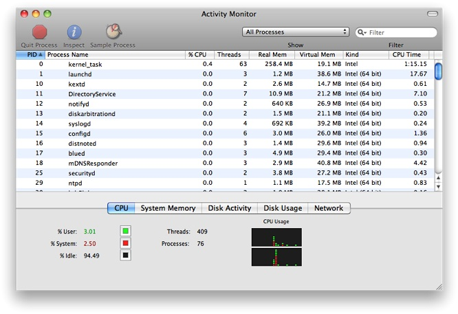

> 导航：[总目录](../../../README.md) · [documentation](../../../_indexes/documentation.md) · [Daemons and Services Programming Guide](About%20Daemons%20and%20Services.md)

[Next](The%20Life%20Cycle%20of%20a%20Daemon.md)[Previous](About%20Daemons%20and%20Services.md)

# Designing Daemons and Services

Two of the most important design decisions to consider when creating a background process are how it will be run and how other processes will communicate with it. These two considerations interact with each other: different types of background processes have different forms of communication available to them.

There are four types of background processes in OS X. The differences are summarized in [Table 1-1](#apple-f4xwc4dqnrsv64tfmyxwi33df52wszbpgeydambqge3te2jnknltilktk43a) and described in detail in the following subsections. To select the appropriate type of background process, consider the following:

- Whether it does something for the currently logged in user or for all users.
- Whether it will be used by single application or by multiple applications.
- Whether it ever needs to display a user interface or launch a GUI application.

__Table 1-1__  Types of Background Process

| Type | Managed by launchd? | Run in which context? | Can present UI? |
| Login item | No\* | User | Yes |
| XPC service | Yes | User | No  (Except in a very limited way using IOSurface) |
| Launch Daemon | Yes | System | No |
| Launch Agent | Yes | User | Not recommended |

\* Login items are started by the per-user instance of `launchd`, but it does not take any actions to manage them.

For more information about the system and user contexts, see _[Multiple User Environment Programming Topics](../Multiple%20User%20Environment%20Programming%20Topics/Introduction%20to%20Multiple%20User%20Environments.md#apple-f4xwc4dqnrsv64tfmyxwi33df52wszbpgeydambqge4da2i)_.

Login items are launched when the user logs in, and continue running until the user logs out or manually quits them. Their primary purpose is to allow users to open frequently-used applications automatically, but they can also be used by application developers. For example, a login item can be used to display a menu extra or to register a global hotkey.

For example, many to-do applications use a login item that listens for a global hotkey and presents a minimal UI allowing the user to enter a new task. Login items are also commonly used to display user interface items, such as a floating clock or a timer, or to display an icon in the menu bar. .

Another example is a calendaring application with a helper application launched as a login item. The helper application runs in the background and launches the main GUI application when appropriate to remind the user of upcoming appointments.

For information about how to create a login item, see [Adding Login Items](Adding%20Login%20Items.md#apple-f4xwc4dqnrsv64tfmyxwi33df52wszbpgeydambqge3te2jnknltklkciffeuqskivdq).

XPC services are managed by `launchd` and provide services to a single application. They are typically used to divide an application into smaller parts. This can be used to improve reliability by limiting the impact if a process crashes, and to improve security by limiting the impact if a process is compromised.

With traditional single-executable applications, if any part of the application crashes, the entire application terminates. By restructuring the application into a main process and services, the impact of a crash in a service is significantly less. The user can continue to work; the service that crashed gets relaunched. For example, an email application can use an XPC service to handle communication with the mail server. Even if the service crashes, temporarily interrupting communication with the server, the rest of the application remains usable.

Sandboxing allows you to specify a list of things your program is expected to do during normal operation. The operating system enforces that list, limiting the damage that can by done by an attacker. For example, a text editor might need to edit files on disk that have been opened by the user, but it probably does not need to open arbitrary files in other locations or communicate over the network.

You can combine sandboxing with XPC services to provide privilege separation by splitting a complex application, tool, or daemon into smaller pieces with well-defined functionality. Because of the reduced privileges of of each individual piece, any flaws are less exploitable by an attacker: none of the pieces run with the full capabilities of the user. For example, an application that organizes and edits photographs does not usually need network access. However, if it also allows users to upload photos to a photo sharing website, that functionality can be implemented as an XPC service with network access and mediated access (or no access) to the file-system.

For information about how to create an XPC service, see [Creating XPC Services](Creating%20XPC%20Services.md#apple-f4xwc4dqnrsv64tfmyxwi33df52wszbpgeydambqge3te2jnknltmlktk4yq).

Daemons are managed by `launchd` on behalf of the OS in the system context, which means they are unaware of the users logged on to the system. A daemon cannot initiate contact with a user process directly; it can only respond to requests made by user processes. Because they have no knowledge of users, daemons also have no access to the window server, and thus no ability to post a visual interface or launch a GUI application. Daemons are strictly background processes that respond to low-level requests.

Most daemons run in the system context of the system—that is, they run at the lowest level of the system and make their services available to all user sessions. Daemons at this level continue running even when no users are logged into the system, so the daemon program should have no direct knowledge of users. Instead, the daemon must wait for a user program to contact it and make a request. As part of that request, the user program usually tells the daemon how to return any results.

For information about how to create a launch daemon, see [Creating Launch Daemons and Agents](Creating%20Launch%20Daemons%20and%20Agents.md#apple-f4xwc4dqnrsv64tfmyxwi33df52wszbpgeydambqge3te2jnknltolkcineukrceijfa).

Agents are managed by `launchd`, but are run on behalf of the currently logged-in user (that is, in the user context). Agents can communicate with other processes in the same user session and with system-wide daemons in the system context. They can display a visual interface, but this is not recommended.

If your code provides both user-specific and user-independent services, you might want to create both a daemon and an agent. Your daemon would run in the system context and provide the user-independent services while an instance of your agent would run in each user session. The agents would coordinate with the daemon to provide the services to each user.

For information about how to create a launch daemon, see [Creating Launch Daemons and Agents](Creating%20Launch%20Daemons%20and%20Agents.md#apple-f4xwc4dqnrsv64tfmyxwi33df52wszbpgeydambqge3te2jnknltolkcineukrceijfa).

There are four major communication mechanisms commonly used between daemons and their clients: XPC, traditional client-server communications (including Apple events, TCP/IP, UDP, other socket and pipe mechanisms), remote procedure calls (including Mach RPC, Sun RPC, and Distributed Objects), and memory mapping (used underneath the Core Graphics APIs, among others).

XPC is the easiest way to launch and communicate with your daemon. For details on implementing this mechanism, see [Creating XPC Services](Creating%20XPC%20Services.md#apple-f4xwc4dqnrsv64tfmyxwi33df52wszbpgeydambqge3te2jnknltmlktk4yq) and _[XPC Services API Reference](https://developer.apple.com/documentation/xpc)_.

Other RPC (remote procedure call) mechanisms such as Distributed Objects should be avoided for communication across security domain boundaries, for example a user process communicating with a system-level daemon, because this creates a security risk. They are appropriate only when you can be certain that both processes involved have the same level of privileges.

In most other cases, you should use a traditional client-server communication API. Code based on these APIs tends to be easier to understand, debug, and maintain than RPC or memory mapping designs. It also tends to be more portable to other platforms than RPC-based code. For details on implementing using TCP/IP, read _[Networking Overview](../../Networking%20Internet%20Web/Networking%20Overview/About%20Networking.md#apple-f4xwc4dqnrsv64tfmyxwi33df52wszbpkridimbqgeydemrq)_.

Memory mapping requires complex management and represents a security risk if you are not careful about what memory pages you share or if you do not sufficiently validate the shared data. You should use memory mapping only if your client and daemon require a large amount of shared state with low latency, such as passing audio or video in real time. For details on implementing this mechanism, see _[SharedMemory](../../../samplecode/SharedMemory/SharedMemory.md#apple-f4xwc4dqnrsv64tfmyxwi33df52wszbpirkfgmjqgaydanzvgq)_.

If you want to see the daemons currently running on your system, use the Activity Monitor application (located in `/Applications/Utilities`). This application lets you view information about all processes including their resource usage. Figure 1-1 shows the Activity Monitor window and the process information.

__Figure 1-1__  Processes shown in Activity Monitor

[Next](The%20Life%20Cycle%20of%20a%20Daemon.md)[Previous](About%20Daemons%20and%20Services.md)

