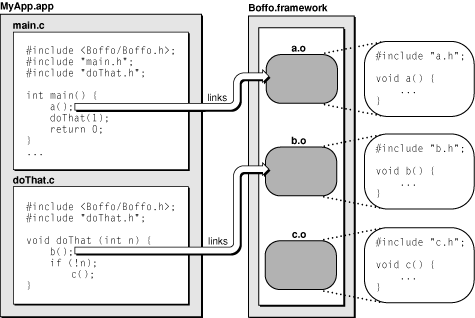

> 导航：[总目录](../../../README.md) · [documentation](../../../_indexes/documentation.md) · [Framework Programming Guide](Introduction%20to%20Framework%20Programming%20Guide.md)


[Next](Frameworks%20and%20Weak%20Linking.md)[Previous](Framework%20Versions.md)

# Frameworks and Binding

Dynamic binding of Mach-O libraries brings a considerable power and flexibility to OS X. Through dynamic binding, frameworks can be updated transparently without requiring applications to relink to them. At runtime, a single copy of the library’s code is shared among all the processes using it, thus reducing memory usage and improving system performance.

The executable code in a framework bundle is a dynamically linked, shared library—or, simply, a dynamic shared library. This is a library whose code can be shared by multiple concurrently running programs.

Dynamic shared libraries bring several benefits. One benefit is that they enable memory to be used more efficiently. Instead of programs retaining a copy of the code in memory, all programs share the same copy. Dynamic shared libraries also make it easier for developers to fix bugs in library code. Because the library is linked dynamically, the new library can be installed without rebuilding programs that rely on it.

Dynamic shared libraries have characteristics that set them apart from static linked shared libraries. For static linked shared libraries, the symbols in the library are checked at link time to make sure they exist. If they don’t exist, link errors occur. With dynamic shared libraries, the binding of undefined symbols is delayed until the execution of the program. More importantly the dynamic link editor resolves each undefined symbol only when the symbol is referenced by the program. If a symbol is not referenced, it is not bound to the program.

The ability to bind symbols at runtime is made possible by the internal structure of Mach-O dynamic shared libraries. The object-code modules that make up the library are built to retain their individual boundaries; that is, the code from the source modules is not merged into a single module. At runtime, the dynamic link editor automatically loads and links modules only as they are needed. In other words, a module is linked only when a program references a symbol in that module. If the symbols in a particular module are not referenced, the module is not linked.

[Figure 1](#apple-f4xwc4dqnrsv64tfmyxwi33df52wszbpgiydambsgi2tmljzheydqobnineeircjizaus) illustrates this “lazy linking” behavior. In this example, module `a.o` is linked in the program’s `main` routine when library function `a` is called. Module `b.o` is linked when library function `b` in program function `doThat` is called. Module `c.o` is never linked because its function is never called.

__Figure 1__  Lazy linking of dynamic shared library modules



As a framework developer, you should design your dynamic shared library with this as-needed linking of separate modules in mind. Because the dynamic link editor always attempts to bind unresolved symbols within the same module before going on to other modules and other libraries, you should ensure that interdependent code is put in its own module. For example, custom allocation and deallocation routines should go in the same module. This technique prevents the wrong symbol definitions from being used. This problem can occur when definitions of a symbol exist in more than one dynamic shared library and those other symbol definitions override the correct one.

When you create a framework, you must ensure that each symbol is defined only once in a library. In addition, “common” symbols are not allowed in the library; you must use a single true definition and precede all other definitions with the `extern` keyword in C code.

When you build a program, linking it against a dynamic shared library, the installation path of the library is recorded in the program. For the system frameworks supplied by Apple, the path is absolute. For third-party frameworks, the path is relative to the application package that contains the framework. This capture of the library path improves launching performance for the program. Instead of having to search the file system, the dynamic link editor goes directly to the dynamic shared library and links it into the program. This means, obviously, that for a program to run, any required library must be installed where the recorded path indicates it can be found, or it must be installed in one of the standard fallback locations for frameworks and libraries. See [Installing Your Framework](Installing%20Your%20Framework.md#apple-f4xwc4dqnrsv64tfmyxwi33df52wszbpgiydambsgi3dclkcijbugrscjjaq) for more information.

Clients of dynamic shared libraries do not need to be aware of any dependencies required by the library. When a dynamic shared library is built, the static linker stores information about any dependent libraries inside the dynamic shared library executable. At runtime, the dynamic link editor reads this information and uses it to load the dependent libraries as needed.

Another important piece of information stored for each dependent library is the required version. Frameworks and dynamic shared libraries have version information associated with them. At runtime, the stored version information is compared against the actual version of the available library. If the available library is too old, the dynamic link editor may terminate the program to prevent undesirable behavior. For more information on library versioning, see [Framework Versions](Framework%20Versions.md#apple-f4xwc4dqnrsv64tfmyxwi33df52wszbpgiydambsgi2tklkcineukq2birca).

In addition to creating frameworks, you can create standalone dynamic shared libraries. By convention, stand-alone dynamic shared libraries have a `.dylib`  extension and are typically installed in `/usr/lib`. The library file contains all the code and resources needed by the library.

Creating standalone dynamic shared libraries is an uncommon approach for most developers. In most cases, frameworks are a preferred approach. The bundle structure of frameworks makes it possible to include complex resource types such as nib files, images, and localized strings.

Prior to OS X v10.3.4, OS X used a feature called prebinding to eliminate the load-time delays incurred by executables linked to dynamic libraries. Prebinding involved the precalculation of symbol addresses in each framework and library on the system. The goal of this precalculation was to avoid address-space conflicts among the libraries and frameworks. Such conflicts incurred tremendous performance penalties at load-time and would noticeably slow down the launch time of an application.

Improvements to the dynamic loader in OS X v10.3.4 made prebinding largely unnecessary. The dynamic loader itself was modified to handle load-time conflicts much more efficiently. Using the new dynamic loader, an application that is not prebound now usually launches at least as fast (and sometimes faster) than it did on earlier versions of the system when it was prebound.

In OS X v10.4, another change was introduced to the prebinding behavior to reduce the amount of time spent "optimizing" the system after installing new software. Instead of prebinding all frameworks and libraries, now only select system frameworks are prebound. By selectively choosing which frameworks are prebound, the prebinding tools are able to tightly pack the system's most frequently-used frameworks into a smaller memory space than before. This step reduces the amount of space reserved for Apple frameworks and gives it back to third-party applications and frameworks.

If you are developing frameworks to run on versions of OS X prior to 10.4, you should still enable prebinding and specify a preferred address. If you are developing frameworks for OS X v10.4 or later, prebinding is not required. Prebinding your framework on later versions of the system does not decrease performance, but does require some additional configuration steps, which are described in the sections that follow.

If you are developing a framework that runs on OS X v10.4 or earlier, you should specify your framework's preferred binding address in your Xcode project.

The following steps show you how to configure prebinding for an Xcode framework project:

1. Open your project in Xcode.
2. In the Groups & Files pane, select your target, open its Info window, and click Build.
3. Make sure the Prebinding build setting is turned on (you can enter `prebinding` in the search field to locate it).
4. To the Other Linker Flags build setting, add the `-seg1addr` flag along with the preferred address for your framework. For example, to set the preferred address of your framework to `0xb0000000`, you would enter:

```
-seg1addr 0xb0000000
```
5. Build and link your framework as usual.

When prebinding frameworks, it is especially important to specify a preferred address using the `-seg1addr` option. If you enable prebinding but do not specify a preferred address, Xcode uses the default address `0x00000000`. This is a problem because that address is also the preferred address for all applications. Instead, you should set the initial address to a region of memory reserved for use by your application code and frameworks. For a list of valid address ranges, see “Prebinding Your Application” in _[Launch Time Performance Guidelines](../../Performance/Launch%20Time%20Performance%20Guidelines/Introduction%20to%20Launch%20Time%20Performance%20Guidelines.md#apple-f4xwc4dqnrsv64tfmyxwi33df52wszbpgeydambqge2dq2i)_.

You can confirm the preferred address of your framework by examining the binary using the `otool` command. See [Finding the Preferred Address of a Framework](#apple-f4xwc4dqnrsv64tfmyxwi33df52wszbpgiydambsgi2tmljrga3tcmrs) for more information.

If you are prebinding your framework so that it can run on versions of OS X prior to 10.4, you should be aware of the following caveats:

- The address range occupied by your framework should not overlap the address ranges of any other libraries or frameworks you are developing. If your frameworks may have to coexist with other third-party libraries or frameworks, you can use `otool` to find the preferred addresses of those third-party products.
- Your framework must not contain references to any undefined symbols.
- Your framework must not override symbols defined in flat namespace libraries. For example, you cannot define your own `malloc` routine and then prebind using flat namespace libraries.
- Two frameworks (or libraries) cannot have circular dependencies.
- Your frameworks should always use two-level namespaces to avoid name collisions with symbols in other frameworks and libraries.
- Keep in mind that for an application to be prebound, all of its dependent frameworks must also be built prebound.

Choosing a unique preferred address for your framework can be tricky, especially if it must coexist with a number of third-party frameworks. Apple provides a set of valid ranges for your frameworks and applications to use. (See “Prebinding Your Application” in _[Launch Time Performance Guidelines](../../Performance/Launch%20Time%20Performance%20Guidelines/Introduction%20to%20Launch%20Time%20Performance%20Guidelines.md#apple-f4xwc4dqnrsv64tfmyxwi33df52wszbpgeydambqge2dq2i)_.) However, you may still run into areas of overlap with frameworks developed by other groups, either inside or outside your company.

Even if an overlap does occur among frameworks, your prebinding efforts are not in vain. The dynamic linker corrects overlaps immediately at runtime, moving frameworks around as needed. In versions of OS X prior to 10.4, a daemon also runs in the background to recalculate prebinding information for applications where that information is out-of-date.

To find the preferred address of a framework, use the `otool` command with the `-l` option to display the load commands for the framework’s binary file. The load commands include the virtual memory address at which to load each segment of the binary. Because most segments reside at an offset from the beginning of the library, you need to look at the initial `LC_SEGMENT` command to find the library’s preferred base address.

For example, suppose you create a library and assign it the preferred address `0xb0000000` in your Xcode project. Running `otool -l` on your library from a Terminal window would display an initial load command similar to the following:

```
Load command 0
      cmd LC_SEGMENT
  cmdsize 328
  segname __TEXT
   vmaddr 0xb0000000
   vmsize 0x00002000
  fileoff 0
 filesize 8192
  maxprot 0x00000007
 initprot 0x00000005
   nsects 4
    flags 0x0
```

Notice the value of the `vmaddr` field. This field indicates that the preferred address of the binary matches the address you specified in your Xcode project.

In versions of OS X prior to 10.4, Apple-provided frameworks are shipped prebound and are assigned to reserved regions of memory. In OS X v10.4 and later, Apple system frameworks are prebound dynamically when you install the operating system. In both cases, the memory ranges reserved by Apple are listed in “Prebinding Your Application” in _[Launch Time Performance Guidelines](../../Performance/Launch%20Time%20Performance%20Guidelines/Introduction%20to%20Launch%20Time%20Performance%20Guidelines.md#apple-f4xwc4dqnrsv64tfmyxwi33df52wszbpgeydambqge2dq2i)_.

[Next](Frameworks%20and%20Weak%20Linking.md)[Previous](Framework%20Versions.md)

