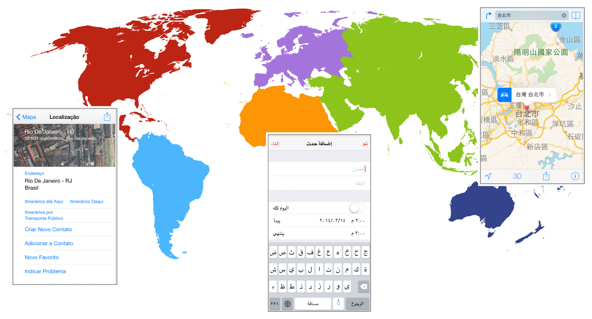
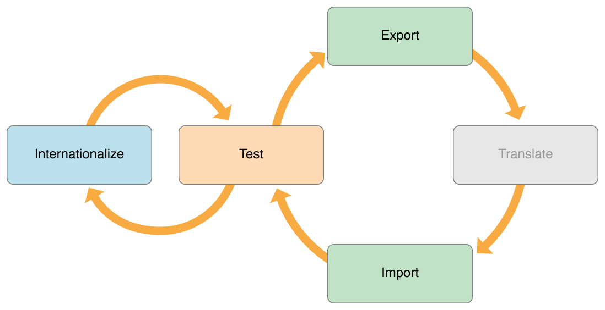

> 导航：[总目录](../../../README.md) · [documentation](../../../_indexes/documentation.md)

[Next](Reviewing%20Language%20and%20Region%20Settings.md)

# About Internationalization and Localization

Localization is the process of translating your app into multiple languages. But before you can localize your app, you internationalize it. Internationalization is the process of making your app able to adapt to different languages, regions, and cultures. Because a single language can be used in multiple parts of the world, your app should adapt to the regional and cultural conventions of where a person resides. An internationalized app appears as if it is a native app in all the languages and regions it supports.

The App Store is available in over 150 different countries, and internationalizing your app is the first step to reach this global market. In App Store Connect, you specify whether your app is available in all territories or specific territories. Then you customize your app for each target market that you want to support. Users in other countries want to use your app in a language they understand and see dates, times, and numbers in familiar, regional formats.

Xcode supports incremental localization of your project. First you internationalize your user interface and code during development. Then you test your app using pseudolocalizations and different region settings. When you are ready to localize your app, you export the localizable text using standard file formats and submit them to a localization team for translation into multiple languages. While you are waiting for these translations, you can continue developing your app and perform additional localization steps yourself—perhaps add language-specific audio and image files to your project. Then import the localizations into your project and thoroughly test your app in each supported language and region. During the next iteration of your app, you only translate changes and add additional languages.

### Learn About Language and Region Settings

Start by familiarizing yourself with the language and region settings available to the user.

### Internationalize Your App

Prepare your app for localization by separating language and locale differences from the rest of your user interface and code.

- Use base internationalization to separate user-facing text from your `.storyboard` and `.xib` files.
- In Interface Builder, use Auto Layout so views adjust to the localized text.
- Separate other user-facing text from your code.
- Use standard APIs to handle the complexity of different writing systems and locale formats.
- Adhere to the user’s settings when formatting, sorting, searching, and parsing data.
- If the app supports right-to-left languages, mirror the user interface and change the text direction as needed.

### Localize Your App

Export and import the localizations using standard file formats.

- Lock views in the user interface.
- Export the localizations.
- Submit the exported files to translators.
- Import the localization files and confirm the changes.
- Perform additional localization steps yourself.

Xcode doesn’t translate text for you. For links to third-party localization vendors, see [Build Apps for the World](https://developer.apple.com/internationalization/).

### Test Your App

Test your internationalized app, using a variety of techniques, during development and after localization.

Before you localize your app:

- In Interface Builder, preview the user interface using pseudolanguages.
- Run the app using different pseudolanguages.

After you import localizations:

- In Interface Builder, preview the localizations.
- Run the app with options that detect non-localized text.
- Run the app using all supported languages and regions.
- Ask native-language speakers to test the app.

The following documents provide more information about related topics:

- _[Xcode Overview](https://developer.apple.com/library/archive/documentation/ToolsLanguages/Conceptual/Xcode_Overview/index.html#//apple_ref/doc/uid/TP40010215)_ describes Xcode features and contains links to other Xcode books.
- _[Data Formatting Guide](../../Cocoa/Data%20Formatting%20Guide/Introduction%20to%20Data%20Formatting%20Programming%20Guide%20For%20Cocoa.md#apple-f4xwc4dqnrsv64tfmyxwi33df52wszbpgeydambqgazds2i)_ describes how to present and interpret calendrical and numerical data according to the user’s region settings.
- _[Date and Time Programming Guide](../../Cocoa/Date%20and%20Time%20Programming%20Guide/About%20Dates%20and%20Times.md#apple-f4xwc4dqnrsv64tfmyxwi33df52wszbpgeydambqgazts2i)_ describes how to manage dates and times according to different calendars and time zones in use around the world.
- _[Internationalization and Localization for OS X](../../../samplecode/Internationalization%20and%20Localization%20for%20OS%20X/Internationalization%20and%20Localization%20for%20OS%20X.md#apple-f4xwc4dqnrsv64tfmyxwi33df52wszbpirkfgnbqgaydonzsg4)_ provides code samples that illustrate internationalization and localization techniques and APIs.

Before you submit your localized app to the App Store or Mac App Store, add territories and localize your metadata using App Store Connect:

- [View and edit app information](https://help.apple.com/itunes-connect/developer/#/dev97865727c)
- [Localize App Store information](https://help.apple.com/itunes-connect/developer/#/deve6f78a8e2)
[Next](Reviewing%20Language%20and%20Region%20Settings.md)

