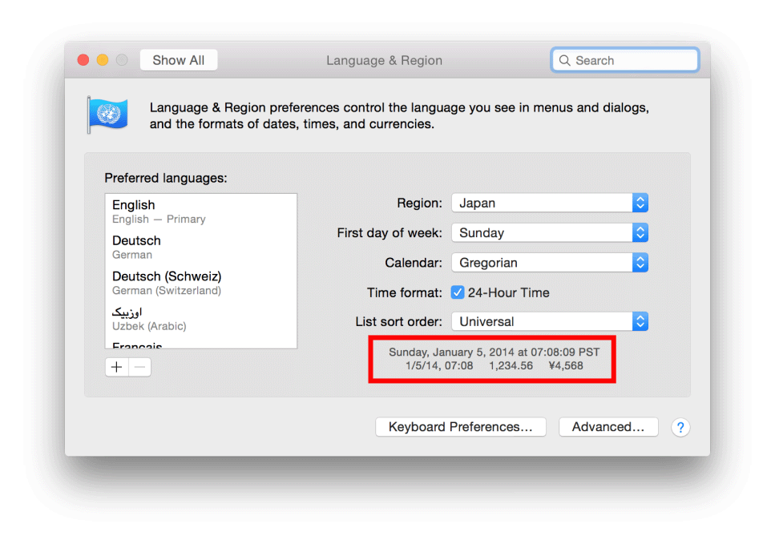

> 导航：[总目录](../../../README.md) · [documentation](../../../_indexes/documentation.md) · [Internationalization and Localization Guide](About%20Internationalization%20and%20Localization.md)


[Next](Supporting%20Right-to-Left%20Languages.md)[Previous](Internationalizing%20Your%20Code.md)

# Formatting Data Using the Locale Settings

Different countries and regions have different conventions for formatting numerical and time-based information. Locale settings provide information about the formats used by the current user and must be considered when writing code that handles user-facing data types. The user sets the locale by choosing a region in Settings on iOS devices and System Preferences on a Mac. The user can also change locale settings while the app is running. Therefore, if you manipulate data objects in your code and then present them to the user, use the locale APIs to format the data correctly.

You do not need to know how to format data in all the different locales. You can use preset styles that automatically generate locale-sensitive formats. You can use custom formats as long as you convert them to locale-sensitive formats before presenting them to users. This chapter explains how to write locale-sensitive code.

Locales represent the formatting choices for a particular user, not the user’s preferred language. These are often the same but can be different. For example, a native English speaker who lives in Germany might select English as the language and Germany as the region. Text appears in English but dates, times, and numbers follow German formatting rules. The day precedes the month and a 24-hour clock represents times, as shown in Table 4-1.

__Table 4-1__  Data formats in United States and Germany

| Language (Region) | Dates | Times | Numbers |
| English (United States) | Sunday, January 5, 2014  1/5/14 | 7:08:09 AM PST  7:08 AM | 1,234.56  $4,567.89 |
| English (Germany) | Sunday 5 January 2014  05/01/14 | 07:08:09 PST  07:08 | 1.234,56  €4.567,89 |

On a Mac, you can preview modified locale preferences in System Preferences. When you choose a geographic region from the Region pop-up menu, samples of the date, time, and number formats appear. This screenshot shows sample data formats when English is the language and Japan is the region:



Mac users can also customize the formats of dates, times, and numbers by clicking the Advanced button, as described in [Reviewing Language and Region Preferences on Your Mac](Reviewing%20Language%20and%20Region%20Settings.md#apple-f4xwc4dqnrsv64tfmyxwi33df52wszbpgeydambqge3tc2jninedcmrnknltg).

An [NSLocale](https://developer.apple.com/documentation/foundation/nslocale) object encapsulates information about the formatting standards of a particular region. When you format user-facing text, you pass an [NSLocale](https://developer.apple.com/documentation/foundation/nslocale) object representing the user’s selected region. The [NSLocale](https://developer.apple.com/documentation/foundation/nslocale) class provides class methods for obtaining the user’s locale object and other information about supported locales.

You can obtain the user’s locale using either the [currentLocale](https://developer.apple.com/documentation/foundation/nslocale/1409990-currentlocale) or [autoupdatingCurrentLocale](https://developer.apple.com/documentation/foundation/nslocale/1414388-autoupdatingcurrent) class methods in the [NSLocale](https://developer.apple.com/documentation/foundation/nslocale) class.

If you use the [currentLocale](https://developer.apple.com/documentation/foundation/nslocale/1409990-currentlocale) method, the property values of the returned object are guaranteed not to change. Therefore, use the [currentLocale](https://developer.apple.com/documentation/foundation/nslocale/1409990-currentlocale) method if you want to perform operations that need to be consistent.

If you use the [autoupdatingCurrentLocale](https://developer.apple.com/documentation/foundation/nslocale/1414388-autoupdatingcurrent) method, the property values can change when the user changes the region settings. However, you are not notified if the returned object changes.

To observe locale preference changes, read [Registering for Locale and Time Zone Changes](#apple-f4xwc4dqnrsv64tfmyxwi33df52wszbpgeydambqge3tc2jninedcmznknltcmy).

Use the [objectForKey:](https://developer.apple.com/documentation/foundation/nslocale/1418430-objectforkey) instance method in the [NSLocale](https://developer.apple.com/documentation/foundation/nslocale) class to access information about a locale. For example, pass the [NSLocaleUsesMetricSystem](https://developer.apple.com/documentation/foundation/nslocale/key/1410780-usesmetricsystem) key to this method to get a Boolean number that determines whether the locale uses the metric system:

```
NSNumber *metricSystem = [[NSLocale currentLocale] objectForKey:NSLocaleUsesMetricSystem];
```

Pass the [NSLocaleCurrencySymbol](https://developer.apple.com/documentation/foundation/nslocale/key/1412279-currencysymbol) key to get a string representation of the locale’s currency symbol:

```
NSString *currencySymbol = [[NSLocale currentLocale] objectForKey:NSLocaleCurrencySymbol];
```

For a complete list of locale property keys, see `NSLocale Component Keys`.

The identifiers that specify languages and dialects in APIs and folder names—for example, `de-CH`, `en-AU`, and `pt-PT`—shouldn’t be displayed to users. To get a human-readable, localized language or dialect name, use the [displayNameForKey:value:](https://developer.apple.com/documentation/foundation/nslocale/1415931-displayname) method in the [NSLocale](https://developer.apple.com/documentation/foundation/nslocale) class, passing [NSLocaleIdentifier](https://developer.apple.com/documentation/foundation/nslocaleidentifier) as the key parameter.

__To get the localized name for languages and dialects__

1. Get the language that the app is using.

```
NSString *languageID = [[NSBundle mainBundle] preferredLocalizations].firstObject;
```

   The returned string is a language ID that identifies a written language or dialect, as described in [Language and Locale IDs](Language%20and%20Locale%20IDs.md#apple-f4xwc4dqnrsv64tfmyxwi33df52wszbpgeydambqge3tc2jninedcnjnknltc).
2. Get the associated locale object.

```
NSLocale *locale = [NSLocale localeWithLocaleIdentifier:languageID];
```

   If you pass the language ID as the locale ID parameter, a locale for the language is returned. For example, if you pass `de-CH` as the language, the Switzerland locale is returned.
3. Get the localized language name.

```
NSString *localizedString = [locale displayNameForKey:NSLocaleIdentifier value:languageID];
```

The format of the string is `[Language] ([Dialect])`. For example, if the language ID is `de-CH`, the localized language string is “Deutsch (Schweiz).” If the language ID is `de`, the localized language string is “Deutsch.”

Beginning and ending quotes, which vary in different languages, can be obtained from the locale object. Use the same technique, described in [Getting Localized Language and Dialect Names](#apple-f4xwc4dqnrsv64tfmyxwi33df52wszbpgeydambqge3tc2jninedcmznknltema), to obtain the default locale for the language, and then use the locale component keys to obtain the language-specific quotes.

__To create a string that uses locale-sensitive quotes__

1. Get the language that the app is using.

```
NSString *languageID = [[NSBundle mainBundle] preferredLocalizations].firstObject;
```
2. Get the associated locale object.

```
NSLocale *locale = [NSLocale localeWithLocaleIdentifier:languageID];
```
3. Get the beginning and ending symbols for quotes from the locale object.

```
bQuote = [locale objectForKey:NSLocaleQuotationBeginDelimiterKey];
eQuote = [locale objectForKey:NSLocaleQuotationEndDelimiterKey];
```
4. Format a string using the locale-sensitive quotes.

```
quotedString = [NSString stringWithFormat:@"%@%@%@", bQuote, myText, eQuote];
```

Table 4-2 shows the results when `myText` is `“@iPhone”`for different regions.

__Table 4-2__  Quotes in China, France, and Japan

| Region | quotedString = @"%@iPhone%@" |
| China | “iPhone” |
| France | ../Art/french_iphone.svg |
| Japan | ../Art/japanese_iphone.svg |

If available, use the alternative, locale-sensitive [NSString](https://developer.apple.com/library/archive/documentation/LegacyTechnologies/WebObjects/WebObjects_3.5/Reference/Frameworks/ObjC/Foundation/Classes/NSStringClassCluster/Description.html#//apple_ref/occ/cl/NSString) method for user-facing text. There are locale-sensitive methods for creating strings with formats, changing the case, obtaining ranges within a string, and comparing strings.

At a minimum, use the [localizedStringWithFormat:](https://developer.apple.com/library/archive/documentation/LegacyTechnologies/WebObjects/WebObjects_3.5/Reference/Frameworks/ObjC/Foundation/Classes/NSStringClassCluster/Description.html#//apple_ref/occ/clm/NSString/localizedStringWithFormat:) method in the [NSString](https://developer.apple.com/library/archive/documentation/LegacyTechnologies/WebObjects/WebObjects_3.5/Reference/Frameworks/ObjC/Foundation/Classes/NSStringClassCluster/Description.html#//apple_ref/occ/cl/NSString) class, not the [stringWithFormat:](https://developer.apple.com/library/archive/documentation/LegacyTechnologies/WebObjects/WebObjects_3.5/Reference/Frameworks/ObjC/Foundation/Classes/NSStringClassCluster/Description.html#//apple_ref/occ/clm/NSString/stringWithFormat:) method to format user-facing text. A simple fix to existing code is to replace occurrences of the [stringWithFormat:](https://developer.apple.com/library/archive/documentation/LegacyTechnologies/WebObjects/WebObjects_3.5/Reference/Frameworks/ObjC/Foundation/Classes/NSStringClassCluster/Description.html#//apple_ref/occ/clm/NSString/stringWithFormat:) method with the alternate [localizedStringWithFormat:](https://developer.apple.com/library/archive/documentation/LegacyTechnologies/WebObjects/WebObjects_3.5/Reference/Frameworks/ObjC/Foundation/Classes/NSStringClassCluster/Description.html#//apple_ref/occ/clm/NSString/localizedStringWithFormat:) method throughout your code, as in:

```
NSString *localizedString = [NSString localizedStringWithFormat:@"%3.2f", myNumber];
```

This method uses the system locale. To specify the user’s locale preference, pass `[NSLocale currentLocale]` as the locale parameter to either the [initWithFormat:locale:](https://developer.apple.com/library/archive/documentation/LegacyTechnologies/WebObjects/WebObjects_3.5/Reference/Frameworks/ObjC/Foundation/Classes/NSStringClassCluster/Description.html#//apple_ref/occ/instm/NSString/initWithFormat:locale:) or [initWithFormat:locale:arguments:](https://developer.apple.com/library/archive/documentation/LegacyTechnologies/WebObjects/WebObjects_3.5/Reference/Frameworks/ObjC/Foundation/Classes/NSStringClassCluster/Description.html#//apple_ref/occ/instm/NSString/initWithFormat:locale:arguments:) method. For best results, use data-specific formatter objects and preset styles, described in [Formatting Dates and Times](#apple-f4xwc4dqnrsv64tfmyxwi33df52wszbpgeydambqge3tc2jninedcmznknltk) and [Formatting Numbers](#apple-f4xwc4dqnrsv64tfmyxwi33df52wszbpgeydambqge3tc2jninedcmznknltq).

The process of changing the case in strings is not the same for all languages. Use these locale-sensitive [NSString](https://developer.apple.com/library/archive/documentation/LegacyTechnologies/WebObjects/WebObjects_3.5/Reference/Frameworks/ObjC/Foundation/Classes/NSStringClassCluster/Description.html#//apple_ref/occ/cl/NSString) methods to change the case:

- [uppercaseStringWithLocale:](https://developer.apple.com/documentation/foundation/nsstring/1413316-uppercased)
- [lowercaseStringWithLocale:](https://developer.apple.com/documentation/foundation/nsstring/1417298-lowercasestringwithlocale)
- [capitalizedStringWithLocale:](https://developer.apple.com/documentation/foundation/nsstring/1414023-capitalized)

If you pass `nil` as the locale parameter, the system locale is used, which is incorrect. To specify the user’s locale preference, pass `[NSLocale currentLocale]` as the locale parameter.

You use the [NSDateFormatter](https://developer.apple.com/library/archive/documentation/LegacyTechnologies/WebObjects/WebObjects_3.5/Reference/Frameworks/ObjC/Foundation/Classes/NSDateFormatter/Description.html#//apple_ref/occ/cl/NSDateFormatter) class to create localized string representations of [NSDate](https://developer.apple.com/library/archive/documentation/LegacyTechnologies/WebObjects/WebObjects_3.5/Reference/Frameworks/ObjC/Foundation/Classes/NSDateClassCluster/Description.html#//apple_ref/occ/cl/NSDate) objects that are also locale-sensitive. [NSDateFormatter](https://developer.apple.com/library/archive/documentation/LegacyTechnologies/WebObjects/WebObjects_3.5/Reference/Frameworks/ObjC/Foundation/Classes/NSDateFormatter/Description.html#//apple_ref/occ/cl/NSDateFormatter) objects are often attached directly to text fields in an Interface Builder file, but if you create [NSDateFormatter](https://developer.apple.com/library/archive/documentation/LegacyTechnologies/WebObjects/WebObjects_3.5/Reference/Frameworks/ObjC/Foundation/Classes/NSDateFormatter/Description.html#//apple_ref/occ/cl/NSDateFormatter) objects programmatically, be sure to use methods that return localized string representations.

To obtain a localized string representation of a date and time using a preset style, use the [localizedStringFromDate:dateStyle:timeStyle:](https://developer.apple.com/documentation/foundation/dateformatter/1415241-localizedstring) class method in the [NSDateFormatter](https://developer.apple.com/library/archive/documentation/LegacyTechnologies/WebObjects/WebObjects_3.5/Reference/Frameworks/ObjC/Foundation/Classes/NSDateFormatter/Description.html#//apple_ref/occ/cl/NSDateFormatter) class:

```
NSString *localizedDateTime = [NSDateFormatter localizedStringFromDate:[NSDate date] dateStyle:NSDateFormatterMediumStyle timeStyle:NSDateFormatterShortStyle];
```

For example, specify a medium style to abbreviate text—such as “Jun 10, 2013”—by passing [NSDateFormatterMediumStyle](https://developer.apple.com/documentation/foundation/nsdateformatterstyle/nsdateformattermediumstyle) as the style parameter. Specify a short style for numerical only representations—such as “6/10/13” or “11:03 AM”—by passing [NSDateFormatterShortStyle](https://developer.apple.com/documentation/foundation/dateformatter/style/short) as the style parameter. Table 4-3 shows the results of using preset formats when English is the language and United States is the region.

__Table 4-3__  Preset date and time styles in English for the United States

| Style | Date | Time | Description |
| Short | 6/10/13 | 11:03 AM | Numeric only |
| Medium | Jun 10, 2013 | 11:03:15 AM | Abbreviated text |
| Long | June 10, 2013 | 11:03:15 AM PDT | Full text |
| Full | Friday, June 10, 2013 | 11:03:15 AM Pacific Daylight Time | Complete details |
| No Style |  |  | Output suppressed |

Table 4-4 shows the results of passing [NSDateFormatterMediumStyle](https://developer.apple.com/documentation/foundation/nsdateformatterstyle/nsdateformattermediumstyle) for the date style and [NSDateFormatterShortStyle](https://developer.apple.com/documentation/foundation/dateformatter/style/short) for the time style for different languages and regions.

__Table 4-4__  Preset date and time styles in different languages and regions

| Language (Region) | Medium style | Short style |
| English (United States) | Jun 6, 2013 | 10:14 AM |
| French (France) | 6 Jun 2013 | 10:14 |
| Chinese (China) | ../Art/chinese_date_year.svg | ../Art/chinese_time.svg |

Use custom date and time styles only when the preset styles don’t meet your needs. However, convert your custom format to a locale-sensitive format before getting string representations of the date and time. The [dateFormatFromTemplate:options:locale:](https://developer.apple.com/documentation/foundation/nsdateformatter/1408112-dateformatfromtemplate) class method in the [NSDateFormatter](https://developer.apple.com/library/archive/documentation/LegacyTechnologies/WebObjects/WebObjects_3.5/Reference/Frameworks/ObjC/Foundation/Classes/NSDateFormatter/Description.html#//apple_ref/occ/cl/NSDateFormatter) class rearranges the given template to adhere to the specified locale.

__To get a localized string representation of a date and time using a custom style__

1. Create an [NSDateFormatter](https://developer.apple.com/library/archive/documentation/LegacyTechnologies/WebObjects/WebObjects_3.5/Reference/Frameworks/ObjC/Foundation/Classes/NSDateFormatter/Description.html#//apple_ref/occ/cl/NSDateFormatter) object.

```
NSDateFormatter *dateFormatter = [NSDateFormatter new];
```
2. Use the [dateFormatFromTemplate:options:locale:](https://developer.apple.com/documentation/foundation/nsdateformatter/1408112-dateformatfromtemplate) class method to get a localized format string from a template that you provide.

```
NSString *localeFormatString = [NSDateFormatter dateFormatFromTemplate:@"dMMM" options:0 locale:dateFormatter.locale];
```

   The template parameter of the [dateFormatFromTemplate:options:locale:](https://developer.apple.com/documentation/foundation/nsdateformatter/1408112-dateformatfromtemplate) method should adhere to Unicode Technical Standard #35, described in [Use Format Strings to Specify Custom Formats](../../Cocoa/Data%20Formatting%20Guide/Number%20Formatters.md#apple-f4xwc4dqnrsv64tfmyxwi33df52wszbpkridimbqgazdgnryfvjvoni). For example, the template `@”dMMM”` specifies that the day of the month and abbreviation for the month should be in the format string. The order of the symbols and any non-symbol characters in the template are ignored.
3. Set the format of the [NSDateFormatter](https://developer.apple.com/library/archive/documentation/LegacyTechnologies/WebObjects/WebObjects_3.5/Reference/Frameworks/ObjC/Foundation/Classes/NSDateFormatter/Description.html#//apple_ref/occ/cl/NSDateFormatter) instance to the locale-sensitive format string.

```
dateFormatter.dateFormat = localeFormatString;
```
4. Use the [stringFromDate:](https://developer.apple.com/documentation/foundation/nsdateformatter/1415810-stringfromdate) method to get a localized string representation of the date.

```
NSString *localizedString = [dateFormatter stringFromDate:[NSDate date]];
```

For example, if you don’t convert the `@“MMM d”` string to a locale-sensitive format, the results are not localized, as shown in the second column in Table 4-5.

__Table 4-5__  Non-localized and localized date formats in different regions

| Language (Region) | Date using format string  “MMM d” | Date using template  “dMMM” |
| English (United States) | Nov 13 | Nov 13 |
| French (France) | nov. 13 | 13 nov. |
| Chinese (China) | ../Art/chinese_date_incorrect.svg | ../Art/chinese_date.svg |

The user enters dates using localized formats, so parse input strings accordingly. Use an [NSDateFormatter](https://developer.apple.com/library/archive/documentation/LegacyTechnologies/WebObjects/WebObjects_3.5/Reference/Frameworks/ObjC/Foundation/Classes/NSDateFormatter/Description.html#//apple_ref/occ/cl/NSDateFormatter) object to convert a localized string to a date object. Set the date formatter’s style using one of the preset styles. (Use a template format string only if a preset style doesn’t work.) Also, allow the date formatter to use heuristics when parsing the string.

__To convert a localized date string to a date object__

1. Create a date formatter object.

```
NSDateFormatter *dateFormatter = [NSDateFormatter new];
```
2. Set the formatter’s style to a preset style.

```
dateFormatter.dateStyle = NSDateFormatterMediumStyle;
```

   Replace [NSDateFormatterMediumStyle](https://developer.apple.com/documentation/foundation/nsdateformatterstyle/nsdateformattermediumstyle) with the style you expect the user to enter.
3. If the input string is not expected to contain a time, set the time style to none.

```
dateFormatter.timeStyle = NSDateFormatterNoStyle;
```
4. Set the leniency to `YES` (enables the heuristics).

```
dateFormatter.lenient = YES];
```
5. Convert the string to a date object.

```
NSDate *date = [dateFormatter dateFromString:inputString];
```

For example, if the locale is United States, the input string is `9/3/14`, and the preset style is [NSDateFormatterShortStyle](https://developer.apple.com/documentation/foundation/dateformatter/style/short), the date is interpreted as `2014-09-03 07:00:00 +0000`. However, if the locale is Germany, the date becomes `2014-03-09 08:00:00 +0000`.

Locale settings affect the format of numbers—such as the decimal, thousands separator, currency, and percentage symbols. For example, the number 1,234.56 is formatted as 1.234,56 in Italy. So use the [NSNumberFormatter](https://developer.apple.com/library/archive/documentation/LegacyTechnologies/WebObjects/WebObjects_3.5/Reference/Frameworks/ObjC/Foundation/Classes/NSNumberFormatter/Description.html#//apple_ref/occ/cl/NSNumberFormatter) class to create localized string representations of [NSNumber](https://developer.apple.com/library/archive/documentation/LegacyTechnologies/WebObjects/WebObjects_3.5/Reference/Frameworks/ObjC/Foundation/Classes/NSNumber/Description.html#//apple_ref/occ/cl/NSNumber) objects.

To obtain a localized string representation of a number using a preset style, use the [localizedStringFromNumber:numberStyle:](https://developer.apple.com/documentation/foundation/numberformatter/1416418-localizedstring) class method in the [NSNumberFormatter](https://developer.apple.com/library/archive/documentation/LegacyTechnologies/WebObjects/WebObjects_3.5/Reference/Frameworks/ObjC/Foundation/Classes/NSNumberFormatter/Description.html#//apple_ref/occ/cl/NSNumberFormatter) class:

```
NSString *localizedString = [NSNumberFormatter localizedStringFromNumber:myNumber numberStyle:NSNumberFormatterDecimalStyle];
```

Table 4-6 lists the preset styles available and compares United States preset formats to other regions.

__Table 4-6__  Preset number styles in different languages and regions

| Style | Formatted string,  English (United States) | Formatted string,  Language (Region) |
| Decimal | 1,234.56 | 1.234,56  Italian (Italy) |
| Currency | $1,234.56 | ../Art/chinese_currency.svg  Chinese (China) |
| Percent | 123,456% | ../Art/arabic_percent.svg  Arabic (Egypt) |
| Scientific | 1.23456E+03 | 1,23456E3  Italian (Italy) |
| Spell Out | one thousand two hundred thirty-four point five six | ../Art/chinese_spellout.svg  Chinese (China) |

The user may enter numbers using localized formats, so parse these input strings accordingly. Use an [NSNumberFormatter](https://developer.apple.com/library/archive/documentation/LegacyTechnologies/WebObjects/WebObjects_3.5/Reference/Frameworks/ObjC/Foundation/Classes/NSNumberFormatter/Description.html#//apple_ref/occ/cl/NSNumberFormatter) object to convert a string to a number object. Set the number formatter’s style using one of the preset styles. Also, allow the number formatter to use heuristics when parsing the string.

__To convert a localized number string to a number object__

1. Create a number formatter object.

```
NSNumberFormatter *numberFormatter = [NSNumberFormatter new];
```
2. Set the formatter’s style to a preset style.

```
numberFormatter.numberStyle = NSNumberFormatterDecimalStyle;
```

   Replace [NSNumberFormatterDecimalStyle](https://developer.apple.com/documentation/foundation/numberformatter/style/decimal) with the style you expect the user to enter.
3. Set the leniency to `YES` (enables the heuristics).

```
numberFormatter.lenient = YES;
```
4. Convert the string to a number object.

```
NSNumber *number = [numberFormatter numberFromString:inputString];
```


The [NSCalendar](https://developer.apple.com/documentation/foundation/nscalendar) class encapsulates all the regional differences and complexities of calendars, shown in Table 4-7. The era changes more frequently in some calendars than others—for example, the era in the Japanese calendar changes with each new emperor. The number of months per year can be 12 or 13. The length of a month can vary from year to year. Even in the Gregorian calendar, the first day of the week can be Saturday, Sunday, or Monday. [NSCalendar](https://developer.apple.com/documentation/foundation/nscalendar) objects know about time zones and which regions observe daylight savings time. Calendar calculations—such as the third Tuesday of the month—depend on the user’s calendar and region.

__Table 4-7__  Variations in regional calendars

| Calendar unit | Possible values |
| Year | 2011, 1432, 2554, 5771 |
| Era | AD, Heisei |
| Number of months per year | 12, 13, variable |
| Lengths of months | From 5 to 31 days |
| First day of week | Saturday, Sunday, Monday |
| When years change | ../Art/japanese_years_change.svg |

Therefore, use the [NSCalendar](https://developer.apple.com/documentation/foundation/nscalendar) class for all calendrical calculations such as computing the number of days in a month, computing delta values, and getting components of a date. You can use an [NSDate](https://developer.apple.com/library/archive/documentation/LegacyTechnologies/WebObjects/WebObjects_3.5/Reference/Frameworks/ObjC/Foundation/Classes/NSDateClassCluster/Description.html#//apple_ref/occ/cl/NSDate) object for internal calculations but use an [NSCalendar](https://developer.apple.com/documentation/foundation/nscalendar) object for computations of user-facing dates.

To get the calendar for the user’s locale, use the [currentCalendar](https://developer.apple.com/documentation/foundation/nscalendar/1408501-current) class method in [NSCalendar](https://developer.apple.com/documentation/foundation/nscalendar) class:

```
NSCalendar *currentCalendar = [NSCalendar currentCalendar];
```

Use an [NSDateComponents](https://developer.apple.com/documentation/foundation/nsdatecomponents) object to access the calendar units of a date.

__To get the components of a date__

1. Create an [NSDateComponents](https://developer.apple.com/documentation/foundation/nsdatecomponents) object.

```
NSDateComponents *components = [[NSCalendar currentCalendar]
    components:NSDayCalendarUnit | NSMonthCalendarUnit | NSYearCalendarUnit | NSEraCalendarUnit
    fromDate:[NSDate date]];
```
2. Access the values for day, month, year, and era.

```
NSInteger day = [components day];
NSInteger month = [components month];
NSInteger year = [components year];
NSInteger era = [components era];
```

For more information on using the [NSCalendar](https://developer.apple.com/documentation/foundation/nscalendar) and [NSDateComponents](https://developer.apple.com/documentation/foundation/nsdatecomponents) classes, read _[Date and Time Programming Guide](../../Cocoa/Date%20and%20Time%20Programming%20Guide/About%20Dates%20and%20Times.md#apple-f4xwc4dqnrsv64tfmyxwi33df52wszbpgeydambqgazts2i)_ or watch _WWDC 2013: Solutions to Common Date and Time Challenges_.

To receive notification of locale changes, add your object as an observer of the [NSCurrentLocaleDidChangeNotification](https://developer.apple.com/documentation/foundation/nslocale/1418141-currentlocaledidchangenotificati) notification:

```
[[NSNotificationCenter defaultCenter] addObserver:self selector:@selector(localeDidChange:) name:NSCurrentLocaleDidChangeNotification object:nil];
```

To receive notification of time zone changes, observe the [NSSystemTimeZoneDidChangeNotification](https://developer.apple.com/documentation/foundation/nsnotification/name/1387256-nssystemtimezonedidchange) notification. For example, if the user is traveling, the time zone might change while your app is running. A long time may elapse since the last time your app was active.

Implement the change notification method to reformat and display all user-facing dates, times, and numbers using the user’s new locale settings.

[Next](Supporting%20Right-to-Left%20Languages.md)[Previous](Internationalizing%20Your%20Code.md)

