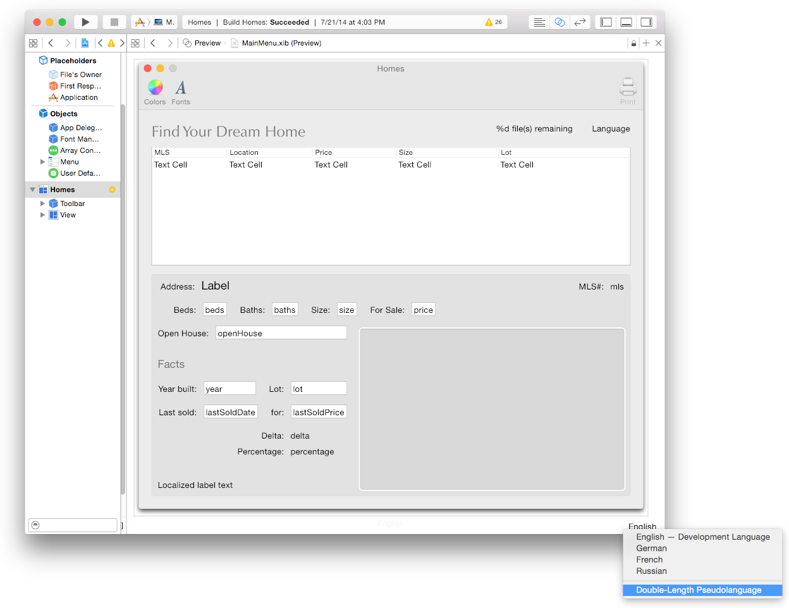
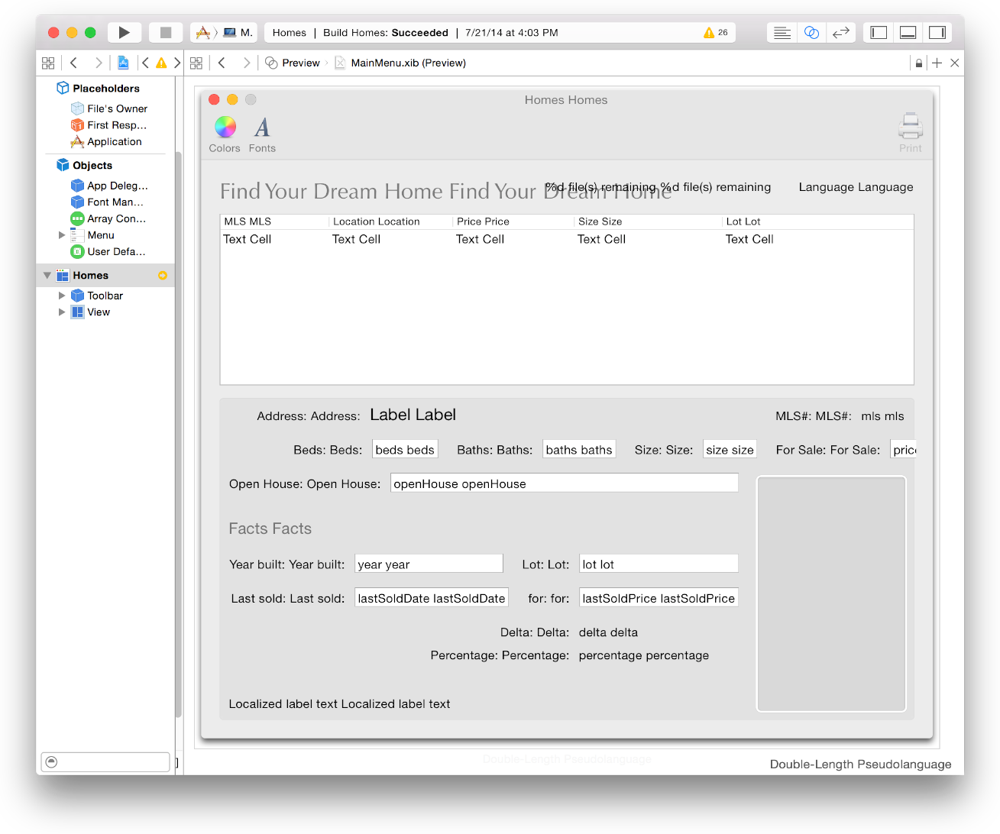
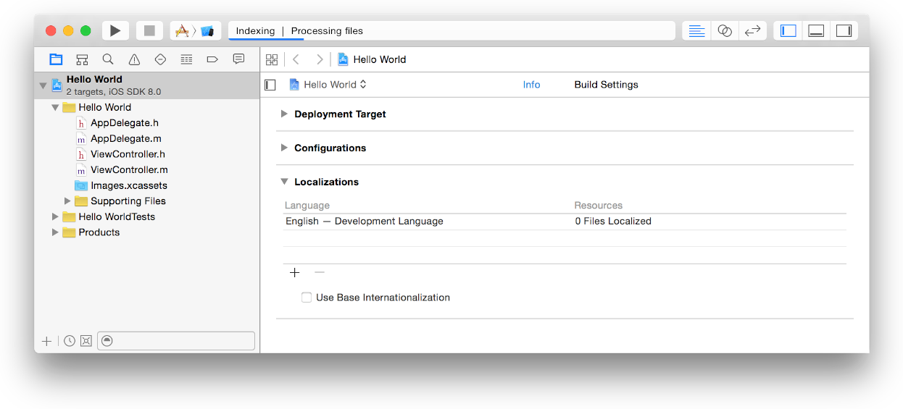
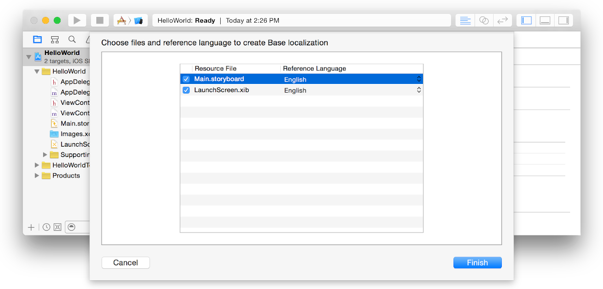
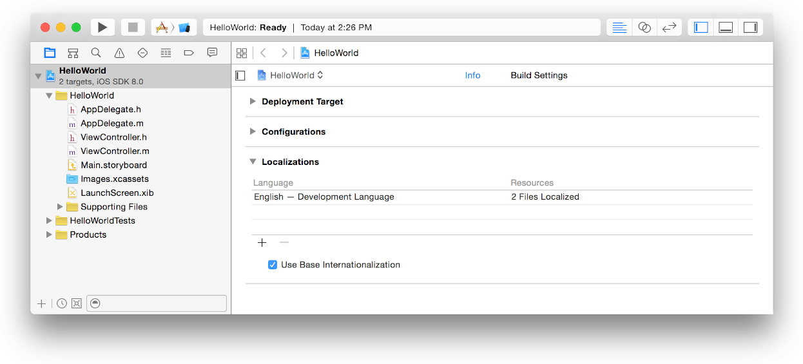

> 导航：[总目录](../../../README.md) · [documentation](../../../_indexes/documentation.md) · [Internationalization and Localization Guide](About%20Internationalization%20and%20Localization.md)

[Next](Internationalizing%20Your%20Code.md)[Previous](Reviewing%20Language%20and%20Region%20Settings.md)

# Internationalizing the User Interface

Xcode provides several technologies to help you develop an internationalized app. Xcode separates user-facing text from your views and layout so user-facing text can be easily translated independent of your Xcode project. Xcode also provides tools to maintain this separation when you change the user interface. In addition, you may have different sets of other types of resource files for each language you support.

Base internationalization separates user-facing strings from `.storyboard` and `.xib` files. It relieves localizers of the need to modify `.storyboard` and `.xib` files in Interface Builder. Instead, an app has just one set of `.storyboard` and `.xib` files where strings are in the _development language_—the language that you used to create the `.storyboard` and `.xib` files. These `.storyboard` and `.xib` files are called the _base internationalization_. When you export localizations, the development language strings are the source that is translated into multiple languages. When you import localizations, Xcode generates language-specific strings files for each `.storyboard` and `.xib` file. The strings files don’t appear in the project navigator until you import localizations or add languages.

In Xcode 5 and later, base internationalization is enabled by default. If you have an older project, enable base internationalization before continuing, as described in [Enabling Base Internationalization](#apple-f4xwc4dqnrsv64tfmyxwi33df52wszbpgeydambqge3tc2jninedglktk42a).

Use Auto Layout to lay out your views relative to each other without fixed origins, widths, and heights, so that views reposition and resize appropriately when the language or locale changes. Auto Layout makes it possible to have one set of `.storyboard` and `.xib` files for all languages.

Follow these tips when using Auto Layout for internationalized apps:

__Remove fixed width constraints.__ Allow views that display localized text to resize. If you use fixed width constraints, localized text may appear cropped in some languages.

__Use intrinsic content sizes.__ The default behavior for text fields and labels is to resize automatically. If a view is not adjusting to the size of localized text, select the view and choose Editor > Size To Fit Content.

__Use leading and trailing attributes.__ When adding constraints, use the attributes `leading` and `trailing` for horizontal constraints. For left-to-right languages, such as English, the attributes `leading` and `trailing` are equivalent to `left` and `right`. For right-to-left language, such as Hebrew or Arabic, `leading` and `trailing` are equivalent to `right` and `left`. The `leading` and `trailing` attributes are the default values for horizontal constraints.

__Pin views to adjacent views.__ Pinning causes a domino effect. When one view resizes to fit localized text, other views do the same. Otherwise, views may overlap in some languages.

__Constantly test your layout changes.__ Test your app using different language settings, as described in [Testing Your Internationalized App](Testing%20Your%20Internationalized%20App.md#apple-f4xwc4dqnrsv64tfmyxwi33df52wszbpgeydambqge3tc2jninedolktk4yq).

__Don’t set the minimum size or maximum size of a window.__ Let the window and its content view adjust to the size of the containing views, which may change when the language changes.

Auto Layout is enabled by default when you create a new project. To enable Auto Layout for an older project, read Adopting Auto Layout in _[Auto Layout Guide](https://developer.apple.com/library/archive/documentation/UserExperience/Conceptual/AutolayoutPG/index.html#//apple_ref/doc/uid/TP40010853)_. To learn how to add constraints and resolve constraint issues, read _[Auto Layout Guide](https://developer.apple.com/library/archive/documentation/UserExperience/Conceptual/AutolayoutPG/index.html#//apple_ref/doc/uid/TP40010853)_.

In Interface Builder, you can preview the user interface using pseudolocalizations to detect Auto Layout problems. Before you localize your app and add languages, only pseudolocalizations are available in Interface Builder.

__To preview the user interface in a pseudolocalization__

1. In project navigator, select the `.storyboard` or `.xib` file you want to preview.
2. Choose View > Assistant Editor > Show Assistant Editor.
3. In the assistant editor jump bar, open the Assistant pop-up menu, scroll to the Preview item, and choose the `.storyboard` or `.xib` file.

   If a preview of the app’s user interface doesn’t appear in the assistant editor, select the window or view you want to preview in the icon or outline view.
4. In the assistant editor, choose the pseudolocalization you want to use from the language pop-up menu in the lower-right corner.

   

   For example, choose “Double-Length Pseudo-Language” from the menu to replace all user-facing strings with duplicate strings. A preview of the localization appears in the assistant editor.

   

Verify that your project is using base internationalization and if necessary, enable it before continuing.

__To enable base internationalization__

1. In the project navigator, select the project (not a target) and click Info.
2. If necessary, click the disclosure triangle next to Localizations to reveal the settings.

   
3. If necessary, select the Use Base Internationalization checkbox.
4. In the dialog that appears, specify the development language for your `.storyboard` and `.xib` files.

   Select the `.storyboard` and `.xib` files in the Resource File column and the development language in the Reference Language column.

   

   Xcode modifies your project folder according to the selections you make in this dialog. Xcode creates a `Base.lproj` folder in your project folder and adds to it the resource files you select. Xcode creates a language folder for the development language but only adds resources that need translation to the folder. For example, if you select English as the development language, Xcode inserts the resource file in the `Base.lproj` project folder but not the `en.lproj` folder because the resource is already in English.

   If no resources appear in the dialog, add your `.storyboard` and `.xib` files to a language, as described in [Adding Languages](Localizing%20Your%20App.md#apple-f4xwc4dqnrsv64tfmyxwi33df52wszbpgeydambqge3tc2jninedklktk4za), and repeat these steps.
5. Click the Finish button.

   In the Language table, the number of localized resource files for the Development Language changes from 0 to the number of files you selected.

   

[Next](Internationalizing%20Your%20Code.md)[Previous](Reviewing%20Language%20and%20Region%20Settings.md)

