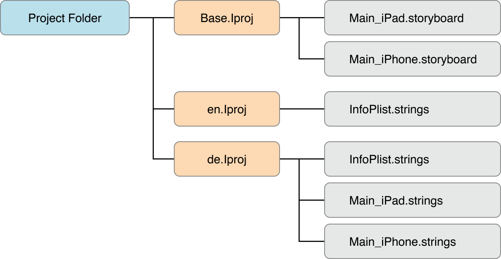
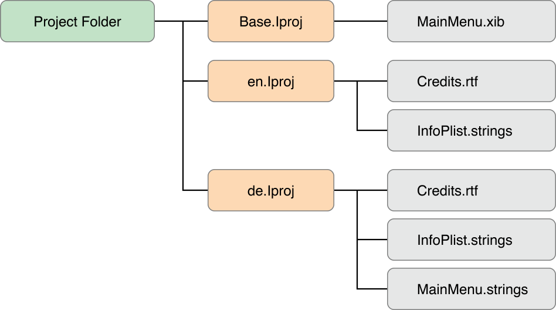
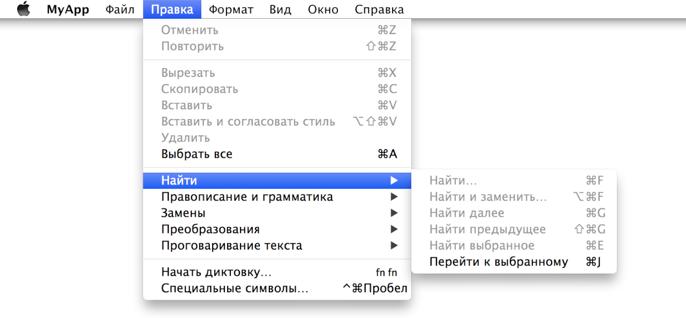

> 导航：[总目录](../../../README.md) · [documentation](../../../_indexes/documentation.md) · [Internationalization and Localization Guide](About%20Internationalization%20and%20Localization.md)


[Next](Language%20and%20Locale%20IDs.md)[Previous](Testing%20Your%20Internationalized%20App.md)

# Managing Strings Files Yourself

Follow the steps in this appendix if you want to generate and translate strings files stored in the project folder yourself. In this case, you add the languages you want to support, generate the strings files, and localize the strings files using AppleGlot glossaries or some other process. You are responsible for updating the strings files when you change the user interface or add user-facing text to your code.

If you want to manage your own strings files, first add the languages you want to support to your project, as described in [Using Base Internationalization](Internationalizing%20the%20User%20Interface.md#apple-f4xwc4dqnrsv64tfmyxwi33df52wszbpgeydambqge3tc2jninedglktk4za).

After importing localizations or adding languages, you can view the different language folders in the Finder. Localized resources, which appear in groups in the project navigator, reside in separate language folders in the project folder. Xcode manages these folders for you when you export and import localizations. To view the language folders in the Finder, Control-click the project in the project navigator and choose “Show in Finder” from the shortcut menu.

The project folder should contain one folder named `Base.lproj` and other language-specific folders with the `.lproj` extension. The prefix for the language folders is the language ID, as described in [Language and Locale IDs](Language%20and%20Locale%20IDs.md#apple-f4xwc4dqnrsv64tfmyxwi33df52wszbpgeydambqge3tc2jninedcnjnknltc).

The `Base.lproj` folder contains all the `.storyboard` or `.xib` files in the development language. The folders for languages that you add to your project contain a strings file for each `.storyboard` or `.xib` file in your project. The development language folder doesn’t contain strings files for the `.storyboard` and `.xib` files because they don’t require translation in the development language. All the language folders contain a `InfoPlist.strings` file used to localize bundle properties, such as the app name. Any other localized resources—such as strings files that you generate and use from your code—appear in these language folders.

For example, for a universal iOS app that uses English as the development language, the `Base.lproj` folder contains `Main_iPad.storyboard` and `Main.iPhone.storyboard`, and the `en.lproj` folder contains `InfoPlist.strings`. If you add the German language, Xcode creates a `de.lproj` folder containing a `InfoPlist.strings`, `Main_iPad.strings`, and `Main_iPhone.strings` file. The files in the `de.lproj` folder contain placeholder text that needs to be translated to German.



For a Mac app that uses English as the development language, the file structure may be similar to:



After you replace strings containing user-facing text with the `NSLocalizedString` macros, as described in [Separating User-Facing Text from Your Code](Internationalizing%20Your%20Code.md#apple-f4xwc4dqnrsv64tfmyxwi33df52wszbpgeydambqge3tc2jninedilktk4zq), you can create and localize the corresponding strings files.

__To create a strings file for user-facing text__

1. Use the `genstrings` script to create the development language version of the `Localizable.strings` file.

   In Terminal, run these commands:

   - `cd [Project folder]`
   - `find . -name \*.m | xargs genstrings -o .`

   For each occurrence of an `NSLocalizedString` macro in the source files, the script adds the comment followed by the key-value pair (using placeholder text for the value) to the `Localizable.strings` file, as in:

```
/* distance for a marathon */
"RunningDistance" = "RunningDistance";
```

   If you use the [NSLocalizedString](https://developer.apple.com/documentation/foundation/nslocalizedstring) macro in your code, the value for the key defaults to the key. If you want different behavior, use one of the other `NSLocalizedString` macros that take more parameters, described in _Foundation Functions Reference_.
2. Add the `Localizable.strings` file to all the language folders.

   Add the file to your Xcode project, as described in [Adding Languages](Localizing%20Your%20App.md#apple-f4xwc4dqnrsv64tfmyxwi33df52wszbpgeydambqge3tc2jninedklktk4za). Don’t add `Localizable.strings` to the Base localization when the dialog appears.
3. Localize the `Localizable.strings` file in each language folder.

   For example, in the `en.lproj/Localizable.strings` file, enter the English translation for the `RunningDistance` key:

```
/* distance for a marathon */
"RunningDistance" = "26.22 miles";
```

   In the `ja.lproj/Localizable.strings` file, enter the Japanese translation for the `RunningDistance` key:

```
/* distance for a marathon */
"RunningDistance" = "42.20 キロメートル";
```
4. Test your app in multiple languages, as described in [Testing Your Internationalized App](Testing%20Your%20Internationalized%20App.md#apple-f4xwc4dqnrsv64tfmyxwi33df52wszbpgeydambqge3tc2jninedolktk4yq).

   Incrementally test your app when making these types of changes to your code. Localize one set of language files or use pseudolocalization techniques, described in [Testing Using Pseudolanguages](Testing%20Your%20Internationalized%20App.md#apple-f4xwc4dqnrsv64tfmyxwi33df52wszbpgeydambqge3tc2jninedolktk4zq).

When you add a language to your project, Xcode adds all the user-facing text it finds in the `.storyboard` or `.xib` file to the corresponding strings file. Xcode inserts a comment before each key-value pair that identifies the view that displays the text. For example, in this fragment of a strings file, the column header `Location` and the text field labels `Address:` and `for:` require translation.

```
/* Class = "NSTableColumn"; headerCell.title = "Location"; ObjectID = "f0Y-kT-hVz"; */
"f0Y-kT-hVz.headerCell.title" = "Location";

/* Class = "NSTextFieldCell"; title = "Address:"; ObjectID = "gfa-oA-9cr"; */
"gfa-oA-9cr.title" = "Address:";

/* Class = "NSTextFieldCell"; title = "for:"; ObjectID = "gsV-Sg-yiA"; */
"gsV-Sg-yiA.title" = "for:";
```

The `genstrings` script also searches your code for user-facing text and adds it to a strings file, as described in [Separating User-Facing Text from Your Code](Internationalizing%20Your%20Code.md#apple-f4xwc4dqnrsv64tfmyxwi33df52wszbpgeydambqge3tc2jninedilktk4zq). The file format is the same except your code provides the comment for translators. To localize a strings file, instruct translators to replace the placeholder text—that appears to the right of the equal sign below the comment—with localized text.

Alternatively, use AppleGlot to perform some of the initial translations of strings files. For example, use AppleGlot to localize the text for views that Xcode added to your user interface based on the template you chose when creating the project. Then you can focus on localizing only the app-specific text that you added to the user interface.

AppleGlot is a localization tool for iOS and Mac app developers. AppleGlot provides iOS and Mac language glossaries to assist you in translating common text strings. It can also export user-facing text into standard formats that localizers can easily translate into multiple languages. AppleGlot supports incremental development so that you only need to translate the changes to user text with each release.

To download AppleGlot and the language glossaries, go to [Build Apps for the World](https://developer.apple.com/internationalization/). Under Programming Resources > Downloads, click “AppleGlot and Localization Glossaries.” If necessary, enter your Apple ID and click Sign In. Download the .dmg files for AppleGlot and the languages you support. To install AppleGlot, open the `AppleGlot.dmg` file and double-click `AppleGlot.pkg`.

Before you localize your files, you can translate all the common text strings using AppleGlot language glossaries.

__To translate your .storyboard and .xib strings files using AppleGlot glossaries__

1. In Terminal, create an AppleGlot environment.

   - `mkdir [MyAppleGlotEnvironment]`
   - `cd [MyAppleGlotEnvironment]`
   - `appleglot -w create .`
2. Set the source and target languages.

   - `appleglot -w setlangs [base_language_id] [target_langauge_id]`

   For example, if the development language is English and the target is Russian, pass `en` for the `base_language_id` and `ru` for `target_langauge_id`.
3. In the Finder, paste the language resource folders into the AppleGlot environment `_NewBase` folder.

   If you use base internationalization, paste the language-specific folder, `[target_language_id].lproj`, into the `_NewBase` folder, and change the name of the folder to `[base_language_id].lproj`. For example, paste `ru.lproj` into `_NewBase`, and change the name to `en.lproj`.

   Otherwise, if you don’t use base internationalization, the `[base_language_id].lproj` folder should contain all the strings files that you want translated into the target language.
4. Open the target language glossary .dmg, and copy the glossaries (files with the `.lg` extension) into the `_LanguageGlossaries` folder.
5. In Terminal, populate the `_NewLoc` folder.

   - `appleglot -w populate`

   This creates a `.ad` file in the `_ApplicationDictionaries` folder with previously translated strings and a `.wg` file in the  `_WorkGlossary` folder that contains all the strings in your project with as much of the translations from your Language Glossaries as possible.
6. Optionally, localize the remaining strings in the files with the `ad` and `wg` extensions using a third-party localization tool that supports these file formats.
7. In Terminal, integrate the translations back into your strings files.

   - `appleglot -w update`
   - `appleglot -w finalize`
8. In the Finder, paste the localized resources into your Xcode project folder.

   Paste the contents of the `_NewLoc/[base_language_id].lproj` folder into your `[target_language_id].lproj` folder in the Xcode project folder. For example, paste the contents of the `_NewLoc/en.lproj` folder into the `ru.lproj` folder if the target language is Russian.
9. To test the localization, launch your app using the target language, as described in [Testing Specific Languages and Regions](Testing%20Your%20Internationalized%20App.md#apple-f4xwc4dqnrsv64tfmyxwi33df52wszbpgeydambqge3tc2jninedolktk4za).

   For Mac apps, the main menu items from an Xcode template appear translated except occurrences of the app name.

   

For more information on AppleGlot, read the _AppleGlot 4 User’s Guide_ located in the `AppleGlot.dmg` file.

When you change user-facing text in `.storyboard` or `.xib` files, use the `ibtool` command to generate new strings files. Use another tool—for example, FileMerge—to identify the changes and merge them into the existing strings files for each language you support. Xcode doesn’t automatically update the corresponding strings files when you edit a `.storyboard` or `.xib` file.

In Terminal, change to the `Base.lproj` folder, and run this command to generate a strings file for an xib file:

- `ibtool [MyNib].xib --generate-strings-file [MyNib_new.strings]`

Optionally, localize the changes in the output file before merging the changes with the [MyNib].strings file in each `lproj` folder. To launch FileMerge from Xcode, choose Xcode > Open Developer Tool > FileMerge.

Alternatively, you can use the `ibtool` command to merge translations back into a nib file and perform other incremental localization updates, as described in the `ibtool` man page. Or use the `appleglot` command to manage changes to the strings files, as described in [Importing Localizations](Localizing%20Your%20App.md#apple-f4xwc4dqnrsv64tfmyxwi33df52wszbpgeydambqge3tc2jninedklktk42a).

If the pseudolocalization options, described in [Testing Your Internationalized App](Testing%20Your%20Internationalized%20App.md#apple-f4xwc4dqnrsv64tfmyxwi33df52wszbpgeydambqge3tc2jninedolktk4yq), are not sufficient to test your app, create your own pseudolocaliation. Add a language to your project, as described in [Using Base Internationalization](Internationalizing%20the%20User%20Interface.md#apple-f4xwc4dqnrsv64tfmyxwi33df52wszbpgeydambqge3tc2jninedglktk4za). Edit the strings files in the language folder by replacing the placeholder text with pseudotext. Set the language launch argument, as described in [Testing Specific Languages and Regions](Testing%20Your%20Internationalized%20App.md#apple-f4xwc4dqnrsv64tfmyxwi33df52wszbpgeydambqge3tc2jninedolktk4za), and run your app.

For example, edit the placeholder text in a strings file by adding characteristics of world languages but keeping the original text readable, as in:

```
/* distance for a marathon */
"RunningDistance" = "[ŔûüñńîńɠƊïšṱáäńçêè]";
```

One technique is to add a prefix and suffix to each string. Then you can easily identify where these prefixes and suffixes do not appear when testing your app. Use multibyte characters for prefixes to verify whether your app supports such characters.

[Next](Language%20and%20Locale%20IDs.md)[Previous](Testing%20Your%20Internationalized%20App.md)

