> 导航：[总目录](../../../README.md) · [documentation](../../../_indexes/documentation.md) · [Internationalization and Localization Guide](About%20Internationalization%20and%20Localization.md)

[Next](Internationalizing%20the%20User%20Interface.md)[Previous](About%20Internationalization%20and%20Localization.md)

# Reviewing Language and Region Settings

For iOS and Mac, the language, region, and calendar are user preferences. The language setting determines which localization the app uses. The region setting determines the format of data—such as dates, times, and numbers—and also cultural conventions of the area. For Mac, you can also customize regional formats. For iOS and Mac, you can choose a different calendar that may change the era and affect other calendar calculations.

For iOS, changing the language restarts Springboard and quits running apps. So the next time you launch an iOS app, it uses the new language setting. For Mac apps, the language doesn’t change until you restart the app. To localize all apps and the entire desktop on a Mac, you log out and log in. For iOS and Mac, the region and calendar settings can be changed at any time, even when your app is running. An internationalized app respects all these user settings and takes the appropriate action when they change.

Before internationalizing your app, review the language, region, and calendar settings on the target device. Notice how localized apps adjust to the changes you make to these settings.

The language, region, and calendar settings are in the International section of the Settings app. Experiment by changing the language, region, and calendar settings independently. For example, if your language is English and you change the region from United States to Germany, notice how the format of dates and times in Calendar changes. The day moves before the month and the time changes to a 24-hour clock. If you change the language to German, notice how all other text in Calendar changes to German.

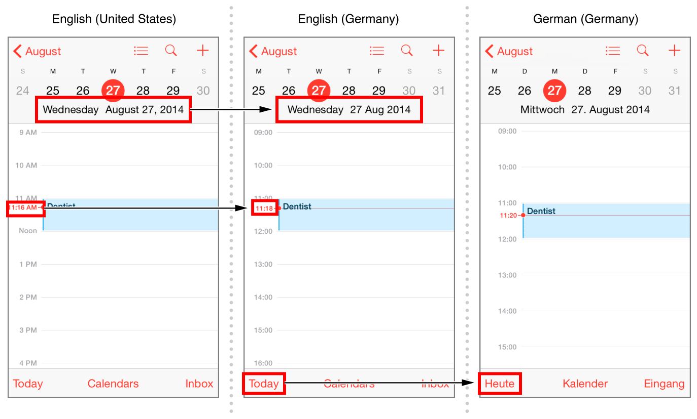

You select the language independent of the region.

__To change the language on iOS devices__

1. Tap Settings > General > Language & Region.
2. Tap iPhone Language, select the language, and tap Done.

   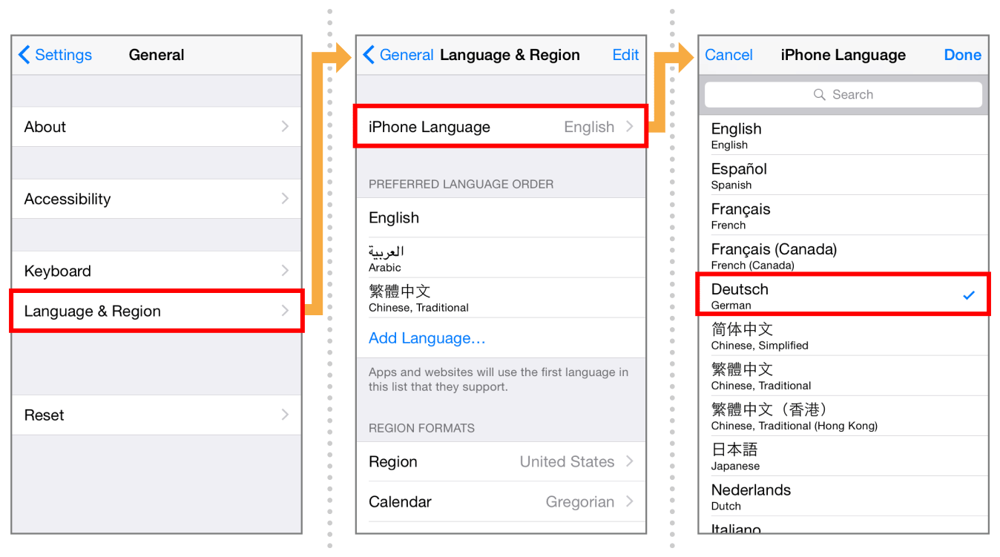
3. Tap “Change to [Language].”

   Wait while iOS changes the language.

For example, see how Calendar localizes its views in Spanish, Chinese, and Arabic below. In Arabic, the title and location text fields are right-aligned because Arabic is a right-to-left language.

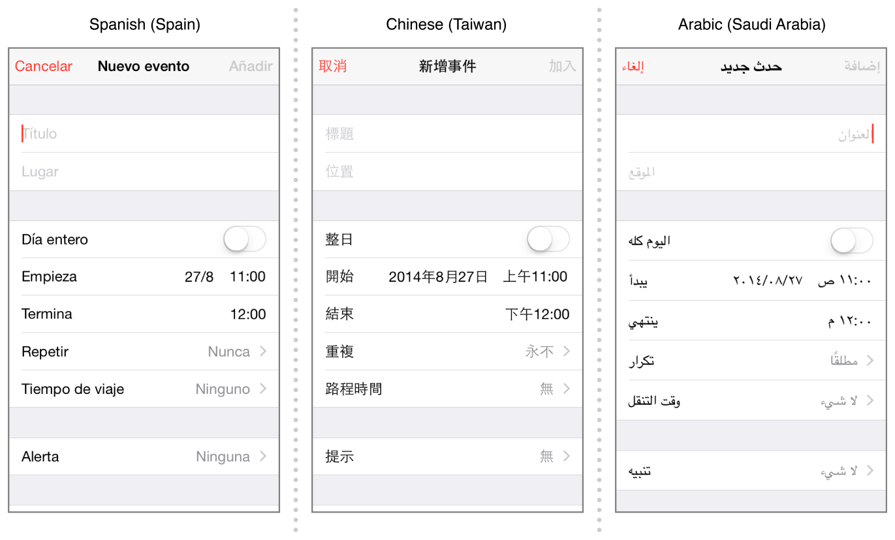

The region setting is independent of the language setting. The region setting doesn’t automatically change when you set the language. For example, if you change the language from English (United States) to German, the region is still United States, and the month appears before the day in date formats. If you want the date and time formats to conform to the German styles, change the region to Germany. Conversely, you can change only the region to localize date and time formats.

__To set the region on iOS devices__

1. Tap Settings > General > Language & Region.
2. Tap Region, and select the region from the list.

   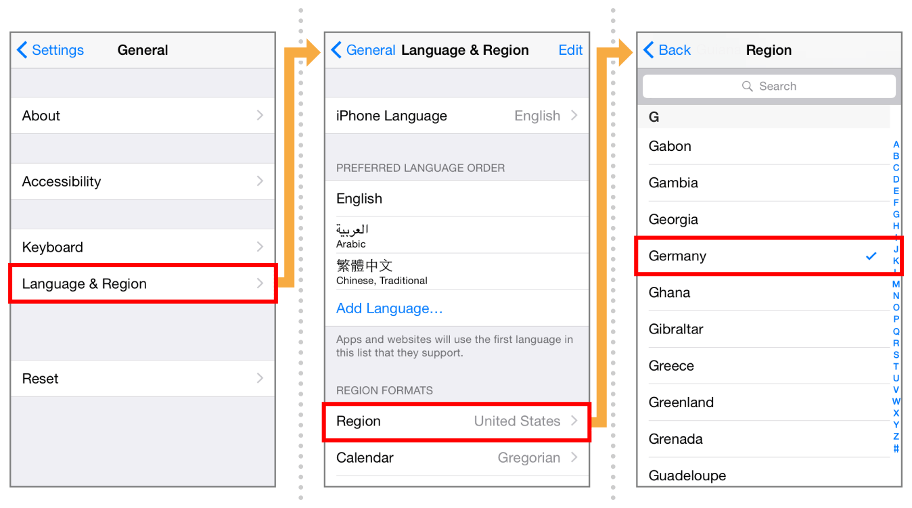
3. To return to the Language & Region settings, tap Back.

You can also specify the preferred calendar. For example, the era is different in the Gregorian, Buddhist, and Japanese calendars.

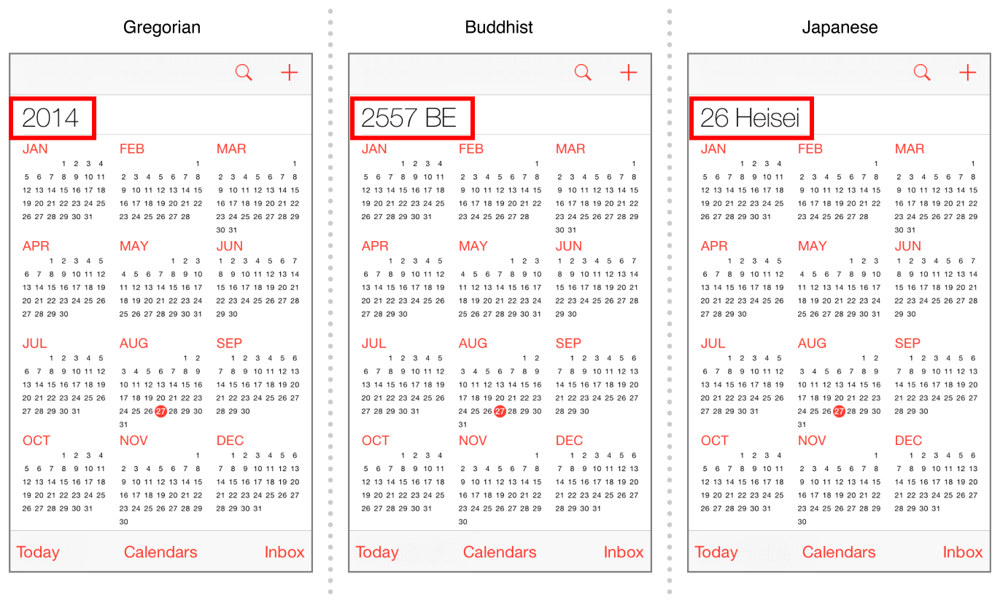

__To change the calendar on iOS devices__

1. Tap Settings > General > Language & Region.
2. Tap Calendar, and select the calendar from the list.

   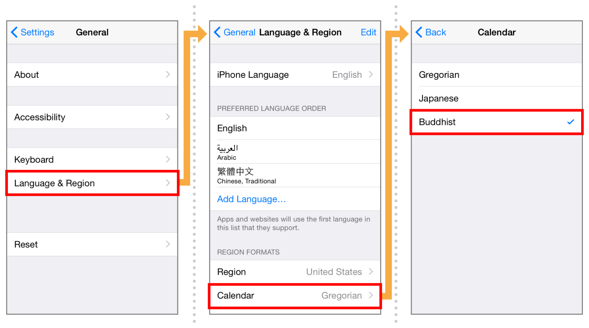
3. To return to the International settings, tap Back.

For Mac, you can best observe language and region changes using Calendar. Notice how the date and times reformat when the region changes. Calendar also adjusts for cultural differences. For example, if you change the region from United States to France, the month view shows Monday as the first day of the week. Other text in Calendar doesn’t appear in French unless you change the language to French.

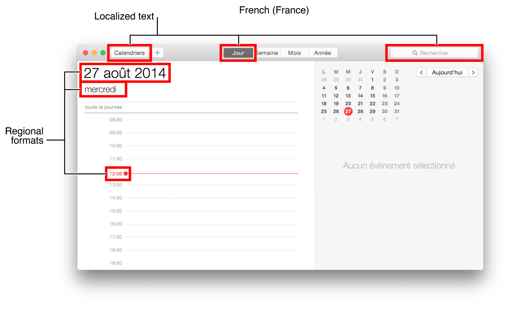

The language, region, and calendar settings are in the Language & Region pane of System Preferences. You can also create custom regional data formats on a Mac.

You can add and remove languages from a list of preferred languages. The first language in the list is the primary language used for localizations.

__To change the language your Mac uses__

1. In System Preferences, click Language & Region.
2. Either click the Add button (+) to add a language, or drag a different language to the top of the “Preferred languages” list.

   If OS X or an app supports the primary language, menus and messages are shown in that language. If it doesn’t, it uses the second language in the list, and so on.

   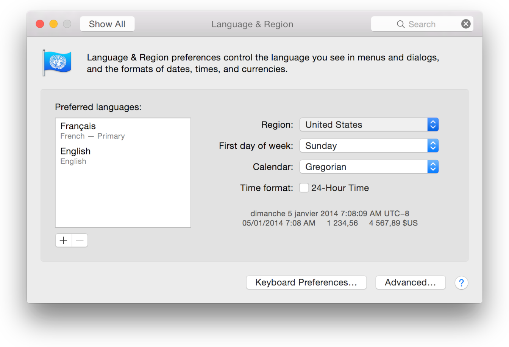
3. If you click the Add button, in the dialog that appears, select a language, and click Add. In the dialog that appears, click Use [Language] to move the language to the top of the “Preferred languages” list.

   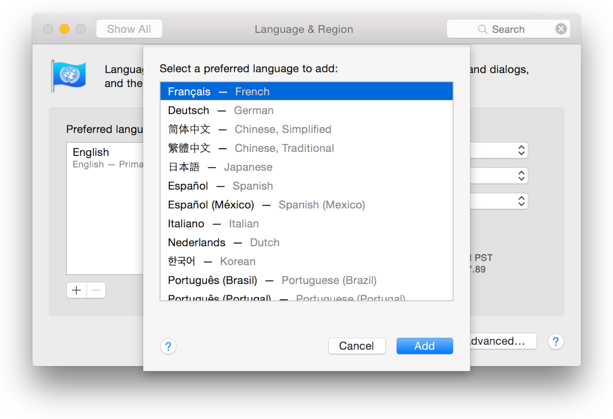

The region you select is independent of the language you select. For example, if you live in Quebec, you can select French as the language and Canada, or United States, as the region.

__To choose a region and customize formats__

1. In System Preferences, click Language & Region.
2. Choose a geographic region from the Region pop-up menu.

   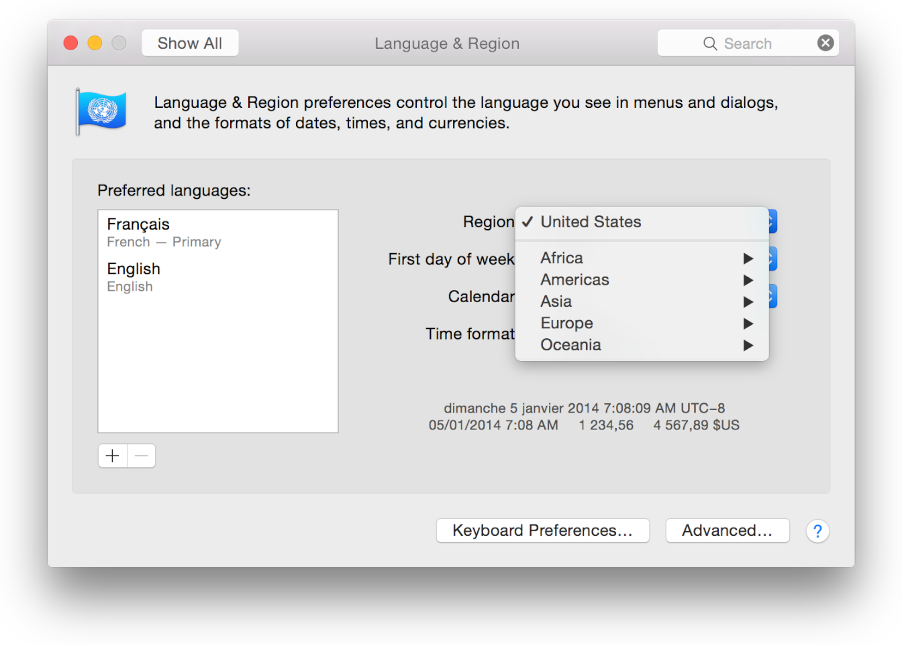
3. To customize formats, click Advanced.
4. In the General pane, choose the language to use for showing dates, times, and numbers, and set formats for numbers, currency, and measurements.

   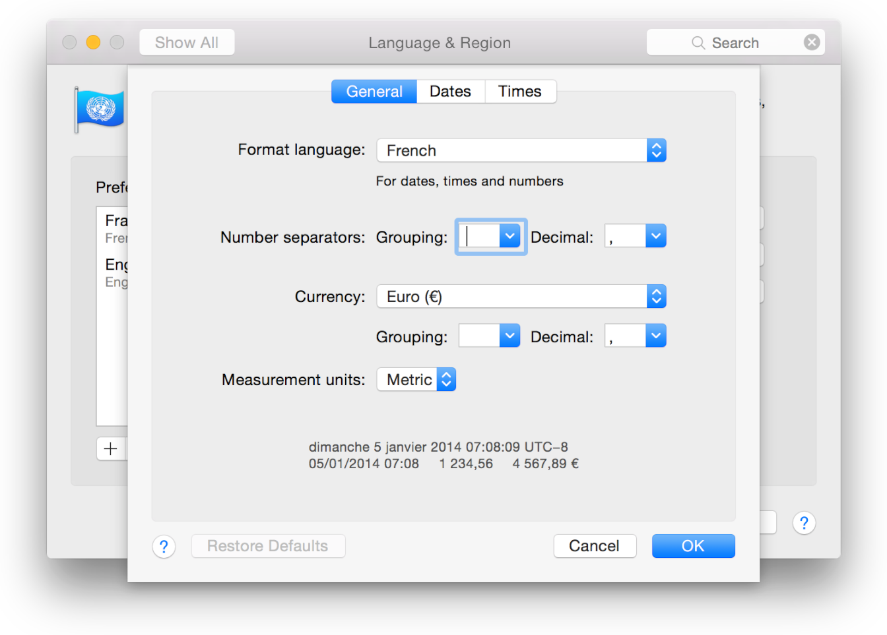
5. In the Dates and Times panes, you can create custom number and date formats by entering text and dragging elements.

   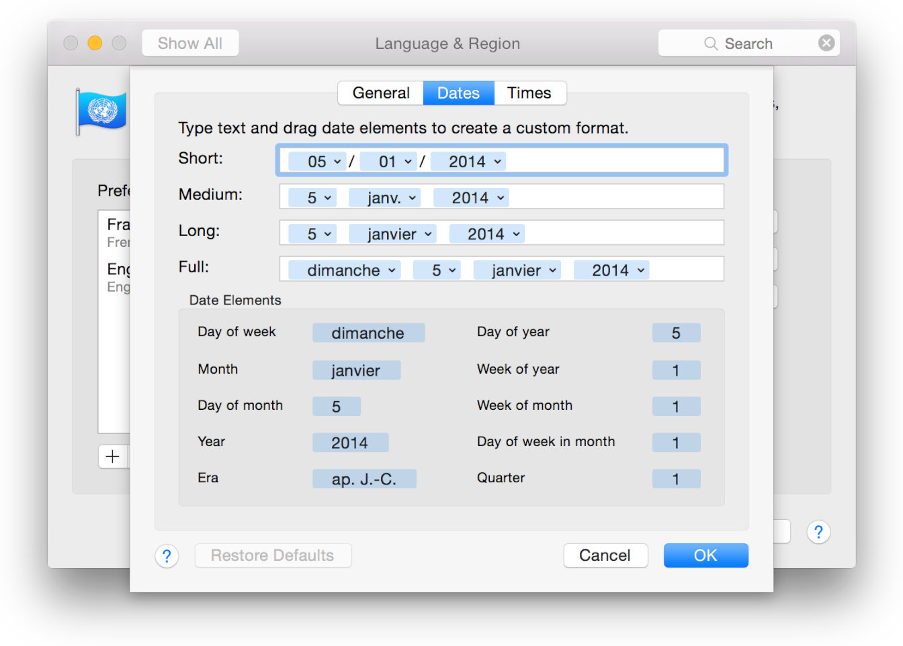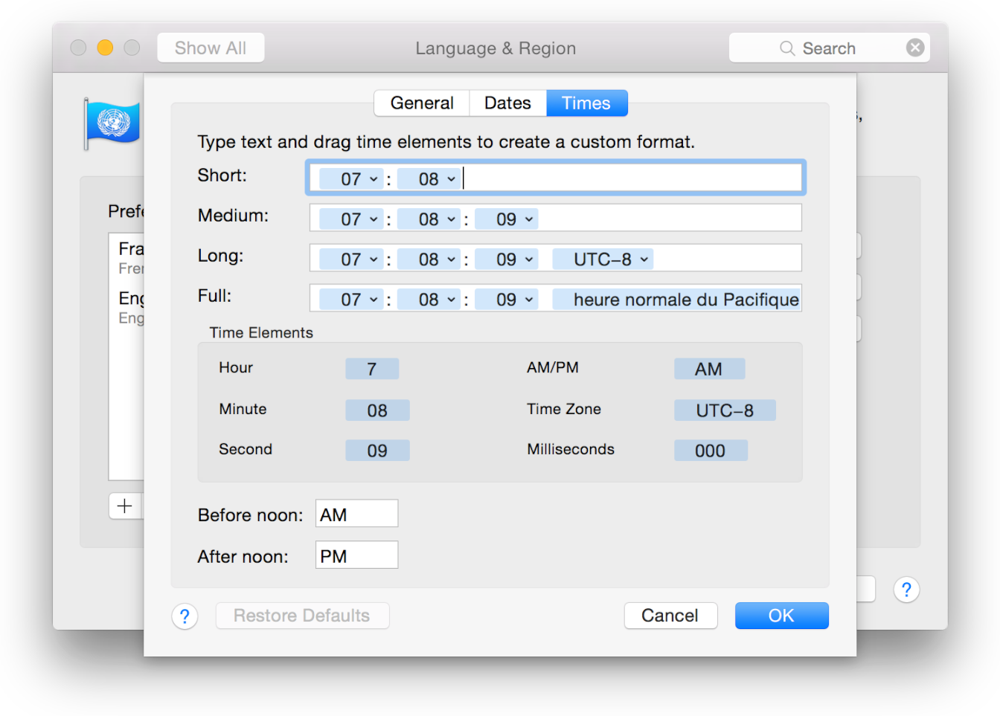

You can also specify the preferred calendar. Calendar adapts to all of these user settings. For example, you can choose Russian as the language, Russia as the region, and Hebrew as the calendar. The 24-hour clock is also optional.

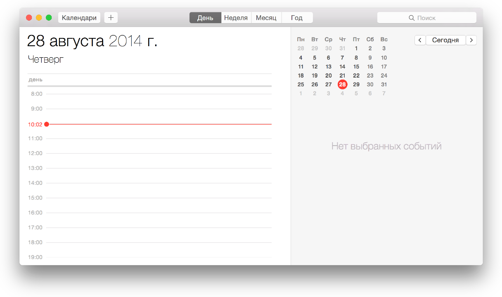

__To change the calendar on Mac__

1. In System Preferences, click Language & Region.
2. Choose a calendar from the Calendar pop-up menu.

   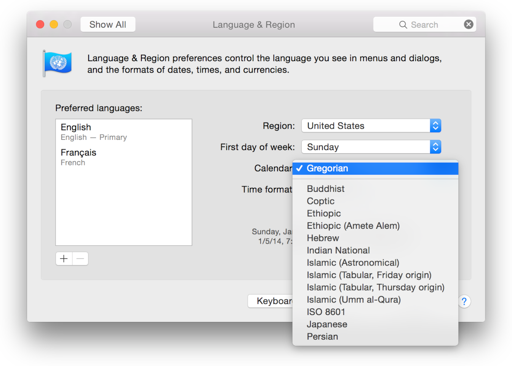

[Next](Internationalizing%20the%20User%20Interface.md)[Previous](About%20Internationalization%20and%20Localization.md)

