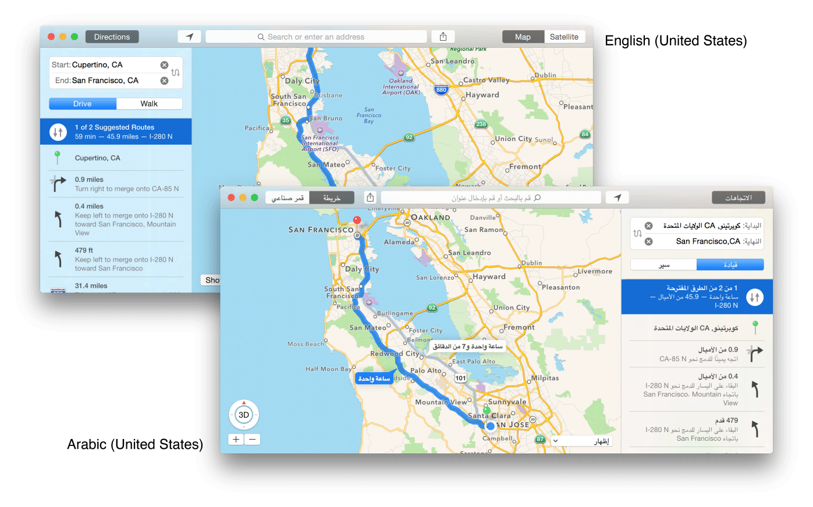
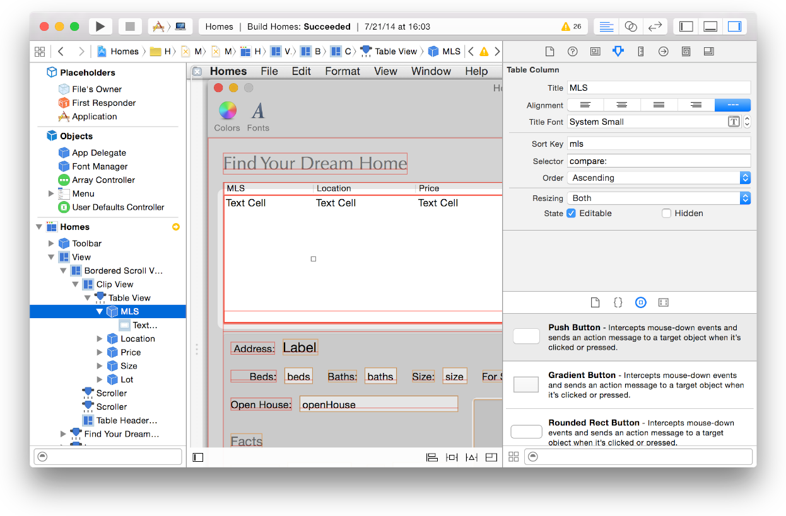
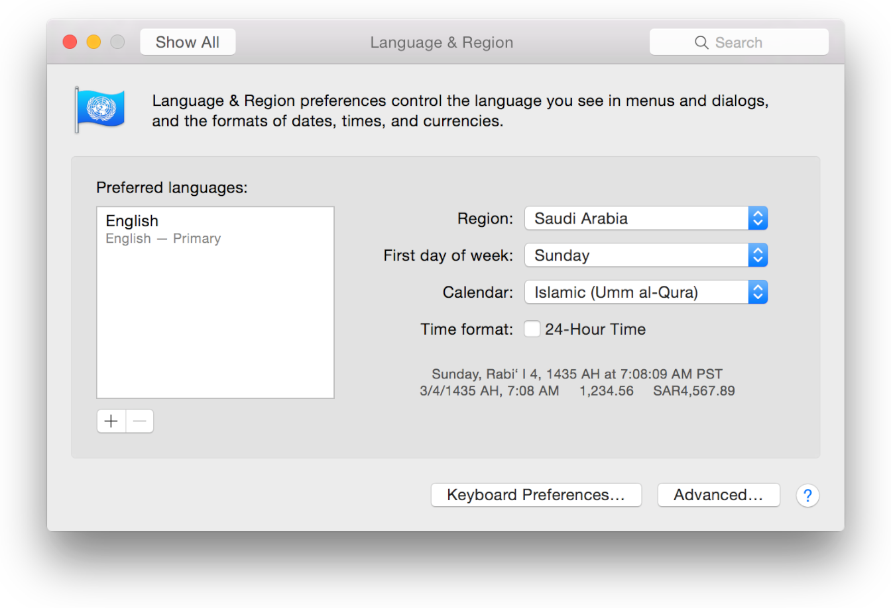
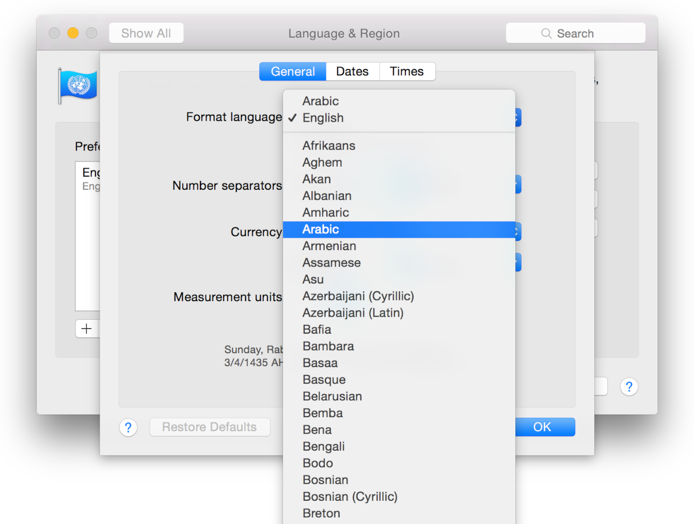

> 导航：[总目录](../../../README.md) · [documentation](../../../_indexes/documentation.md) · [Internationalization and Localization Guide](About%20Internationalization%20and%20Localization.md)


[Next](Localizing%20Your%20App.md)[Previous](Formatting%20Data%20Using%20the%20Locale%20Settings.md)

# Supporting Right-to-Left Languages

Your user interface should be mirrored when displaying right-to-left languages. If you use base internationalization and Auto Layout, most of the user interface will appear mirrored automatically for you. The text direction changes to right-to-left, with the exception of phone numbers and country codes which are always left-to-right. Some views and controls in your user interface may not change direction automatically; when appropriate, you can fix this programmatically.

Support right-to-left languages by using base internationalization and Auto Layout, as described in [Internationalizing the User Interface](Internationalizing%20the%20User%20Interface.md#apple-f4xwc4dqnrsv64tfmyxwi33df52wszbpgeydambqge3tc2jninedglktk4zq). In general, if the development language is left-to-right, align the views starting in the upper-left corner and add constraints that expand views to the bottom-right. When you use the Auto Layout `leading` and `trailing` attributes (not the `right` and `left` attributes), most of the user interface appears mirrored in right-to-left languages. For Mac apps, most controls—such as segmented controls, progress indicators, and outline views—also appear flipped. In iOS apps, UIKit controls appear flipped when the app links against iOS 9 and later.



Types of controls and content that should not flip in a right-to-left language are:

- Video controls and timeline indicators
- Images, unless they communicate a sense of direction, such as arrows
- Clocks
- Music notes and sheet music
- Graphs (x– and y–axes always appear in the same orientation)

Use base internationalization and if necessary, provide language-specific images and audio files for the right-to-left languages that you support. To localize other resource files, read [Adding Additional Resources You Want to Localize](Localizing%20Your%20App.md#apple-f4xwc4dqnrsv64tfmyxwi33df52wszbpgeydambqge3tc2jninedklktk4yto).

Thoroughly test your user interface in a right-to-left language, as described in [Testing Right-to-Left Layouts](Testing%20Your%20Internationalized%20App.md#apple-f4xwc4dqnrsv64tfmyxwi33df52wszbpgeydambqge3tc2jninedolktk42q), and only if necessary, modify your code to support right-to-left languages.

In iOS apps, you get the layout direction of an instance of `UIView` by calling the [userInterfaceLayoutDirectionForSemanticContentAttribute:](https://developer.apple.com/documentation/uikit/uiview/1622480-userinterfacelayoutdirectionfors) method. For example:

```
if ([UIView userInterfaceLayoutDirectionForSemanticContentAttribute:view.semanticContentAttribute] == UIUserInterfaceLayoutDirectionRightToLeft) {
    …
}
```

In Mac apps, you get the layout direction of an instance of `NSView` by examining the view’s [userInterfaceLayoutDirection](https://developer.apple.com/documentation/appkit/nsview/1483254-userinterfacelayoutdirection) property. For example:

```
if (view.userInterfaceLayoutDirection == NSUserInterfaceLayoutDirectionRightToLeft) {
    …
}
```


By default, text alignment in iOS is natural; in OS X, it’s left. Using natural text alignment aligns text on the left in a left-to-right language, and automatically mirrors the alignment for right-to-left languages. For example, if you set the alignment of an [NSMutableParagraphStyle](https://developer.apple.com/documentation/uikit/nsmutableparagraphstyle) object using the [setAlignment:](https://developer.apple.com/documentation/appkit/nsmutableparagraphstyle/1534368-alignment) method, pass `NSNaturalTextAlignment` as the parameter.

```
[[(NSMutableParagraphStyle *)paraStyle setAlignment:NSNaturalTextAlignment];
```

However, if you want to align a control to the right in a left-to-right language (and to the left in a right-to-left language), get the layout direction, as described in [Getting the Layout Direction](#apple-f4xwc4dqnrsv64tfmyxwi33df52wszbpgeydambqge3tc2jninedcnznknlte), and set the alignment to `NSLeftTextAlignment` for a right-to-left language.

For Mac apps:

```
if ([NSApp userInterfaceLayoutDirection] == NSUserInterfaceLayoutDirectionRightToLeft) {
    [[(NSMutableParagraphStyle *)paraStyle setAlignment:NSLeftTextAlignment];
} else {
    [[(NSMutableParagraphStyle *)paraStyle setAlignment:NSRightTextAlignment];
}
```


Bidirectional (or "Bidi") text is text that contains segments that run in different directions. Languages such as Arabic and Hebrew are written from right to left, but numbers and Latin text (such as nonlocalized product names) are written from left to right. Use standard views and controls that automatically handle bidirectional text, as described in [Displaying Text](Internationalizing%20Your%20Code.md#apple-f4xwc4dqnrsv64tfmyxwi33df52wszbpgeydambqge3tc2jninedilktk4yto). If you create custom controls for text input, you need to handle bidirectional text yourself.

For text and controls, use natural writing direction that determines the writing direction at runtime by examining the first few characters of text to be displayed.

For iOS apps, use the [setBaseWritingDirection:forRange:](https://developer.apple.com/documentation/uikit/uitextinput/1614563-setbasewritingdirection) method in the[UITextInput](https://developer.apple.com/documentation/uikit/uitextinput) protocol and pass [UITextWritingDirectionNatural](https://developer.apple.com/documentation/uikit/uitextwritingdirection/uitextwritingdirectionnatural) as the writing direction parameter. For Mac apps, set the base writing direction of a control and other types of objects using the [setBaseWritingDirection:](https://developer.apple.com/documentation/appkit/nscontrol/1428921-basewritingdirection) method, passing [NSWritingDirectionNatural](https://developer.apple.com/documentation/uikit/nswritingdirection/nswritingdirectionnatural) as the parameter.

Although direction and alignment are different settings, it’s common for text in left-to-right languages to be left aligned and for text in right-to-left languages to be right aligned. Read [Setting Text Alignment](#apple-f4xwc4dqnrsv64tfmyxwi33df52wszbpgeydambqge3tc2jninedcnznknltq) for how to set the text alignment for a right-to-left language.

In a few cases, the default behavior produces incorrect results. To handle these cases, the Unicode Bidirectional Algorithm provides a number of invisible characters that can be used to force the correct behavior.

For example, phone numbers are laid out from left-to‐right in all languages. If a localized string contains a variable for a phone number, insert a left-to-right embedding (LRE) character, U+202A, before the variable and a pop directional formatting (PDF) character, U+202C, after the variable.

```
// Wrap the plus (+) prefix and phone number in left-to-right directional markers
NSString *phoneNumber = @"408-555-1212";
NSString *localizedPhoneNumber = [NSString stringWithFormat:@"\u202A%@\u202C", phoneNumber];
```

Conversely, to always display a variable right-to-left in a left-to-right language, insert a right-to-left embedding (RLE) character, U+202B, before the variable and a pop directional formatting (PDF) character, U+202C, after the variable.

If a variable appears at the beginning of a string, natural direction causes the entire string to use the directionality of the variable. This is incorrect behavior if the variable directionality is unknown—for example, the variable could be an Arabic or English user name. In this case, insert a right-to-left mark (RLM) character, U+200F, before the variable for right-to-left languages, or a left-to-right mark (LRM) character, U+200E, before the variable for strings for left-to-right languages. Use this technique for left-to-right localizations even if you don’t have localizations for right-to-left languages.

Some Cocoa Touch views shouldn’t automatically flip when the language is right-to-left. In iOS 9 and later, you can use the semantic content attributes defined for [UIView](https://developer.apple.com/documentation/uikit/uiview) to specify how some views should appear in a right-to-left context.

For example, if your app displays a slider that represents a video scrubber, you can use the `UISemanticContentAttributePlayback` value to indicate that this view should not flip in a right-to-left context. To learn more about the attributes you can use, see [UISemanticContentAttribute](https://developer.apple.com/documentation/uikit/uisemanticcontentattribute).

To flip image resources for right-to-left languages, you can choose one of the following three options:

- Flip images programmatically for right-to-left languages by calling the [UIImage](https://developer.apple.com/documentation/uikit/uiimage) method [imageFlippedForRightToLeftLayoutDirection](https://developer.apple.com/documentation/uikit/uiimage/1624140-imageflippedforrighttoleftlayout).
- Provide separate, localized resources for the right-to-left languages you support, as described in [Adding Additional Resources You Want to Localize](Localizing%20Your%20App.md#apple-f4xwc4dqnrsv64tfmyxwi33df52wszbpgeydambqge3tc2jninedklktk4yto)
- Add alternate, right-to-left image resources to your Xcode project, and in your code, use the alternate image for right-to-left languages

Some Cocoa views don’t automatically flip when the language is right-to-left. In your Mac app, you can fix the text alignment in Interface Builder and the order of views programmatically to produce the desired mirrored results. You can also flip the views that don’t mirror in your app.

To flip image resources for right-to-left languages, choose one of three approaches. You can provide separate, localized resources for the right-to-left languages you support, as described in [Adding Additional Resources You Want to Localize](Localizing%20Your%20App.md#apple-f4xwc4dqnrsv64tfmyxwi33df52wszbpgeydambqge3tc2jninedklktk4yto). You can add alternate, right-to-left image resources to your Xcode project, and in your code, use the alternate image for right-to-left languages. You can also flip images programmatically for right-to-left languages in the app delegate’s [awakeFromNib](https://developer.apple.com/documentation/objectivec/nsobject/1402907-awakefromnib) method.

For example, invoke this `flipImage:` method to return a mirrored image.

```objc
- (NSImage *)flipImage:(NSImage *)image
{
   NSImage *existingImage = image;
   NSSize existingSize = [existingImage size];
   NSSize newSize = NSMakeSize(existingSize.width, existingSize.height);
   NSImage *flippedImage = [[[NSImage alloc] initWithSize:newSize] autorelease];

   [flippedImage lockFocus];
   [[NSGraphicsContext currentContext] setImageInterpolation:NSImageInterpolationHigh];

   NSAffineTransform *transform = [NSAffineTransform transform];
   [transform translateXBy:existingSize.width yBy:0];
   [transform scaleXBy:-1 yBy:1];
   [transform concat];

   [existingImage drawAtPoint:NSZeroPoint fromRect:NSMakeRect(0, 0, newSize.width, newSize.height) operation:NSCompositeSourceOver fraction:1.0];

   [flippedImage unlockFocus];

   return flippedImage;
}
```


In a Mac app, toolbars don’t automatically mirror in right-to-left languages. You can fix this programmatically by either reversing the order of toolbar items in the [awakeFromNib](https://developer.apple.com/documentation/objectivec/nsobject/1402907-awakefromnib) method or implementing the [toolbarDefaultItemIdentifiers:](https://developer.apple.com/documentation/appkit/nstoolbardelegate/1516944-toolbardefaultitemidentifiers) delegate method to return items in reverse order.

For example, add this code fragment to the app delegate’s [awakeFromNib](https://developer.apple.com/documentation/objectivec/nsobject/1402907-awakefromnib) method implementation where `toolbar` is the [NSToolbar](https://developer.apple.com/documentation/appkit/nstoolbar) object you want to flip.

```
// Flip toolbar items order for RTL support
if ([NSApp userInterfaceLayoutDirection] == NSUserInterfaceLayoutDirectionRightToLeft) {
   NSArray *toolbarItems = [[self.toolbar items] copy];
   for (NSToolbarItem *item in toolbarItems) {
       [self.toolbar removeItemAtIndex:toolbarItems.count-1];
       [self.toolbar insertItemWithItemIdentifier:item.itemIdentifier atIndex:0];
   }
}
```

If the images on controls communicate direction—for example, left and right arrows—they should be flipped as well.

Tables don’t automatically mirror when the layout is right-to-left. The order of the columns does not change. The views in view-based tables flip automatically if using Auto Layout and base internationalization but headers and cells in cell-based tables don’t change their text alignment.

For cell-based tables, set the alignment of columns and cells to natural writing direction using Interface Builder.

__To set the text alignment of a column and its cell__

1. In Interface Builder, select the Table Column in the outline view.
2. If necessary, show the Attributes inspector.
3. Select natural from the Alignment control.
4. In the outline view, click the disclosure triangle next to the Table Column and select its Text Field Cell.
5. In the Attributes inspector, select natural (– – –) from the Alignment control.

   

Alternatively, set the object’s `alignment` property to `NSNaturalTextAlignment` programmatically.

For Mac apps, add this method to the [NSTableView](https://developer.apple.com/documentation/appkit/nstableview) class (using an Objective-C category) that reverses the order of columns in a table.

```objc
@implementation NSTableView (RTLSupport)
- (void)reverseColumnOrder {
   if ([[NSApplication sharedApplication] userInterfaceLayoutDirection] != NSUserInterfaceLayoutDirectionRightToLeft)
       return;
   unsigned long index = self.tableColumns.count-1;
   while (index > 0) {
       [self moveColumn:0 toColumn:index];
       index--;
   }
}
@end
```


You don’t need to change the language to Arabic or Hebrew to test the right-to-left locale formats. Instead, change the language and region in the scheme editor, described in [Testing Specific Languages and Regions](Testing%20Your%20Internationalized%20App.md#apple-f4xwc4dqnrsv64tfmyxwi33df52wszbpgeydambqge3tc2jninedolktk4za). To change the text direction without changing the language or region, read [Testing Right-to-Left Layouts](Testing%20Your%20Internationalized%20App.md#apple-f4xwc4dqnrsv64tfmyxwi33df52wszbpgeydambqge3tc2jninedolktk42q).

To test right-to-left locale formats on an iOS device, you select the region and format language together in Settings, as described in [Setting the Region on iOS Devices](Reviewing%20Language%20and%20Region%20Settings.md#apple-f4xwc4dqnrsv64tfmyxwi33df52wszbpgeydambqge3tc2jninedcmrnknltk). A language submenu appears in the Region pop-up menu for languages that are used in multiple regions. To test the locale of an Arabic speaking country, choose the country from the Arabic submenu. To test the locale format in Hebrew, choose Hebrew (Israel) from the Region pop-up menu.

To test right-to-left locale formats on a Mac, you select the region and format language separately in System Preferences. If you want to test the locale formats in Arabic, set the Region setting to a locale that uses Arabic and change the format language to Arabic. Similarly, to test locale formats in Hebrew, set the Region setting to Israel and the format language to Hebrew. Alternatively, you can set the region and then set the preferred language to either Arabic or Hebrew.

__To test the locale format in a right-to-left language on Mac__

1. In System Preferences, click Language & Region.
2. Choose a region that uses the language from the Region pop-up menu.

   The calendar setting automatically changes to match the region.
3. Click Advanced.

   
4. In the General pane, choose the right-to-left language from the “Format language” pop-up menu.

   

[Next](Localizing%20Your%20App.md)[Previous](Formatting%20Data%20Using%20the%20Locale%20Settings.md)

