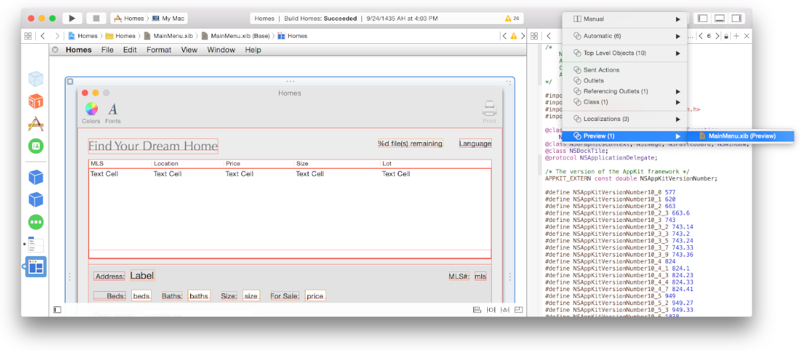
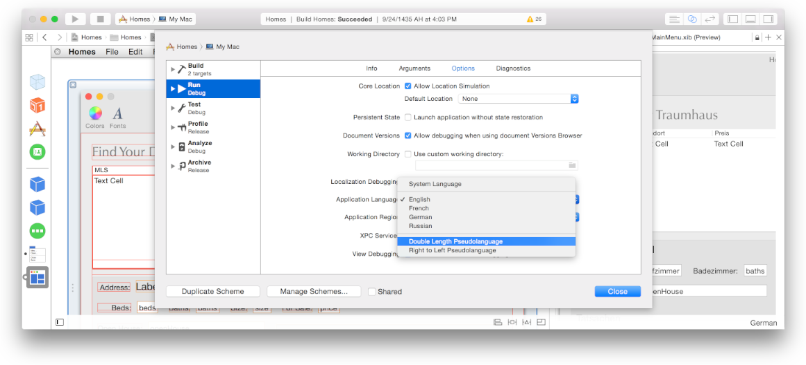
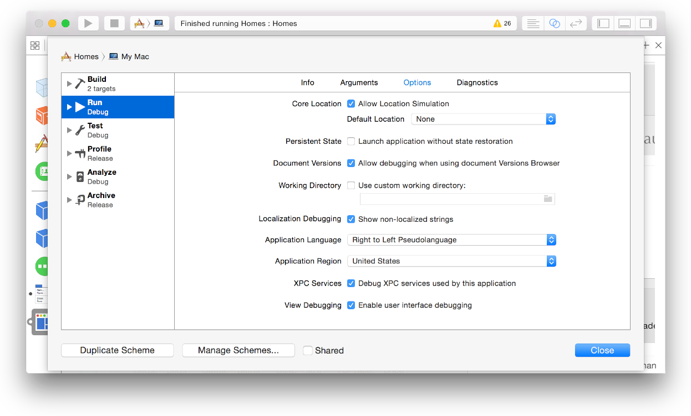
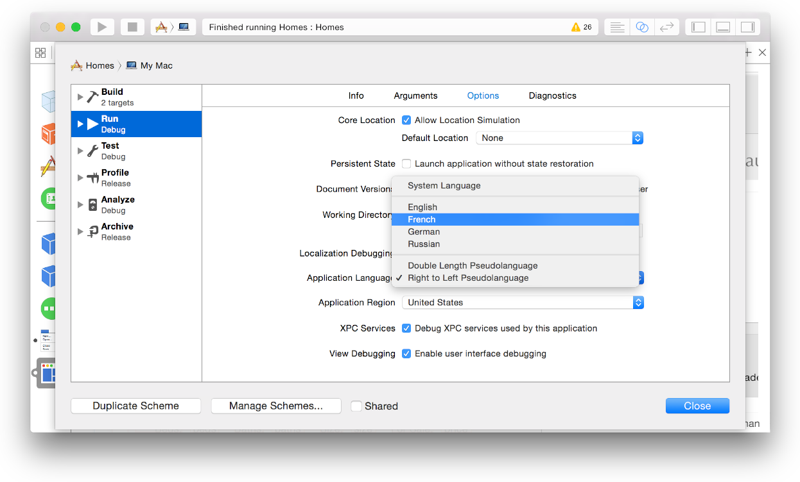

> 导航：[总目录](../../../README.md) · [documentation](../../../_indexes/documentation.md) · [Internationalization and Localization Guide](About%20Internationalization%20and%20Localization.md)

[Next](Managing%20Strings%20Files%20Yourself.md)[Previous](Localizing%20Your%20App.md)

# Testing Your Internationalized App

Test your internationalized app during different stages of development, even before localizing your app. Preview your app in Interface Builder to detect Auto Layout problems and non-localized strings, similarly run your app using pseudolanguages, simulate right-to-left languages, and test specific languages and regions. After importing localizations, test your app in all the languages you support.

In Interface Builder, you can preview localizations of the user interface without running your app. Preview pseudolocalizations before localizing your app to detect Auto Layout problems. Later, preview localizations you import to detect if strings files are out of sync with `.storyboard` or `.xib` files. Before you import localizations, as described in [Importing Localizations](Localizing%20Your%20App.md#apple-f4xwc4dqnrsv64tfmyxwi33df52wszbpgeydambqge3tc2jninedklktk42a), only pseudolocalizations are available for preview unless you explicitly added a language to the project.

__To preview a localization in Interface Builder__

1. In project navigator, select the `.storyboard` or `.xib` file you want to preview.
2. Choose View > Assistant Editor > Show Assistant Editor.
3. In the assistant editor jump bar, open the Assistant pop-up menu, scroll to and choose the Preview item, and choose the `.storyboard` or `.xib` file from the submenu.

   If a preview of the app’s user interface doesn’t appear in the assistant editor, select the window or view you want to preview in the icon or outline view.

   
4. In the assistant editor, choose the localization you want to preview from the language pop-up menu in the lower-right corner.

   A preview of the localization appears in the assistant editor. If you choose a real language, strings that do not need to be localized or need to be localized, but currently are not, appear in uppercase.

If you detect that the strings files are out of sync with the base internationalization files (perhaps you made changes to the user interface after importing localizations), export and import localizations again, as described in [Localizing Your App](Localizing%20Your%20App.md#apple-f4xwc4dqnrsv64tfmyxwi33df52wszbpgeydambqge3tc2jninedklktk4yq). You only need to translate the text that changed since the last time you imported localizations. (Alternatively, read Updating Storyboard and Xib Strings Files Using ibtool for how to update strings files after you make changes to the base internationalization `.storyboard` and `.xib` files.)

When previewing iOS apps, you can also change the iOS version, orientation, and form factor, as described in Previewing Your Layout for Different Devices and Localizations.

Before you localize your app, make sure views reposition and resize appropriately for international text using pseudolocalizations. To test whether your user interface is flexible enough to adapt to different language fonts and string lengths, edit the scheme to use a pseudolocalization.

__To test using pseudolanguages__

1. Click the target in the Run destination menu and choose Edit Scheme.
2. On the right, select Options.
3. Choose a pseudolocalization from the Application Language pop-up menu.

   - To test Auto Layout, choose Double Length Pseudolanguage. All the localized strings appear duplicated, changing the size and position of the views.
   - To test right-to-left writing direction, choose “Right to Left Pseudolanguage.”
4. Click the Close button.
5. Click Run to launch your app in the pseudolanguage you specified in your scheme.

Alternative, to double the length of all the localized strings, add the `NSDoubleLocalizedStrings` launch argument in the Arguments pane of the scheme editor or set the equivalent user default. For how to set the right-to-left language launch arguments, read Testing Right-to-Left Layouts.

You can test the layout of your app for right-to-left languages without adding a right-to-left language to your project. Follow the steps in [Testing Using Pseudolanguages](#apple-f4xwc4dqnrsv64tfmyxwi33df52wszbpgeydambqge3tc2jninedolktk4zq) and choose “Right to Left Pseudolanguage” from the Application Language pop-up menu. If you want to test the localization of a right-to-left language, choose the right-to-left language from the Application Language pop-up menu instead. If the user interface doesn’t appear mirrored, read [Supporting Right-to-Left Languages](Supporting%20Right-to-Left%20Languages.md#apple-f4xwc4dqnrsv64tfmyxwi33df52wszbpgeydambqge3tc2jninedcnznknltc) to fix the problem.

Alternatively, to test right-to-left layouts, add launch arguments or set the equivalent user defaults. For iOS apps, enter this line in the Arguments pane of the scheme editor:

- `-AppleTextDirection YES`

For Mac apps, enter both these launch arguments:

- `-NSForceRightToLeftWritingDirection YES`
- `-AppleTextDirection YES`

If you use strings files to separate user-facing text, you can run your app using an option that detects strings in the user interface that are not localized. The non-localized strings appear in uppercase when you run your app. Use this feature to identify problems with out-of-date localizations.

__To detect non-localized strings__

1. Click the target in the Run destination menu and choose Edit Scheme.
2. On the right, select Options.
3. Select the “Show non-localized strings” checkbox.

   
4. Click the Close button.
5. Click Run to launch your app in this mode.

Alternatively, add the `NSShowNonLocalizedStrings` launch argument. To identify stings that are not _localizable_, add the `NSShowNonLocalizableStrings` launch argument in the Arguments pane of the scheme editor or set the equivalent user default.

You can test specific languages that you have localizations for and regions by selecting options in the scheme editor before launching your app.

As soon as possible, test your app in at least one language other than the development language. (Read [Exporting Localizations](Localizing%20Your%20App.md#apple-f4xwc4dqnrsv64tfmyxwi33df52wszbpgeydambqge3tc2jninedklktk44q) and [Importing Localizations](Localizing%20Your%20App.md#apple-f4xwc4dqnrsv64tfmyxwi33df52wszbpgeydambqge3tc2jninedklktk42a) for how to localize your app.) If you are testing a right-to-left language—such as Arabic or Hebrew—read [Testing Right-to-Left Layouts](#apple-f4xwc4dqnrsv64tfmyxwi33df52wszbpgeydambqge3tc2jninedolktk42q) for additional launch arguments. Remember that data won’t use regional formats unless you also change the region setting.

As soon as you write code that adheres to locale settings, as described in [Formatting Data Using the Locale Settings](Formatting%20Data%20Using%20the%20Locale%20Settings.md#apple-f4xwc4dqnrsv64tfmyxwi33df52wszbpgeydambqge3tc2jninedcmznknltc), test your app using a region that changes the data formats.

__To launch your app in a specific language and region__

1. Click the target in the Run destination menu and choose Edit Scheme.
2. On the right, select Options.
3. Optionally, choose a language from the Application Language pop-up menu.

   
4. Optionally, choose a region from the Application Region pop-up menu.
5. Click the Close button.
6. Click Run to launch your app in the language and region you specified.

Alternatively, add `AppleLanguages` and `AppleLocale` launch arguments using the scheme editor—for example, add `-AppleLanguages "(de)"` to specify the German language and `-AppleLocale "fr_FR"` to specify the France region.

For the most accurate test of an iOS app, run your app in Simulator or on a device and change the user’s language and region settings, as described in [Setting the Language on iOS Devices](Reviewing%20Language%20and%20Region%20Settings.md#apple-f4xwc4dqnrsv64tfmyxwi33df52wszbpgeydambqge3tc2jninedcmrnknlti) and [Setting the Region on iOS Devices](Reviewing%20Language%20and%20Region%20Settings.md#apple-f4xwc4dqnrsv64tfmyxwi33df52wszbpgeydambqge3tc2jninedcmrnknltk).

For Mac apps, you can test locale changes by simply changing your region settings on your Mac, as described in [Setting the Region on Your Mac](Reviewing%20Language%20and%20Region%20Settings.md#apple-f4xwc4dqnrsv64tfmyxwi33df52wszbpgeydambqge3tc2jninedcmrnknltq) or by using the locale launch argument, as described in [Testing Specific Languages and Regions](#apple-f4xwc4dqnrsv64tfmyxwi33df52wszbpgeydambqge3tc2jninedolktk4za). However, to test the user’s language settings, export your app and launch it from another system account. Some system services will not be in the new language until you log out and log in again. To change the language settings on your Mac, read [Setting the Language on Your Mac](Reviewing%20Language%20and%20Region%20Settings.md#apple-f4xwc4dqnrsv64tfmyxwi33df52wszbpgeydambqge3tc2jninedcmrnknlto).

[Next](Managing%20Strings%20Files%20Yourself.md)[Previous](Localizing%20Your%20App.md)

