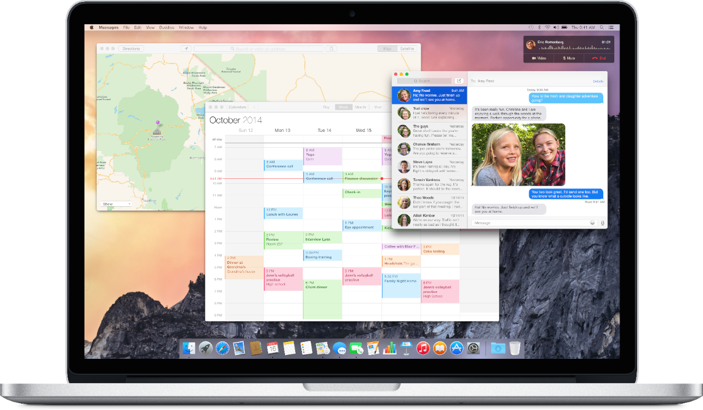
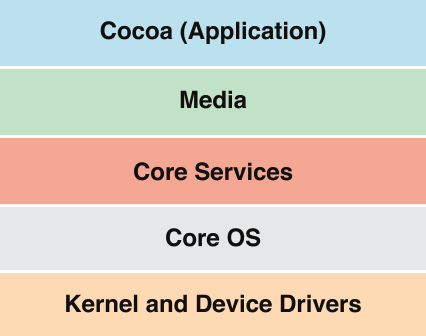

> 导航：[总目录](../../../README.md) · [documentation](../../../_indexes/documentation.md)

# About Developing for Mac

The OS X operating system combines a stable core with advanced technologies to help you deliver world-class products on the Mac platform. Knowing what these technologies are, and how to use them, can help streamline your development process, while giving you access to key OS X features.

This guide introduces you to the range of possibilities for developing Mac software, describes the many technologies you can use for software development, and points you to sources of information about those technologies. It does not describe user-level system features or features that have no impact on software development.

### OS X Has a Layered Architecture with Key Technologies in Each Layer

It’s helpful to view the implementation of OS X as a set of layers. The lower layers of the system provide the fundamental services on which all software relies. Subsequent layers contain more sophisticated services and technologies that build on (or complement) the layers below.

__Figure I-1__  Layers of OS X

The lower the layer a technology is in, the more specialized are the services it provides. Generally, technologies in higher layers incorporate lower-level technologies to provide common app behaviors. A good rule of thumb is to use the highest-level programming interface that meets the goals of your app. Here is a brief summary of the layers of OS X.

- The Cocoa (Application) layer includes technologies for building an app’s user interface, for responding to user events, and for managing app behavior.
- The Media layer encompasses specialized technologies for playing, recording, and editing audiovisual media and for rendering and animating 2D and 3D graphics.
- The Core Services layer contains many fundamental services and technologies that range from Automatic Reference Counting and low-level network communication to string manipulation and data formatting.
- The Core OS layer defines programming interfaces that are related to hardware and networking, including interfaces for running high-performance computation tasks on a computer’s CPU and GPU.
- The Kernel and Device Drivers layer consists of the Mach kernel environment, device drivers, BSD library functions (`libSystem`), and other low-level components. The layer includes support for file systems, networking, security, interprocess communication, programming languages, device drivers, and extensions to the kernel.

### You Can Create Many Different Kinds of Software for Mac

Using the developer tools and system frameworks, you can develop a wide variety of software for Mac, including the following:

- __Apps.__ Apps help users accomplish tasks that range from creating content and managing data to connecting with others and having fun. OS X provides a wealth of system technologies such as app extensions and handoff, that you use to extend the capabilities of your apps and enhance the experience of your users.
- __Frameworks and libraries.__ Frameworks and libraries enable code sharing among apps.
- __Command-line tools and daemons.__ Command-line tools allow sophisticated users to manipulate data in the command-line environment of the Terminal app. Daemons typically run continuously and act as servers for processing client requests.
- __App plug-ins and loadable bundles.__ Plug-ins extend the capabilities of other apps; bundles contain code and resources that apps can dynamically load at runtime.
- __System plug-ins.__ System plug-ins, such as audio units, kernel extensions, I/O Kit device drivers, preference panes, Spotlight importers, and screen savers, extend the capabilities of the system.

### When Porting a Cocoa Touch App, Be Aware of API Similarities and Differences

The technology stacks on which Cocoa and Cocoa Touch apps are based have many similarities. Some system frameworks are identical (or nearly identical) in each platform, including Foundation, Core Data, and AV Foundation. This commonality of API makes some migration tasks—for example, porting the data model of your Cocoa Touch app—easy.

Other migration tasks are more challenging because they depend on frameworks that reflect the differences between the platforms. For example, porting controller objects and revising the user interface are more demanding tasks because they depend on AppKit and UIKit, which are the primary app frameworks in the Cocoa and CocoaTouch layers, respectively.

Apple provides developer tools and additional information that support your development efforts.

Xcode, Apple’s integrated development environment, helps you design, create, debug, and optimize your software. You can download Xcode from the Mac App Store.

For an overview of the developer tools for OS X, see the [Xcode Apple Developer webpage](https://developer.apple.com/xcode/). For an overview Xcode functionality, read _[Xcode Overview](https://developer.apple.com/library/archive/documentation/ToolsLanguages/Conceptual/Xcode_Overview/index.html#//apple_ref/doc/uid/TP40010215)_.

The OS X Developer Library contains the documentation, sample code, tutorials, and other information you need to write OS X apps. You can access the OS X Developer Library from the [Apple Developer website](https://developer.apple.com/library/mac/navigation/) or from Xcode. In Xcode, choose Help > Documentation and API Reference to view documents and other resources in the Organizer window.

In addition to the OS X Developer Library, there are other sources of information on developing different types of software for Mac:

- __Apple Open Source__. Apple makes major components of OS X—including the UNIX core—available to the developer community. To learn about Apple’s commitment to Open Source development, visit [Open Source Development Resources](https://developer.apple.com/opensource/). To learn more about some specific Open Source projects, such as Bonjour and WebKit, visit [Mac OS Forge](http://www.macosforge.org/).
- __BSD__. Berkeley Software Distribution (BSD) is an essential UNIX-based part of the OS X kernel environment. Several excellent books on BSD and UNIX are available in bookstores. But you can also find additional information on any of the websites that cover BSD variants—for example, [The FreeBSD Project](http://www.freebsd.org/).
- __Third-party books__. Several excellent books on Mac app development can be found online and in the technical sections of bookstores.

