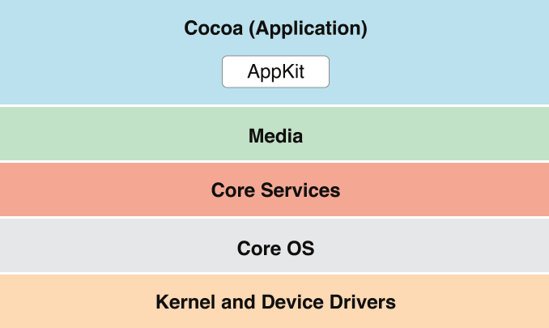

> 导航：[总目录](../../../README.md) · [documentation](../../../_indexes/documentation.md) · [Mac Technology Overview](About%20Developing%20for%20Mac.md)

# Cocoa Application Layer

The Cocoa application layer is primarily responsible for the appearance of apps and their responsiveness to user actions. In addition, many of the features that define the OS X user experience—such as Notification Center, full-screen mode, and Auto Save—are implemented by the Cocoa layer.

The term _Aqua_ refers to the overall appearance and behavior of OS X. The Aqua look and feel is characterized by consistent, user-friendly behaviors combined with a masterful use of layout, color, and texture. Although much of the Aqua look and feel comes for free when you use Cocoa technologies to develop your app, there are still many steps you should take to distinguish your app from the competition. To create a beautiful, compelling app that users will love, be sure to follow the guidance provided in _OS X Human Interface Guidelines_.

The Cocoa (Application) layer implements many features that are distinctive aspects of the OS X user experience. Users expect to find these features throughout the system, so it’s a good idea to support all the features that make sense in your app.

Notification Center provides a way for users to receive and view app notifications in an attractive, unobtrusive way. For each app, users can specify how they want to be notified of an item’s arrival; they can also reveal Notification Center to view all the items that have been delivered.

The Notification Center APIs, which help you configure the user-visible portions of a notification item, schedule items for delivery, and find out when items have been delivered. You can also determine whether your app has launched as a result of a notification, and if it has, whether that notification is a local or remote (that is, push) notification.

To learn about integrating the Notification Center into your app, see _[NSUserNotificationCenter Class Reference](https://developer.apple.com/documentation/foundation/nsusernotificationcenter)_ and _[NSUserNotification Class Reference](https://developer.apple.com/documentation/foundation/nsusernotification)_. To ensure that your app gives users the best Notification Center experience, read Notification Center. In addition, you can add items to the Today view using a Today extension, see [Today](../../General/App%20Extension%20Programming%20Guide/Today.md#apple-f4xwc4dqnrsv64tfmyxwi33df52wszbpkridimbqge2demjufvbuqmjr) in the _[App Extension Programming Guide](https://developer.apple.com/library/archive/documentation/General/Conceptual/ExtensibilityPG/index.html#//apple_ref/doc/uid/TP40014214)_.

Game Center accesses the same social-gaming network as on iOS, allowing users to track scores on a leaderboard, compare their in-game achievements, invite friends to play a game, and start a multiplayer game through automatic matching. Game Center functionality is provided in three parts:

- The Game Center app, in which users sign in to their account, discover new games and new friends, add friends to their gaming network, and browse leaderboards and achievements.
- The Game Kit framework, which contains the APIs developers use to support live multiplayer or turn-based games and adopt other Game Center features, such as in-game voice chat and leaderboard access.
- The online Game Center service supported by Apple, which performs player authentication, provides leaderboard and achievement information, and handles invitations and automatching for multiplayer games. You interact with the Game Center service only indirectly, using the Game Kit APIs.

In your game, use the Game Kit APIs to post scores and achievements to the Game Center service and to display leaderboards in your user interface. You can also use Game Kit APIs to help users find others to play with in a multiplayer game.

To learn more about adding Game Center support to your app, see _[Game Center Programming Guide](../../Networking%20Internet/Game%20Center%20Programming%20Guide/About%20Game%20Center.md#apple-f4xwc4dqnrsv64tfmyxwi33df52wszbpkridimbqga4dgmbu)_.

The sharing service provides a consistent user experience for sharing content among many types of services. For example, a user might want to share a photo by posting it in a Twitter message, attaching it to an email, or sending it to another Mac user via AirDrop.

Use the AppKit [NSSharingService](https://developer.apple.com/documentation/appkit/nssharingservice) class to get information about available services and share items with them directly. As a result, you can display a custom UI to present the services. You can also use the [NSSharingServicePicker](https://developer.apple.com/documentation/appkit/nssharingservicepicker) class to display a list of sharing services (including custom services that you define) from which the user can choose. When a service is performed, the system-provided sharing window is displayed, where the user can comment or add recipients.

Resume is a systemwide enhancement of the user experience that supports app persistence. A user can log out or shut down the operating system, and on next login or startup, OS X automatically relaunches the apps that were last running and restores the windows that were last opened. If your app provides the necessary support, reopened windows have the same size and location as before; in addition, window contents are scrolled to the previous position and selections are restored.

To support app persistence, you must also implement automatic and sudden app termination, user interface preservation, and Auto Save. See, Automatic and Sudden Termination of Apps, User Interface Preservation, and [Documents Are Automatically Saved](../../Data%20Management/Document-Based%20App%20Programming%20Guide%20for%20Mac/Core%20App%20Behaviors.md#apple-f4xwc4dqnrsv64tfmyxwi33df52wszbpkridimbqgeytcnzzfvbuqnjnknlti) in the _[Mac App Programming Guide](../../General/Mac%20App%20Programming%20Guide/About%20OS%20X%20App%20Design.md#apple-f4xwc4dqnrsv64tfmyxwi33df52wszbpkridimbqgeydknbt)_.

When an app enters full-screen mode it opens its frontmost app or document window in a separate space. Enabling full-screen mode adds an Enter Full Screen menu item to the View menu or, if there is no View menu, to the Window menu. When a user chooses this menu item, the frontmost app or document window fills the entire screen.

The AppKit framework provides support for customizing the appearance and behavior of full-screen windows. For example, you can set a window-style mask and can implement custom animations when an app enters and exits full-screen mode.

You enable and manage full-screen support through methods of the [NSApplication](https://developer.apple.com/documentation/appkit/nsapplication) and [NSWindow](https://developer.apple.com/documentation/appkit/nswindow) classes and the [NSWindowDelegate Protocol](https://developer.apple.com/documentation/appkit/nswindowdelegate) protocol. To find out more about this feature, read [Implementing the Full-Screen Experience](https://developer.apple.com/library/archive/documentation/General/Conceptual/MOSXAppProgrammingGuide/FullScreenApp/FullScreenApp.html#//apple_ref/doc/uid/TP40010543-CH6) in _[Mac App Programming Guide](../../General/Mac%20App%20Programming%20Guide/About%20OS%20X%20App%20Design.md#apple-f4xwc4dqnrsv64tfmyxwi33df52wszbpkridimbqgeydknbt)_.

Cocoa Auto Layout is a rule-based system designed to implement the layout guidelines described in _OS X Human Interface Guidelines_. It expresses a larger class of relationships and is more intuitive to use than springs and struts.

Using Auto Layout brings you a number of benefits:

- Localization through swapping of strings alone, instead of also revamping layouts
- Mirroring of UI elements for right-to-left languages such as Hebrew and Arabic
- Better layering of responsibility between objects in the view and controller layers

  A view object usually knows best about its standard size and its positioning within its superview and relative to its sibling views. A controller can override these values if something nonstandard is required.

The entities you use to define a layout are Objective-C objects called _constraints_. You define constraints by combining attributes—such as leading, trailing, left, right, top, bottom, width, and height—that encapsulate the relationships between UI elements. (Leading and trailing are similar to left and right, but they are more expressive because they automatically mirror the constraint in a right-to-left environment.) In addition, you can assign priority levels to constraints, to identify the constraints that are most important to satisfy.

You can use Interface Builder to add and edit constraints for your interface. When you need more control, you can work with constraints programatically.

For more information on Auto Layout, see _[Auto Layout Guide](https://developer.apple.com/library/archive/documentation/UserExperience/Conceptual/AutolayoutPG/index.html#//apple_ref/doc/uid/TP40010853)_.

A popover is a view that displays additional content related to existing content onscreen. AppKit provides the [NSPopover](https://developer.apple.com/documentation/appkit/nspopover) class to support popovers. AppKit automatically positions a popover relative to the view containing the existing content—known as the _positioning view_—and it moves the popover when the popover’s positioning view moves.

You configure the appearance and behavior of a popover, including which user interactions cause the popover to close. And by implementing the appropriate delegate method, you can configure a popover to detach itself and become a separate window when a user drags it.

For more information, see _[NSPopover Class Reference](https://developer.apple.com/documentation/appkit/nspopover)_ and _[NSPopoverDelegate Protocol Reference](https://developer.apple.com/documentation/appkit/nspopoverdelegate)_. For guidelines on using popovers, see Popovers in _OS X Human Interface Guidelines_.

OS X programs commonly use property list files (also known as _plist files_) to store configuration data. A property list is a text or binary file used to manage a dictionary of key-value pairs. Apps use a special type of property list file, called an _information property list_ (`Info.plist`) _file_, to communicate key attributes of the app—such as the app’s name, unique identification string, and version information—to the system. Apps also use property list files to store user preferences or other custom configuration data.

The advantage of property list files is that they are easy to edit and modify from outside the runtime environment of your app. Xcode includes a built-in property list editor for editing your app’s `Info.plist` file. To learn more about information property list files and the keys you put in them, see _[Runtime Configuration Guidelines](../Runtime%20Configuration%20Guidelines/Introduction.md#apple-f4xwc4dqnrsv64tfmyxwi33df52wszbpgeydambqge3ta2i)_ and _[Information Property List Key Reference](../../General/Information%20Property%20List%20Key%20Reference/About%20Info.plist%20Keys%20and%20Values.md#apple-f4xwc4dqnrsv64tfmyxwi33df52wszbpkridimbqga4tenbx)_. To learn how to edit a property list file in Xcode, see Edit Keys and Values.

Inside your app, you can read and write property list files programmatically using facilities found in both Core Foundation and Cocoa. For more information on creating and using property lists programmatically, see _[Property List Programming Guide](../../Cocoa/Property%20List%20Programming%20Guide/Introduction%20to%20Property%20Lists.md#apple-f4xwc4dqnrsv64tfmyxwi33df52wszbpgeydambqga2dq2i)_ or _[Property List Programming Topics for Core Foundation](../../Core%20Foundation/Property%20List%20Programming%20Topics%20for%20Core%20Foundation/Introduction%20to%20Property%20List%20Programming%20Topics%20for%20Core%20Foundation.md#apple-f4xwc4dqnrsv64tfmyxwi33df52wszbpgeydambqgezta2i)_.

Accessibility is the successful access to information and information technologies by the millions of people who have some type of disability or special need. OS X provides many built-in features and assistive technologies that help users with special needs benefit from the Mac. OS X also provides software developers with the functions they need to create apps that are accessible to all users.

Apps that use Cocoa interfaces receive significant support for accessibility automatically. For example, apps get the following support for free:

- Zoom features let users increase the size of onscreen elements.
- Sticky keys let users press keys sequentially instead of simultaneously for keyboard shortcuts.
- Mouse keys let users control the mouse with the numeric keypad.
- Full keyboard access mode lets users complete any action using the keyboard instead of the mouse.
- Speech recognition lets users speak commands rather than type them.
- Text-to-speech reads text to users with visual disabilities.
- VoiceOver provides spoken user interface features to assist visually impaired users.

Although Cocoa integrates accessibility support into its APIs, there might still be times when you need to provide more descriptive information about your windows and controls. The Accessibility section of the Xcode Identity inspector makes it easy to provide custom accessibility information about the UI elements in your app. Or you can use the appropriate accessibility interfaces to change the settings programmatically.

For more information about accessibility, see _[Accessibility Programming Guide for OS X](https://developer.apple.com/library/archive/documentation/Accessibility/Conceptual/AccessibilityMacOSX/index.html#//apple_ref/doc/uid/TP40001078)_.

OS X employs AppleScript as the primary language for making apps scriptable. With AppleScript, users can write scripts that link together the services of multiple scriptable apps.

When designing new apps, you should consider AppleScript support early in the process. The key to a good design that supports AppleScript is choosing an appropriate data model for your app. The design must not only serve the purposes of your app but also make it easy for AppleScript implementers to manipulate your content. After you settle on a data model, you can implement the Apple event code needed to support scripting.

To learn how to support AppleScript in your programs, see [Applescript Overview](https://developer.apple.com/library/mac/documentation/AppleScript/Conceptual/AppleScriptX/AppleScriptX.html).

Spotlight provides advanced search capabilities for apps. The Spotlight server gathers metadata from documents and other relevant user files and incorporates that metadata into a searchable index. The Finder uses this metadata to provide users with more relevant information about their files. For example, in addition to listing the name of a JPEG file, the Finder can also list its width and height in pixels.

App developers use Spotlight in two different ways. First, you can search for file attributes and content using the Spotlight search API. Second, if your app defines its own custom file formats, you should incorporate any appropriate metadata information in those formats and provide a Spotlight importer plug-in to return that metadata to Spotlight.

For more information on using Spotlight in your apps, see _[Spotlight Overview](../../Carbon/Spotlight%20Overview/Introduction%20to%20Spotlight.md#apple-f4xwc4dqnrsv64tfmyxwi33df52wszbpkridimbqgaytenry)_.

Ink Services provides handwriting recognition for apps that support the Cocoa and WebKit text systems and any text system that supports input methods. The automatic support is for text and handwriting gestures (which are defined in the Ink panel). The Ink framework offers several features that you can incorporate into your apps, including the following:

- Enabling or disabling handwriting recognition programmatically
- Accessing Ink data directly
- Supporting either deferred recognition or recognition on demand
- Supporting the direct manipulation of text by means of gestures

The Ink Services feature is implemented by the Ink framework (`Ink.framework`). The Ink framework is not intended solely for developers of end-user apps. Hardware developers can also use it to implement a handwriting recognition solution for a new input device. You might also use the Ink framework to implement your own correction model to provide users with a list of alternate interpretations for handwriting data.

The Ink framework is a subframework of `Carbon.framework`; you should link to it directly with the umbrella framework, not with `Ink.framework`. For more information on using Ink Services in Cocoa apps, see _[Using Ink Services in Your Application](../../Carbon/Using%20Ink%20Services%20in%20Your%20Application/Introduction%20to%20Using%20Ink%20Services%20in%20Your%20Application.md#apple-f4xwc4dqnrsv64tfmyxwi33df52wszbpkridimbqgaydsnjz)_.

The Cocoa (Application) layer includes the frameworks described in the following sections.

The Cocoa umbrella framework (`Cocoa.framework`) imports the core Objective-C frameworks for app development: AppKit, Foundation, and Core Data.

- __AppKit__ (`AppKit.framework`). This is the only framework of the three that is actually in the Cocoa layer. See [AppKit](#apple-f4xwc4dqnrsv64tfmyxwi33df52wszbpkridimbqgaytanrxfvbuqmrxgqwvgvzw) for a summary of AppKit features and classes.
- __Foundation__ (`Foundation.framework`). The classes of the Foundation framework (which resides in the Core Services layer) implement data management, file access, process notification, network communication, and other low-level features. AppKit has a direct dependency on Foundation because many of its methods and functions either take instances of Foundation classes as parameters, or return the instances as values.

  To find out more about Foundation, see [Foundation and Core Foundation](Core%20Services%20Layer.md#apple-f4xwc4dqnrsv64tfmyxwi33df52wszbpkridimbqgaytanrxfvbuqmrxgawvgvzu).
- __Core Data__ (`CoreData.framework`). The classes of the Core Data framework (which also resides in the Core Services layer) manage the data model of an app based on the Model-View-Controller design pattern. Although Core Data is optional for app development, it is recommended for apps that deal with large data sets.

  For more information about Core Data, see [Core Data](Core%20Services%20Layer.md#apple-f4xwc4dqnrsv64tfmyxwi33df52wszbpkridimbqgaytanrxfvbuqmrxgawueqkki5ceeqsi).

AppKit is the key framework for Cocoa apps. The classes in the AppKit framework implement the user interface (UI) of an app, including windows, dialogs, controls, menus, and event handling. They also handle much of the behavior required of a well-behaved app, including menu management, window management, document management, Open and Save dialogs, and pasteboard (Clipboard) behavior.

In addition to having classes for windows, menus, event handling, and a wide variety of views and controls, AppKit has window- and data-controller classes and classes for fonts, colors, images, and graphics operations. A large subset of classes comprise the Cocoa text system, described in [Text, Typography, and Fonts](Media%20Layer.md#apple-f4xwc4dqnrsv64tfmyxwi33df52wszbpkridimbqgaytanrxfvbuqmrxgmwvgvzrge). Other AppKit classes support document management, printing, and services such as spellchecking, help, speech, and pasteboard and drag-and-drop operations.

Apps can participate in many of the features that make the user experience of OS X such an intuitive, productive, and rewarding experience. These features include the following:

- __Gestures__. Users appreciate being able to use fluid, intuitive Multi-Touch gestures to interact with OS X. AppKit classes make it easy to adopt these gestures in your app and to provide a better zoom experience without redrawing your content. For example, `NSScrollView` includes built-in support for the smart zoom gesture (that is, a two-finger double-tap on a trackpad). When you provide the semantic layout of your content, `NSScrollView` can intelligently magnify the content under the pointer. You can also use this class to respond to the lookup gesture (that is, a three-finger tap on a trackpad). To learn more about the gesture support that `NSScrollView` provides, see _[NSScrollView Class Reference](https://developer.apple.com/documentation/appkit/nsscrollview)_.
- __Spaces__. Spaces lets the user organize windows into groups and switch back and forth between groups to avoid cluttering up the desktop. AppKit provides support for sharing windows across spaces through the use of collection behavior attributes on the window. For information about setting these attributes, see _[NSWindow Class Reference](https://developer.apple.com/documentation/appkit/nswindow)_.
- __Fast User Switching__. With this feature, multiple users can share access to a single computer without logging out. One user’s session can continue to run, while another user logs in and accesses the computer. To support fast user switching, be sure that your app avoids doing anything that might affect another version of the app running in a different session. To learn how to implement this behavior, see _[Multiple User Environment Programming Topics](../Multiple%20User%20Environment%20Programming%20Topics/Introduction%20to%20Multiple%20User%20Environments.md#apple-f4xwc4dqnrsv64tfmyxwi33df52wszbpgeydambqge4da2i)_.

Xcode includes Interface Builder, a user interface editor that contains a library of AppKit objects, such as controls, views, and controller objects. With it, you can create most of your UI (including much of its behavior) graphically rather than programatically. With the addition of Cocoa bindings and Core Data, you can also implement most of the rest of your app graphically.

For an overview of the AppKit framework, see the introduction to the _[Application Kit Framework Reference](https://developer.apple.com/documentation/appkit)_. _[Mac App Programming Guide](../../General/Mac%20App%20Programming%20Guide/About%20OS%20X%20App%20Design.md#apple-f4xwc4dqnrsv64tfmyxwi33df52wszbpkridimbqgeydknbt)_ offers a practical discussion of how you use mostly AppKit classes to implement an app’s user interface, its documents, and its overall behavior.

The Game Kit framework (`GameKit.framework`) provides APIs that allow your app to participate in Game Center. For example, you can use Game Kit classes to display leaderboards in your game and to give users the opportunity to share their in-game achievements and play multiplayer games.

To learn more about using Game Kit in your app, see _[Game Kit Framework Reference](https://developer.apple.com/documentation/gamekit)_.

The Preference Panes framework (`PreferencePanes.framework`) lets you create plug-ins containing a user interface for setting app preferences. At runtime, the System Preferences app (or your app) can dynamically load the plug-in and present the settings UI to users. In System Preferences, each icon in the Show All view represents an individual preference pane plug-in. You typically implement preference pane plug-ins when your app lacks its own user interface or has a very limited UI but needs to be configurable. In these cases, you create both the plug-in and the app-specific code that reads and writes the preference settings.

For more information about creating preference-pane plug-ins, see _[Preference Pane Programming Guide](../../User%20Experience/Preference%20Pane%20Programming%20Guide/Introduction.md#apple-f4xwc4dqnrsv64tfmyxwi33df52wszbpgeydambqgeyta2i)_.

The Screen Saver framework (`ScreenSaver.framework`) contains classes for creating dynamically loadable bundles that implement screen savers. Users can select your screen saver in the Desktop & Screen Saver pane of the System Preferences app. Screen Saver helps you implement the screen saver view and preview and manage screen saver preferences.

To learn more about creating screen savers, see _[Screen Saver Framework Reference](https://developer.apple.com/documentation/screensaver)_. Also read the technical note _[Building Screen Savers for Snow Leopard](https://developer.apple.com/library/archive/qa/qa1666/_index.html#//apple_ref/doc/uid/DTS40009292)_ for additional information.

The Security Interface framework (`SecurityInterface.framework`) contains classes that provide UI elements for programs implementing security features such as authorization, access to digital certificates, and access to items in keychains. There are classes for creating custom views and standard security controls, for creating panels and sheets for presenting and editing certificates, for editing keychain settings, and for presenting and allowing selection of identities.

For more information about the Security Interface framework, see _[Security Interface Framework Reference](https://developer.apple.com/documentation/securityinterface)_.

