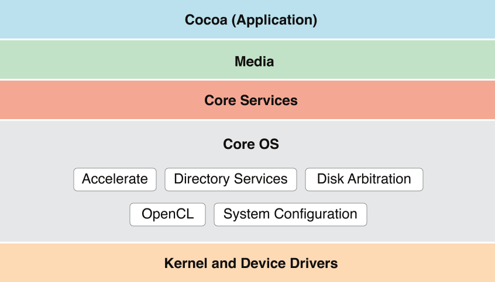

> 导航：[总目录](../../../README.md) · [documentation](../../../_indexes/documentation.md) · [Mac Technology Overview](About%20Developing%20for%20Mac.md)

# Core OS Layer

The technologies and frameworks in the Core OS layer provide low-level services related to hardware and networks. These services are based on facilities in the Kernel and Device Drivers layer.

The Core OS layer implements features related to app security.

Gatekeeper, allows users to block the installation of software that does not come from the Mac App Store and identified developers. If your app is not signed with a Developer ID certificate issued by Apple, it will not launch on systems that have this security option selected. If you plan to distribute your app outside of the Mac App Store, be sure to test the installation of your app on a Gatekeeper enabled system so that you can provide a good user experience.

Xcode supports most of the tasks that you need to perform to get a Developer ID certificate and code sign your app. To learn how to submit your app to the Mac App Store—or test app installation on a Gatekeeper enabled system—read _Tools Workflow Guide for Mac_.

App Sandbox provides a last line of defense against stolen, corrupted, or deleted user data if malicious code exploits your app. App Sandbox also minimizes the damage from coding errors. Its strategy is twofold:

- App Sandbox enables you to describe how your app interacts with the system. The system then grants your app only the access it needs to get its job done, and no more.
- App Sandbox allows the user to transparently grant your app additional access by using Open and Save dialogs, drag and drop, and other familiar user interactions.

You describe your app’s interaction with the system by setting entitlements in Xcode. For details on all the entitlements available in OS X, see _[Entitlement Key Reference](../../Miscellaneous/Entitlement%20Key%20Reference/About%20Entitlements.md#apple-f4xwc4dqnrsv64tfmyxwi33df52wszbpkridimbqgeytcojv)_.

When you adopt App Sandbox, you must code sign your app (for more information, see [Code Signing](#apple-f4xwc4dqnrsv64tfmyxwi33df52wszbpkridimbqgaytanrxfvbuqojnknlti)). This is because entitlements, including the special entitlement that enables App Sandbox, are built into an app’s code signature.

For a complete explanation of App Sandbox and how to use it, read _[App Sandbox Design Guide](https://developer.apple.com/library/archive/documentation/Security/Conceptual/AppSandboxDesignGuide/AboutAppSandbox/AboutAppSandbox.html#//apple_ref/doc/uid/TP40011183)_.

OS X employs the security technology known as _code signing_ to allow you to certify that your app was indeed created by you. After an app is code signed, the system can detect any change to the app—whether the change is introduced accidentally or by malicious code. Various security technologies, including App Sandbox and parental controls, depend on code signing.

In most cases, you can rely on Xcode automatic code signing, which requires only that you specify a code signing identity in the build settings for your project. The steps to take are described in Code Signing Your App in _Tools Workflow Guide for Mac_. If you need to incorporate code signing into an automated build system or if you link your app against third-party frameworks, refer to the procedures described in _[Code Signing Guide](../../Security/Code%20Signing%20Guide/About%20Code%20Signing.md#apple-f4xwc4dqnrsv64tfmyxwi33df52wszbpkridimbqga2tsmrz)_.

For a complete explanation of code signing in the context of App Sandbox, read [App Sandbox in Depth](https://developer.apple.com/library/archive/documentation/Security/Conceptual/AppSandboxDesignGuide/AppSandboxInDepth/AppSandboxInDepth.html#//apple_ref/doc/uid/TP40011183-CH3) in _[App Sandbox Design Guide](https://developer.apple.com/library/archive/documentation/Security/Conceptual/AppSandboxDesignGuide/AboutAppSandbox/AboutAppSandbox.html#//apple_ref/doc/uid/TP40011183)_.

The following technologies and frameworks are in the Core OS layer of OS X:

The Accelerate framework (`Accelerate.framework`) contains APIs that help you accelerate complex operations—and potentially improve performance—by using the available vector unit. Hardware-based vector units boost the performance of any app that exploits data parallelism, such as those that perform 3D graphic imaging, image processing, video processing, audio compression, and software-based cell telephony. (Because Quartz and QuickTime Kit incorporate vector capabilities, any app that uses these APIs can tap into this hardware acceleration without making any changes.)

The Accelerate framework is an umbrella framework that wraps the vecLib and vImage frameworks into a single package. The vecLib framework contains vector-optimized routines for doing digital signal processing, linear algebra, and other computationally expensive mathematical operations. The vImage framework supports the visual realm, adding routines for morphing, alpha-channel processing, and other image-buffer manipulations.

For information on how to use the components of the Accelerate framework, see _[vImage Programming Guide](https://developer.apple.com/library/archive/documentation/Performance/Conceptual/vImage/Introduction/Introduction.html#//apple_ref/doc/uid/TP30001001)_, _vImage Reference Collection_, and _[vecLib Reference](https://developer.apple.com/documentation/accelerate/veclib)_. For general performance-related information, see _[Performance Overview](../../Performance/Performance%20Overview/Introduction.md#apple-f4xwc4dqnrsv64tfmyxwi33df52wszbpkridimbqgaytimjq)_.

The Disk Arbitration framework (`DiskArbitration.framework`) notifies your app when local and remote volumes are mounted and unmounted. It also furnishes other updates on the status of remote and local mounts and returns information about mounted volumes. For example, if you provide the framework with the BSD disk identifier of a volume, you can get the volume’s mount-point path.

For more information on Disk Arbitration, see _[Disk Arbitration Framework Reference](https://developer.apple.com/documentation/diskarbitration)_.

The Open Computing Language (OpenCL) makes the high-performance parallel processing power of GPUs available for general-purpose computing. The OpenCL language is a general purpose computer language, not specifically a graphics language, that abstracts out the lower-level details needed to perform parallel data computation tasks on GPUs and CPUs. Using OpenCL, you create compute kernels that are then offloaded to a graphics card or CPU for processing. Multiple instances of a compute kernel can be run in parallel on one or more GPU or CPU cores, and you can link to your compute kernels from Cocoa, C, or C++ apps.

For tasks that involve data-parallel processing on large data sets, OpenCL can yield significant performance gains. There are many apps that are ideal for acceleration using OpenCL, such as signal processing, image manipulation, and finite element modeling. The OpenCL language has a rich vocabulary of vector and scalar operators and the ability to operate on multidimensional arrays in parallel.

For information about OpenCL and how to write compute kernels, see _[OpenCL Programming Guide for Mac](../../Performance/OpenCL%20Programming%20Guide%20for%20Mac/About%20OpenCL%20for%20OS%20X.md#apple-f4xwc4dqnrsv64tfmyxwi33df52wszbpkridimbqga4dgmjs)_.

Open Directory is a directory services architecture that provides a centralized way to retrieve information stored in local or network databases. Directory services typically provide access to collected information about users, groups, computers, printers, and other information that exists in a networked environment (although they can also store information about the local system). You use Open Directory to retrieve information from these local or network databases. For example, if you’re writing an email app, you can use Open Directory to connect to a corporate LDAP server and retrieve the list of individual and group email addresses for the company.

Open Directory uses a plug-in architecture to support a variety of retrieval protocols. OS X provides plug-ins to support LDAPv2, LDAPv3, NetInfo, AppleTalk, SLP, SMB, DNS, Microsoft Active Directory, and Bonjour protocols, among others. You can also write your own plug-ins to support additional protocols.

The Open Directory framework (`OpenDirectory.framework`) publishes a programmatic interface for accessing Open Directory services.

For more information on this technology, see _[Open Directory Programming Guide](https://developer.apple.com/library/archive/documentation/Networking/Conceptual/Open_Directory/Introduction/Introduction.html#//apple_ref/doc/uid/TP40000917)_. For information on how to write Open Directory plug-ins, see _[Open Directory Plug-in Programming Guide](https://developer.apple.com/library/archive/documentation/Networking/Conceptual/Open_Dir_Plugin/Introduction/Introduction.html#//apple_ref/doc/uid/TP40000918)_.

System Configuration (`SystemConfiguration.framework`) is a framework that helps apps configure networks and determine if networks can be reached prior to connecting with them. The framework includes calls for a user experience when interacting with a captive network. (A captive network, such as a public Wi-Fi hotspot, requires user interaction before providing Internet access.)

Use System Configuration APIs to determine and set configuration settings and respond dynamically to changes in that information. You can also use these APIs to help you determine whether a remote host is reachable and, if it is, to request a network connection so it can provide content to its users. To assist in this, System Configuration does the following:

- It provides access to current network configuration information.
- It allows apps to determine the reachability of remote hosts and start PPP-based connections.
- It notifies apps when there are changes in network status and network configuration.
- It provides a flexible schema for defining and accessing stored preferences and the current network configuration.

To learn more about System Configuration, see _[System Configuration Programming Guidelines](../../Networking/System%20Configuration%20Programming%20Guidelines/Introduction%20to%20System%20Configuration%20Programming%20Guidelines.md#apple-f4xwc4dqnrsv64tfmyxwi33df52wszbpkridimbqgaytanrv)_.

