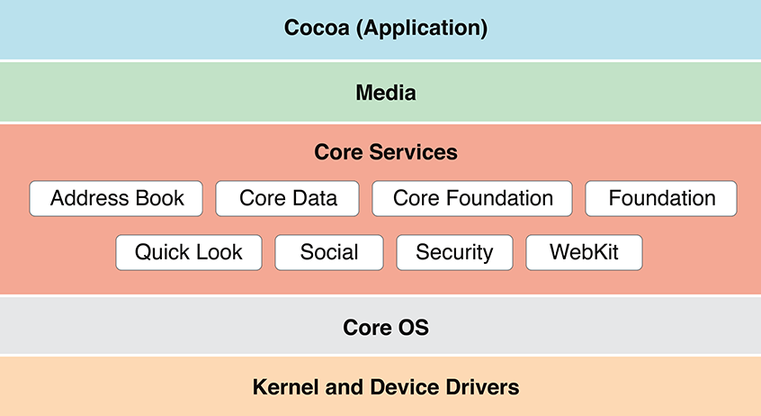

> 导航：[总目录](../../../README.md) · [documentation](../../../_indexes/documentation.md) · [Mac Technology Overview](About%20Developing%20for%20Mac.md)

# Core Services Layer

The technologies in the Core Services layer are called _core services_ because they provide essential services to apps but have no direct bearing on the app’s user interface. In general, these technologies are dependent on frameworks and technologies in the two lowest layers of OS X—that is, the Core OS layer and the Kernel and Device Drivers layer.

The following sections describe some of the key technologies available in the Core Services layer.

Two frameworks that make it easy for users to share content with various social networking services from within your app:

- __Accounts__ (`Accounts.framework`). The Accounts framework provides access to supported account types that are stored in the Accounts database.
- __Social__ (`Social.framework`). The Social framework provides an API for sending requests to supported social media services that can perform operations on behalf of your users.

When you use the Accounts framework, your app does not need to be responsible for storing account login information because an `ACAccount` object stores the users login credentials for services such as Twitter and Facebook. Users can grant your app permission to use their account login credentials, bypassing the need to enter their user name and password. If no account for a particular service exists in the user’s Accounts database, you can help them create and save an account from within your app. To learn more about the Accounts framework, see _[Accounts Framework Reference](https://developer.apple.com/documentation/accounts)_.

The Social framework provides a simple interface for accessing the user’s social media accounts, including Facebook and Sina Weibo, a Chinese microblogging website. Apps can use this framework to post status updates and images to a user’s account. The Social framework works with the Accounts framework to provide a single sign-on model for the user and to ensure that access to the user’s account is approved. For more information about the Social API, see _[Social Framework Reference](https://developer.apple.com/documentation/social)_.

From a user’s perspective, iCloud is a simple feature that automatically makes their personal content available on all of their devices. When you adopt iCloud, OS X initiates and manages uploading and downloading of data for the devices associated with an iCloud account.

There are three types of iCloud storage that your app can take advantage of:

- __Document storage__. Document storage is for user-visible file-based content, such as presentations or documents, or for other substantial file-based content, such as the state of a complex game.
- __Key-value storage__. Key-value storage is for sharing small amounts of data—such as preferences or bookmarks—among instances of your app.
- __Core Data storage__. Core Data storage supports server-based, multidevice database solutions for structured content. (Core Data storage is built on document storage.)

Many apps can benefit from using more than one type of storage. For example, a complex strategy game could employ document storage for its game state, and key-value storage for scores and achievements.

To learn more about adding iCloud storage to your app, read _[iCloud Design Guide](../../General/iCloud%20Design%20Guide/About%20Incorporating%20iCloud%20into%20Your%20App.md#apple-f4xwc4dqnrsv64tfmyxwi33df52wszbpkridimbqgezdaoju)_.

CloudKit provides apps with more control over when and how data is stored in iCloud. Unlike iCloud Storage, CloudKit is a complimentary service that works with your apps existing data structures. CloudKit records include support for:

- Saving, searching, and fetching data for specific to an individual user
- Saving, searching, and fetching data in a public area shared by all users

CloudKit has minimal caching and relies on a network connection. To learn more about using CloudKit, see the _[CloudKit Framework Reference](https://developer.apple.com/documentation/cloudkit)_

File coordination eliminates file-system inconsistencies due to overlapping read and write operations from competing processes. When you use the [NSDocument](https://developer.apple.com/documentation/appkit/nsdocument) class from the AppKit framework, you get file coordination with very little effort. To use file coordination explicitly, you employ the [NSFileCoordinator](https://developer.apple.com/documentation/foundation/nsfilecoordinator) class and the [NSFilePresenter](https://developer.apple.com/documentation/foundation/nsfilepresenter) protocol, both from the Foundation framework.

The file coordination APIs let you assert your app’s ownership of files and directories. When another process attempts access, you have a chance to respond. For example, if another app attempts to read a document that your app is editing, you have a chance to write unsaved changes to disk before the other app is allowed to do its reading.

You use file coordination only with files that users conceivably might share with other users, not (for example) with files written to a cache or other temporary locations. File coordination is an enabling technology for automatic document saving, App Sandbox, and other features introduced in OS X v10.7. For more information on file coordination, see [Coordinating File Access With Other Processes](../../General/Mac%20App%20Programming%20Guide/The%20Mac%20Application%20Environment.md#apple-f4xwc4dqnrsv64tfmyxwi33df52wszbpkridimbqgeydknbtfvbuqmrnknltcnq) in _[Mac App Programming Guide](../../General/Mac%20App%20Programming%20Guide/About%20OS%20X%20App%20Design.md#apple-f4xwc4dqnrsv64tfmyxwi33df52wszbpkridimbqgeydknbt)_.

A feature integral to OS X software distribution is the bundle mechanism. Bundles encapsulate related resources in a hierarchical file structure but present those resources to the user as a single entity. Programmatic interfaces make it easy to find resources inside a bundle. These same interfaces form a significant part of the OS X internationalization strategy.

Apps and frameworks are only two examples of bundles in OS X. Plug-ins, screen savers, and preference panes are also implemented using the bundle mechanism. Developers can also use bundles for their document types to make it easier to store complex data.

Packages are another technology, like bundles, that make distributing software easier. A package—also referred to as an _installation package_—is a directory that contains files and directories in well-defined locations. The Finder displays packages as files. Double-clicking a package launches the Installer app, which then installs the contents of the package on the user’s system.

For an overview of bundles and to learn how they are constructed, see _[Bundle Programming Guide](../../Core%20Foundation/Bundle%20Programming%20Guide/Introduction.md#apple-f4xwc4dqnrsv64tfmyxwi33df52wszbpgeydambqgezdg2i)_.

Localization (which is the process of adapting your app for use in another region) is necessary for success in many foreign markets. Users in other countries are much more likely to buy your software if the text and graphics reflect their own language and culture. Before you can localize an app, though, you must design it in a way that supports localization, a process called internationalization. Properly internationalizing an app makes it possible for your code to load localized content and display it correctly.

Internationalizing an app involves the following steps:

- Use Unicode strings for storing user-visible text.
- Extract user-visible text into “strings” resource files.
- Use nib files to store window and control layouts whenever possible.
- Use international or culture-neutral icons and graphics whenever possible.
- Use Cocoa or Core Text to handle text layout.
- Support localized file-system names (also known as _display names_).
- Use formatter objects in Core Foundation and Cocoa to format numbers, currencies, dates, and times based on the current locale.

For details on how to support localized versions of your software, see _[Internationalization and Localization Guide](../Internationalization%20and%20Localization%20Guide/About%20Internationalization%20and%20Localization.md#apple-f4xwc4dqnrsv64tfmyxwi33df52wszbpgeydambqge3tc2i)_. For information on Core Foundation formatters, see _[Data Formatting Guide for Core Foundation](../../Core%20Foundation/Data%20Formatting%20Guide%20for%20Core%20Foundation/Introduction%20to%20Data%20Formatting%20Guide%20for%20Core%20Foundation.md#apple-f4xwc4dqnrsv64tfmyxwi33df52wszbpgeydambqge3tm2i)_.

Block objects, or _blocks_, are a C-level mechanism that you can use to create an ad hoc function body as an inline expression in your code. In other languages and environments, a block is sometimes called a _closure_ or a _lambda_. You use blocks when you need to create a reusable segment of code but defining a function or method might be a heavyweight (and perhaps inflexible) solution. For example, blocks are a good way to implement callbacks with custom data or to perform an operation on all the items in a collection. Many OS X technologies—for example Game Kit, Core Animation, and many Cocoa classes—use blocks to implement callbacks.

The compiler provides support for blocks using the C, C++, and Objective-C languages. For more information about how to create and use blocks, see _[Blocks Programming Topics](../../Cocoa/Blocks%20Programming%20Topics/Introduction.md#apple-f4xwc4dqnrsv64tfmyxwi33df52wszbpkridimbqga3tkmbs)_.

Grand Central Dispatch (GCD) provides a simple and efficient API for achieving the concurrent execution of code in your app. Instead of providing threads, GCD provides the infrastructure for executing any task in your app asynchronously using a dispatch queue. Dispatch queues collect your tasks and work with the kernel to facilitate their execution on an underlying thread. A single dispatch queue can execute tasks serially or concurrently, and apps can have multiple dispatch queues executing tasks in parallel.

There are several advantages to using dispatch queues over traditional threads. One of the most important is performance. Dispatch queues work more closely with the kernel to eliminate the normal overhead associated with creating threads. Serial dispatch queues also provide built-in synchronization for queued tasks, eliminating many of the problems normally associated with synchronization and memory contention normally encountered when using threads.

In addition to providing dispatch queues, GCD provides three other dispatch interfaces to support the asynchronous design approach offered by dispatch queues:

Dispatch sources provide a way to handle the following types of kernel-level events that is more efficient than BSD alternatives:

- Timer notifications
- Signal handling
- Events associated with file and socket operations
- Significant process-related events
- Mach-related events
- Custom events that you define and trigger
- Asynchronous I/O through dispatch data and dispatch I/O

Dispatch groups allow one thread (or _task_) to block while it waits for one or more other tasks to finish executing.

Dispatch semaphores provide a more efficient alternative to the traditional semaphore mechanism.

For more information about how to use GCD in your apps, see _[Concurrency Programming Guide](../../General/Concurrency%20Programming%20Guide/Introduction.md#apple-f4xwc4dqnrsv64tfmyxwi33df52wszbpkridimbqga4daojr)_.

Bonjour is Apple’s implementation of the zero-configuration networking architecture, a powerful system for publishing and discovering services over an IP network. It is relevant to both software and hardware developers.

Incorporating Bonjour support into your software improves the overall user experience. Rather than prompt the user for the exact name and address of a network device, you can use Bonjour to obtain a list of available devices and let the user choose from that list. For example, you could use it to look for available printing services, which would include any printers or software-based print services, such as a service to create PDF files from print jobs.

Developers of network-based hardware devices are strongly encouraged to support Bonjour. Bonjour alleviates the need for complicated setup instructions for network-based devices such as printers, scanners, RAID servers, and wireless routers. When plugged in, these devices automatically publish the services they offer to clients on the network.

For information on how to incorporate Bonjour services into a Cocoa app, see _[Bonjour Overview](../../Cocoa/Bonjour%20Overview/About%20Bonjour.md#apple-f4xwc4dqnrsv64tfmyxwi33df52wszbpgeydambqgeyts2i)_. To incorporate Bonjour into a non-Cocoa app, see _[DNS Service Discovery Programming Guide](../../Networking/DNS%20Service%20Discovery%20Programming%20Guide/Introduction%20to%20DNS%20Service%20Discovery.md#apple-f4xwc4dqnrsv64tfmyxwi33df52wszbpkridgmbqgaydsnru)_.

OS X security is built upon several open source technologies—including BSD and Kerberos—adds its own features to those technologies. The Security framework (`Security.framework`) implements a layer of high-level services to simplify your security solutions. These high-level services provide a convenient abstraction and make it possible for Apple and third parties to implement new security features without breaking your code. They also make it possible for Apple to combine security technologies in unique ways.

OS X provides high-level interfaces for the following features:

- User authentication
- Certificate, Key, and Trust Services
- Authorization Services
- Secure Transport
- Keychain Services
- Smart cards with the CryptoTokenKit framework

Security Transforms, provide a universal context for all cryptographic work. A cryptographic unit in Security Transforms, also known as a _transform_, can be used to perform tasks such as encryption, decryption, signing, verifying, digesting, and encoding. You can also create custom transforms. Transforms are built upon GCD and define a data-flow model for processing data that allows high throughput on multicore machines.

OS X supports many network-based security standards; for a complete list of network protocols, see [Standard Network Protocols](Kernel%20and%20Device%20Drivers%20Layer.md#apple-f4xwc4dqnrsv64tfmyxwi33df52wszbpkridimbqgaytanrxfvbuqmrqg4wviucykjcummjrg4). For more information about the security architecture and security-related technologies of OS X, see _[Security Overview](../../Security/Security%20Overview/About%20Software%20Security.md#apple-f4xwc4dqnrsv64tfmyxwi33df52wszbpkridgmbqgaydsnzw)_.

MapKit provides a way for embedding maps into your windows and views. There is support for annotation, overlays, and reverse-geocoding lookup using coordinates. For more information, see _[Map Kit Framework Reference](https://developer.apple.com/documentation/mapkit)_

Address Book is technology that encompasses a centralized database for contact and group information, an app for viewing that information, and a programmatic interface for accessing that information in your app. The database contains information such as user names, street addresses, email addresses, phone numbers, and distribution lists. Apps that support the Address Book framework can use this data as is or extend it to include app-specific information. They can also share user records with system apps, such as Contacts and Mail. For more information about the Address Book framework, see [Address Book](#apple-f4xwc4dqnrsv64tfmyxwi33df52wszbpkridimbqgaytanrxfvbuqmrxgawviucykjcummjtga).

Address Book gives users control over their contacts data by requiring your app to get permission before it can access the Address Book database. When users have enabled iCloud, Address Book keeps their data synchronized across all their devices by using the CardDAV protocol. To learn how to integrate Address Book into your app, see _[Address Book Programming Guide for Mac](../../User%20Experience/Address%20Book%20Programming%20Guide%20for%20Mac/Introduction.md#apple-f4xwc4dqnrsv64tfmyxwi33df52wszbpgeydambqgeyto2i)_.

OS X contains speech technologies that recognize and speak U.S. English.

Speech recognition is the ability for the computer to recognize and respond to a person’s speech. Using speech recognition, users can accomplish tasks comprising multiple steps with one spoken command. Because users control the computer by voice, speech-recognition technology is very important for people with special needs. You can take advantage of the speech engine and API included with OS X to incorporate speech recognition into your apps.

Speech synthesis, also called text-to-speech (TTS), converts text into audible speech. TTS provides a way to deliver information to users without forcing them to shift attention from their current task. For example, the computer could deliver messages such as “Your download is complete” and “You have email from your boss; would you like to read it now?” in the background while you work. TTS is crucial for users with vision or attention disabilities. As with speech recognition, TTS provides an API and several user interface features to help you incorporate speech synthesis into your apps. You can also use speech synthesis to replace digital audio files of spoken text. Eliminating these files can reduce the overall size of your software bundle.

For more information, see _[Speech Synthesis Programming Guide](../../User%20Experience/Speech%20Synthesis%20Programming%20Guide/Introduction%20to%20Speech%20Synthesis%20Programming%20Guide.md#apple-f4xwc4dqnrsv64tfmyxwi33df52wszbpkridimbqga2dgnrv)_ and _[NSSpeechRecognizer Class Reference](https://developer.apple.com/documentation/appkit/nsspeechrecognizer)_.

Identity Services encompasses features located in the Collaboration and Core Services frameworks. Identity Services provides a way to manage groups of users on a local system. In addition to standard login accounts, administrative users can now create sharing accounts, which use access control lists (ACLs) to restrict access to designated system or app resources. An access control list (ACL) gives fine-grained access to file-system objects. Sharing accounts do not have an associated home directory on the system and have much more limited privileges than traditional login accounts.

For more information about the features of Identity Services and how you use those features in your apps, see _[Identity Services Programming Guide](../../Networking/Identity%20Services%20Programming%20Guide/Introduction%20to%20Identity%20Services%20Programming%20Guide.md#apple-f4xwc4dqnrsv64tfmyxwi33df52wszbpkridimbqga2diojq)_ and _Identity Services Reference Collection_.

Time Machine protects user data from accidental loss by automatically backing up data to a different hard drive. Included with this feature is a set of programmer-level functions that you can use to exclude unimportant files from the backup set. For example, you might use these functions to exclude your app’s cache files or any files that can be recreated easily. Excluding these types of files improves backup performance and reduces the amount of space required to back up the user’s system.

For information about using the Backup Core API, see _[Backup Core Reference](https://developer.apple.com/documentation/coreservices/backup_core)_.

Keychain Services provides a secure way to store passwords, keys, certificates, and other sensitive information associated with a user. Users often have to manage multiple user IDs and passwords to access various login accounts, servers, secure websites, instant messaging services, and so on. A keychain is an encrypted container that holds passwords for multiple apps and secure services. Access to the keychain is provided through a single master password. Once the keychain is unlocked, Keychain Services–aware apps can access authorized information without bothering the user.

If your app handles passwords or sensitive information, you should support Keychain Services in your app. For more information on this technology, see _Keychain Services Programming Guide_.

OS X includes several XML parsing technologies. Most apps should use these Foundation classes: [NSXMLParser](https://developer.apple.com/documentation/foundation/xmlparser) for parsing XML streams, and the NSXML classes (for example, [NSXMLNode](https://developer.apple.com/documentation/foundation/nsxmlnode)) for representing XML documents internally as tree structures. Core Foundation also provides a set of functions for parsing XML content.

The open source `libXML2` library allows your app to parse or write arbitrary XML data quickly. The headers for this library are located in the `/usr/include/libxml2` directory.

For information on parsing XML from a Cocoa app, see _[Event-Driven XML Programming Guide](../../Cocoa/Event-Driven%20XML%20Programming%20Guide/Introduction%20to%20Event-Driven%20XML%20Programming%20Guide%20for%20Cocoa.md#apple-f4xwc4dqnrsv64tfmyxwi33df52wszbpgeydambqge4dm2i)_ and _[Tree-Based XML Programming Guide](../../Cocoa/Tree-Based%20XML%20Programming%20Guide/Introduction%20to%20Tree-Based%20XML%20Programming%20Guide%20for%20Cocoa.md#apple-f4xwc4dqnrsv64tfmyxwi33df52wszbpkridimbqgaytenrz)_.

The SQLite library lets you embed a SQL database engine into your apps. Programs that link with the SQLite library can access SQL databases without running a separate RDBMS process. You can create local database files and manage the tables and records in those files. The library is designed for general purpose use but is still optimized to provide fast access to database records.

The SQLite library is located at `/usr/lib/libsqlite3.dylib`, and the `sqlite3.h` header file is in `/usr/include`. A command-line interface (`sqlite3`) is also available for communicating with SQLite databases using scripts. For details on how to use this command-line interface, see the `sqlite3` man page.

For more information about using SQLite, go to [SQLite Home Page](http://www.sqlite.org/).

Apps can create and manage extensions in the Today view of the Notification Center. Extensions are used to give the user a summary of important pieces of information and can perform simple actions or launch the app. For more information, see _[Notification Center Framework Reference](https://developer.apple.com/documentation/notificationcenter)_

A distributed notification is a message posted by any process to a per-computer notification center, which in turn broadcasts the message to any processes interested in receiving it. Included with the notification is the ID of the sender and an optional dictionary containing additional information. The distributed notification mechanism is implemented by the Core Foundation `CFNotificationCenter` object and by the Cocoa `NSDistributedNotificationCenter` class.

Distributed notifications are ideal for simple notification-type events. For example, a notification might communicate the status of a certain piece of hardware, such as the network interface. Notifications should not be used to communicate critical information to a specific process because delivery of a notification to every registered received is not guaranteed.

Distributed notifications are true notifications because there is no opportunity for the receiver to reply to them. There is also no way to restrict the set of processes that receive a distributed notification. Any process that registers for a given notification may receive it. Because distributed notifications use a string for the unique registration key, there is a potential for namespace conflicts.

For information on Core Foundation support for distributed notifications, see _[CFNotificationCenter Reference](https://developer.apple.com/documentation/corefoundation/cfnotificationcenter)_. For information about Cocoa support for distributed notifications, see _[Notification Programming Topics](../../Cocoa/Notification%20Programming%20Topics/Introduction.md#apple-f4xwc4dqnrsv64tfmyxwi33df52wszbpgeydambqga2dg2i)_.

OS X includes several core services that make developing apps easier. These technologies range from utilities for managing your internal data structures to high-level frameworks for speech recognition and accessing calendar data. This section summarizes the technologies in the Core Services layer that are relevant to developers—that is, that have programmatic interfaces or have an impact on how you write software.

The Core Services umbrella framework (`CoreServices.framework`) includes the following frameworks:

- __Launch Services__ (`LaunchServices.framework`). Launch Services gives you a programmatic way to open apps, documents, URLs, or files with a given MIME type in a way similar to the Finder or the Dock. The Launch Services framework also provides interfaces for programmatically registering the document types your app supports. Launch Services is in the Core Services umbrella framework. For information on how to use Launch Services, see _[Launch Services Programming Guide](../../Carbon/Launch%20Services%20Programming%20Guide/Introduction.md#apple-f4xwc4dqnrsv64tfmyxwi33df52wszbpkridgmbqgaydsojz)_.
- __Metadata__ (`Metadata.framework`). The Metadata framework helps you to create Spotlight importer plug-ins. It also provides a query API that you can use in your app to search for files based on metadata values and then sort the results based on certain criteria. (The Foundation framework offers an Objective-C interface to the query API.) For more information on Spotlight importers, querying Spotlight, and the Metadata framework, see _[Spotlight Importer Programming Guide](../../Carbon/Spotlight%20Importer%20Programming%20Guide/About%20Spotlight%20Importers.md#apple-f4xwc4dqnrsv64tfmyxwi33df52wszbpkridimbqgaytenrx)_ and _[File Metadata Search Programming Guide](../../Carbon/File%20Metadata%20Search%20Programming%20Guide/About%20File%20Metadata%20Queries.md#apple-f4xwc4dqnrsv64tfmyxwi33df52wszbpkridimbqgaytqnbr)_.
- __Search Kit__ (`SearchKit.framework`). Search Kit lets you search, summarize, and retrieve documents written in most human languages. You can incorporate these capabilities into your app to support fast searching of content managed by your app. This framework is part of the Core Services umbrella framework. For detailed information about the available features, see _[Search Kit Reference](https://developer.apple.com/documentation/coreservices/search_kit)_.
- __Web Services Core__ (`WebServicesCore.framework`). Web Services Core provides support for the invocation of web services using CFNetwork. The available services cover a wide range of information and include things such as financial data and movie listings. Web Services Core is part of the Core Services umbrella framework. For a description of web services and information on how to use the Web Services Core framework, see _[Web Services Core Programming Guide](../../Networking/Web%20Services%20Core%20Programming%20Guide/Introduction.md#apple-f4xwc4dqnrsv64tfmyxwi33df52wszbpkridgmbqgaydsobv)_.
- __Dictionary Services__ (`DictionaryServices.framework`). Dictionary Services lets you create custom dictionaries that users can access through the Dictionary app. Through these services, your app can also access dictionaries programmatically and can support user access to dictionary look-up through a contextual menu. For more information, see _[Dictionary Services Programming Guide](../../User%20Experience/Dictionary%20Services%20Programming%20Guide/Introduction.md#apple-f4xwc4dqnrsv64tfmyxwi33df52wszbpkridimbqga3dcnjs)_.

You should not link directly to any of these subframeworks; instead link to (and import) `CoreServices.framework`.

The Accounts framework (`Accounts.framework`) provides a single sign-on model for supported account types such as Twitter and Facebook. Single sign-on improves the user experience because it prevents your app from having to prompt a user separately for login information related to an account. It also simplifies the development model for you by managing the account authorization process for your app.

The Address Book framework (`AddressBook.framework`) uses a centralized database to store the user’s contacts and other personal information. With the user’s permission, your app can use the Address Book to access Exchange and CardDAV contacts and allow users to display and edit contacts in a standardized user interface.

The Address Book framework supports yearless dates and several instant-messaging services, in addition to the creation of custom plug-ins. For more information about using the Address Book APIs, see either _[Address Book Objective-C Framework Reference for Mac](https://developer.apple.com/documentation/addressbook)_ or _Address Book C Framework Reference for Mac_.

The Automator framework (`Automator.framework`) enables your app to run workflows. Workflows string together the actions defined by various apps to perform complex tasks automatically. Unlike AppleScript, which uses a scripting language to implement the same behavior, workflows are constructed visually, requiring no coding or scripting skills to create.

For information about incorporating workflows into your own apps, see _[Automator Framework Reference](https://developer.apple.com/documentation/automator)_.

The Core Data framework (`CoreData.framework`) manages the data model of an app in terms of the [Model-View-Controller](https://developer.apple.com/library/archive/documentation/General/Conceptual/DevPedia-CocoaCore/MVC.html#//apple_ref/doc/uid/TP40008195-CH32) design pattern. Instead of defining data structures programmatically, you use the graphical tools in Xcode to build a schema representing your data model. At runtime, entities are created, managed, and made available through the Core Data framework with little or no coding on your part.

Core Data provides the following features:

- Storage of object data in mediums ranging from an XML file to a SQLite database
- Management of undo/redo operations beyond basic text editing
- Support for validation of property values
- Support for propagating changes and ensuring that the relationships between objects remain consistent
- Grouping, filtering, and organizing data in memory and transferring those changes to the user interface through Cocoa bindings

Core Data also includes incremental storage, a work concurrency model, and nested managed object contexts.

- Using the incremental store classes ([NSIncrementalStore](https://developer.apple.com/documentation/coredata/nsincrementalstore) and [NSIncrementalStoreNode](https://developer.apple.com/documentation/coredata/nsincrementalstorenode)), you can create Core Data stores that connect to any possible data source.
- The work concurrency model API enables your app to share unsaved changes between threads across the object graph efficiently.
- You can create nested managed object contexts, in which fetch and save operations are mediated by the parent context instead of a coordinator. This pattern has a number of usage scenarios, including performing background operations on a second thread or queue and managing discardable edits, such as in an inspector window or view.

For more information, see _[Core Data Programming Guide](https://developer.apple.com/library/archive/documentation/Cocoa/Conceptual/CoreData/index.html#//apple_ref/doc/uid/TP40001075)_.

Event Kit (`EventKit.framework`) provides an interface for accessing a user’s calendar events and reminder items. You can use the APIs in this framework to get existing events and to add new events to the user’s calendar. Events that are created using Event Kit are automatically propagated to the CalDAV or Exchange calendars on other devices, which allows your app to display up-to-date calendar information without requiring users to open the Calendar app. (Calendar events can include configurable alarms with rules for when they should be delivered.)

You can also use Event Kit APIs to access reminder lists, create new reminders, add an alarm to a reminder, set the due date and start date of a reminder, and mark a reminder as complete. To learn more about the Event Kit APIs, see _[Event Kit Framework Reference](https://developer.apple.com/documentation/eventkit)_.

The Foundation and Core Foundation frameworks are essential to most types of software developed for OS X. The basic goals of both frameworks are the same:

- Define basic object behavior and introduce consistent conventions for object mutability, object archiving, notifications, and similar behaviors.
- Define basic object types representing strings, numbers, dates, data, collections, and so on.
- Support internationalization with bundle technology and Unicode strings.
- Support object persistence.
- Provide utility classes that access and abstract system entities and services at lower layers of the system, including ports, threads, processes, run loops, file systems, and pipes.

The difference between Foundation (`Foundation.framework`) and Core Foundation (`CoreFoundation.framework`) is the language environment in which they are used. Foundation is an Objective-C framework and is intended to be used with all other Objective-C frameworks that declare methods taking Foundation class types as parameters or with return values that are Foundation class types. Along with the AppKit and Core Data frameworks, Foundation is considered to be a core framework for app development (see [Cocoa Umbrella Framework](Cocoa%20Application%20Layer.md#apple-f4xwc4dqnrsv64tfmyxwi33df52wszbpkridimbqgaytanrxfvbuqmrxgqwvgvzs)). Core Foundation, on the other hand, declares C-based programmatic interfaces; it is intended to be used with other C-based frameworks, such as Core Graphics.

In its implementation, Foundation is based on Core Foundation. And, although it is C based, the design of the Core Foundation interfaces are more object-oriented than C. As a result, the opaque types (often referred to as _objects_) you create with Core Foundation interfaces operate seamlessly with the Foundation interfaces. Specifically, most equivalent Foundation classes and Core Foundation opaque types are toll-free bridged; this means that you can convert between object types through simple typecasting.

Foundation and Core Foundation provide basic data types and data management features, including the following:

- Collections
- Bundles and plug-ins
- Strings
- Raw data blocks
- Dates and times
- Preferences
- Streams
- URLs
- XML data
- Locale information
- Run loops
- Ports and sockets
- Notification Center interaction
- Interprocess communication between apps using XPC

For an overview of Foundation, read the introduction to _[Foundation Framework Reference](https://developer.apple.com/documentation/foundation)_. For an overview of Core Foundation, read _[Core Foundation Design Concepts](../../Core%20Foundation/Core%20Foundation%20Design%20Concepts/Introduction%20to%20Core%20Foundation%20Design%20Concepts.md#apple-f4xwc4dqnrsv64tfmyxwi33df52wszbpgeydambqgezde2i)_.

Quick Look enables apps such as Spotlight and the Finder to display thumbnail images and full-size previews of documents. If your app defines custom document formats that are different from the system-supported content types, you should provide a Quick Look generator for those formats. (Generators are plug-ins that convert documents of the appropriate type from their native format to a format that Quick Look can display as thumbnails and previews to users.) Quick Look also allows users of your app to preview the contents of a document that’s embedded as a text attachment without requiring them to leave the app.

For information about supporting Quick Look for your custom document types, see _[Quick Look Programming Guide](../../User%20Experience/Quick%20Look%20Programming%20Guide/Introduction%20to%20Quick%20Look%20Programming%20Guide.md#apple-f4xwc4dqnrsv64tfmyxwi33df52wszbpkridimbqga2tamrq)_ and _Quick Look Framework Reference for Mac_. The related Quick Look UI framework is briefly described in [Quick Look UI](Media%20Layer.md#apple-f4xwc4dqnrsv64tfmyxwi33df52wszbpkridimbqgaytanrxfvbuqmrxgmwvgvztge).

The Social framework (`Social.framework`) helps you integrate supported social networking services into your app by providing a template for creating HTTP requests and a generalized interface for posting requests on the user’s behalf. You can also use the Social framework to retrieve information for integrating a user’s social networking accounts into your app.

To learn more about the Social API, see _[Social Framework Reference](https://developer.apple.com/documentation/social)_.

Store Kit (`StoreKit.framework`) enables you to request payment from a user to purchase additional app functionality or content from the Mac App Store.

Store Kit handles the financial aspects of a transaction, processing the payment request through the user’s iTunes Store account. Store Kit then provides your app with information about the purchase. Your app handles the other aspects of the transaction, including the presentation of a purchasing interface and the downloading (or unlocking) of the appropriate content. This division of labor gives you control over the user experience. You also decide on the delivery mechanism that works best for your app.

For more information about Store Kit, read _[In-App Purchase Programming Guide](https://developer.apple.com/library/archive/documentation/NetworkingInternet/Conceptual/StoreKitGuide/Introduction.html#//apple_ref/doc/uid/TP40008267)_ and _[Store Kit Framework Reference](https://developer.apple.com/documentation/storekit)_.

The WebKit framework (`WebKit.framework`) enables your app to display HTML content. It has two subframeworks: Web Core and JavaScript Core. Web Core is for parsing and displaying HTML content; JavaScript Core is for parsing and executing JavaScript code.

WebKit also lets you create text views containing editable HTML. With this basic editing support, users can replace text and manipulate the document text and attributes, including CSS properties. WebKit also supports creating and editing content at the DOM level of an HTML document. For example, you could extract the list of links on a page, modify them, and replace them prior to displaying the document in a web view.

For information on how to use WebKit, see _[WebKit Objective-C Programming Guide](../../Cocoa/WebKit%20Objective-C%20Programming%20Guide/Introduction%20to%20WebKit%20Objective-C%20Programming%20Guide.md#apple-f4xwc4dqnrsv64tfmyxwi33df52wszbpgeydambqge3di2i)_.

The Core Services layer of OS X also includes the following frameworks:

- __Collaboration__ (`Collaboration.framework`). The Collaboration framework provides a set of Objective-C classes for displaying sharing account information and other identity-related user interfaces. With this API, apps can display information about users and groups and display a panel for selecting users and groups during the editing of access control lists. For related information, see [Identity Services](#apple-f4xwc4dqnrsv64tfmyxwi33df52wszbpkridimbqgaytanrxfvbuqmrxgawvgvzr).
- __Input Method Kit__ (`InputMethodKit.framework`). Input Method Kit helps you build input methods for Chinese, Japanese, and other languages. The framework handles tasks such as connecting to clients and running candidate windows. To learn more, see _[Input Method Kit Framework Reference](https://developer.apple.com/documentation/inputmethodkit)_.
- __Latent Semantic Mapping__ (`LatentSemanticMapping.framework`). Latent Semantic Mapping supports the classification of text and other token-based content into developer-defined categories, based on semantic information latent in the text. Products of this technology are maps, which you can use to analyze and classify arbitrary text—for example, to determine, if an email message is consistent with the user’s interests. For information about the Latent Semantic Mapping framework, see _[Latent Semantic Mapping Reference](https://developer.apple.com/documentation/latentsemanticmapping)_.

