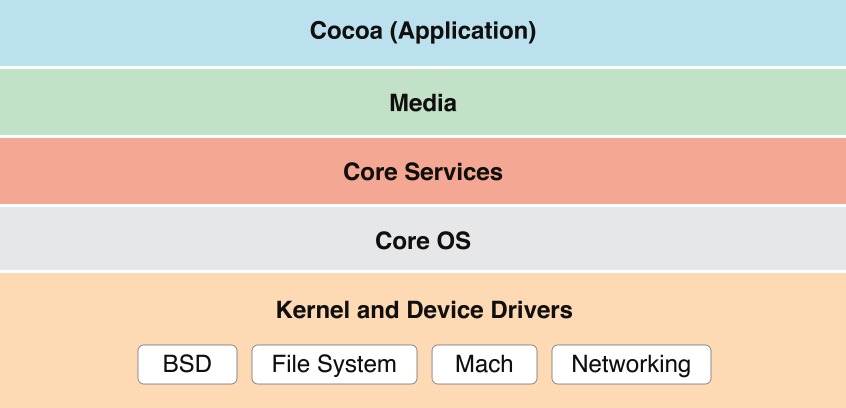

> 导航：[总目录](../../../README.md) · [documentation](../../../_indexes/documentation.md) · [Mac Technology Overview](About%20Developing%20for%20Mac.md)

# Kernel and Device Drivers Layer

The lowest layer of OS X includes the kernel, drivers, and BSD portions of the system and is based primarily on open source technologies. OS X extends this low-level environment with several core infrastructure technologies that make it easier for you to develop software.

The following sections describe features in the Kernel and Device Drivers layer of OS X.

XPC is an OS X interprocess communication technology that complements App Sandbox by enabling privilege separation. Privilege separation, in turn, is a development strategy in which you divide an app into pieces according to the system resource access that each piece needs. The component pieces that you create are called _XPC services_.

You create an XPC service as an individual target in your Xcode project. Each service gets its own sandbox—specifically, it gets its own container and its own set of entitlements. In addition, an XPC service that you include with your app is accessible only by your app. These advantages add up to making XPC the best technology for implementing privilege separation in an OS X app.

XPC is integrated with Grand Central Dispatch (GCD). When you create a connection, you associate it with a dispatch queue on which message traffic executes.

When the app is launched, the system automatically registers each XPC service it finds into the namespace visible to the app. An app establishes a connection with one of its XPC services and sends it messages containing events that the service then handles.

For more on XPC Services, read [Creating XPC Services](https://developer.apple.com/library/archive/documentation/MacOSX/Conceptual/BPSystemStartup/Chapters/CreatingXPCServices.html#//apple_ref/doc/uid/10000172i-SW6) in _[Daemons and Services Programming Guide](../Daemons%20and%20Services%20Programming%20Guide/About%20Daemons%20and%20Services.md#apple-f4xwc4dqnrsv64tfmyxwi33df52wszbpgeydambqge3te2i)_. To learn more about App Sandbox, read _[App Sandbox Design Guide](https://developer.apple.com/library/archive/documentation/Security/Conceptual/AppSandboxDesignGuide/AboutAppSandbox/AboutAppSandbox.html#//apple_ref/doc/uid/TP40011183)_.

The `libcache` API is a low-level purgeable caching API. Aggressive caching is an important technique in maximizing app performance. However, when caching demands exceed available memory, the system must free up memory as necessary to handle new demands. Typically, this means paging cached data to and from relatively slow storage devices, sometimes even resulting in systemwide performance degradation. Your app should avoid potential paging overhead by actively managing its data caches, releasing them as soon as it no longer needs the cached data.

In the wider system context, your app can also help by creating caches that the operating system can simply purge on a priority basis as memory pressure necessitates. The `libcache` library and Foundation framework’s [NSCache](https://developer.apple.com/documentation/foundation/nscache) class help you to create these purgeable caches.

For more information about the functions of the `libcache` library, see _libcache Reference_. For more information about the `NSCache` class, see _[NSCache Class Reference](https://developer.apple.com/documentation/foundation/nscache)_.

I/O Video provides a kernel-level C++ programming interface for writing video capture device drivers. I/O Video replaces the QuickTime sequence grabber API as a means of getting video into OS X.

I/O Video consists of the `IOVideoDevice` class on the kernel side (along with various related minor classes) that your driver should subclass, and a user space device interface for communicating with the driver.

For more information, see the `IOVideoDevice.h` header file in the Kernel framework.

Beneath the appealing, easy-to-use interface of OS X is a rock-solid, UNIX-based foundation that is engineered for stability, reliability, and performance. The kernel environment is built on top of Mach 3.0 and provides high-performance networking facilities and support for multiple, integrated file systems.

The following sections describe some of the key features of the kernel and driver portions of Darwin.

Mach is at the heart of Darwin because it provides some of the most critical functions of the operating system. Much of what Mach provides is transparent to apps. It manages processor resources such as CPU usage and memory, handles scheduling, enforces memory protection, and implements a messaging-centered infrastructure for untyped interprocess communication, both local and remote. Mach provides the following important advantages to Mac computing:

- __Protected memory.__ The stability of an operating system should not depend on all executing apps being good citizens. Even a well-behaved process can accidentally write data into the address space of the system or another process, which can result in the loss or corruption of data or even precipitate system crashes. Mach ensures that an app cannot write in another app’s memory or in the operating system’s memory. By walling off apps from each other and from system processes, Mach makes it virtually impossible for a single poorly behaved app to damage the rest of the system. Best of all, if an app crashes as the result of its own misbehavior, the crash affects only that app and not the rest of the system.
- __Preemptive multitasking.__ With Mach, processes share the CPU efficiently. Mach watches over the computer’s processor, prioritizing tasks, making sure activity levels are at the maximum, and ensuring that every task gets the resources it needs. It uses certain criteria to decide how important a task is and therefore how much time to allocate to it before giving another task its turn. Your process is not dependent on another process yielding its processing time.
- __Advanced virtual memory.__ In OS X, virtual memory is “on” all the time. The Mach virtual memory system gives each process its own private virtual address space. For 64-bit apps, the theoretical maximum is approximately 18 exabytes, or 18 billion billion bytes. Mach maintains address maps that control the translation of a task’s virtual addresses into physical memory. Typically only a portion of the data or code contained in a task’s virtual address space resides in physical memory at any given time. As pages are needed, they are loaded into physical memory from storage. Mach augments these semantics with the abstraction of memory objects. Named memory objects enable one task (at a sufficiently low level) to map a range of memory, unmap it, and send it to another task. This capability is essential for implementing separate execution environments on the same system.
- __Real-time support.__ This feature guarantees low-latency access to processor resources for time-sensitive media apps.

Mach also enables cooperative multitasking, preemptive threading, and cooperative threading.

As of v10.8, OS X requires a Mac that uses the 64-bit kernel. A 64-bit kernel provides several benefits:

- The kernel can support large memory configurations more efficiently.
- The maximum size of the buffer cache is increased, potentially improving I/O performance.
- Performance is improved when working with specialized networking hardware that emulates memory mapping across a wire or with multiple video cards containing over 2 GB of video RAM.

Because a 64-bit kernel does not support 32-bit drivers and kernel extensions (KEXTs), those items must be built for 64-bit. Fortunately, for most drivers and KEXTs, building for a 64-bit kernel is usually not as difficult as you might think. For the most part, transitioning a driver or KEXT to be 64-bit capable is just like transitioning any other piece of code. For details about how to make the transition, including what things to check for in your code, see _[64-Bit Transition Guide](../../Darwin/64-Bit%20Transition%20Guide/Introduction%20to%2064-Bit%20Transition%20Guide.md#apple-f4xwc4dqnrsv64tfmyxwi33df52wszbpkridimbqgaytanru)_.

Darwin offers an object-oriented framework for developing device drivers called the _I/O Kit framework_. This framework facilitates the creation of drivers for OS X and provides much of the infrastructure that they need. Written in a restricted subset of C++ and designed to support a range of device families, the I/O Kit is both modular and extensible.

Device drivers created with the I/O Kit acquire several important features:

- True plug and play
- Dynamic device management (“hot plugging”)
- Power management (for both desktops and portables)

If your device conforms to standard specifications—such as those for mice, keyboards, audio input devices, modern MIDI devices, and so on—it should just work when you plug it in. If your device doesn’t conform to a published standard, you can use the I/O Kit resources to create a custom driver to meet your needs. Devices such as AGP cards, PCI and PCIe cards, scanners, and printers usually require custom drivers or other support software in order to work with OS X.

For information on creating device drivers, see _[IOKit Device Driver Design Guidelines](../../Device%20Drivers/IOKit%20Device%20Driver%20Design%20Guidelines/Introduction%20to%20I-O%20Kit%20Device%20Driver%20Design%20Guidelines.md#apple-f4xwc4dqnrsv64tfmyxwi33df52wszbpkridgmbqgaydmoju)_.

Darwin allows kernel developers to add networking capabilities to the operating system by creating network kernel extensions (NKEs). The NKE facility allows you to create networking modules and even entire protocol stacks that can be dynamically loaded into the kernel and unloaded from it. NKEs also make it possible to configure protocol stacks automatically.

NKE modules have built-in capabilities for monitoring and modifying network traffic. At the data-link and network layers, they can also receive notifications of asynchronous events from device drivers, such as when there is a change in the status of a network interface.

For information on how to write an NKE, see _[Network Kernel Extensions Programming Guide](../../Darwin/Network%20Kernel%20Extensions%20Programming%20Guide/Introduction%20to%20Network%20Kernel%20Extensions%20Programming%20Guide.md#apple-f4xwc4dqnrsv64tfmyxwi33df52wszbpkridimbqgaytqnjy)_.

Integrated with Darwin is a customized version of the Berkeley Software Distribution (BSD) operating system. Darwin’s implementation of BSD includes much of the POSIX API, which higher-level apps can also use to implement basic app features. BSD serves as the basis for the file systems and networking facilities of OS X. In addition, it provides several programming interfaces and services, including:

- The process model (process IDs, signals, and so on)
- Basic security policies such as file permissions and user and group IDs
- Threading support (POSIX threads)
- Networking support (BSD sockets)

The following sections describe some of the key features of the BSD layer of OS X.

OS X supports the following technologies for interprocess communication (IPC) and for delivering notifications across the system:

- __File System Events.__ File System Events (`FSEvents`) is a mechanism for notifying your app when changes occur in the file system, such as at the creation, modification, or removal of files and directories. The `FSEvents` API gives you a way to monitor many directories at once and detect general changes to a file hierarchy. For example, you might use this technology in backup software to detect what files changed. The `FSEvents` API is not intended for detecting fine-grained changes to individual files.

  To learn how to use the `FSEvents` API, see _[File System Events Programming Guide](../../Darwin/File%20System%20Events%20Programming%20Guide/Introduction.md#apple-f4xwc4dqnrsv64tfmyxwi33df52wszbpkridimbqga2teobz)_.
- __Kernel queues and kernel events.__ These mechanisms allow you to intercept kernel-level events to receive notifications about changes to sockets, processes, the file system, and other aspects of the system. Kernel queues and events are part of the FreeBSD layer of the operating system and are described in the [kqueue](https://developer.apple.com/library/archive/documentation/System/Conceptual/ManPages_iPhoneOS/man2/kqueue.2.html#//apple_ref/doc/man/2/kqueue) and [kevent](https://developer.apple.com/library/archive/documentation/System/Conceptual/ManPages_iPhoneOS/man2/kevent.2.html#//apple_ref/doc/man/2/kevent) man pages.
- __BSD notifications.__ BSD notifications have a few advantages over the notification services that are offered by Core Foundation and Foundation. For example, your program can receive BSD notifications through mechanisms that include Mach ports, signals, and file descriptors. Moreover, this technology is lightweight, efficient, and capable of coalescing notifications.

  You can add support for BSD notifications to any type of program, including Cocoa apps. For more information, see _[Mac Notification Overview](../../Darwin/Mac%20Notification%20Overview/Introduction%20to%20OS%20X%20Notification%20Overview.md#apple-f4xwc4dqnrsv64tfmyxwi33df52wszbpkridimbqga2tsnbx)_ or the [notify](https://developer.apple.com/library/archive/documentation/System/Conceptual/ManPages_iPhoneOS/man3/notify.3.html#//apple_ref/doc/man/3/notify) man page. For a discussion of Cocoa and Core Foundation interfaces for interprocess notification, see [Distributed Notifications](Core%20Services%20Layer.md#apple-f4xwc4dqnrsv64tfmyxwi33df52wszbpkridimbqgaytanrxfvbuqmrxgawvgvzrg4).
- __Sockets and ports.__ Sockets and ports are portable mechanisms for interprocess communication. A socket represents one end of a communications channel between two processes either locally or across the network. A port is a channel between processes or threads on the local computer. Core Foundation and Foundation provide higher-level abstractions for ports and sockets that make them easier to implement and offer additional features. For example, you can use a `CFSocket` with a `CFRunLoop` to multiplex data received from a socket with data received from other sources (or more information, see _[CFSocket Reference](https://developer.apple.com/documentation/corefoundation/cfsocket-rg7)_ and _[CFRunLoop Reference](https://developer.apple.com/documentation/corefoundation/cfrunloop)_).
- __Streams__. A stream is mechanism for transferring data between processes when you are communicating using an established transport mechanism such as Bonjour or HTTP. Higher-level interfaces of Core Foundation and Foundation (which work with `CFNetwork`) provide a stream-based way to read and write network data and can be used with run loops to operate efficiently in a network environment.
- __Pipes__. A pipe is a communications channel typically created between a parent and a child process when the child process is forked. Data written to a pipe is buffered and read in first-in, first-out (FIFO) order. You can create named pipes (`pipe` function) for communication between related processes or named pipes for communication between any two processes. A named pipe must be created with a unique name known to both the sending and the receiving process.
- __Shared memory__. Shared memory is a region of memory that has been allocated by a process specifically for the purpose of being readable and possibly writable among several processes. You can create regions of shared memory using several BSD approaches, including the `shm_open` and `shm_unlink` routines, and the `mmap` routine. Access to shared memory is controlled through POSIX semaphores, which implement a kind of locking mechanism.

  Although shared memory permits any process with the appropriate permissions to read or write a shared memory region directly, it is very fragile—leading to the dangers of data corruption and security breaches—and should be used with care. It is best used only as a repository for raw data (such as pixels or audio), with the controlling data structures accessed through more conventional interprocess communication.

  For information about `shm_open`, `shm_unlink`, and `mmap`, see the [shm_open](https://developer.apple.com/library/archive/documentation/System/Conceptual/ManPages_iPhoneOS/man2/shm_open.2.html#//apple_ref/doc/man/2/shm_open), [shm_unlink](https://developer.apple.com/library/archive/documentation/System/Conceptual/ManPages_iPhoneOS/man2/shm_unlink.2.html#//apple_ref/doc/man/2/shm_unlink), and [mmap](https://developer.apple.com/library/archive/documentation/System/Conceptual/ManPages_iPhoneOS/man2/mmap.2.html#//apple_ref/doc/man/2/mmap) man pages.
- __Apple event__. An Apple event is a high-level semantic event that an app can send to itself, to other apps on the same computer, or to apps on a remote computer. Apps can use Apple events to request services and information from other apps. To supply services, you define objects in your app that can be accessed using Apple events and then provide Apple event handlers to respond to requests for those objects.

  Although Apple events are not a BSD technology, they are a low-level alternative for interprocess communication. To learn how to use Apple events, see _[Apple Events Programming Guide](../../Apple%20Script/Apple%20Events%20Programming%20Guide/Introduction%20to%20Apple%20Events%20Programming%20Guide.md#apple-f4xwc4dqnrsv64tfmyxwi33df52wszbpkridimbqgaytinbz)_.

OS X is one of the premier platforms for computing in an interconnected world. It supports the dominant media types, protocols, and services in the industry, as well as differentiated and innovative services from Apple.

The OS X network protocol stack is based on BSD. The extensible architecture provided by network kernel extensions, summarized in [Network Kernel Extensions](#apple-f4xwc4dqnrsv64tfmyxwi33df52wszbpkridimbqgaytanrxfvbuqmrqg4wueqsdinfecq2e), facilitates the creation of modules implementing new or existing protocols that can be added to this stack.

OS X provides built-in support for a large number of network protocols that are standard in the computing industry. Table 6-1 summarizes these protocols.

__Table 6-1__  Network protocols

| Protocol | Description |
| 802.1x | 802.1x is a protocol for implementing port-based network access over wired or wireless LANs. It supports a wide range of authentication methods, including TLS, TTLS, LEAP, MDS, and PEAP (MSCHAPv2, MD5, GTC). |
| DHCP and BOOTP | The Dynamic Host Configuration Protocol and the Bootstrap Protocol automate the assignment of IP addresses in a particular network. |
| DNS | Domain Name Services is the standard Internet service for mapping host names to IP addresses. |
| FTP and SFTP | The File Transfer Protocol and Secure File Transfer Protocol are two standard means of moving files between computers on TCP/IP networks. |
| HTTP and HTTPS | The Hypertext Transport Protocol is the standard protocol for transferring webpages between a web server and browser. OS X provides support for both the insecure and secure versions of the protocol. |
| LDAP | The Lightweight Directory Access Protocol lets users locate groups, individuals, and resources such as files and devices in a network, whether on the Internet or on a corporate intranet. |
| NBP | The Name Binding Protocol is used to bind processes across a network. |
| NTP | The Network Time Protocol is used for synchronizing client clocks. |
| PAP | The Printer Access Protocol is used for spooling print jobs and printing to network printers. |
| PPP | For dial-up (modem) access, OS X includes PPP (Point-to-Point Protocol). PPP support includes TCP/IP as well as the PAP and CHAP authentication protocols. |
| PPPoE | The Point-to-Point Protocol over Ethernet protocol provides an Ethernet-based dial-up connection for broadband users. |
| S/MIME | The Secure/Multipurpose Internet Mail Extensions protocol supports encryption of email and the attachment of digital signatures to validate email addresses. |
| SLP | Service Location Protocol is designed for the automatic discovery of resources (servers, fax machines, and so on) on an IP network. |
| SOAP | The Simple Object Access Protocol is a lightweight protocol for exchanging encapsulated messages over the web or other networks. |
| SSH | The Secure Shell protocol is a safe way to perform a remote login to another computer. Session information is encrypted to prevent unauthorized access of data. |
| TCP/IP and UDP/IP | OS X provides two transmission-layer protocols, TCP (Transmission Control Protocol) and UDP (User Datagram Protocol), to work with the network-layer Internet Protocol (IP). (OS X includes support for IPv6 and IPSec.) |
| XML-RPC | XML-RPC is a protocol for sending remote procedure calls using XML over the web. |

OS X also implements a number of file-sharing protocols; see [Table 6-4](#apple-f4xwc4dqnrsv64tfmyxwi33df52wszbpkridimbqgaytanrxfvbuqmrqg4wueq2ji5cuoscb) for a summary of these protocols.

OS X supports the network technologies listed in Table 6-2.

__Table 6-2__  Network technology support

| Technology | Description |
| Ethernet 10/100Base-T | For the Ethernet ports built into every new Macintosh. |
| Ethernet 1000Base-T | Also known as Gigabit Ethernet. For data transmission over fiber-optic cable and standardized copper wiring. |
| Jumbo Frame | This Ethernet format uses 9 KB frames for interserver links rather than the standard 1.5 KB frame. Jumbo Frame decreases network overhead and increases the flow of server-to-server and server-to-app data. |
| Serial | Supports modem and ISDN capabilities. |
| Wireless | Supports the 802.11b, 802.11g, 80211n, and 802.11ac wireless network technologies using AirPort Extreme and AirPort Express. |
| IP Routing/RIP | IP routing provides routing services for small networks. It uses Routing Information Protocol (RIP) in its implementation. |
| Multihoming | Enables a computer host to be physically connected to multiple data links that can be on the same or different networks. |
| IP aliasing | Allows a network administrator to assign multiple IP addresses to a single network interface. |
| Zero-configuration networking | See [Bonjour](Core%20Services%20Layer.md#apple-f4xwc4dqnrsv64tfmyxwi33df52wszbpkridimbqgaytanrxfvbuqmrxgawvgvzs). |
| NetBoot | Allows computers to share a single System folder, which is installed on a centralized server that the system administrator controls. Users store their data in home directories on the server and have access to a common Applications folder, both of which are also commonly installed on the server. |
| Personal web sharing | Allows users to share information with other users on an intranet, no matter what type of computer or browser they are using. The Apache web server is integrated as the system’s HTTP service. |

Network diagnostics is a way of helping the user solve network problems. Although modern networks are generally reliable, there are still times when network services may fail. Sometimes the cause of the failure is beyond the ability of the desktop user to fix, but sometimes the problem is in the way the user’s computer is configured. The network diagnostics feature provides a diagnostic app to help the user locate problems and correct them.

If your app encounters a network error, you can use the diagnostic interfaces of `CFNetwork` to launch the diagnostic app and attempt to solve the problem interactively. You can also choose to report diagnostic problems to the user without attempting to solve them.

For more information on using this feature, see [Using Network Diagnostics](https://developer.apple.com/library/archive/documentation/Networking/Conceptual/CFNetwork/UsingNetworkDiagnostics/UsingNetworkDiagnostics.html#//apple_ref/doc/uid/TP30001132-CH7).

The file-system component of Darwin is based on extensions to BSD and an enhanced Virtual File System (VFS) design. The file-system component includes the following features:

- Permissions on removable media. This feature is based on a globally unique ID registered for each connected removable device (including USB and FireWire devices) in the system.
- Access control lists, which support fine-grained access to file-system objects.
- URL-based volume mounts, which enable users (via a Finder command) to mount such things as AppleShare and web servers
- Unified buffer cache, which consolidates the buffer cache with the virtual-memory cache
- Long filenames (255 characters or 755 bytes, based on UTF-8)
- Support for hiding filename extensions on a per-file basis
- Journaling of all file-system types to aid in data recovery after a crash

Because of its multiple app environments and the various kinds of devices it supports, OS X handles file data in many standard volume formats. Table 6-3 lists the supported formats.

__Table 6-3__  Supported local volume formats

| Volume format | Description |
| Mac OS Extended Format | Also called HFS (hierarchical file system) Plus, or HFS+. This is the default root and booting volume format in OS X. This extended version of HFS optimizes the storage capacity of large hard disks by decreasing the minimum size of a single file. |
| Mac OS Standard Format | Also called hierarchical file system, or HFS. This is the legacy volume format in Mac OS systems prior to Mac OS 8.1. HFS (like HFS+) stores resources and data in separate forks of a file and makes use of various file attributes, including type and creator codes. |
| UDF | Universal Disk Format, used for hard drives and optical disks, including most types of CDs and DVDs. OS X supports reading UDF revisions 1.02 through 2.60 on both block devices and most optical media, and it supports writing to block devices and to DVD-RW and DVD+RW media using UDF 2.00 through 2.50 (except for mirrored metadata partitions in 2.50). You can find the UDF specification at [http://www.osta.org](http://www.osta.org/). |
| ISO 9660 | The standard format for CD-ROM volumes. |
| NTFS | The NT File System, used by Windows computers. OS X can read NTFS-formatted volumes but cannot write to them. |
| UFS | UNIX File System, a flat (that is, single-fork) disk volume format, based on the BSD FFS (Fast File System), that is similar to the standard volume format of most UNIX operating systems; it supports POSIX file-system semantics, which are important for many server applications. Although UFS is supported in OS X, its use is discouraged. |
| MS-DOS (FAT) | The FAT file system is used by many Windows computers, digital cameras, video cameras, SD and SDHC memory cards, and other digital devices. OS X can read and write FAT-formatted volumes. |
| ExFAT | The ExFAT file system is an extension of the FAT file system, and is also used on Windows computers, some digital cameras and video cameras, SDXC memory cards, and other digital devices. OS X can read and write ExFAT-formatted volumes. |

HFS+ volumes support aliases, symbolic links, and hard links, whereas UFS volumes support symbolic links and hard links but not aliases. Although an alias and a symbolic link are both lightweight references to a file or directory elsewhere in the file system, they are semantically different in significant ways. For more information, see [Aliases and Symbolic Links](https://developer.apple.com/library/archive/documentation/MacOSX/Conceptual/BPFileSystem/Articles/Aliases.html#//apple_ref/doc/uid/20002288) in _[File System Overview](../File%20System%20Overview/Introduction%20to%20the%20File%20System%20Overview.md#apple-f4xwc4dqnrsv64tfmyxwi33df52wszbpgeydambqge4dk2i)_.

Because OS X is intended to be deployed in heterogeneous networks, it also supports several network file-sharing protocols. Table 6-4 lists these protocols.

__Table 6-4__  Supported network file-sharing protocols

| File protocol | Description |
| AFP | Apple Filing Protocol, the principal file-sharing protocol in Mac OS 9 systems (available only over TCP/IP transport). |
| NFS | Network File System, the dominant file-sharing protocol in the UNIX world. |
| WebDAV | Web-based Distributed Authoring and Versioning, an HTTP extension that allows collaborative file management on the web. |
| SMB/CIFS | SMB/CIFS, a file-sharing protocol used on Windows and UNIX systems. |

The roots of OS X in the UNIX operating system provide a robust and secure computing environment whose track record extends back many decades. OS X security services are built on top of BSD (Berkeley Software Distribution), an open-source standard. BSD is a form of the UNIX operating system that provides basic security for fundamental services, such as file and network access.

The CommonCrypto library, which is part of `libSystem`, provides raw cryptographic algorithms. It is intended to replace similar OpenSSL interfaces.

OS X also includes the following security features:

- Adoption of Mandatory Access Control, which provides a fine-grained security architecture for controlling the execution of processes at the kernel level. This feature enables the “sandboxing” of apps, which lets you limit the access of a given app to only those features you designate.
- Support for code signing and installer package signing. This feature lets the system validate apps using a digital signature and warn the user if an app is tampered with.
- Compiler support for fortifying your source code against potential security threats. This support includes options to disallow the execution of code located on the stack or other portions of memory containing data.
- Support for putting unknown files into quarantine. This is especially useful for developers of web browsers or other network-based apps that receive files from unknown sources. The system prevents access to quarantined files unless the user explicitly approves that access.

For an introduction to OS X security features, see _[Security Overview](../../Security/Security%20Overview/About%20Software%20Security.md#apple-f4xwc4dqnrsv64tfmyxwi33df52wszbpkridgmbqgaydsnzw)_.

Darwin includes all of the scripting languages commonly found in UNIX-based operating systems. In addition to the scripting languages associated with command-line shells (such as `bash` and `csh`), Darwin also includes support for Perl, Python, Ruby, Ruby on Rails, and others.

OS X provides scripting bridges to the Objective-C classes of Cocoa. These bridges let you use Cocoa classes from within your Python and Ruby scripts. For information about using these bridges, see _[Ruby and Python Programming Topics for Mac](../../Cocoa/Ruby%20and%20Python%20Programming%20Topics%20for%20Mac/Introduction%20to%20Ruby%20and%20Python%20Programming%20Topics%20for%20OS%20X.md#apple-f4xwc4dqnrsv64tfmyxwi33df52wszbpkridimbqga2dsmzw)_.

OS X provides full support for creating multiple preemptive threads of execution inside a single process. Threads let your program perform multiple tasks in parallel. For example, you might create a thread to perform some lengthy calculations in the background while a separate thread responds to user events and updates the windows in your app. Using multiple threads can often lead to significant performance improvements in your app, especially on computers with multiple CPU cores. Multithreaded programming is not without its dangers though. It requires careful coordination to ensure your app’s state does not get corrupted.

All user-level threads in OS X are based on POSIX threads (also known as pthreads). A pthread is a lightweight wrapper around a Mach thread, which is the kernel implementation of a thread. You can use the pthreads API directly or use any of the threading packages offered by Cocoa. Although each threading package offers a different combination of flexibility versus ease-of-use, all packages offer roughly the same performance.

In general, you should try to use Grand Central Dispatch or operation objects to perform work concurrently. However, there might still be situations where you need to create threads explicitly. For more information about threading support and guidelines on how to use threads safely, see _[Threading Programming Guide](../../Cocoa/Threading%20Programming%20Guide/Introduction.md#apple-f4xwc4dqnrsv64tfmyxwi33df52wszbpgeydambqga2to2i)_.

The X11 windowing system is provided as an optional installation component for the system. This windowing system is used by many UNIX applications to draw windows, controls, and other elements of graphical user interfaces. The OS X implementation of X11 uses the Quartz drawing environment to give X11 windows a native OS X feel. This integration also makes it possible to display X11 windows alongside windows from native apps written in Cocoa.

The following sections describe some additional features of OS X that affect the software development process.

The underlying architecture of OS X executables was built from the beginning with flexibility in mind. This flexibility became important as Mac computers have transitioned from using PowerPC to Intel CPUs and from supporting only 32-bit apps to 64-bit apps. The following sections provide an overview of the types of architectures you can support in your OS X executables along with other information about the runtime and debugging environments available to you.

When OS X was first introduced, it was built to support a 32-bit PowerPC hardware architecture. With Apple’s transition to Intel-based Mac computers, OS X added initial support for 32-bit Intel hardware architectures. In addition to 32-bit support, OS X v10.4 added some basic support for 64-bit architectures as well and this support was expanded in OS X v10.5. This means that apps and libraries can now support two different architectures:

- 32-bit Intel (`i386`)
- 64-bit Intel (`x86_64`)

Although apps can support all of these architectures in a single binary, doing so is not required. The ability to create “universal binaries” that run natively on all supported architectures gives OS X the flexibility it needs for the future.

Supporting multiple architectures requires careful planning and testing of your code for each architecture. There are subtle differences from one architecture to the next that can cause problems if not accounted for in your code. For example, some built-in data types have different sizes in 32-bit and 64-bit architectures. Accounting for these differences is not difficult but requires consideration to avoid coding errors.

Xcode provides integral support for creating apps that support multiple hardware architectures. For information about tools support and creating universal binaries. For information about 64-bit support in OS X, including links to documentation for how to make the transition, see [64-Bit Support](#apple-f4xwc4dqnrsv64tfmyxwi33df52wszbpkridimbqgaytanrxfvbuqmrqg4wvgvzs).

OS X was initially designed to support binary files on computers using a 32-bit architecture. In OS X v10.4, however, support was introduced for compiling, linking, and debugging binaries on a 64-bit architecture. This initial support was limited to code written using C or C++ only. In addition, 64-bit binaries could link against the Accelerate framework and `libSystem.dylib` only.

Starting in OS X v10.5, most system libraries and frameworks are 64-bit ready, meaning they can be used in both 32-bit and 64-bit apps. Frameworks built for 64-bit means you can create apps that address extremely large data sets, up to 128 TB on the current Intel-based CPUs. On Intel-based Macintosh computers, some 64-bit apps may even run faster than their 32-bit equivalents because of the availability of extra processor resources in 64-bit mode.

There are a few technologies that have not been ported to 64-bit. Development of 32-bit apps with these APIs is still supported, but if you want to create a 64-bit app, you must use alternative technologies. Among these APIs are the following:

- The entire QuickTime C API (deprecated in OS X v10.9; in a 64-bit app, use AV Foundation instead)
- HIToolbox, Window Manager, and most other user interface APIs (in general, use Cocoa UI classes and other alternatives); see _[64-Bit Guide for Carbon Developers](../../Carbon/64-Bit%20Guide%20for%20Carbon%20Developers/Introduction%20to%2064-Bit%20Guide%20for%20Carbon%20Developers.md#apple-f4xwc4dqnrsv64tfmyxwi33df52wszbpkridimbqga2dgobr)_ for the list of specific APIs and transition paths.

OS X uses the LP64 model that is in use by other 64-bit UNIX systems, which means fewer headaches when porting from other operating systems. For general information on the LP64 model and how to write 64-bit apps, see _[64-Bit Transition Guide](../../Darwin/64-Bit%20Transition%20Guide/Introduction%20to%2064-Bit%20Transition%20Guide.md#apple-f4xwc4dqnrsv64tfmyxwi33df52wszbpkridimbqgaytanru)_. For Cocoa-specific transition information, see _[64-Bit Transition Guide for Cocoa](../../Cocoa/64-Bit%20Transition%20Guide%20for%20Cocoa/Introduction%20to%2064-Bit%20Transition%20Guide%20For%20Cocoa.md#apple-f4xwc4dqnrsv64tfmyxwi33df52wszbpkridimbqga2denbx)_.

OS X is capable of loading object files that use several different object-file formats. Mach-O format is the format used for all native OS X app development.

For information about the Mach-O file format, see _OS X ABI Mach-O File Format Reference_. For additional information about using Mach-O files, see _[Mach-O Programming Topics](../../Developer%20Tools/Mach-O%20Programming%20Topics/Introduction.md#apple-f4xwc4dqnrsv64tfmyxwi33df52wszbpkridimbqgaytkmjz)_.

Whenever you debug an executable file, the debugger uses symbol information generated by the compiler to associate user-readable names with the procedure and data address it finds in memory. Normally, this user-readable information is not needed by a running program and is stripped out (or never generated) by the compiler to save space in the resulting binary file. For debugging, however, this information is very important to be able to understand what the program is doing.

OS X supports two different debug file formats for compiled executables: Stabs and DWARF. The Stabs format is present in all versions of OS X and until the introduction of Xcode 2.4 was the default debugging format. Code compiled with Xcode 2.4 and later uses the DWARF debugging format by default. When using the Stabs format, debugging symbols, like other symbols are stored in the symbol table of the executable; see _OS X ABI Mach-O File Format Reference_. With the DWARF format, debugging symbols are stored either in a specialized segment of the executable or in a separate debug-information file.

For information about the DWARF standard, go to [The DWARF Debugging Standard](http://www.dwarfstd.org/); for information about the Stabs debug file format, see _STABS Debug Format_. For additional information about Mach-O files and their stored symbols, see _[Mach-O Programming Topics](../../Developer%20Tools/Mach-O%20Programming%20Topics/Introduction.md#apple-f4xwc4dqnrsv64tfmyxwi33df52wszbpkridimbqgaytkmjz)_.

Since its first release, OS X has supported several different environments for running apps. The most prominent of these environments is the dynamic link editor (`dyld`) environment, which is also the only environment supported for active development. Most of the other environments provided legacy support during the transition from Mac OS 9 to OS X and are no longer supported for active development. The following sections describe the runtime environments you may encounter in various versions of OS X.

The `dyld` runtime environment is the native environment in OS X and is used to load, link, and execute Mach-O files. At the heart of this environment is the `dyld` dynamic loader program, which handles the loading of a program’s code modules and associated dynamic libraries, resolves any dependencies between those libraries and modules, and begins the execution of the program.

Upon loading a program’s code modules, the dynamic loader performs the minimal amount of symbol binding needed to launch your program and get it running. This binding process involves resolving links to external libraries and loading them as their symbols are used. The dynamic loader takes a lazy approach to binding individual symbols, doing so only as they are used by your code. Symbols in your code can be strongly linked or weakly linked. Strongly linked symbols cause the dynamic loader to terminate your program if the library containing the symbol cannot be found or the symbol is not present in the library. Weakly linked symbols terminate your program only if the symbol is not present and an attempt is made to use it.

For more information about the dynamic loader program, see the `dyld` man page. For information about building and working with Mach-O executable files, see _[Mach-O Programming Topics](../../Developer%20Tools/Mach-O%20Programming%20Topics/Introduction.md#apple-f4xwc4dqnrsv64tfmyxwi33df52wszbpkridimbqgaytkmjz)_.

The tools that come with OS X provide direct support for developing software using the Swift, C, C++, Objective-C, and Objective-C++ languages along with numerous scripting languages. Support for other languages may also be provided by third-party developers. For more information on the key features of Swift and Objective-C, see [Development Languages](Creating%20Software%20Products%20for%20the%20Mac%20Platform.md#apple-f4xwc4dqnrsv64tfmyxwi33df52wszbpkridimbqgaytanrxfvbuqmrqgywvgvzu)

