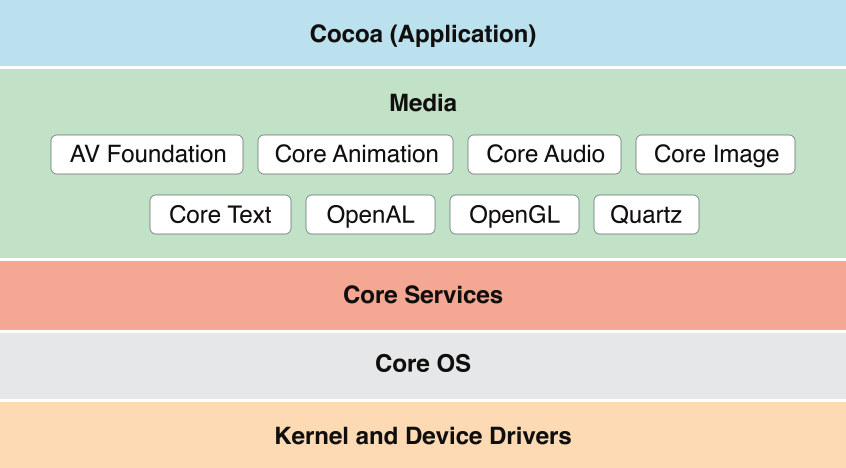

> 导航：[总目录](../../../README.md) · [documentation](../../../_indexes/documentation.md) · [Mac Technology Overview](About%20Developing%20for%20Mac.md)

# Media Layer

Beautiful graphics and high-fidelity multimedia are hallmarks of the OS X user experience. Take advantage of the technologies of the Media layer to incorporate 2D and 3D graphics, animations, image effects, and professional-grade audio and video functionality into your app.

OS X supports more than 100 media types, covering a range of audio, video, image, and streaming formats. Table 3-1 lists some of the more common supported file formats.

__Table 3-1__  Partial list of formats supported in OS X

| Image formats | PICT, BMP, GIF, JPEG, TIFF, PNG, DIB, ICO, EPS, PDF |
| Audio file and data formats | AAC, AIFF, WAVE, uLaw, AC3, MPEG-3, MPEG-4 (`.mp4`, `.m4a`), `.snd`, `.au`, `.caf`, Adaptive multi-rate (`.amr`) |
| Video file formats | AVI, AVR, DV, M-JPEG, MPEG-1, MPEG-2, MPEG-4, AAC, OpenDML, 3GPP, 3GPP2, AMC, H.264, iTunes (`.m4v`), QuickTime (`.mov`, `.qt`) |
| Web streaming protocols | HTTP, RTP, RTSP |

A distinctive quality of any OS X app is high-quality graphics in its user interface. And on a Retina display, users are more aware than ever of your app’s graphics.

The simplest, most efficient, and most common way to ensure high-quality graphics in your app is to use the standard views and controls of the AppKit framework, along with prerendered images in different resolutions. In this way, you let the system do the work of rendering the app’s UI appropriately for the current display. Occasionally, you might need to go beyond off-the-shelf views and simple graphics. In these situations, you can take advantage of the powerful OS X graphics technologies. The following sections describe some of these technologies; for summaries of all technologies see [Media Layer Frameworks](#apple-f4xwc4dqnrsv64tfmyxwi33df52wszbpkridimbqgaytanrxfvbuqmrxgmwvgvzv).

OS X offers several system technologies for graphics and drawing. Many of these technologies provide support for making your rendered content look good at different screen resolutions. To learn how to make sure that your app looks good on a high-resolution display, see _[High Resolution Guidelines for OS X](../../Graphics%20Animation/High%20Resolution%20Guidelines%20for%20OS%20X/About%20High%20Resolution%20for%20OS%20X.md#apple-f4xwc4dqnrsv64tfmyxwi33df52wszbpkridimbqgezdgmbs)_.

The AppKit framework provides object-oriented wrappers for many of the features found in Quartz 2D. Cocoa provides support for drawing primitive shapes such as lines, rectangles, ovals, arcs, and Bezier paths. It supports drawing in both standard and custom color spaces and it supports content manipulations using graphics transforms. Drawing calls made from Cocoa are composited along with all other Quartz 2D content. You can even mix Quartz 2D drawing calls (and drawing calls from other system graphics technologies) with Cocoa calls in your code.

The AppKit framework is described in [AppKit](Cocoa%20Application%20Layer.md#apple-f4xwc4dqnrsv64tfmyxwi33df52wszbpkridimbqgaytanrxfvbuqmrxgqwvgvzw). For more information on how to draw using Cocoa features, see _[Cocoa Drawing Guide](../../Cocoa/Cocoa%20Drawing%20Guide/Introduction%20to%20Cocoa%20Drawing%20Guide.md#apple-f4xwc4dqnrsv64tfmyxwi33df52wszbpkridimbqgazteojq)_.

Metal provides the lowest-overhead access to the GPU, enabling you to maximize the graphics and compute potential of your app. With a streamlined API, precompiled shaders, and support for efficient multi-threading, Metal can take your game or graphics app to the next level of performance and capability.

The Metal framework is described in _[Metal Programming Guide](../../Miscellaneous/Metal%20Programming%20Guide/About%20Metal%20and%20This%20Guide.md#apple-f4xwc4dqnrsv64tfmyxwi33df52wszbpkridimbqge2demrr)_, _Metal Shading Language Guide_, and the associated references.

In addition to AppKit (specifically, its Cocoa drawing interface), there are several other important frameworks for graphics and drawing. By design, Cocoa drawing integrates well with the other graphics and drawing technologies listed next.

- __Core Graphics__ (`CoreGraphics.framework`). Core Graphics (also known as _Quartz 2D_) offers native 2D vector- and image-based rendering capabilities that are resolution- and device-independent. These capabilities include path-based drawing, painting with transparency, shading, drawing of shadows, transparency layers, color management, antialiased rendering, and PDF document generation. The Core Graphics framework is in the Application Services umbrella framework.

  Quartz is at the heart of the OS X graphics and windowing environment. It provides rendering support for 2D content and combines a rich imaging model with on-the-fly rendering, compositing, and antialiasing of content. It also implements the windowing system for OS X and provides low-level services such as event routing and cursor management (for more information, see [Core Graphics](#apple-f4xwc4dqnrsv64tfmyxwi33df52wszbpkridimbqgaytanrxfvbuqmrxgmwueqsdivauiqsd)).
- __Core Animation.__ Core Animation enables your app to create fluid animations using advanced compositing effects. It defines a hierarchical view-like abstraction that mirrors a hierarchy of views and is used to perform complex animations of user interfaces. Core Animation is implemented by the Quartz Core framework (`QuartzCore.framework`) (for more information, see [Core Animation](#apple-f4xwc4dqnrsv64tfmyxwi33df52wszbpkridimbqgaytanrxfvbuqmrxgmwvgvzshe)).
- __SpriteKit__ (`SpriteKit.framework`). SpriteKit provides the tools and methods for creating and rendering and animating textured images, or sprites. You use graphical editors for creating sprites, and then use those sprites in scenes that simulate game physics. In addition to sprites, you can add lights, emitters, and different kinds of fields to scenes. SpriteKit animates your scene and calls back to your code for events such as collisions. To learn more, see [Sprite Kit](#apple-f4xwc4dqnrsv64tfmyxwi33df52wszbpkridimbqgaytanrxfvbuqmrxgmwvgvztgq).
- __Scene Kit__ (`SceneKit.framework`). Scene Kit provides a high-level, Objective-C graphics API that you can use to efficiently load, manipulate, and render 3D scenes. Powerful and easy-to-use Scene Kit integrates well with Core Animation and SpriteKit, allowing you to use built-in materials or custom GLSL shaders to render your 3D scenes (for more information, see [Scene Kit](#apple-f4xwc4dqnrsv64tfmyxwi33df52wszbpkridimbqgaytanrxfvbuqmrxgmwvgvztgm)).
- __Metal__ _Metal.framework_ provides extremely low-overhead access to the capabilities of modern GPUs and enables high-performance 2D and 3D graphics, and parallel computational tasks. A more flexible and efficient alternative to OpenGL and OpenCL, Metal is intended for use by games and graphics-intensive applications that require fine-grained control over the GPU. To learn more about Metal, see _[Metal Programming Guide](../../Miscellaneous/Metal%20Programming%20Guide/About%20Metal%20and%20This%20Guide.md#apple-f4xwc4dqnrsv64tfmyxwi33df52wszbpkridimbqge2demrr)_ and _Metal Shading Language Guide_
- MetalKit MetalKit.framework provides libraries of commonly needed functions and classes to reduce the overall time for developing a Metal application. For more information, see _[MetalKit Framework Reference](https://developer.apple.com/documentation/metalkit)_ and _[MetalKit Functions Reference](https://developer.apple.com/documentation/metalkit/metalkit_functions)_.
- __OpenGL__ (`OpenGL.framework`). OpenGL is an open, standards-based technology for creating and animating real-time 2D and 3D graphics. It is primarily used for games and other apps with real-time rendering needs. To learn more about OpenGL in OS X, see [OpenGL](#apple-f4xwc4dqnrsv64tfmyxwi33df52wszbpkridimbqgaytanrxfvbuqmrxgmwvgvzy).
- __GLKit__ (`GLKit.framework`). GLKit provides libraries of commonly needed functions and classes that reduce the effort required to create shader-based apps or to port existing apps that rely on fixed-function vertex or fragment processing provided by earlier versions of OpenGL ES or OpenGL. To learn more about the GLKit framework, see [GLKit](#apple-f4xwc4dqnrsv64tfmyxwi33df52wszbpkridimbqgaytanrxfvbuqmrxgmwvgvzsgq).

OS X provides extensive support for advanced typography for Cocoa apps. With this support, your app can control the fonts, layout, typesetting, text input, and text storage when managing the display and editing of text. For the most basic text requirements, you can use the text fields, text views, and other text-displaying objects provided by the AppKit framework.

There are two technologies to draw upon for more sophisticated text, font, and typography needs: the Cocoa text system and the Core Text API. Unless you need low-level access to the layout manager routines, the Cocoa text system should provide most of the features and performance you need. If you need a lower-level API for drawing any kind of text into a `CGContext`, then you should consider using the Core Text API.

- __Cocoa text system.__ AppKit provides a collection of classes, known as the _Cocoa text system_, that together provide a complete set of high-quality typographical services. With these services, apps can create, edit, display, and store text with all the characteristics of fine typesetting, such as kerning, ligatures, line breaking, and justification. Use the Cocoa Text system to display small or large amounts of text and to customize the default layout manager classes to support custom layout. The Cocoa text system is the recommended technology for most apps that require text handling and typesetting capabilities.

  AppKit also offers a class ([NSFont](https://developer.apple.com/documentation/appkit/nsfont)), a font manager, and a font panel. In addition, the Cocoa text system supports vertical text and linguistic tagging.

  For an overview of the Cocoa text system, see _[Cocoa Text Architecture Guide](../../Cocoa%20Text%20Architecture%20Guide/About%20the%20Cocoa%20Text%20System.md#apple-f4xwc4dqnrsv64tfmyxwi33df52wszbpkridimbqga4tinjz)_.
- __Core Text__ (`CoreText.framework`). The Core Text framework contains low-level interfaces for laying out Unicode text and handling Unicode fonts. Core Text provides the underlying implementation for many features of the Cocoa text system.

  To learn more about the Core Text framework, see [Core Text](#apple-f4xwc4dqnrsv64tfmyxwi33df52wszbpkridimbqgaytanrxfvbuqmrxgmwvgvzt).

Both AppKit and Quartz let you create objects that represent images ([NSImage](https://developer.apple.com/documentation/appkit/nsimage) and [CGImageRef](https://developer.apple.com/documentation/coregraphics/cgimageref)) from various sources, draw these images to an appropriate graphics context, and even composite one image over another according to a given blending mode. Beyond the native capabilities of AppKit and Core Graphics, you can do other things with images using the following frameworks:

- __Image Capture Core__ (`ImageCaptureCore.framework`). The Image Capture Core framework enables your app to browse locally connected or networked scanners and cameras, to list and download thumbnails and images, to take scans, rotate and delete images and, if the device supports it, to take pictures or control the scan parameters. For more information, see [Other Media Layer Frameworks](#apple-f4xwc4dqnrsv64tfmyxwi33df52wszbpkridimbqgaytanrxfvbuqmrxgmwvgvzrga).
- __Core Image.__ Core Image is an image processing technology that allows developers to process images with system-provided image filters, create custom image filters, and detect features in an image. Examples of built-in filters are those that crop, blur, and warp images. Core Image is implemented by the Quartz Core framework (`QuartzCore.framework`). For more information, see [Core Image](#apple-f4xwc4dqnrsv64tfmyxwi33df52wszbpkridimbqgaytanrxfvbuqmrxgmwvgvztga).
- __Image Kit.__ Image Kit is built on top of the Image Capture Core framework. It provides views you can use in your app to help users connect to cameras and scanners, view and download images from these devices, and edit and process the images. For more information, see [Image Kit](#apple-f4xwc4dqnrsv64tfmyxwi33df52wszbpkridimbqgaytanrxfvbuqmrxgmwvgvzz).
- __Image I/O__ (`ImageIO.framework`). The Image I/O framework helps you read image data from a source and write image data to a destination. Sources and destinations can be URLs, Core Foundation data objects, and Quartz data consumers and data providers. For more information, see [Image I/O](#apple-f4xwc4dqnrsv64tfmyxwi33df52wszbpkridimbqgaytanrxfvbuqmrxgmwvgvzu).

ColorSync is the color management system for OS X. It provides essential services for fast, consistent, and accurate color reproduction, proofing, and calibration. It also provides an interface for accessing and managing systemwide settings for color devices such as displays, printers, cameras, and scanners.

In most cases, you do not need to call ColorSync functions at all. Quartz and Cocoa automatically use ColorSync to manage pixel data when drawing on the screen or printing. By design, the ICC (International Color Consortium) profiles embedded in the color data of images and PDF documents are fully respected. You are strongly encouraged to use appropriate calibrated color spaces—for example, those based on ICC profiles—when creating your own content. For very special needs, ColorSync also allows you to define a custom color management module (CMM) to use instead of a system-provided CMM to perform required color conversions based on the ICC profiles.

For information about creating custom color spaces, see [Making Custom Color Spaces](../../Cocoa/Color%20Programming%20Topics/Working%20With%20Color%20Spaces.md#apple-f4xwc4dqnrsv64tfmyxwi33df52wszbpkridimbqgaytqmbxfu4tmojrg4). For information on the ColorSync API, see _[ColorSync on Mac OS X](https://developer.apple.com/library/archive/technotes/tn2035/_index.html#//apple_ref/doc/uid/DTS10003071)_, and the ColorSync header files in `/System/Library/Frameworks/ApplicationServices.framework/Frameworks/ColorSync.framework/Headers`.

OS X implements printing support using a collection of APIs and system services that are available to all app environments. Drawing on the capabilities of Quartz, the printing system delivers a consistent human interface and streamlines the development process for printer vendors. It also provides apps with a high degree of control over the user interface elements in printing dialogs. Table 3-2 describes some other features of the OS X printing system.

__Table 3-2__  Features of the OS X printing system

| Feature | Description |
| AirPrint | Users can print to an AirPrint-enabled printer on their network without having to use a third-party driver. |
| CUPS | Common UNIX Printing System (CUPS), an open source architecture used to handle print spooling and other low-level features, provides the underlying support for printing. |
| Desktop printers | Desktop printers offer users a way to manage printing and print jobs from the Dock or desktop. |
| Fax support | Fax support means that users can fax documents directly from the Print dialog. |
| Native PDF support | PDF as a native data type lets any app easily save textual and graphical data to the device-independent PDF format. |
| PostScript support | PostScript support allows apps to use legacy third-party drivers to print to PostScript Level 2–compatible and Level 3–compatible printers and to convert PostScript files directly to PDF. |
| Print preview | The print preview capability lets users see documents through a PDF viewer app prior to printing. |
| Printer discovery | Printer discovery enables users to detect, configure, and add to printer lists those printers that implement Bluetooth or Bonjour. |
| Raster printers (support for) | This support allows apps to print to raster printers using legacy third-party drivers. |
| Speedy spooling | Speedy spooling enables apps that use PDF to submit PDF files directly to the printing system instead of spooling individual pages. |

To learn more about the Cocoa printing architecture, and about how to support printing in a Cocoa app, see _[Printing Programming Guide for Mac](../../Cocoa/Printing%20Programming%20Guide%20for%20Mac/About%20Printing%20on%20the%20Mac.md#apple-f4xwc4dqnrsv64tfmyxwi33df52wszbpgeydambqga4dg2i)_; for information about the Core Printing API, see _[Core Printing Reference](https://developer.apple.com/documentation/applicationservices/core_printing)_.

OS X includes support for high-quality audio recording, synthesis, manipulation, and playback. The frameworks in the following list are ordered from high level to low level, with the AV Foundation framework offering the highest-level interfaces you can use. When choosing an audio technology, remember that higher-level frameworks are easier to use and, for this reason, are usually preferred. Lower-level frameworks offer more flexibility and control but require you to do more work.

- __AV Foundation__ (`AVFoundation.framework`). AV Foundation supports audio playback, editing, analysis, and recording. Unless you are creating a fast-action game, a virtual music instrument, or a Voice over IP (VoIP) app, look first at AV Foundation. For more information, see [AV Foundation](#apple-f4xwc4dqnrsv64tfmyxwi33df52wszbpkridimbqgaytanrxfvbuqmrxgmwvgvzsgu).
- __OpenAL__ (`OpenAL.framework`). OpenAL implements a cross-platform standard API for 3D audio. OpenAL also lets you add high-performance positional playback in games and other apps. For more information, see [OpenAL](#apple-f4xwc4dqnrsv64tfmyxwi33df52wszbpkridimbqgaytanrxfvbuqmrxgmwvgvzrgy).
- __Core Audio__ (`CoreAudio.framework`). Core Audio consists of a set of frameworks that provide audio services that support recording, playback, synchronization, signal processing, format conversion, synthesis, and surround sound. Core Audio is well suited for adding VoIP and other high-performance audio features to your app. For more information, see [Core Audio](#apple-f4xwc4dqnrsv64tfmyxwi33df52wszbpkridimbqgaytanrxfvbuqmrxgmwviucykjcummjwgu).

Whether you are playing movie files from your app or streaming them from the network, OS X provides several technologies to play your video-based content. On systems with the appropriate hardware, you can also use these technologies to capture video and incorporate it into your app.

When choosing a video technology, remember that the higher-level frameworks simplify your work and are, for this reason, usually preferred. The frameworks in the following list are ordered from highest to lowest level, with the AV Foundation framework offering the highest-level interfaces you can use.

- __AVKit__ (`AVKit.framework`). AV Kit supports playing visual content in your application using the standard controls.
- __AV Foundation__ (`AVFoundation.framework`). AV Foundation supports playing, recording, reading, encoding, writing, and editing audiovisual media.
- __Core Media__ (`CoreMedia.framework`). Core Media provides a low-level C interface for managing audiovisual media. With the Core Media I/O framework, you can create plug-ins that can access media hardware and that can capture video and mixed audio and video streams.
- __Core Video__ (`CoreVideo.framework`). Core Video provides a pipeline model for digital video between a client and the GPU to deliver hardware-accelerated video processing while allowing access to individual frames. Use Core Video only if your app needs to manipulate individual video frames; otherwise, use AV Foundation.

For information about each of the video frameworks (as well as other frameworks) in the Media layer, see [Media Layer Frameworks](#apple-f4xwc4dqnrsv64tfmyxwi33df52wszbpkridimbqgaytanrxfvbuqmrxgmwvgvzv).

OS X includes numerous technologies for rendering and animating 2D and 3D content (including text) and for playing, recording, and editing audiovisual media.

The Application Services umbrella framework (`ApplicationServices.framework`) includes the following subframeworks. You should not link with these frameworks directly; instead link with (and import) `ApplicationServices.framework`.

The Quartz 2D client API offered by the Core Graphics framework (`CoreGraphics.framework`) provides commands for managing the graphics context and for drawing primitive shapes, images, text, and other content. The Core Graphics framework defines the Quartz 2D interfaces, types, and constants you use in your apps.

Quartz 2D provides many important features to apps, including the following:

- High-quality rendering on the screen
- High-resolution UI support
- Antialiasing for all graphics and text
- Support for adding transparency information to windows
- Internal compression of data
- A consistent feature set for all printers
- Automatic PDF generation and support for printing, faxing, and saving as PDF
- Color management through ColorSync

For information about the Quartz 2D API, see _[Quartz 2D Programming Guide](../../Graphics%20Imaging/Quartz%202D%20Programming%20Guide/Introduction.md#apple-f4xwc4dqnrsv64tfmyxwi33df52wszbpkridgmbqgaytanrw)_.

Core Text is a C-based API that provides precise control over text layout and typography. Core Text provides a layered approach to laying out and displaying Unicode text. You can modify as much or as little of the system as suits your needs. Core Text also provides optimized configurations for common scenarios, saving setup time in your app.

The Core Text font API is complementary to the Core Text layout engine. Core Text font technology is designed to handle Unicode fonts natively and comprehensively, unifying disparate OS X font facilities so that developers can do everything they need to do without resorting to other APIs.

For more information about Core Text, see _[Core Text Programming Guide](../../Strings%20Text%20Fonts/Core%20Text%20Programming%20Guide/About%20Core%20Text.md#apple-f4xwc4dqnrsv64tfmyxwi33df52wszbpkridimbqga2tkmzt)_ and _[Core Text Reference Collection](https://developer.apple.com/documentation/coretext)_.

The [NSImage](https://developer.apple.com/documentation/appkit/nsimage) class takes advantage of all the capabilities of Image I/O and is the preferred method for loading and drawing image resources on OS X. It is particularly important to use `NSImage` if you’re working with images that are visible in the UI, because this class handles multiresolution images.

Apps can use the Image I/O framework to read and write image data in most file formats in a highly efficient manner. It offers very fast image encoding and decoding facilities, supports image metadata and caching, provides color management, and is able to load image data incrementally.

The central objects in Image I/O are image sources and image destinations. Sources and destinations can be URLs ([CFURLRef](https://developer.apple.com/documentation/corefoundation/cfurl)), data objects ([CFDataRef](https://developer.apple.com/documentation/corefoundation/cfdata) and [CFMutableDataRef](https://developer.apple.com/documentation/corefoundation/cfmutabledataref)), and data consumer and data provider objects ([CGDataConsumerRef](https://developer.apple.com/documentation/coregraphics/cgdataconsumer) and [CGDataProviderRef](https://developer.apple.com/documentation/coregraphics/cgdataprovider)).

The Image I/O programmatic interfaces were once part of Quartz 2D (Core Graphics) but have been collected in an separate framework so that apps can use it independently of Core Graphics. To learn more about Image I/O, see _[Image I/O Programming Guide](../../Graphics%20Imaging/Image%20I-O%20Programming%20Guide/Introduction.md#apple-f4xwc4dqnrsv64tfmyxwi33df52wszbpkridimbqga2tinrs)_.

The AV Foundation framework (`AVFoundation.framework`) provides services for capturing, playing, inspecting, editing, and reencoding time-based audiovisual media. The framework includes many Objective-C classes, with the core class being `AVAsset`; this class presents a uniform model and inspection interface for all forms and sources of audiovisual media. The services offered by this framework include the following:

- Movie or audio capture
- Movie or audio playback, including precise synchronization and audio panning
- Media editing and track management
- Media asset and metadata management
- Audio file inspection (for example, data format, sample rate, and number of channels)

For most audio recording and playback requirements, you can use the [AVAudioPlayer](https://developer.apple.com/documentation/avfoundation/avaudioplayer) and [AVAudioRecorder](https://developer.apple.com/documentation/avfoundation/avaudiorecorder) classes.

AV Foundation is the recommended framework for all new development involving time-based audiovisual media. AV Foundation is also recommended for transitioning existing apps based on QuickTime or QTKit.

For more information about the classes of the AV Foundation framework, see _[AVFoundation Programming Guide](../../Audio%20Video/AVFoundation%20Programming%20Guide/About%20AVFoundation.md#apple-f4xwc4dqnrsv64tfmyxwi33df52wszbpkridimbqgeydcoby)_.

The ColorSync framework (`ColorSync.framework`) implements the color management system for OS X. To find out more about ColorSync, see [Color Management](#apple-f4xwc4dqnrsv64tfmyxwi33df52wszbpkridimbqgaytanrxfvbuqmrxgmwviucykjcummjwga).

The ColorSync framework is a subframework of the Application Services umbrella framework. Your project cannot link to it directly; it must link instead to `ApplicationServices.framework`.

Core Audio consists of a group of frameworks that offer sophisticated services for manipulating multichannel audio. (Core Audio is also the name of one framework of this group.) You can use Core Audio to generate, record, mix, edit, process, and play audio. You can also use Core Audio to work with MIDI (Musical Instrument Digital Interface) data using both hardware and software MIDI instruments. The frameworks of Core Audio are as follows:

- __Core Audio__ (`CoreAudio.framework`). Core Audio provides interfaces that allow your app to interact with audio hardware and obtain and convert the host's time base. It also defines data types used throughout the Core Audio frameworks.
- __Core Audio Kit__ (`CoreAudioKit.framework`). Core Audio Kit contains Objective-C classes that provide user interfaces for audio units.
- __Audio Toolbox__ (`AudioToolbox.framework`). Audio Toolbox provides general audio services to apps, such as audio converters and audio processing graphs, reading and writing audio data in files, managing and playing event tracks, and assigning and reading audio format metadata.
- __Audio Unit__ (`AudioUnit.framework`). The Audio Unit framework defines programmatic interfaces for creating and manipulating audio units, plug-ins for handling or generating audio signals.
- __Core MIDI__ (`CoreMIDI.framework`). Core MIDI provides MIDI support for apps, allowing them to communicate with MIDI devices, to configure or customize the global state of the MIDI system, and to create MIDI play-through connections between MIDI sources and destinations.

Most Core Audio interfaces are C based, providing a low-latency and flexible programming environment that is suitable for real-time apps. You can use Core Audio from any OS X program. Some of the benefits of Core Audio include the following:

- Built-in support for reading and writing a wide variety of audio file and data formats
- Plug-in support for custom formats, audio synthesis, and processing (audio DSP)
- A modular approach for constructing audio signal chains
- Easy MIDI synchronization
- Support for scheduled playback and synchronization with access to timing and control information
- A standardized interface to all built-in and external hardware devices, regardless of connection type (USB, Firewire, PCI, and so on)

Audio queue objects give you access to incoming or outgoing raw audio data while the system mediates playback and recording, employs codecs (if needed), and makes hardware connections. To intercept and process audio as it proceeds through an audio queue object, you use the real-time, callback-based feature known as _audio queue processing taps_. This feature works for input (such as for recording) as well as output (such as for playback). Audio queue processing taps let you insert audio units or other forms of audio processing, effectively tapping into and modifying the data stream within an audio queue. You can also use this technology in a _siphon mode_, in which you gain access to the stream but do not modify it.

To learn more about the Core Audio framework, see _[Core Audio Framework Reference](https://developer.apple.com/documentation/coreaudio)_.

GLKit framework (`GLKit.framework`) helps reduce the effort required to create new shader-based apps or to port existing apps that rely on fixed-function vertex or fragment processing provided by earlier versions of OpenGL ES or OpenGL. In addition, the GLKit framework includes APIs that perform several optimized mathematical operations, reduce the effort in loading texture data, and provide standard implementations of commonly needed shader effects.

To learn more about using GLKit in your app, see _[GLKit Framework Reference](https://developer.apple.com/documentation/glkit)_.

OS X provides enables plugins for supporting messaging services:

- __Instant Message Service Plug-in__ (`IMServicePlugin.framework`). The Instant Message Service Plug-in framework enables the creation of bundle plug-ins that let apps talk to instant-messaging services, such as iChat. It includes support for the buddy list, handle availability, handle icon, status messages, instant messaging, and group-chat messaging.

For more information about using the Instant Message framework, see _Instant Message Programming Guide_. For more information about the Instant Message Service Plug-in framework, see _IMServicePlugIn Protocol Reference_ and _IMServicePlugInInstantMessagingSupport Protocol Reference_

The Open Audio Library (`OpenAL.framework`) is a cross-platform standard framework for delivering 3D audio. OpenAL lets you implement high-performance positional playback in games and other programs. Because it is a cross-platform standard, apps you write using OpenAL in OS X can be ported to run on many other platforms.

OpenAL in OS X supports audio capture, exponential and linear distance models, location offsets, and spatial effects such as reverb and occlusion. The OS X implementation of OpenAL also supports certain Core Audio features, such as mixer sample rates.

To learn about the OpenAL specification, visit [OpenAL](http://www.openal.org/).

OpenGL is an industry wide standard for developing portable three-dimensional (3D) graphics apps. It is specifically designed for apps such as games that need a rich, robust framework for visualizing shapes in two and three dimensions. OpenGL is one of the most widely adopted graphics API standards, which makes code written for OpenGL portable and consistent across platforms. The OpenGL framework (`OpenGL.framework`) in OS X includes a highly optimized implementation of the OpenGL libraries that provides high-quality graphics at a consistently high level of performance.

OpenGL offers a broad and powerful set of imaging functions, including texture mapping, hidden surface removal, alpha blending (transparency), antialiasing, pixel operations, viewing and modeling transformations, atmospheric effects (fog, smoke, and haze), and other special effects. Each OpenGL command directs a drawing action or causes a special effect, and developers can create lists of these commands for repetitive effects. Although OpenGL is largely independent of the windowing characteristics of each operating system, the standard defines special glue routines to enable OpenGL to work in an operating system’s windowing environment. The OS X implementation of OpenGL implements these glue routines to enable operation with Quartz Compositor.

OpenGL supports the ability to use multiple threads to process graphics data. OpenGL also supports pixel buffer objects, color-managed texture images in the sRGB color space, and 64-bit addressing. It also offers improvements in the shader programming API.

OS X v10.7 added support for Open GL 3.2 Core, which added more extensions as baseline features. Note that routines and mechanisms found in OpenGL 1._n_ and OpenGL 2._n_ are deprecated, including the removal of the fixed-function pipeline that was the main approach to developing OpenGL 1._n_ apps. An OpenGL 3.2 app requires you to create your own shader strategy rather than assuming that a standard graphics pipeline will do everything. As a result, for simple apps you need to write more boilerplate code than was required by previous versions of OpenGL.

For information about using OpenGL in OS X, see _[OpenGL Programming Guide for Mac](../../Graphics%20Imaging/OpenGL%20Programming%20Guide%20for%20Mac/About%20OpenGL%20for%20OS%20X.md#apple-f4xwc4dqnrsv64tfmyxwi33df52wszbpkridimbqgaytsobx)_.

The Quartz umbrella framework includes the following subframeworks. You should not link directly with any of the subframeworks; instead link with (and import) `Quartz.framework`.

The Image Kit (`ImageKit.framework`) is an Objective-C framework that makes it easy to incorporate powerful imaging services into your apps. This framework takes advantage of features in Quartz, Core Image, OpenGL, and Core Animation to provide an advanced and highly optimized development path for implementing the following features:

- Displaying images
- Rotating, cropping, and performing other image-editing operations
- Browsing for images
- Taking pictures using the built-in picture taker panel
- Displaying slideshows
- Browsing for Core Image filters
- Displaying custom views for Core Image filters

For more information on how to use Image Kit, see _[ImageKit Programming Guide](../../Graphics%20Imaging/ImageKit%20Programming%20Guide/Introduction%20to%20Image%20Kit%20Programming%20Guide.md#apple-f4xwc4dqnrsv64tfmyxwi33df52wszbpkridimbqga2dsmbx)_ and _Image Kit Reference Collection_.

PDF Kit (`PDFKit.framework`, a subframework of the Quartz framework) is a Cocoa framework for managing and displaying PDF content directly from your app’s windows and dialogs. You can embed a `PDFView` object in your window and give it a PDF file to display. The PDF view handles the rendering of the PDF content, handles copy-and-paste operations, and provides controls for navigating and setting the zoom level. Other classes let you get the number of pages in a PDF file, find text, manage selections, add annotations, and specify the behavior of some graphical elements, among other actions.

For more information on PDF Kit, see _[PDFKit Programming Guide](../../Graphics%20Imaging/PDFKit%20Programming%20Guide/Introduction%20to%20PDF%20Kit%20Programming%20Guide.md#apple-f4xwc4dqnrsv64tfmyxwi33df52wszbpkridimbqgaytqnrt)_.

The Quartz Composer framework (`QuartzComposer.framework`) provides programmatic support for working with Quartz Composer compositions. It enables apps to load, play, and control compositions and to integrate them with Cocoa views, Core Animation layers, or OpenGL rendering.

For more information, see _[Quartz Composer Programming Guide](../../Graphics%20Imaging/Quartz%20Composer%20Programming%20Guide/Introduction%20to%20Quartz%20Composer%20Programming%20Guide.md#apple-f4xwc4dqnrsv64tfmyxwi33df52wszbpkridimbqgaytgnjx)_.

The Quick Look UI framework (`QuickLookUI.framework`) defines an interface for implementing a Quick Look preview panel, which displays the preview of a list of items. The framework also includes the capability for embedding a preview inside a view.

For an example of an app that implements Quick Look preview panels, see _[QuickLookDownloader](../../../samplecode/QuickLookDownloader/QuickLookDownloader.md#apple-f4xwc4dqnrsv64tfmyxwi33df52wszbpirkfgnbqgaydsmbygi)_.

The Quartz Core framework (`QuartzCore.framework`) implements two important system technologies for graphics and imaging Core Animation and Core Image.

Core Animation is a set of Objective-C classes used for sophisticated 2D rendering and animation. Using Core Animation, you can create everything from basic window content to carousel–style user interfaces (such as the Front Row interface), and achieve respectable animation performance without having to tune your code using OpenGL or other low-level drawing routines. This performance is achieved using server-side content caching, which restricts the compositing operations performed by the server to only those parts of a view or window whose contents actually change.

At the heart of the Core Animation programming model are layer objects, which are similar in many ways to Cocoa views. As with views, you can arrange layers in hierarchies, change their size and position, and tell them to draw themselves. Unlike views, layers do not support event handling, accessibility, or drag and drop.

You can manipulate the layout of layers in more ways than the layout of traditional Cocoa views. In addition to positioning layers using a layout manager, you can apply 3D transforms to layers to rotate, scale, skew, or translate them in relation to their parent layer.

Layer content can be animated implicitly or explicitly depending on the actions you take. Modifying specific properties of a layer—such as its geometry, visual attributes, or children—typically triggers an implicit animation to transition from the property’s old state to the new one. For example, adding a child layer triggers an animation that causes the child layer to fade gradually into view. You can also trigger animations explicitly in a layer by modifying its transformation matrix.

You can manipulate layers independent of, or in conjunction with, the views and windows of your app. Cocoa apps can take advantage of Core Animation’s integration with the `NSView` class to add animation effects to windows. Layers can also support the following types of content:

- Quartz and Cocoa drawing content
- OpenGL content
- Quartz Composer compositions
- Core Image filter effects

For information about Core Animation, see _[Animation Overview](../../Graphics%20Imaging/Animation%20Overview/Introduction%20to%20Animation%20Overview.md#apple-f4xwc4dqnrsv64tfmyxwi33df52wszbpkridimbqga2dsnjs)_.

Core Image extends the basic graphics capabilities of the system to provide a framework for implementing complex visual behaviors in your app. Core Image uses GPU-based acceleration and 32-bit floating-point support to provide fast image processing and pixel-level accurate content. Its plug-in–based architecture lets you expand the capabilities of Core Image through the creation of image units, which implement the desired visual effects.

Core Image includes built-in image units that allow you to do the following:

- Crop, composite, blur, and sharpen images
- Correct color, including performing white-point adjustments
- Apply color effects, such as sepia tone
- Warp the geometry of an image by applying an affine transform or a displacement effect
- Generate color, checkerboard patterns, Gaussian gradients, and other pattern images
- Add transition effects to images or video
- Provide real-time control, such as color adjustment and support for sports mode, vivid mode, and other video modes
- Apply linear lighting effects, such as spotlights
- Face detection including mouth and eye bounds.

You can use both the built-in and custom image units in your app to implement special effects and perform other types of image manipulations.

For information about how to use Core Image or how to write custom image units, see _[Core Image Programming Guide](../../Graphics%20Imaging/Core%20Image%20Programming%20Guide/About%20Core%20Image.md#apple-f4xwc4dqnrsv64tfmyxwi33df52wszbpkridgmbqgaytcobv)_ and _[Core Image Reference Collection](https://developer.apple.com/documentation/coreimage)_. For information about the built-in filters in Core Image, see _[Core Image Filter Reference](https://developer.apple.com/library/archive/documentation/GraphicsImaging/Reference/CoreImageFilterReference/index.html#//apple_ref/doc/uid/TP40004346)_.

QTKit (`QTKit.framework`) is a deprecated Objective-C framework for manipulating QuickTime-based media. Use the AV Foundation framework instead; to learn more, see [AV Foundation](#apple-f4xwc4dqnrsv64tfmyxwi33df52wszbpkridimbqgaytanrxfvbuqmrxgmwvgvzsgu).

The Scene Kit framework (`SceneKit.framework`) provides a high-level Objective-C API that helps you to efficiently load, manipulate, and render 3D scenes in your app. Scene Kit allows you to import Digital Asset Exchange files (`.dae` files) that are created by popular content-creation applications and gives you access to the objects, lights, cameras, and geometry data that define a 3D scene. Using an approach based on scene graphs, Scene Kit makes it simple to modify, animate, and render your 3D scenes.

Scene Kit integrates with Image Kit, SpriteKit, and Core Animation, so you do not need advanced 3D graphical programming skills. For example, you can embed a 3D scene into a layer and then use Core Animation compositing capabilities to add overlays and backgrounds. You can also use Core Animation layers as textures for your 3D objects in 3D scenes. To learn how to use Scene Kit in your app, see _[SceneKit Programming Guide](../../3D%20Drawing/SceneKit%20Programming%20Guide/Introduction%20to%20Scene%20Kit.md#apple-f4xwc4dqnrsv64tfmyxwi33df52wszbpkridimbqgezdeobs)_.

The Sprite Kit framework (`SpriteKit.framework`) provides a graphics rendering and animation infrastructure that you can use to animate arbitrary textured images, or sprites. You use graphical tools to create the sprites. You then create scenes including sprites, light sources, emitters, and physics fields. Sprite Kit animates the scene you specify using a traditional animation loop, doing the work to render frames of animation efficiently using the graphics hardware.

Sprite kit includes basic sound playback support in addition to physics simulation. In addition, you can create complex special effects and texture atlases directly in Xcode. This combination of framework and tools makes Sprite Kit a good choice for games and other apps that require similar kinds of animation. Animated images created with Sprite Kit work well with SceneKit. To learn how to use Sprite Kit, see _[SpriteKit Programming Guide](../../Graphics%20Animation/SpriteKit%20Programming%20Guide/About%20SpriteKit.md#apple-f4xwc4dqnrsv64tfmyxwi33df52wszbpkridimbqgeztanbt)_.

The Media layer of OS X also has the following frameworks:

- __Audio Video Bridging__ (`AudioVideoBridging.framework`). The Audio Video Bridging framework supports Audio Video Bridging (AVB) and implements the IEEE P1722.1 draft standard. AVB enhances the quality of service and provides guaranteed latency and bandwidth for media streams over an AVB network. Audio Video Bridging gives you access to the Entity discovery and control protocols of IEEE P1722.1 over an Ethernet network.
- __Core Media__ (`CoreMedia.framework`). The Core Media framework provides low-level audiovisual media objects and tools for managing them. It also defines the fundamental time representation used uniformly throughout AV Foundation.

  For information about using the Core Media framework, see _[Core Media Framework Reference](https://developer.apple.com/documentation/coremedia)_.
- __Core Media I/O__ (`CoreMediaIO.framework`). The Core Media I/O framework publishes the Device Abstraction Layer (DAL) plug-in API. This technology enables you to create plug-ins that can access media hardware and capture video and “muxed” (video combined with audio) streams. Core Media I/O is a replacement for the QuickTime VDig API.
- __Core Video__ (`CoreVideo.framework`). Core Video creates a bridge between QuickTime and the graphics card’s GPU to deliver hardware-accelerated video processing. Benefits of Core Video include filters and effects, per-pixel accuracy, and hardware scalability.

  For information about using the Core Video framework, see _[Core Video Programming Guide](../../Graphics%20Imaging/Core%20Video%20Programming%20Guide/Introduction%20to%20Core%20Video%20Programming%20Guide.md#apple-f4xwc4dqnrsv64tfmyxwi33df52wszbpkridimbqgaytkmzw)_.
- __Disc Recording__ (`DiscRecording.framework`). Disc Recording gives apps the ability to burn and erase CDs and DVDs. Your app specifies the content to be burned but the framework (`DiscRecording.framework`) takes over the process of buffering the data, generating the proper file format information, and communicating everything to the burner.

  The Disc Recording UI framework (`DiscRecordingUI.framework`) provides a complete, standard set of windows for gathering information from the user and displaying the progress of the burn operation.

  For more information about the Disc Recording frameworks, see _Disc Recording Framework Reference_ and _Disc Recording UI Framework Reference_.
- __DVD Playback__ (`DVDPlayback.framework`). The DVD Playback framework embeds DVD viewer capabilities into an app. You use the framework to control various aspects of playback, including menu navigation, viewer location, angle selection, and audio track selection. You can play back DVD data from disc or from a local `VIDEO_TS` directory.

  For more information about using the DVD Playback framework, see _[DVD Playback Services Programming Guide](../../Graphics%20Imaging/DVD%20Playback%20Services%20Programming%20Guide/Introduction%20to%20DVD%20Playback%20Services%20Programming%20Guide.md#apple-f4xwc4dqnrsv64tfmyxwi33df52wszbpkridimbqgazdcnrt)_.
- __Image Capture Core__ (`ImageCaptureCore.framework`). Image Capture Core helps you capture image data from scanners and digital cameras. The interfaces of the framework are device independent, so you can use them to gather data from any devices connected to the system. You can get a list of devices, retrieve information about a specific device or image, and retrieve the image data itself.

  This framework works in conjunction with the Image Capture Devices framework (`ICADevices.framework`) to communicate with imaging hardware. For information on using these frameworks, see _[Image Capture Applications Programming Guide](../../Carbon/Image%20Capture%20Applications%20Programming%20Guide/Introduction.md#apple-f4xwc4dqnrsv64tfmyxwi33df52wszbpkridimbqga2tcojw)_.
- __Video Toolbox__ (`VideoToolbox.framework`). The Video Toolbox framework comprises the 64-bit replacement for the QuickTime Image Compression Manager. Video Toolbox provide services for video compression and decompression, and for conversion between raster image formats stored in Core Video pixel buffers.

