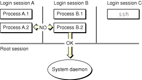
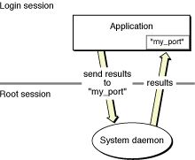

> 导航：[总目录](../../../README.md) · [documentation](../../../_indexes/documentation.md) · [Multiple User Environment Programming Topics](Introduction%20to%20Multiple%20User%20Environments.md)

[Next](Supporting%20Fast%20User%20Switching.md)[Previous](Introduction%20to%20Multiple%20User%20Environments.md)

# Root and Login Sessions

From early on, OS X was designed to be a secure operating system. One aspect of this security is the control exercised over inter-process communication. Processes are loosely gathered into groups and associated with either the root session or a login session. The `launchd` daemon assigns each new process to an appropriate session based on factors such as who created the process and when. The `launchd` daemon incorporates the functionality previously built into the `mach_init` daemon, and when acting in this capacity is also known as the _bootstrap server_.

Most root-level processes are placed in the _root session_. The root session is the first session to be created and the last to be destroyed. Only one root session ever exists on the system, and it is where most boot-time processes and daemons live. Processes in the root session are user-independent and vend basic services to anyone on the system. For example, the `mDNSResponder` process runs in the root session.

Processes launched by a user or for a user’s benefit live in a _login session_. Each login session is associated with an authenticated user. The system may have multiple login sessions active at any given time, but each one is something of an island to the associated user. Console login sessions include processes such as the Finder and Dock; however, remote login connections contain only shell-level processes. Most of the communication between different login sessions is restricted by the bootstrap server. Communication is still possible but generally requires creating an explicit, and trusted, connection.

By organizing processes into root and login sessions, the `launchd` process is able to create a more trustworthy environment for users. Requests for Mach ports go through the `launchd` process, which routes the requests to the appropriate target. The login session acts like a set of walls around a user’s processes, limiting port requests to those in the current login session or root session. Doing so prevents accidental or intentional attempts by processes in a different session to obtain access to the ports in the current login session. In a sense, login sessions are a lightweight firewall around the processes they represent.

Thus, login sessions give users an assurance that processes launched by other users do not interfere with their own processes. For example, a malicious user might write a program that pretends to be a known user service and use that program to gather information from other users. However, unless the malicious user has administrative access to the machine, the program runs in the login session of the malicious user. Because other users cannot see the program, they are protected from its effects.

At boot time, the kernel launches the `launchd` process, which is responsible for handling lookup requests for Mach ports (among other things). As part of each request, `launchd` also ensures that processes do not attempt to cross login session bounds illegally. This is not to say that crossing session bounds is completely forbidden. There are situations where it is appropriate and even necessary. For example, applications can use BSD sockets, shared files, shared memory, or distributed notifications to communicate with processes in other sessions; however, doing so requires cooperation between both sessions and involves a certain level of trust.

Conceptually, you can think of the root session as a parent session for all of the login sessions that follow. However, the parent-child analogy ends there. Processes in the root session have no inherent knowledge of processes in any of the active login sessions. Conversely, processes in login sessions do have knowledge of processes in the root session and can access them as needed for appropriate services. User processes in one login session do not have any inherent access to processes in other login sessions, though. Figure 1 illustrates this relationship.

__Figure 1__  Root and login session relationships

Processes in the root session are not completely blind to processes in login sessions. When a user process requests a service from a daemon running in the root session, the process typically provides a port address over which to return the results. Because it has an explicit Mach port to talk to, the daemon can now send the results of the request directly back to the user process. Figure 2 illustrates this behavior.

__Figure 2__  Communicating with user processes

As you might expect, the root session is the first to be created on the system. It is also the last to be destroyed when the system is shut down. The root session is the logical place in which to run daemons and system services that apply to all users. However, writing a daemon to run in the root session precludes the use of many higher-level system frameworks that require the presence of the window server. (For a list of frameworks you can use, see [Frameworks Available in the Root Session](#apple-f4xwc4dqnrsv64tfmyxwi33df52wszbpgiydambsgiydqljrge3dkmbr).)

When a user logs in, either through the login window or `ssh`, the system creates a new login session. The login session remains in existence until all processes belonging to it are terminated. When a user logs out, the system attempts to terminate the processes in that user’s login session. When the last process in a login session dies, the system closes out the login session and reclaims its memory.

Applications can defer a user logout for various reasons, which are described in _[Daemons and Services Programming Guide](../Daemons%20and%20Services%20Programming%20Guide/About%20Daemons%20and%20Services.md#apple-f4xwc4dqnrsv64tfmyxwi33df52wszbpgeydambqge3te2i)_. Per-user services are shut down automatically and are not given the chance to abort the logout procedure.

Each time a user is authenticated with the system, the Security layer of the system creates a unique ID to identify the user’s login session. This ID is the security session ID, often referred to simply as the _session ID_. Applications can use the session ID to distinguish among resources allocated in different login sessions.

Session IDs are not persistent between user logins. Each session ID is valid only for the duration of the current login session, and it is valid for all processes in that login session. If a user logs out and logs back in, a different session ID is assigned to the new login session.

You should use session IDs to prevent namespace collisions with objects in other login sessions. If an application used a common name for a session-specific shared memory region, the same application in another session would likely encounter an error when trying to create that memory region using the same name. Including the session ID in the memory region name can prevent these kinds of errors.

For information on how to get session IDs, see [Getting Login Session Information](Supporting%20Fast%20User%20Switching.md#apple-f4xwc4dqnrsv64tfmyxwi33df52wszbpgiydambsgiydsljrga2demjz).

If you are writing applications for end users, the existence of login sessions requires more thought in your design. You must remember that multiple instances of your application may be running simultaneously and write your code to handle potential resource conflicts. If you need to communicate with processes in other login sessions, you need to use BSD sockets, distributed notifications, or some other form of trusted connection.

If you are writing _only_ kernel code, root and login sessions are largely irrelevant. However, driver developers frequently need to write programs that run either in the kernel or in the root session and communicate with programs in one or more login sessions. For example, a driver developer might want to configure a sound driver based on the active user’s preferences. In this case, it would be necessary to write an agent program to run in each login session and communicate user-level changes to the driver.

Many system frameworks depend on the window server for part of their implementations. They either use the window server for drawing graphics, for tracking notifications, or for coordinating with the system in other ways. For most applications, this is not a problem at all and is actually necessary to implement some behaviors. However, if you are writing a daemon or other type of program to run in the root session, there is no window server process with which to communicate. As a result, many higher level frameworks cannot be used at all.

[Next](Supporting%20Fast%20User%20Switching.md)[Previous](Introduction%20to%20Multiple%20User%20Environments.md)

