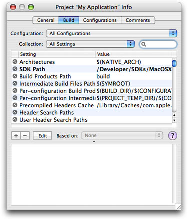
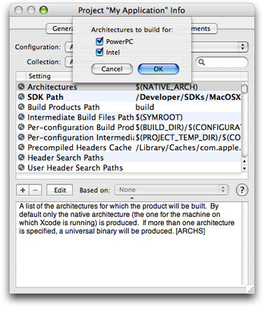
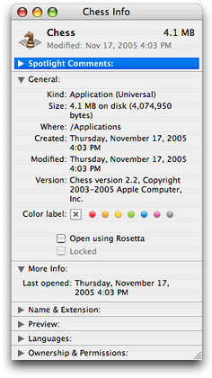

> 导航：[总目录](../../../README.md) · [documentation](../../../_indexes/documentation.md) · [Universal Binary Programming Guidelines, Second Edition](Introduction.md)


[Next](Architectural%20Differences.md)[Previous](Introduction.md)

# Building a Universal Binary

Architectural differences between Macintosh computers that use Intel and PowerPC microprocessors can cause existing PowerPC code to behave differently when built and run natively on a Macintosh computer that uses an Intel microprocessor. The extent to which architectural differences affect your code depends on the level of your source code. Most existing code is high-level source code that is not specific to the processor. If your application falls into this category, you’ll find that creating a universal binary involves adjusting code in a few places. Cocoa developers may need to make fewer adjustments than Carbon developers whose code was ported from Mac OS 9 to Mac OS X.

Most code that uses high-level frameworks and that builds with GCC 4.0 in Mac OS X v10.4 will build with few, if any, changes on an Intel-based Macintosh computer. The best approach for any developer in that situation is to build the existing code as a universal binary, as described in this chapter, and then see how the application runs on an Intel-based Macintosh. Find the places where the code doesn’t behave as expected and consult the sections in this document that cover those issues.

Developers who use AltiVec instructions in their code or who intentionally exploit architectural differences for optimization or other purposes will need to make the most code adjustments. These developers will probably want to consult the rest of this document before building a universal binary. AltiVec programmers should read [Preparing Vector-Based Code](Preparing%20Vector-Based%20Code.md#apple-f4xwc4dqnrsv64tfmyxwi33df52wszbpkridimbqgazdemjxfvbuqmrqhawviucykjcummjqge).

This chapter describes how to use Xcode 2.2 to create a universal binary, provides troubleshooting information, and lists relevant build options. You’ll find that the software development workflow on an Intel-based Macintosh computer is exactly the same as the software development workflow on a PowerPC-based Macintosh.

Before you build your code as a universal binary, you must ensure that:

- Your application already builds for Mac OS X. Your application can use any of the Mac OS X development environments: Carbon, Cocoa, Java, or BSD UNIX.
- Your application uses the Mach-O executable format. Mach-O binaries are the only type of binary that run natively on an Intel-based Macintosh computer. If you are already using the Xcode compilers and linkers, your application is a Mach–O binary. Carbon applications based on the Code Fragment Manager Preferred Executable Format (PEF) must be changed to Mach-O.
- Your Xcode target is a native Xcode target. If it isn’t, in Xcode you can choose Project > Upgrade All Targets in Project to Native.
- Your code project is ported to GCC 4.0. Xcode uses GCC 4.0 for targeting Intel-based Macintosh computers. You may want to look at the document _[GCC Porting Guide](https://developer.apple.com/library/archive/releasenotes/DeveloperTools/GCC40PortingReleaseNotes/Introduction.html#//apple_ref/doc/uid/TP40002069)_ to assess whether you need to make any changes to your code to allow it to compile using GCC 4.0.
- You installed the Mac OS X v10.4 universal SDK. The installer places the SDK in this location:

  `/Developer/SDKs/MacOSX10.4u.sdk`

If you have already been using Xcode to build applications on a PowerPC-based Macintosh, you’ll see that building your code on an Intel-based Macintosh computer is accomplished in the same way. By default, Xcode compiles code to run on the architecture on which you build your Xcode project. Note that your Xcode target must be a native target.

When you are in the process of developing your project, you’ll want to use the following settings for the Default and Debug configurations:

- Keep the Architectures settings set to `$(NATIVE_ARCH)`.
- Change the Mac OS X Deployment Target settings to `Mac OS X 10.4`.
- Make sure the SDKROOT setting is `/Developer/SDKs/MacOSX10.4u.sdk`.

You can set the SDK root for the project by following these steps:

1. Open your project in Xcode 2.2 or later.

   Make sure that your Xcode target is a native target. If it isn’t, you can choose Project > Upgrade All Targets in Project to Native.
2. In the Groups & Files list, click the project name.
3. Click the Info button to open the Info window.
4. In the General pane, in the Cross-Develop Using Target SDK pop-up menu, choose Mac OS X 10.4 (Universal).

   If you don’t see Mac OS X 10.4 (Universal) as a choice, look in the following directory to make sure that the universal SDK is installed:

   `/Developer/SDKs/MacOSX10.4u.sdk`

   If it’s not there, you’ll need to install this SDK before you can continue.
5. Click Change in the sheet that appears.

The Debug build configuration turns on ZeroLink, Fix and Continue, and debug-symbol generation, among other settings, and turns off code optimization.

When you are ready to test your application on both architectures, you’ll want to use the Release configuration. This configuration turns off ZeroLink and Fix and Continue. It also sets the code-optimization level to optimize for size. As with the Default and Debug configurations, you’ll want to set the Mac OS X Deployment Target to `Mac OS X 10.4` and the SDK root to `MacOSX10.4u.sdk`. To build a universal binary, the Architectures setting for the Release configuration must be set to build on Intel and PowerPC.

You can change the Architectures setting by following these steps:

1. Open your project in Xcode 2.2 or later.
2. In the Groups & Files list, click the project name.
3. Click the Info button to open the Info window.
4. In the Build pane (see Figure 1-1), choose Release from the Configuration pop-up menu.

   __Figure 1-1__  The Build pane

   
5. Select the Architectures setting and click Edit. In the sheet that appears, select the PowerPC and Intel options, as shown in Figure 1-2.

   __Figure 1-2__  Architectures settings

   
6. Close the Info window.
7. Build and run the project.

If your application doesn’t build, see [Debugging](#apple-f4xwc4dqnrsv64tfmyxwi33df52wszbpkridimbqgazdemjxfvbuqmrqgywtenbsgy3ti).

If your application builds but does not behave as expected when you run it as a native binary on an Intel-based Macintosh computer, see [Troubleshooting Your Built Application](#apple-f4xwc4dqnrsv64tfmyxwi33df52wszbpkridimbqgazdemjxfvbuqmrqgywtemzyg4yti).

If your application behaves as expected, don’t assume that it also works on the other architecture. You need to test your application on both PowerPC Macintosh computers and Intel-based Macintosh computers. If your application reads data from and writes data to disk, you should make sure that you can save files on one architecture and open them on the other.

For information on default compiler settings, architecture-specific options, and Autoconf macros, see [Build Options](#apple-f4xwc4dqnrsv64tfmyxwi33df52wszbpkridimbqgazdemjxfvbuqmrqgywtenbqge4tc).

For information on building with version-specific SDKs for PowerPC (Mac OS X v10.3, v10.2, and so forth) while still building a universal binary for both PowerPC and Intel-based Macintosh computers, see the following resources:

- Using Cross Development in Xcode.
- Cross-Development and Universal Binaries in the _[SDK Compatibility Guide](../../Developer%20Tools/SDK%20Compatibility%20Guide/Introduction.md#apple-f4xwc4dqnrsv64tfmyxwi33df52wszbpgeydambqge3dg2i)_ provides details on to create executable files that contain object code for both Intel-based and PowerPC-based Macintosh computers.

Xcode uses GDB for debugging, so you’ll want to review the _[Xcode Debugging Guide](../../Developer%20Tools/Xcode%20Debugging%20Guide/Introduction.md#apple-f4xwc4dqnrsv64tfmyxwi33df52wszbpkridimbqga3tanjx)_ document. Xcode provides a powerful user interface to GDB that lets you step through your code, set breakpoints and view variables, stack frames, and threads.

_[Debugging with GDB](https://developer.apple.com/library/archive/documentation/DeveloperTools/gdb/gdb/gdb_toc.html#//apple_ref/doc/uid/TP40000996)_—an Open Source document that explains how to use GDB—is another useful resource that you’ll want to look at. It provides a lot of valuable information, including how to get a list of breakpoints for debugging.

If you are moving code to GCC 4.0, you can find remedies for most linking issues and compiler warnings by consulting _[GCC Porting Guide](https://developer.apple.com/library/archive/releasenotes/DeveloperTools/GCC40PortingReleaseNotes/Introduction.html#//apple_ref/doc/uid/TP40002069)_. You can find additional information on the GCC options you can use to request or suppress warnings in Section 3.8 of the _GNU C/C++/Objective-C 4.0.1 Compiler User Guide_.

Here are the most typical behavior problems you’ll observe when your application runs natively on an Intel-based Macintosh computer:

- The application crashes.
- There are unexpected numerical results.
- Color is displayed incorrectly.
- Text is not displayed properly—characters from the Last Resort font or unexpected Chinese or Japanese characters appear.
- Files are not read or written correctly.
- Network communication does not work properly.

The first two problems in the list are typically caused by architecture-dependent code. On an Intel-based Macintosh computer, an integer divide-by-zero exception results in a crash, but on PowerPC the same operation returns zero. In these cases, the code must be rewritten in an architecture-independent manner. [Architectural Differences](Architectural%20Differences.md#apple-f4xwc4dqnrsv64tfmyxwi33df52wszbpkridimbqgazdemjxfvbuqmrugawviucykjcummjqge) discusses the major differences between Macintosh computers that use PowerPC and Intel microprocessors. That chapter can help you determine which code is causing the crash or the unexpected numerical results.

The last four problems in the list are most often caused by byte-ordering differences between architectures. These problems are easily remedied by taking the byte order into account when you read and write data. The strategies available for handling byte ordering, as well as an in-depth discussion of byte-ordering differences, are provided in [Swapping Bytes](Swapping%20Bytes.md#apple-f4xwc4dqnrsv64tfmyxwi33df52wszbpkridimbqgazdemjxfvbuqmrugmwviucykjcummjqge). Keep in mind that Mac OS X ensures that byte-ordering is correct for anything it is responsible for. Apple-defined resources (such as menus) won’t result in problem behavior. Custom resources provided by your application, however, can result in problem behavior. For example, if images in your application seem to have a cyan tint, it’s quite likely that your application is writing alpha channel data to the blue channel. For this specific issue, depending on the APIs that you are using, you’d want to consult the sections [GWorlds](Guidelines%20for%20Specific%20Scenarios.md#apple-f4xwc4dqnrsv64tfmyxwi33df52wszbpkridimbqgazdemjxfvbuqmrthewteojwgqytk), [Pixel Data](Guidelines%20for%20Specific%20Scenarios.md#apple-f4xwc4dqnrsv64tfmyxwi33df52wszbpkridimbqgazdemjxfvbuqmrthewteobqgm4dk), or other graphics-related sections in [Guidelines for Specific Scenarios](Guidelines%20for%20Specific%20Scenarios.md#apple-f4xwc4dqnrsv64tfmyxwi33df52wszbpkridimbqgazdemjxfvbuqmrthewviucykjcummjqge).

Apple engineers prepared a lot of code to run natively on an Intel-based Macintosh computer—including the operating system, most Apple applications, and Apple tools. The guidelines in this book are the result of their work. In addition to the more common issues discussed in [Architectural Differences](Architectural%20Differences.md#apple-f4xwc4dqnrsv64tfmyxwi33df52wszbpkridimbqgazdemjxfvbuqmrugawviucykjcummjqge) and [Swapping Bytes](Swapping%20Bytes.md#apple-f4xwc4dqnrsv64tfmyxwi33df52wszbpkridimbqgazdemjxfvbuqmrugmwviucykjcummjqge), the engineers identified a number of narrowly focused issues. These are described in [Guidelines for Specific Scenarios](Guidelines%20for%20Specific%20Scenarios.md#apple-f4xwc4dqnrsv64tfmyxwi33df52wszbpkridimbqgazdemjxfvbuqmrthewviucykjcummjqge). You will want to at least glance at this chapter to see if your code can benefit from any of the information.

You can determine whether an application has a universal binary by looking at the Kind entry in the General section of the Info window for the application (see Figure 1-3). To open the Info window, click the application icon and press Cmd-I.

__Figure 1-3__  The Chess application has a Universal binary



On an Intel-based Macintosh computer, when you double-click an application that doesn’t have an executable for the native architecture, it might launch. Whether or not it launches depends on how compatible the application is with Rosetta. For more information, see [Rosetta](Rosetta.md#apple-f4xwc4dqnrsv64tfmyxwi33df52wszbpkridimbqgazdemjxfvbuqmrrgawviucykjcummjqge).

This section contains information on the build options that you need to be aware of when using Xcode 2.2 and later on an Intel-based Macintosh computer. It lists the default compiler options, discusses how to set architecture-specific options, and provides information on using GNU Autoconf macros.

In Xcode 2.2 and later on an Intel-based Macintosh computer, the defaults for compiler flags that differ from standard GCC distributions are listed in Table 1-1.

__Table 1-1__  Default values for compiler flags on an Intel-based Macintosh computer

| Compiler flag | Default value | Specifies to |
| `-mfpmath` | `sse` | Use SSE instructions for floating-point math. |
| `-msse2` | On by default | Enable the MMX, SSE, and SSE2 extensions in the Intel instruction set architecture. |

Most developers don’t need to use architecture-specific options for their projects.

In Xcode, to set one flag for an Intel-based Macintosh and another for PowerPC, you use the `PER_ARCH_CFLAGS_i386` and `PER_ARCH_CFLAGS_ppc` build settings variables to supply the architecture-specific settings.

For example to set the architecture-specific flags `-faltivec` and `-msse3`, you would add the following build settings:

```
PER_ARCH_CFLAGS_i386 = -msse3
PER_ARCH_CFLAGS_ppc = -faltivec
```

Similarly, you can supply architecture-specific linker flags using the `OTHER_LDFLAGS_i386` and `OTHER_LDFLAGS_ppc` build settings variables.

You can pass the `-arch` flag to `gcc`, `ld`, and `as`. The allowable values are `i386` and `ppc`. You can specify both flags as follows:

```
-arch ppc -arch i386
```

For more information on architecture-specific options, see[Building Universal Binaries](../../Developer%20Tools/Xcode%20Project%20Management%20Guide/Building%20Products.md#apple-f4xwc4dqnrsv64tfmyxwi33df52wszbpkridimbqgazdmojtfvjvomy).

If you are compiling a project that uses GNU Autoconf and trying to build it for both PowerPC-based and Intel-based Macintosh computers, you need to make sure that when the project configures itself, it doesn't use Autoconf macros to determine the endian type of the runtime system. For example, if your project uses the Autoconf `AC_C_BIGENDIAN` macro, the program won't work correctly when it is run on the opposite architecture from the one you are targeting when you configure the project. To correctly build for both PowerPC-based and Intel-based Macintosh computers, use the compiler-defined `__BIG_ENDIAN__` and `__LITTLE_ENDIAN__` macros in your code.

For more information, see [Using GNU Autoconf](../../Porting/Porting%20UNIX-Linux%20Applications%20to%20OS%20X/Compiling%20Your%20Code%20in%20OS%20X.md#apple-f4xwc4dqnrsv64tfmyxwi33df52wszbpkridimbqgazdqnjqfvkfawcsivddcmjx) in _[Porting UNIX/Linux Applications to OS X](../../Porting/Porting%20UNIX-Linux%20Applications%20to%20OS%20X/Introduction%20to%20Porting%20UNIX-Linux%20Applications%20to%20OS%20X.md#apple-f4xwc4dqnrsv64tfmyxwi33df52wszbpkridgmbqgaytambt)_.

These resources provide information related to compiling and building applications, and measuring performance:

- _[Xcode Project Management Guide](../../Developer%20Tools/Xcode%20Project%20Management%20Guide/Introduction.md#apple-f4xwc4dqnrsv64tfmyxwi33df52wszbpkridimbqga3dsmjx)_ contains all the instructions needed to compile and debug any type of Xcode project (C, C++, Objective C, Java, AppleScript, resource, nib files, and so forth).
- _[GCC Porting Guide](https://developer.apple.com/library/archive/releasenotes/DeveloperTools/GCC40PortingReleaseNotes/Introduction.html#//apple_ref/doc/uid/TP40002069)_ provides advice for how to modify your code in ways that make it more compatible with GCC 4.0.
- _GNU C/C++/Objective-C 4.0.1 Compiler User Guide_ provides details about the GCC implementation. Xcode uses the GNU compiler collection (GCC) to compile code.

  The assembler (`as`) used by Xcode supports AT&T System V/386 assembler syntax in order to maintain compatibility with the output from GCC. The AT&T syntax is quite different from Intel syntax. The major differences are discussed in the GNU documentation.
- _[C++ Runtime Environment Programming Guide](../../Developer%20Tools/C%2B%2B%20Runtime%20Environment%20Programming%20Guide/Introduction.md#apple-f4xwc4dqnrsv64tfmyxwi33df52wszbpkridimbqgaytmnrw)_ provides information on the GCC 4.0 shared C++ runtime that is available in Panther 10.3.9 and later.
- _[Porting UNIX/Linux Applications to OS X](../../Porting/Porting%20UNIX-Linux%20Applications%20to%20OS%20X/Introduction%20to%20Porting%20UNIX-Linux%20Applications%20to%20OS%20X.md#apple-f4xwc4dqnrsv64tfmyxwi33df52wszbpkridgmbqgaytambt)_. Developers porting from UNIX and Linux applications who want to compile a universal binary, will want to read the section [Compiling for Multiple Architectures.](../../Porting/Porting%20UNIX-Linux%20Applications%20to%20OS%20X/Compiling%20Your%20Code%20in%20OS%20X.md#apple-f4xwc4dqnrsv64tfmyxwi33df52wszbpkridimbqgazdqnjqfvbecssdizcueqi)
- _[Kernel Extension Programming Topics](../../Darwin/Kernel%20Extension%20Programming%20Topics/Introduction.md#apple-f4xwc4dqnrsv64tfmyxwi33df52wszbpkridimbqgaytanrt)_ contains information about debugging KEXTs on Intel-based Macintosh computers.
- Performance tools. Shark, MallocDebug, ObjectAlloc, Sampler, Quartz Debug, Thread Viewer, and other Apple-developed tools (some command-line, others use a GUI) are in the `/Developer` directory. Command-line performance tools are in the `/usr/bin` directory.
- _[Code Size Performance Guidelines](../../Performance/Code%20Size%20Performance%20Guidelines/Introduction%20to%20Code%20Size%20Performance%20Guidelines.md#apple-f4xwc4dqnrsv64tfmyxwi33df52wszbpgeydambqge2ds2i)_ and _[Code Speed Performance Guidelines](../../Performance/Code%20Speed%20Performance%20Guidelines/Introduction%20to%20Code%20Speed%20Performance%20Guidelines.md#apple-f4xwc4dqnrsv64tfmyxwi33df52wszbpgeydambqge2ta2i)_ discuss optimization strategies for a Mach-O executable.

[Next](Architectural%20Differences.md)[Previous](Introduction.md)

