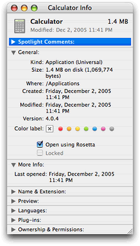
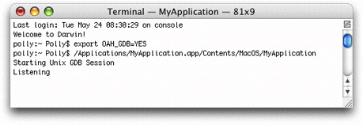
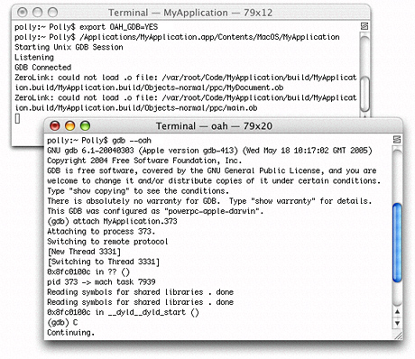

> 导航：[总目录](../../../README.md) · [documentation](../../../_indexes/documentation.md) · [Universal Binary Programming Guidelines, Second Edition](Introduction.md)


[Next](Architecture-Independent%20Vector-Based%20Code.md)[Previous](Preparing%20Vector-Based%20Code.md)

# Rosetta

Rosetta is a translation process that runs a PowerPC binary on an Intel-based Macintosh computer—it allows applications to run as nonnative binaries. Many, but not all, applications can run translated. Applications that run translated will never run as fast as they run as a native binary because the translation process itself incurs a processing cost.

How compatible your application is with Rosetta depends on the type of application it is. An application such as a word processor that has a lot of user interaction and low computational needs is quite compatible. An application that requires a moderate amount of user interaction and has some high computational needs or that uses OpenGL is most likely also quite compatible. One that has intense computing needs isn’t compatible. This includes applications that need to repeatedly compute fast Fourier transforms (FFTs), that compute complex models for 3-D modeling, or that compute ray tracing.

To the user, Rosetta is transparent. Unlike Classic, when the user launches an application, there aren’t any visual cues to indicate that the application is translated. The user may perceive that the application is slow to start up or that the performance is slower than it is on a PowerPC-based Macintosh. The user can discover whether an application has only a PowerPC binary by looking at the Finder information for the application. (See [Determining Whether a Binary Is Universal](Building%20a%20Universal%20Binary.md#apple-f4xwc4dqnrsv64tfmyxwi33df52wszbpkridimbqgazdemjxfvbuqmrqgywtenbqge4di).)

This appendix discusses the sorts of applications that can run translated, describes how Rosetta works, points out special considerations for translated applications, shows how to force an application to run translated using Rosetta, describes how to programmatically detect whether an application is running nonnatively, and provides troubleshooting information if your application won’t run translated but you think that it should.

Rosetta is designed to translate currently shipping applications that run on a PowerPC with a G3 or G4 processor and that are built for Mac OS X. That includes CFM as well as Mach-O PowerPC applications.

Rosetta does _not_ run the following:

- Applications built for any version of the Mac OS earlier than Mac OS X —that means Mac OS 9, Mac OS 8, Mac OS 7, and so forth
- The Classic environment
- Screen savers written for the PowerPC architecture
- Code that inserts preferences in the System Preferences pane
- Applications that require a G5 processor
- Applications that depend on one or more PowerPC-only kernel extensions
- Kernel extensions
- Java applications with JNI libraries
- Java applets in applications that Rosetta can translate; that means a web browser that Rosetta can run translated will not be able to load Java applets.

Rosetta does not support precise exceptions. Any application that relies on register states being accurate in exception handlers or signal handlers will not function properly running with Rosetta.

For more information on the limitations of Java applications using Rosetta, see [Java Applications](Guidelines%20for%20Specific%20Scenarios.md#apple-f4xwc4dqnrsv64tfmyxwi33df52wszbpkridimbqgazdemjxfvbuqmrthewteojwgmyte) and _Technical Q &A QA1295, Java on Intel-based Macintosh Computers_, which is in the [ADC Reference Library](https://developer.apple.com/technicalqas/Java/index-title.html).

When an application launches on an Intel-based Macintosh computer, the kernel detects whether the application has a native binary. If the binary is not native, the kernel launches the binary using Rosetta. If the application is one of those that can be translated, it launches and runs, although not as fast as it would as a native binary. Behind the scenes, Rosetta translates and executes the PowerPC binary code.

Rosetta runs in the same thread of control as the application. When Rosetta starts an application, it translates a block of application code and executes that block. As Rosetta encounters a call to a routine that it has not yet translated, it translates the needed routine and continues the execution. The result is a smooth and continual transitioning between translation and execution. In essence, Rosetta and your application work together in a kind of symbiotic relationship.

Rosetta optimizes translated code to deliver the best possible performance on the nonnative architecture. It uses a large translation buffer, and it caches code for reuse. Code that gets reused repeatedly in your application benefits the most because it needs to be translated only once. The system uses the cached translation, which is faster than translating the code again.

Rosetta must run the entire process when it translates. This has implications for applications that use third-party plug-ins or any other component that must be loaded at the time your application launches. All parts (application, plug-ins, or other components needed at launch time) must run either nonnatively or natively. For example, if your application is built as a universal binary, but it uses a plug-in that has only a PowerPC binary, then your application needs to run nonnatively on an Intel-based Macintosh computer to use the nonnative plug in.

Rosetta takes endian issues into account when it translates your application. Multibyte data that moves between your application and any system process is automatically handled for you—you don’t need to concern yourself with the endian format of the data.

The following kinds of multibyte data can have endian issues if the data moves between:

- Your translated application and a native process that’s not a system process
- A custom pasteboard provided by your translated application and a custom pasteboard provided by a native application
- Data files or caches provided by your translated application and a native application

You might encounter this scenario while developing a universal binary. For example, if you’ve created a universal binary for a server process that your application relies on, and then test that process by running your application as a PowerPC binary, the endian format of the data passed from the server to your application would be wrong. You encounter the same problem if you create a universal binary for your application, but have not yet done so for a server process needed by the application.

Structures that the system defines and that are written using system routines will work correctly. But consider the code in Listing A-1.

__Listing A-1__  A structure whose endian format depends on the architecture

```
typedef struct
{
    int x;
    int y;
} data_t

void savefile(data_t data, int filehandle)
{
  write(filehandle, &data, sizeof(data));
}
```

When run using Rosetta, the application will write a big-endian structure; _x_ and _y_ are both written as big-endian integers. When the application runs natively on an Intel-based Macintosh, it will write out a little-endian structure; _x_ and _y_ are written as little-endian integers. It is up to you to define data formats on disk to be of a canonical endian format. Endian-specific data formats are fine as long as any application that reads or write the data understands what the endian format of the data is and treats the data appropriately.

Keep in mind that private frameworks and plug-ins can also encounter these sorts of endian issues. If a private framework creates a cache or data file, and the framework is a universal binary, then it will try to access the cache from both native and PPC processes. The framework either needs to account for the endian format of the cache when reading or writing data or needs to have two separate caches.

Assuming that the application meets the criteria described in [What Can Be Translated?](#apple-f4xwc4dqnrsv64tfmyxwi33df52wszbpkridimbqgazdemjxfvbuqmrrgawtemzwg42do), applications that have only a PowerPC binary automatically run as translated on an Intel-based Macintosh. For testing purposes, there are several ways that you can force applications that have a universal binary to launch as a PowerPC binary on an Intel-based Macintosh:

- For applications, [Make a Setting in the Info Window](#apple-f4xwc4dqnrsv64tfmyxwi33df52wszbpkridimbqgazdemjxfvbuqmrrgawtenbqgqydm)
- For command-line tools [Use Terminal](#apple-f4xwc4dqnrsv64tfmyxwi33df52wszbpkridimbqgazdemjxfvbuqmrrgawtenbqgq2tg)
- For an application that you are writing, [Modify the Property List](#apple-f4xwc4dqnrsv64tfmyxwi33df52wszbpkridimbqgazdemjxfvbuqmrrgawtenbqgq4tk)
- Programmatically, [Use the sysctlbyname Function](#apple-f4xwc4dqnrsv64tfmyxwi33df52wszbpkridimbqgazdemjxfvbuqmrrgawtenbqgu3de)

Each of these methods is described in this section.

You can manually set which binary to execute on an Intel-based Macintosh computer by selecting the “Open using Rosetta” option in the Info window of the application. To set the option, click the application icon, then press Command-I to open the Info window. Make the setting, as shown in Figure A-1.

__Figure A-1__  The Info window for the Calculator application



You can force a command-line tool to run translated by entering the following in Terminal:

```
ditto -arch ppc <toolname> /tmp/toolname
/tmp/toolname
```


You can set the default setting for the “Open using Rosetta” option by adding the following key to the `Info.plist` of your application bundle:

```
<key>LSPrefersPPC</key>
<true/>
```

This key informs the system that the application should launch as a PowerPC binary and causes the “Open using Rosetta” checkbox to be selected. You might find this useful if you ship an application that has plug-ins that are not native at the time of shipping.

The `exec_affinity` routine in Listing A-2 controls the preferred CPU type for sublaunched processes. You might find this routine useful if you are using `fork` and `exec` to launch applications from your application.

The routine calls the `sysctlbyname` function with the `"sysctl.proc_exec_affinity"` string, passing a constant that specifies the CPU type. Pass `CPU_TYPE_POWERPC` to launch the PPC executable in a universal binary. (For information on `sysctlbyname` see _Mac OS X Man Pages_.)

__Listing A-2__  A routine that controls the preferred CPU type for sublaunched processes

```
cpu_type_t exec_affinity (cpu_type_t new_cputype)
{
    cpu_type_t ret;
    cpu_type_t *newp = NULL;
    size_t sz = sizeof (cpu_type_t);

    if (new_cputype != 0)
        newp = &new_cputype;

     if (sysctlbyname("sysctl.proc_exec_affinity",
            &ret, &sz, newp, newp ? sizeof(cpu_type_t) :  0) == -1) {
        fprintf(stderr, "exec_affinity: sysctlbyname failed:  %s\n",
                strerror(errno));
        return -1;
    }
    return ret;
}
```


To prevent an application from opening using Rosetta, add the following key to the `Info.plist`:

```
<key>LSRequiresNativeExecution</key>
<true/>
```


Some developers may want to determine programmatically whether an application is running using Rosetta. For example, a developer writing device interface code may need to determine whether the user client is using the same endian format as the kernel.

Listing A-3 is a utility routine that can call the `sysctlbyname` function on a process ID (`pid`). If you pass a process ID of `0` to the routine, it performs the call on the current process. Otherwise it performs the call on the process specified by the `pid` value that you pass. (For information on `sysctlbyname` see _Mac OS X Man Pages_.)

__Listing A-3__  A utility routine for calling the `sysctlbyname` function

```
static int sysctlbyname_with_pid (const char *name, pid_t pid,
                            void *oldp, size_t *oldlenp,
                            void *newp, size_t newlen)
{
    if (pid == 0) {
        if (sysctlbyname(name, oldp, oldlenp, newp, newlen) == -1)  {
            fprintf(stderr, "sysctlbyname_with_pid(0): sysctlbyname  failed:"
                     "%s\n", strerror(errno));
            return -1;
        }
    } else {
        int mib[CTL_MAXNAME+1];
        size_t len = CTL_MAXNAME;
        if (sysctlnametomib(name, mib, &len) == -1) {
            fprintf(stderr, "sysctlbyname_with_pid: sysctlnametomib  failed:"
                     "%s\n", strerror(errno));
            return -1;
        }
        mib[len] = pid;
        len++;
        if (sysctl(mib, len, oldp, oldlenp, newp, newlen) == -1)  {
            fprintf(stderr, "sysctlbyname_with_pid: sysctl  failed:"
                    "%s\n", strerror(errno));
            return -1;
        }
    }
    return 0;
}
```

The `is_pid_native` routine shown in [Listing A-4](#apple-f4xwc4dqnrsv64tfmyxwi33df52wszbpkridimbqgazdemjxfvbuqmrrgawtemzzgi2ts) calls the `sysctlbyname_with_pid` routine, passing the string `"sysctl.proc_native"`. The `is_pid_native` routine determines whether the specified process is running natively or translated. The routine returns:

- `0` if the process is running translated using Rosetta
- `1` if the process is running natively on a PowerPC- or Intel-based Macintosh
- `–1` if an unexpected error occurs

__Listing A-4__  A routine that determines whether a process is running natively or translated

```
int is_pid_native (pid_t pid)
{
    int ret = 0;
    size_t sz = sizeof(ret);

    if (sysctlbyname_with_pid("sysctl.proc_native", pid,
                &ret, &sz, NULL, 0) == -1) {
         if (errno == ENOENT) {
            return 1;
        }
        fprintf(stderr, "is_pid_native: sysctlbyname_with_pid  failed:"
                "%s\n", strerror(errno));
        return -1;
    }
    return ret;
}
```


If you are convinced that your application falls into the category of those that should be able to run using Rosetta but it doesn’t run or it has unexpected behavior, you can follow the procedure in this section to debug your application. This procedure works only for PowerPC binaries—not for a universal binary—and is the only way you can debug a PowerPC binary on an Intel-based Macintosh. Xcode debugging does not work for translated applications.

To debug a PowerPC binary on an Intel-based Macintosh, follow these steps:

1. Open Terminal.
2. Enter the following two lines:

   For `tcsh`:

```
setenv OAH_GDB YES
/<path>/<your_application>.app/Contents/MacOS/<your_application>
```

   For `bash`:

```
export OAH_GDB=YES
/<path>/<your_application>.app/Contents/MacOS/<your_application>
```

   You’ll see the Rosetta process launch and wait for a port connection (Figure A-2).

   __Figure A-2__  Rosetta listens for a port connection

   
3. Open a second terminal window and start up GDB with the following command:

```
gdb --oah
```

   Using GDB on an Intel-based Macintosh computer is just like using GDB on a PowerPC Macintosh.
4. Attach your application.

```
attach <your_application>
```
5. Press Tab.

   GDB automatically appends the process ID (`pid`) to your application name.
6. Press Return.
7. Type `c` to execute your application.

Figure A-3 shows the commands for initiating a debugging session for a PowerPC binary. After you start the session, you can debug in much the same way as you would debug a native process except that you can’t call functions—either explicitly or implicitly—from within GDB. For example, you can’t inspect CF objects by calling `CFShow`.

Keep in mind that symbol files aren’t loaded at the start of the debugging session. They are loaded after your application is up and running. This means that any breakpoints you set are “pending breakpoints” until the executable and libraries are loaded.

__Figure A-3__  Terminal windows with the commands for debugging a PowerPC binary on an Intel-based Macintosh computer



[Next](Architecture-Independent%20Vector-Based%20Code.md)[Previous](Preparing%20Vector-Based%20Code.md)

