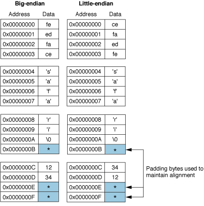

> 导航：[总目录](../../../README.md) · [documentation](../../../_indexes/documentation.md) · [Universal Binary Programming Guidelines, Second Edition](Introduction.md)


[Next](Guidelines%20for%20Specific%20Scenarios.md)[Previous](Architectural%20Differences.md)

# Swapping Bytes

Two primary byte-ordering methods (or _endian formats_) exist in the world of computing. An endian format specifies how to store the individual bytes of multibyte numerical data in memory. _Big-endian byte ordering_ specifies to store multibyte data with its most significant byte first. _Little-endian byte ordering_ specifies to store multibyte data with its least significant byte first. The PowerPC processor uses big-endian byte ordering. The x86 processor family uses little-endian byte ordering. By convention, multibyte data sent over the network uses big-endian byte ordering.

If your application assumes that data is in one endian format, but the data is actually in another, then it will interpret the data incorrectly. You will want to analyze your code for routines that read multibyte data (16 bits, 32 bits, or 64 bits) from, or write multibyte data to, disk or to the network, as these routines are sensitive to byte-ordering format. There are two general approaches for handling byte ordering differences: swap bytes when necessary or use XML or another byte-order-independent data format such as those offered by Core Foundation (CFPreferences, CFPropertyList, CFXMLParser).

Whether you should swap bytes or use a byte-order-independent data format depends on how you use the data in your application. If you have an existing file format to support, the binary-compatible solution is to accept the big-endian file format you have been using in your application, and write code that swaps bytes when the file is read or written on an Intel-based Macintosh. If you don’t have legacy files to support, you could consider redesigning your file format to use XML (extensible markup language), XDR (external data representation), or NSCoding (Objective C) to represent data.

This chapter describes why byte ordering matters, gives guidelines for swapping bytes, describes the byte-swapping APIs available in Mac OS X, and provides solutions for most of the situations where byte ordering matters.

The example in this section is designed to show you why byte ordering matters. Take a look at the C data structure defined in Listing 3-1. It contains a four-byte integer, a character string, and a two-byte integer. The listing also initializes the structure.

__Listing 3-1__  A data structure that contains multibyte and single-byte data

```
typedef struct {
    uint32_t myOptions;
    char     myStringArray [7];
    short    myVariable;
} myDataStructure;

myDataStructure aStruct;

aStruct.myOptions = 0xfeedface;
strcpy(aStruct.myStringArray, "safari");
aStruct.myVariable = 0x1234;
```

Figure 3-1 compares how this data structure is stored in memory on big-endian and little-endian systems. In a big-endian system, memory is organized with the address of each data byte increasing from most significant to least significant. In a little-endian system, memory is organized with the address of each data byte increasing from the least significant to the most significant.

__Figure 3-1__  Big-endian byte ordering compared to little-endian byte ordering



As you look at Figure 3-1, note the following:

- Multibyte data, such as the 32-bit and 16-bit variables shown in the figure, are stored differently between big-endian and little-endian systems. As you can see in the figure, big-endian systems store data in memory so that the most significant byte of the data is stored in the address with the lowest value. Little-endian systems store data in memory so that the most significant byte of the data is in the address with the highest value. Hence, the least significant byte of the `myOptions` variable (`0xce`) is stored in memory location `0x00000003` on the big-endian system while it is stored in memory location `0x00000000` on the little-endian system.
- Single-byte data, such as the `char` values in the `myStringArray` character array, are stored in the same memory location on either system regardless of the byte ordering format of the system.
- Each system pads bytes to maintain four-byte data alignment. Padded bytes in the figure are designated by a shaded box that contains an asterisk.

The byte ordering of multibyte data in memory matters if you are reading data written on one architecture from a system that uses a different architecture and you access the data on a byte-by-byte basis. For example, if your application is written to access the second byte of the `myOptions` variable, then when you read the data from a system that uses the opposite byte ordering scheme, you’ll end up retrieving the first byte of the `myOptions` variable instead of the second one.

Suppose the example data values that are initialized by the code shown in Listing 3-1 are generated on a little-endian system and saved to disk. Assume that the data is written to disk in byte-address order. When read from disk by a big-endian system, the data is again laid out in memory as shown in Figure 3-1. The problem is that the data is still in little-endian byte order even though it is interpreted on a big-endian system. This difference causes the values to be evaluated incorrectly. In this example, the value of the field `myOptions` should be `0xfeedface`, but because of the incorrect byte ordering it is evaluated as `0xcefaedfe`.

The following guidelines, along with the strategies provided later in this chapter, will help ensure optimal byte-swapping code in your application.

- Keep data structures in native byte-order while in memory. Only swap bytes when you read data from disk or write it to disk.
- When possible, let the compiler do the work for you. For example, when you use function calls such as the Core Foundation function `CFSwapInt16BigToHost`, the compiler determines whether the function call does something for the processor you are targeting. If the code does nothing, the compiler won’t call the function. Letting the compiler do the work is more efficient than using `#ifdef` statements.
- If you must access a large file, consider arranging the data in a way that limits the byte swapping that you must perform. For example, you can arrange the most frequently accessed data contiguously in the file. Then, you need to read and swap bytes only for that chunk of data instead of for the entire data file.
- Use the `__BIG_ENDIAN__` and `__LITTLE_ENDIAN__` macros only if you must. Do not use macros that check for a specific processor type, such as `__i386__` and `__ppc__`.
- Choose a consistent byte-order approach and stick with it. That is, if you are reading and writing data from disk on a regular basis, choose the endian format you want to use. This eliminates the need for you to check the byte ordering of the data, and then to possibly have to swap the byte order.
- Be aware of which functions return big-endian data, and use them appropriately. These include the BSD Sockets networking functions, the `DNSServiceDiscovery` functions (for example, TCP and UDP ports are specified in network byte order), and the ColorSync profile functions (for which all data is big-endian). The `IconFamilyElement` and `IconFamilyResource` data types (which also include the data types `IconFamilyPtr` and `IconFamilyHandle`) are always big-endian. There may be other functions and data types that are not listed here. Consult the appropriate API reference for information on data returned by a function. For more information see [Network-Related Data](#apple-f4xwc4dqnrsv64tfmyxwi33df52wszbpkridimbqgazdemjxfvbuqmrugmwteojrgqztm).
- Keep in mind that swapping bytes comes at a performance cost so swap them only when absolutely necessary.

The APIs that provide byte-swapping routines are listed below. For most situations it’s best to use the routines that match the framework you’re programming in. The Core Foundation and Foundation APIs have functions for swapping floating-point values, while the other APIs listed do not.

- POSIX (Portable Operating System Interface) byte ordering functions (`ntohl`, `htonl`, `ntohs`, and `htons`) are documented in _Mac OS X Man Pages_.
- Darwin byte ordering functions and macros are defined in the header file `libkern/OSByteOrder.h`. Even though this header is in the kernel framework, it is acceptable to use it from high-level applications.
- Core Foundation byte-order functions are defined in the header file `CoreFoundation/CFByteOrder.h` and described in the _[Byte-Order Utilities Reference](https://developer.apple.com/documentation/corefoundation/byte_order_utilities)_. For details on using these functions, see the [Byte Swapping](https://developer.apple.com/library/archive/documentation/CoreFoundation/Conceptual/CFMemoryMgmt/Tasks/ByteSwapping.html#//apple_ref/doc/uid/20001155) article in _[Memory Management Programming Guide for Core Foundation](../../Core%20Foundation/Memory%20Management%20Programming%20Guide%20for%20Core%20Foundation/Introduction.md#apple-f4xwc4dqnrsv64tfmyxwi33df52wszbpgeydambqgezdo2i)_.
- Foundation byte-order functions are defined in the header file `Foundation/NSByteOrder.h` and described in _[Foundation Framework Reference](https://developer.apple.com/documentation/foundation)_.
- The Core Endian API is defined in the header file `CarbonCore/Endian.h` and described in _[Core Endian Reference](https://developer.apple.com/documentation/coreservices/carbon_core/core_endian)_.

The strategy for swapping bytes depends on the format of the data; there is no universal routine that can take care of all byte ordering differences. Any program that needs to swap data must know the data type, the source data endian order, and the host endian order.

This section lists byte-swapping strategies, organized alphabetically, for the following data:

- [Constants](#apple-f4xwc4dqnrsv64tfmyxwi33df52wszbpkridimbqgazdemjxfvbuqmrugmwteojqg44tk)
- [Custom Apple Event Data](#apple-f4xwc4dqnrsv64tfmyxwi33df52wszbpkridimbqgazdemjxfvbuqmrugmwteojqhazta)
- [Custom Resource Data](#apple-f4xwc4dqnrsv64tfmyxwi33df52wszbpkridimbqgazdemjxfvbuqmrugmwteojqha4tk)
- [Floating-Point Values](#apple-f4xwc4dqnrsv64tfmyxwi33df52wszbpkridimbqgazdemjxfvbuqmrugmwteojrgaytm)
- [Integers](#apple-f4xwc4dqnrsv64tfmyxwi33df52wszbpkridimbqgazdemjxfvbuqmrugmwteojrgi4te)
- [Network-Related Data](#apple-f4xwc4dqnrsv64tfmyxwi33df52wszbpkridimbqgazdemjxfvbuqmrugmwteojrgqztm)
- [OSType-to-String Conversions](#apple-f4xwc4dqnrsv64tfmyxwi33df52wszbpkridimbqgazdemjxfvbuqmrugmwteojrguzdg)
- [Unicode Text Files](#apple-f4xwc4dqnrsv64tfmyxwi33df52wszbpkridimbqgazdemjxfvbuqmrugmwteojrgy2dq)
- [Values in an Array](#apple-f4xwc4dqnrsv64tfmyxwi33df52wszbpkridimbqgazdemjxfvbuqmrugmwteojxg43tk)

Constants that are part of a compiled executable are in host byte order. You need to swap bytes for a constant only if it is part of data that is not maintained natively or if the constant travels between hosts. In most cases you can either swap bytes ahead of time or let the preprocessor perform any needed math by using shifts or other simple operators.

If you are defining and populating a structure that must use data of a specific endian format in memory, use the `OSSwapConst` macros and the `OSSwap*Const` variants defined in the `libkern/OSByteOrder.h` header file. These macros can be used from high-level applications.

An Apple event is a high-level event that conforms to the Apple Event Interprocess Messaging Protocol. The Apple Event Manager sends Apple events between applications on the same computer or between applications on remote computers. You can define your own Apple event data types, and send and receive Apple events using the Apple Event Manager API.

Mac OS X manages system-defined Apple event data types for you, handling them appropriately for the currently executing code. You don't need to perform any special tasks. When the data that your application extracts from an Apple event is system-defined, the system swaps the data for you before giving the event to your application to process. You will want to treat system-defined data types from Apple events as native endian. Similarly, if you put native-endian data into an Apple event that you are sending, and it is a system-defined data type, the receiver will be able to interpret the data in its own native endian format.

However, you must account for byte-ordering differences for the custom Apple event data types that you define. You can accomplish this in one of the following ways:

- Write a byte-swapping callback routine (also known as a flipper) and provide it to the system. Whenever the system determines that your Apple event data needs to be byte swapped it invokes your flipper to ensure that the recipient of the data gets the data in the correct endian format. For details, see [Writing a Callback to Swap Data Bytes](#apple-f4xwc4dqnrsv64tfmyxwi33df52wszbpkridimbqgazdemjxfvbuqmrugmwteobvgq3tc).
- Choose one endian format to use, regardless of architecture. Then, when you read or write your custom Apple event data, use big-to-host and host-to-big routines, such as the Core Foundation Byte Order Utilities functions [CFSwapInt16BigToHost](https://developer.apple.com/documentation/corefoundation/1425282-cfswapint16bigtohost) and [CFSwapInt16HostToBig](https://developer.apple.com/documentation/corefoundation/1425301-cfswapint16hosttobig).

In Mac OS X, the preferred way to supply resources is to provide files in your application bundle that define resources such as image files, sounds, localized text, and archived user-interface definitions. The resource data types discussed in this section are those defined in Resource Manager-style files supported by Carbon. The Resource Manager was created prior to Mac OS X. If your application uses Resource Manager-style resource files, you should consider moving towards Mac OS X–style resources in your application bundle instead.

Resources typically include data that describes menus, windows, controls, dialogs, sounds, fonts, and icons. Although the system defines a number of standard resource types (such as `'moov'`, used to specify a QuickTime movie, and `'MENU'`, used to define menus) you can also create your own private resource types for use in your application. You use the Resource Manager API to define resource data types and to get and set resource data.

Mac OS X keeps track of resources in memory and allows your application to read or write resources. Applications and system software interpret the data for a resource according to its resource type. Although you'll typically let the operating system read resources (such as your application icon) for you, you can also call Resource Manager functions directly to read and write resources.

Mac OS X manages the system-defined resources for you, handling them appropriately for the currently executing code. That is, if your application runs on an Intel-based Macintosh, Mac OS X swaps bytes so that your application icon, menus, and other standard resources appear correctly. You don't need to perform any special tasks. But if you define your own private resource data types for use in your application, you need to account for byte-ordering differences between architectures when you read or write resource data from disk.

You can use either of the following strategies to handle custom Resource Manager-style resource data. Notice that these are the same strategies used to handle custom Apple event data:

- Provide a byte-swapping callback routine for the system to invoke whenever the system determines your resource data must be byte swapped. For details, see [Writing a Callback to Swap Data Bytes](#apple-f4xwc4dqnrsv64tfmyxwi33df52wszbpkridimbqgazdemjxfvbuqmrugmwteobvgq3tc).
- Always write your data using the same endian format, regardless of the architecture. Then, when you read or write your custom resource data, use big-to-host and host-to-big routines, such as the Core Foundation Byte Order Utilities [CFSwapInt16BigToHost](https://developer.apple.com/documentation/corefoundation/1425282-cfswapint16bigtohost) and [CFSwapInt16HostToBig](https://developer.apple.com/documentation/corefoundation/1425301-cfswapint16hosttobig).

Core Foundation defines a set of functions and two special data types to help you work with floating-point values. These functions allow you to encode 32- and 64-bit floating-point values in such a way that they can later be decoded and byte swapped if necessary. Listing 3-2 shows you how to encode a 64-bit floating-point number and Listing 3-3 shows how to decode it.

__Listing 3-2__  Encoding a 64-bit floating-point value

```
double d = 3.0;
CFSwappedFloat64 swappedDouble;
// Encode the floating-point value.
swappedDouble = CFConvertFloat64HostToSwapped(d);
// Call the appropriate routine to write swappedDouble to disk,
// send it to another process, etc.
write(myFile, &swappedDouble, sizeof(swappedDouble));
```

The data types `CFSwappedFloat32` and `CFSwappedFloat64` contain floating-point values in a canonical representation. A `CFSwappedFloat` data type is not itself a floating-point value, and should not be directly used as one. You can however send one to another process, save it to disk, or send it over a network. Because the format is converted to and from the canonical format by the conversion functions, there is no need for explicit swapping. Bytes are swapped for you during the format conversion if necessary.

__Listing 3-3__  Decoding a 32-bit floating-point value

```
float f;
CFSwappedFloat32 swappedFloat;
// Call the appropriate routine to read swappedFloat from disk,
// receive it from another process, etc.
read(myFile, &swappedFloat, sizeof(swappedFloat));
f = CFConvertFloat32SwappedToHost(swappedFloat)
```

The `NSByteOrder.h` header file defines functions that are comparable to the Core Foundation functions discussed here.

The system library byte-access functions, such as `OSReadLittleInt16` and `OSWriteLittleInt16`, provide generic byte swapping. These functions swap bytes if the native endian format is different from the endian format of the destination. They are defined in the `libkern/OSByteOrder.h` header file.

Core Foundation provides three optimized primitive functions for swapping bytes— [CFSwapInt16](https://developer.apple.com/documentation/corefoundation/1425304-cfswapint16), [CFSwapInt32](https://developer.apple.com/documentation/corefoundation/1425262-cfswapint32), and [CFSwapInt64](https://developer.apple.com/documentation/corefoundation/1425278-cfswapint64). All of the other swapping functions use these primitives to accomplish their work. In general you don’t need to use these primitives directly.

Although the primitive swapping functions swap unconditionally, the higher-level swapping functions are defined in such a way that they do nothing when swapping bytes is not required—in other words, when the source and host byte orders are the same. For the integer types, these functions take the forms `CFSwapXXXBigToHost`, `CFSwapXXXLittleToHost`, `CFSwapXXXHostToBig`, and `CFSwapXXXHostToLittle`, where `XXX` is a data type such as `Int32`. For example, on a little-endian machine you use the function `CFSwapInt16BigToHost` to read a 16-bit integer value from a network whose data is in network byte order (big-endian). Listing 3-4 demonstrates this process.

__Listing 3-4__  Swapping a 16-bit integer from big-endian to host-endian

```
SInt16  bigEndian16;
SInt16  swapped16;
// Swap a 16-bit value read from the network.
swapped16 = CFSwapInt16BigToHost(bigEndian16);
```

Suppose the integers are in the fields of a data structure. Listing 3-5 demonstrates how to swap bytes.

__Listing 3-5__  Swapping integers from little-endian to host-endian

```
// Swap the bytes of the values if necessary.
aStruct.int1 = CFSwapInt32LittleToHost(aStruct.int1)
aStruct.int2 = CFSwapInt32LittleToHost(aStruct.int2)
```

The code swaps bytes only if necessary. If the host is a big-endian architecture, the functions used in the code sample swap the bytes in each field. The code does nothing when run on a little-endian machine—the compiler ignores the code.

Network-related data typically uses big-endian format (also known as _network byte order_), so you may need to swap bytes when communicating between the network and an Intel-based Macintosh computer. You probably never had to adjust your PowerPC code when you transmitted data to, or received data from, the network. On an Intel-based Macintosh computer you must look closely at your networking code and ensure that you always send network-related data in the appropriate byte order. You must also handle data received from the network appropriately, swapping the bytes of values to the endian format appropriate to the host microprocessor.

You can use the following POSIX functions to convert between network byte order and host byte order. (Other byte-swapping functions, such as those defined in the `OSByteOrder.h` and `CFByteOrder.h` header files, can also be useful for handling network data.)

- network to host:

  `uint32_t ntohl (uint32_t netlong);`

  `uint16_t ntohs (uint16_t netshort);`
- host to network:

  `uint32_t htonl (uint32_t hostlong);`

  `uint16_t htons (uint16_t hostshort);`

These functions are documented in _Mac OS X Man Pages_.

The `sin_saddr.s_addr` and `sin_port` fields of a `sockaddr_in` structure should always be in network byte order. You can find out the appropriate endian format of any argument to a BSD networking function by reading the man page documentation.

When advertising a service on the network, you use `getsockname` to get the local TCP or UDP port that your socket is bound to, and then pass `my_sockaddr.sin_port` unchanged, without any byte swapping, to the [DNSServiceRegister](https://developer.apple.com/documentation/dnssd/1804733-dnsserviceregister) function.

In CoreFoundation code, you can use the same approach. Use the [CFSocketCopyAddress](https://developer.apple.com/documentation/corefoundation/1543303-cfsocketcopyaddress) function as shown below, and then pass `my_sockaddr.sin_port` unchanged, without any byte swapping, to the [DNSServiceRegister](https://developer.apple.com/documentation/dnssd/1804733-dnsserviceregister) function.

```
CFDataRef addr = CFSocketCopyAddress(myCFSocketRef);
struct sockaddr_in my_sockaddr;
memmove(&my_sockaddr, CFDataGetBytePtr(addr), sizeof(my_sockaddr));
DNSServiceRegister( ... , my_sockaddr.sin_port, ...);
```

When browsing and resolving, the process is similar. The `DNSServiceResolve` function and the BSD Sockets calls such as `gethostbyname` and `getaddrinfo` all return IP addresses and ports already in the correct byte order so that you can assign them directly to your `struct sockaddr_in` and call `connect` to open a TCP connection. If you byte-swap the address or port, then your program will not work.

The important point is that when you use the DNSServiceDiscovery API with the BSD Sockets networking APIs, you do not need to swap anything. Your code will work correctly on both PowerPC and Intel-based Macintosh computers as well as on Linux, Solaris, and Windows.

You can use the functions `UTCreateStringForOSType` and `UTGetOSTypeFromString` to convert an `OSType` data type to or from a `CFString` object (`CFStringRef` data type). These functions are discussed in _[Uniform Type Identifiers Overview](../../File%20Management/Uniform%20Type%20Identifiers%20Overview/Introduction%20to%20Uniform%20Type%20Identifiers%20Overview.md#apple-f4xwc4dqnrsv64tfmyxwi33df52wszbpkridimbqgaytgmjz)_ and defined in the `UTType.h` header file, which is part of the Launch Services framework.

When you use four-character literals, keep in mind that `“abcd” != 'abcd'`. Rather `'abcd' == 0x61626364`. You must treat `'abcd'` as an integer and not string data, as `'abcd'` is a shortcut for a 32-bit integer. (A `FourCharCode` data type is a `UInt32` data type.) The compiler does not swap this for you. You can use the shift operator if you need to deal with individual characters.

For example, if you currently print an `OSType` or `FourCharCode` type using the standard C `printf`-style semantics, use

```
printf("%c%c%c%c", (char) (val >> 24), (char) (val  >> 16),
                    (char) (val >> 8), (char) val)
```

instead of the following:

```
printf("%4.4s", (const char*) &val)
```


Mac OS X often uses UTF-16 to encode Unicode; a `UniChar` data type is a double-byte value. As with any multibyte data, Unicode characters are sensitive to the byte ordering method used by the microprocessor. A byte order mark written to the beginning of a file informs the program reading the data which byte ordering method was used to write the data. The Unicode standard states that in the absence of a byte order mark (BOM) the data in a Unicode data file is to be taken as big-endian. Although a BOM is not mandatory, you should make use of it to ensure that a file written on one architecture can be read from the other architecture. The program can then act accordingly to make sure the byte ordering of the Unicode text is compatible with the host.

Table 3-1 lists the standard byte order marks for UTF-8, UTF-16, and UTF-32. (Note that the UTF-8 BOM is not used for endian issues, but only as a tag to indicate that the file is UTF-8.)

__Table 3-1__  Byte order marks

| Byte order mark | Encoding form |
| `EF BB BF` | UTF-8 |
| `FF FE` | UTF-16/UCS-2, little endian |
| `FE FF` | UTF-16/UCS-2, big endian |
| `FF FE 00 00` | UTF-32/UCS-4, little endian |
| `00 00 FE FF` | UTF-32/UCS-4, big endian |

In practice, when your application reads a file, it does not need to look for a byte order mark nor does it need to swap bytes as long as you follow these steps to read a file:

1. Map the file using `mmap` to get a pointer to the contents of the file (or string).

   Reading the entire file into memory ensures the best performance and is a prerequisite for the next step.
2. Generate a `CFString` object by calling the function `CFStringCreateWithBytes` with the `isExternalRepresentation` parameter set to `true`, or call the function `CFStringCreateWithExternalRepresentation` to generate a `CFString`, passing in an encoding of `kCFStringEncodingUnicode` (for UTF-16) or `kCFStringEncodingUTF8` (for UTF-8).

   Either function interprets a BOM swaps bytes as necessary. Note that a BOM should not be used in memory; its use is solely for data transmission (files, pasteboard, and so forth).

In summary, with respect to Unicode files, your application performs best when you follow these guidelines:

- Accept the BOM when taking UTF-16 or UTF-8 encoded files from outside the application.
- Use native-endian `UniChar` data types internally.
- Generate a BOM when writing UTF-16 to a file. Ideally, you only need to generate a BOM for an architecture that uses little-endian format, but it is also acceptable to generate a BOM for an architecture that uses big-endian format.
- When you put data on the Clipboard, make sure that `'utxt'` data does not have a BOM. Only `'ut16'` data should have a BOM. If you use Cocoa to put an `NSString` object on the pasteboard, you don’t need to concern yourself with a BOM.

For more information, see “UTF & BOM,” available from the Unicode website:

[http://www.unicode.org/faq/utf_bom.html](http://www.unicode.org/faq/utf_bom.html)

The Apple Event Manager provides text constants that you can use to specify the type of your data. As of Mac OS X v10.4, only two text constants are recommended:

- `typeUTF16ExternalRepresentation`, which specifies Unicode text in 16-bit external representation with optional byte order mark (BOM). The presence of this constant guarantees that either there is a BOM or the data is in UTF-16 big-endian format.
- `typeUTF8Text`, which specifies 8-bit Unicode (UTF-8 encoding).

The constant `typeUnicodeText` indicates `utxt` text data, in native byte ordering format, with an optional BOM. This constant does not specify an explicit Unicode encoding or byte order definition.

The Scrap Manager provides the flavor type constant `kScrapFlavorTypeUTF16External` which specifies Unicode text in 16-bit external representation with optional byte order mark (BOM).

The routine in Listing 3-6 shows an approach that you can use to swap the bytes of values in an array. On a big-endian system, the compiler optimizes away the entire function; you don’t need to use `#ifdef` statements to swap these sorts of arrays.

__Listing 3-6__  A routine for swapping the bytes of the values in an array

```
static inline void SwapUInt32ArrayBigToHost(UInt32 *array, UInt32  count) {
    int i;

    for(i = 0; i < count; i++) {
        array[i] = CFSwapInt32BigToHost(array[i]);
    }
}
```


You can provide a byte-swapping callback routine, also referred to as a _flipper_, to the system for custom resource data, custom pasteboard data, and custom Apple event data. When you install a byte-swapping callback, you specify which domain that the data type belongs to. There are two data domains—Apple event and resource. The resource data domain specifies custom pasteboard data or custom resource data. If the callback can be applied to either domain (Apple event and resource), you can specify that as well.

The Core Endian API defines a callback that you provide to swap bytes for custom resource and Apple event data. You must provide one callback for each type of data you want to swap bytes. The prototype for the `CoreEndianFlipProc` callback is:

```
typedef CALLBACK_API (OSStatus, CoreEndianFlipProc)
    (OSType dataDomain,
    OSType dataType,
    short id,
    void *dataPtr,
    UInt32 dataSize,
    Boolean currentlyNative,
    void *refcon
);
```

The callback takes the following parameters:

- `dataDomain`—An `OSType` value that specifies the domain to which the flipper callback applies. The value `kCoreEndianResourceManagerDomain` signifies that the domain is resource or pasteboard data. The value `kCoreEndianAppleEventManagerDomain` signifies that the domain is Apple event data.
- `dataType`—The type of data that needs the callback to swap bytes for. This is the four-character code of the resource type, pasteboard type, or Apple event.
- `id`—The resource id of the data type. This field is ignored if the `dataDomain` parameter is not `kCoreEndianResourceManagerDomain`.
- `dataPtr`—On input, points to the data to be flipped. On output, points to the byte swapped data.
- `dataSize`—The size of the data pointed to by the `dataPtr` parameter.
- `currentlyNative`—A Boolean value that indicates the direction to swap bytes. The value `true` specifies the data pointed to by the `dataPtr` parameter uses the byte ordering of the currently executing code. On a PowerPC Macintosh, `true` specifies that the data is in big-endian format. On an Intel-based Macintosh, `true` specifies that the data is in little-endian format.
- `refcon`—A 32-bit value that contains, or refers to, data needed by the callback.

The callback returns a result code that indicates whether bytes are swapped successfully. Your callback should return `noErr` if the data is byte swapped without error and the appropriate result code to indicate an error condition—`errCoreEndianDataTooShortForFormat`, `errCoreEndianDataTooLongForFormat`, or `errCoreEndianDataDoesNotMatchFormat`. The result code you return is propagated through the appropriate manager (Resource Manager (`ResError`) or Apple Event Manager) to the caller.

You do not need to swap bytes for quantities that are not numerical (such as strings, byte streams, and so forth). You need to provide a callback only to swap bytes data types for which the order of bytes in a word or long word are important. (For the preferred way to handle Unicode strings, see [Unicode Text Files](#apple-f4xwc4dqnrsv64tfmyxwi33df52wszbpkridimbqgazdemjxfvbuqmrugmwteojrgy2dq).)

Your callback should traverse the data structure that contains the data and swap bytes for:

- All counts and lengths so that array indexes are associated with the appropriate value
- All integers and longs so that when you read them into variables of a compatible type, you can operate correctly on the values (such as numerical, offset, and shift operations)

The Core Endian API provides these functions for working with your callback:

- [CoreEndianInstallFlipper](https://developer.apple.com/documentation/coreservices/1575602-coreendianinstallflipper) registers your callback for the specified data type (custom resource or custom Apple Event). After you register a byte-swapping callback for an application-defined resource data type, then any time you call a Resource Manager function that operates on that resource type, the system invokes your callback if it is appropriate to do so. (If your callback operates on pasteboard data, the system also invokes the callback at the appropriate time.) Similarly, if you specify Apple event as the domain for your callback, then any time you call an Apple Event Manager function that operates on that data type, your callback is invoked when it is appropriate to do so.
- [CoreEndianGetFlipper](https://developer.apple.com/documentation/coreservices/1575564-coreendiangetflipper) obtains the callback that is registered for the specified data type. You can call this function to determine whether a flipper is available for a given data type.
- [CoreEndianFlipData](https://developer.apple.com/documentation/coreservices/1575610-coreendianflipdata) invokes the callback associated with the specified data type. You shouldn’t need to call this function, because the system invokes your callback whenever it’s needed.

As an example, look at a callback for the custom resource type (`'PREF'`) defined in Listing 3-7. The `MyPreferences` structure is used to store preferences data on disk. The structure contains a number of values and includes two instances of the `RGBColor` data type and an array of `RGBColor` values.

__Listing 3-7__  A declaration for a custom resource

```
#define kMyPreferencesType      'PREF'

struct MyPreferences {
                SInt32          fPrefsVersion;

                Boolean         fHighlightLinks;
                Boolean         fUnderlineLinks;

                RGBColor        fHighlightColor;
                RGBColor        fUnderlineColor;
                SInt16          fZoomValue;

                char            fCString[32];

                SInt16          fCount;
                RGBColor        fPalette[];
};
```

You can handle the `RGBColor` data type by writing a function that swaps bytes in an `RGBColor` data structure, such as the function `MyRGBSwap`, shown in Listing 3-8. This function calls the Core Endian macro `EndianS16_Swap` to swap bytes for each of the values in the `RGBColor` data structure. The function doesn’t need to check for the currently executing system because the function is never called unless the values in the `RGBColor` data type need to have their bytes swapped. The `MyRGBSwap` function is called by the byte-swapping callback routine (shown in [Listing 3-9](#apple-f4xwc4dqnrsv64tfmyxwi33df52wszbpkridimbqgazdemjxfvbuqmrugmwteobvg44di)) that’s provided to handle the custom `'PREF'` resource (that is defined in [Listing 3-7](#apple-f4xwc4dqnrsv64tfmyxwi33df52wszbpkridimbqgazdemjxfvbuqmrugmwteobvgu4dc)).

__Listing 3-8__  A flipper function for RGBColor data

```swift
static void MyRGBSwap (RGBColor *p)
{
    p->red = Endian16_Swap(p->red);
    p->blue = Endian16_Swap(p->blue);
    p->green = Endian16_Swap(p->green);
}
```

Listing 3-9 shows a byte-swapping callback for the custom `'PREF'` resource. An explanation for each numbered line of code appears following the listing. Note that the flipper checks for data that is malformed or is of an unexpected length. If the data passed into the flipper routine is a shorter length than the flipped type is normally, or (for example) contains garbage data instead of an array count, the flipper must be careful not to read or write data beyond the end of the passed-in data. Instead, the routine returns an error.

__Listing 3-9__  A flipper for the custom 'PREF' resource

```swift
#define kCurrentVersion    0x00010400

static OSStatus MyFlipPreferences (OSType dataDomain,  // 1
                    OSType dataType,   // 2
                    short id,   // 3
                    void * dataPtr,   // 4
                    UInt32 dataSize,   // 5
                    Boolean currentlyNative,  // 6
                    void* refcon)  // 7
{
    UInt32  versionNumber;

    OSStatus status = noErr;
    MyPreferences* toFlip = (MyPreferences*) dataPtr;       // 8
    int count, i;

    if (dataSize < sizeof(MyPreferences))
        return errCoreEndianDataTooShortForFormat;  // 9
    if (currentlyNative)   // 10
    {
        count = toFlip->fCount;
        versionNumber = toFlip->fPrefsVersion;
        toFlip->fPrefsVersion = Endian32_Swap (toFlip->fPrefsVersion);
        toFlip->fCount = Endian16_Swap (toFlip->fCount);
        toFlip->fZoomValue = Endian16_Swap (toFlip->fZoomValue);
    }
    else   // 11
    {
        toFlip->fPrefsVersion = Endian32_Swap (toFlip->fPrefsVersion);
        versionNumber = toFlip->fPrefsVersion;
        toFlip->fCount = Endian16_Swap (toFlip->fCount);
        toFlip->fZoomValue = Endian16_Swap (toFlip->fZoomValue);
        count = toFlip->fCount;
    }
    if (versionNumber != kCurrentVersion)  // 12
                return errCoreEndianDataDoesNotMatchFormat;

    MyRGBSwap (&toFlip->fHighlightColor);  // 13
    MyRGBSwap (&toFlip->fUnderlineColor);  // 14

    if (dataSize < sizeof(MyPreferences) + count * sizeof(RGBColor))
        return errCoreEndianDataTooShortForFormat;   // 15

    for(i = 0; i < count; i++)
    {
        MyRGBSwap (&toFlip->fPalette[i]);  // 16
    }

    return status;     // 17
}
```

Here’s what the code does:

1. The system passes to your callback the domain to which the callback applies. You define the domain when you register the callback using the function `CoreEndianInstallFlipper`.
2. The system passes to your callback the resource type you defined for the data. In this example, the resource type is `'PREF'`.
3. The system passes to your callback the resource ID of the data type. If the data is not a resource, this value is `0`.
4. The system passes to your callback a pointer to the resource data that needs to have its bytes swapped. In this case, the pointer refers to a `MyPreferences` data structure.
5. The system passes to your callback the size of the data pointed to by the pointer described in the previous step.
6. The system passes to your callback `true` if the data in the buffer passed to the callback is in the byte ordering of the currently executing code. On a PowerPC Macintosh, when `currentlyNative` is `true`, the data is in big-endian order. On a Macintosh that uses an Intel microprocessor, when `currentlyNative` is `true`, the data is in little-endian order. Your callback needs to know this value, because if your callback uses a value in the data buffer to decide how to process other data in the buffer (for example, the `count` variable shown in the code), you must know whether that value needs to be flipped before the value can be used by the callback.
7. The system passes to your callback a pointer that refers to application-specific data. In this example, the callback doesn’t require any application-specific data.
8. Defines a variable for the `MyPreferences` data type and assigns the contents of the data pointer to the newly-defined `toFlip` variable.
9. Checks the static-length portion of the structure. If the size is less than it should be, the routine returns the error `errCoreEndianDataTooLongForFormat`.
10. If `currentlyNative` is `true`, saves the count value to a local variable and then swaps the bytes for the other values in the `MyPreferences` data structure. You must save the count value before you swap because you need it for an iteration later in the function. The fact that `currentlyNative` is `true` indicates that the value does not need to be byte swapped if it is used in the currently executing code. However, the value does need to be swapped to be stored to disk.

    The values are swapped using the appropriate Core Endian macros.
11. If `currentlyNative` is `false`, flips the values in the `MyPreferences` data structure before it saves the count value to a local variable. The fact that `currentlyNative` is `false` indicates that the count value needs to have its bytes swapped before it can be used in the callback.
12. Checks to make sure the version of the data structure is supported by the application. If the version is not supported, then your callback would not swap bytes for the data and would return the result `errCoreEndianDataDoesNotMatchFormat`.
13. Calls the `MyRGBSwap` function (shown in [Listing 3-8](#apple-f4xwc4dqnrsv64tfmyxwi33df52wszbpkridimbqgazdemjxfvbuqmrugmwteobvg4zdq)) to swap the bytes of the `fHighlightColor` field of the data structure.
14. Calls the `MyRGBSwap` function to swap the bytes of the `fUnderlineColor` field of the data structure.
15. Checks the data size to make sure that it is less than it should be. If not, the routine returns the error `errCoreEndianDataTooLongForFormat`.
16. Iterates through the elements in the `fPalette` array, calling the `MyRGBSwap` function to swap the bytes of the data in the array.
17. Returns `noErr` to indicate that the data is flipped without error.

Although the sample performs some error checking, it does not include all the error-handling code that it could. When you write a flipper you may want to include such code.

You register a byte-swapping callback routine by calling the function `CoreEndianInstallFlipper`. You should register the callback when your application calls its initialization routine or when you open your resources. For example, you would register the flipper callback shown in [Listing 3-9](#apple-f4xwc4dqnrsv64tfmyxwi33df52wszbpkridimbqgazdemjxfvbuqmrugmwteobvg44di) using the following code:

```
OSStatus status = noErr;
status = CoreEndianInstallFlipper (kCoreEndianResourceManagerDomain,
                        kMyPreferencesType,
                        MyFlipPreferences,
                        NULL);
```

The system invokes the callback for the specified resource type and data domain when `currentlyNative` is `false` at the time a resource is loaded and `true` at the time the resource is set to be written. For example, the sample byte-swapping callback gets invoked any time the following line of code is executed in your application:

```
MyPreferences** hPrefs = (MyPreferences**) GetResource ('PREF',  128);
```

After swapping the bytes of the data, you can modify it as much as you’d like.

When the Resource Manager reads a resource from disk, it looks up the resource type (for example, `'PREF'`) in a table of byte-swapping routines. If a callback is installed for that resource type, the Resource Manager invokes the callback if it is appropriate to do so. Similar actions are taken when the Resource Manager writes a resource to disk. It finds the appropriate routine and invokes the callback to swap the bytes of the resource if it is appropriate to do so.

When you copy or drag custom data from an application that has a callback installed for pasteboard data, the system invokes your callback at the appropriate time. If you copy or drag custom data to a native application, the data callback is not invoked. If you copy or drag custom data to a nonnative application, the system invokes your callback to swap the bytes of the custom data. If you paste or drop custom data into your application from a nonnative application, and a callback exists for that custom data, the system invokes the callback at the time of the paste or drop. If the custom data is copied or dragged from another native application, the callback is not invoked.

Note that different pasteboard APIs use different type specifiers. The Scrap Manager and Drag Manager use `OSType` data types. The Pasteboard Manager uses Uniform Type Identifiers (UTI), and the `NSPasteboard` class uses its own type mechanism. In each case, the type is converted by the system to an `OSType` data type to discover if there is a byte-swapping callback for that type.

Apple event data types are typically swapped to network byte order when sent over a network. The callback you install is called only if a custom data type that you define is sent to another machine, or if another machine sends Apple event data to your application. The byte ordering of Apple events on the network is big-endian.

For cases in which the system would not normally invoke your byte-swapping callback, you can call the function `CoreEndianFlipData` to invoke the callback function installed for the specified data type and domain.

The following resources are available in the ADC Reference Library:

- _[Byte-Order Utilities Reference](https://developer.apple.com/documentation/corefoundation/byte_order_utilities)_ describes the Core Foundation byte order utilities API.
- [Byte Swapping](../../Core%20Foundation/Memory%20Management%20Programming%20Guide%20for%20Core%20Foundation/Byte%20Swapping.md#apple-f4xwc4dqnrsv64tfmyxwi33df52wszbpgiydambrge2tklkdjjbekscbifdq), in Core Foundation Memory Management, shows how to swap integers and floating-point values using Core Foundation byte-order utilities.
- _[File-System Performance Guidelines](../../Performance/File-System%20Performance%20Guidelines/Introduction%20to%20File-System%20Performance%20Guidelines.md#apple-f4xwc4dqnrsv64tfmyxwi33df52wszbpgeydambqge3dc2i)_ provides information useful for mapping Unicode files to memory.

[Next](Guidelines%20for%20Specific%20Scenarios.md)[Previous](Architectural%20Differences.md)

